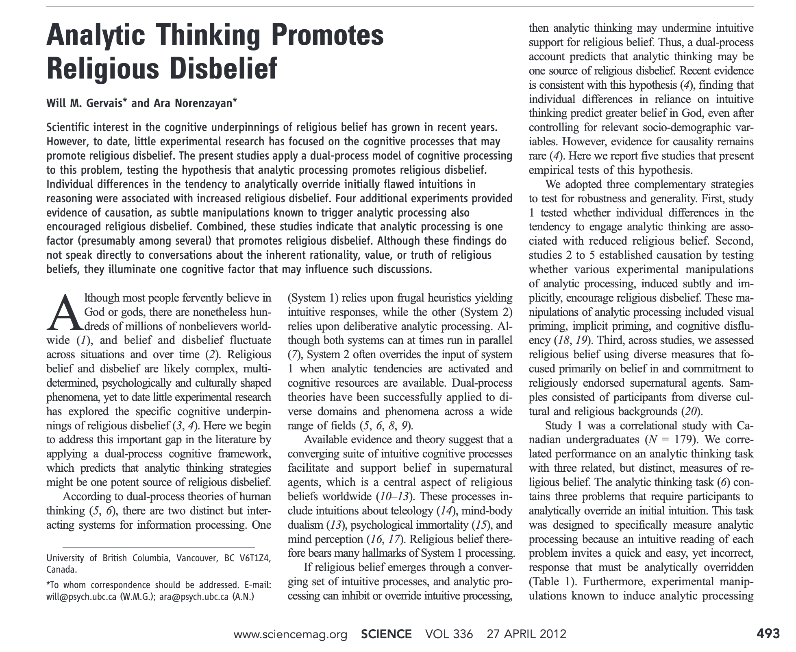
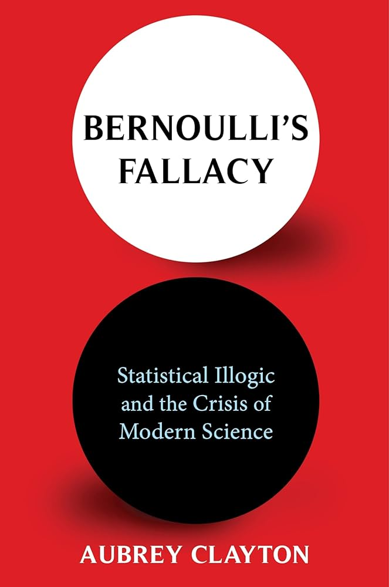
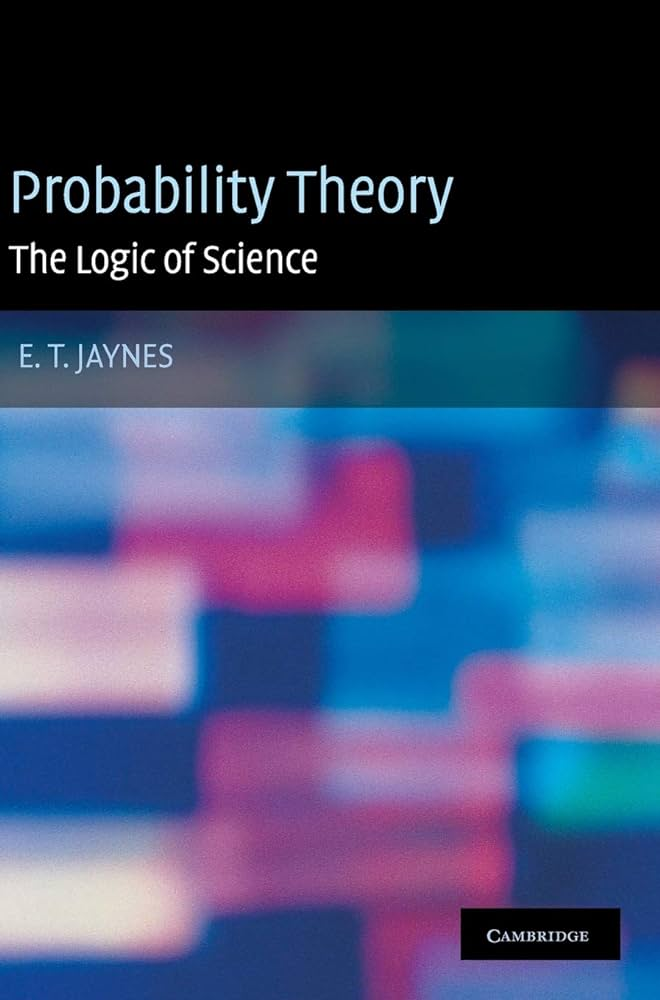
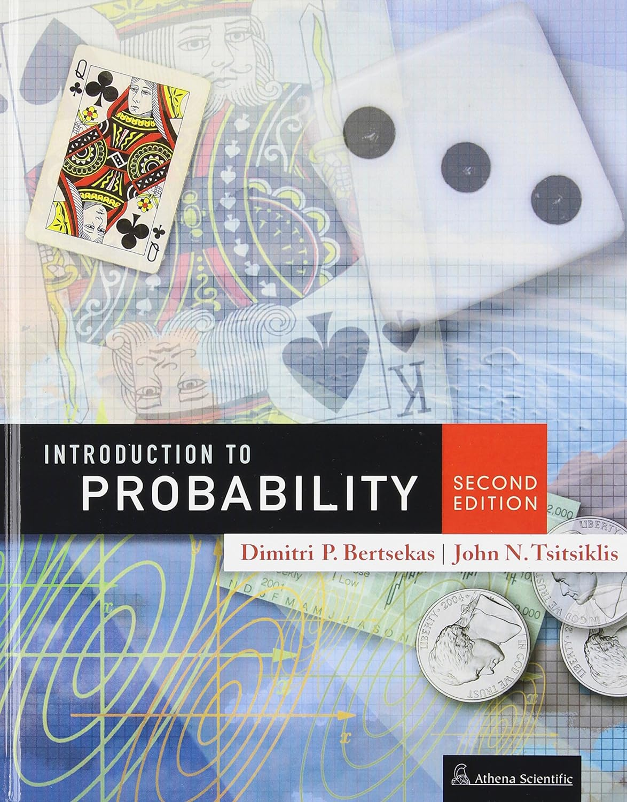
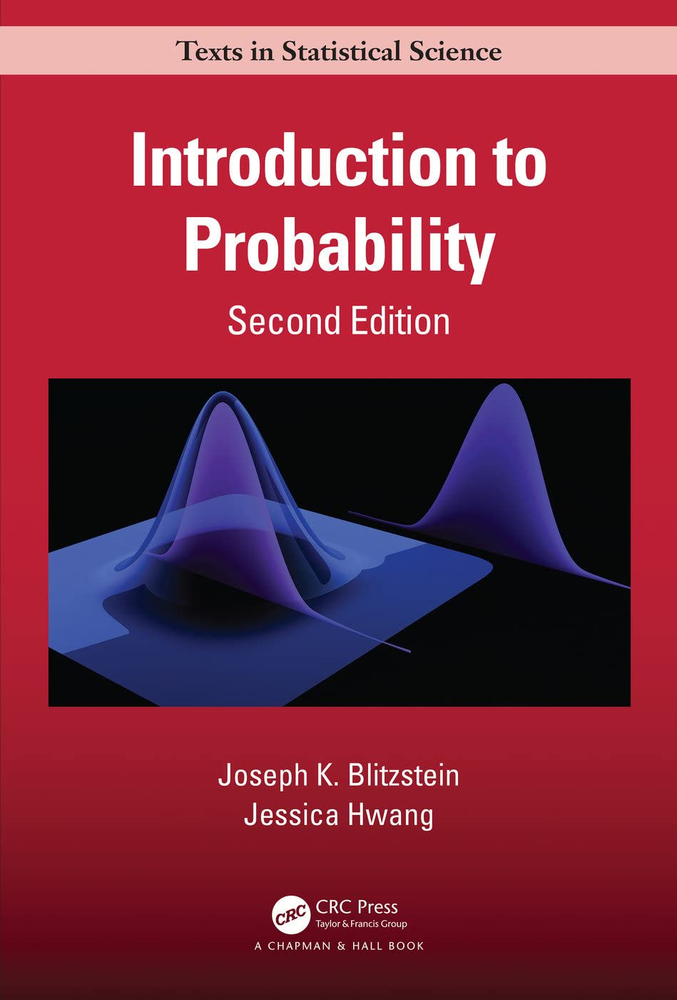
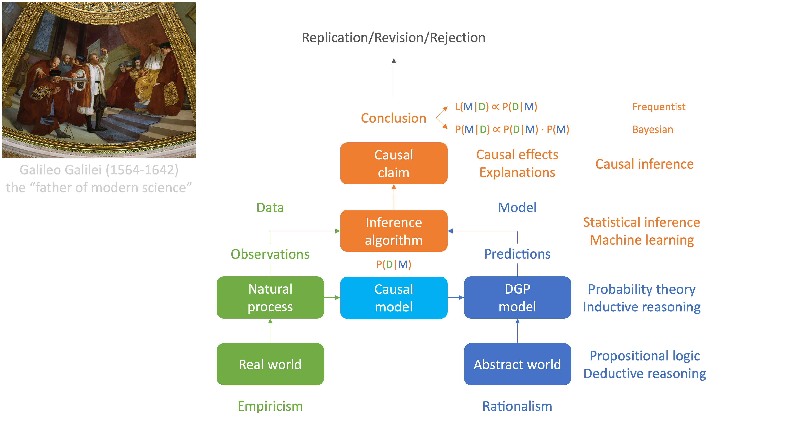
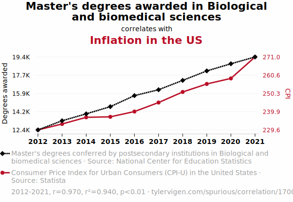
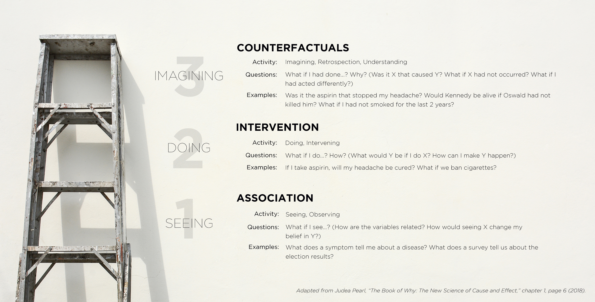

```{r}
#| include: false
library(tidyverse)
theme_set(theme_minimal())

#| output-location: default
# def conditional operator
`%=>%` <- function(A, B) {
  !A | B
}

# def biconditional operator 
`%<=>%` <- function(A, B) {
  (A %=>% B) & (B %=>% A)
}
```

##  {background-image="images/last_week_tonight.jpg" background-size="contain"}

## What the &#%! is probability?

{height="200"}

-   Ontological interpretations

    -   Limiting relative frequency/proportion (frequentists say "long-run" but mean ∞ 🤯)
    -   Physical chance/propensity\
         

-   Epistemological interpretations

    -   Degree of belief in the truth of a proposition (subjective Bayesian)

    -   Strength of an inductive argument (objective Bayesian)

## What the &#%! is probability?

{height="200"}

::: nonincremental
-   Ontological interpretations

    -   Limiting relative frequency/proportion (frequentists say "long-run" but mean ∞ 🤯)
    -   Physical chance/propensity\
         

-   Epistemological interpretations

    -   Degree of belief in the truth of a proposition (subjective Bayesian)

    -   **Strength of an inductive argument (objective Bayesian)**
:::

## Take homes from last week

-   **Probability theory** is the completion of **propositional logic**

    -   A mathematical language we use to **represent** our **knowledge** of the world **and** to **reason with it** (from premises known or assumed to be true to a conclusion that is likely to be true, yet uncertain; *inductive reasoning*)

::: fragment
> *All of the things we say in science, all of the conclusions, are uncertain.*
>
> *And it is of paramount importance, in order to make progress, that we recognize this ignorance and this doubt.*
>
> — [Richard Feynman](https://en.wikipedia.org/wiki/Richard_Feynman) (1918 – 1988, Nobel-prize winning theoretical physicist)
:::

## Take homes from last week

::: nonincremental
-   **Probability theory** is the completion of **propositional logic**

    -   A mathematical language we use to **represent** our **knowledge** of the world **and** to **reason with it** (from premises known or assumed to be true to a conclusion that is likely to be true, yet uncertain; *inductive reasoning*)

-   **Inductive reasoning is scientific reasoning**, including statistical inference
:::

## Take homes from last week

::: nonincremental
-   **Probability theory** is the completion of **propositional logic**

    -   A mathematical language we use to **represent** our **knowledge** of the world **and** to **reason with it** (from premises known or assumed to be true to a conclusion that is likely to be true, yet uncertain; *inductive reasoning*)

-   **Inductive reasoning is scientific reasoning**, including statistical inference

    -   **Probability theory is the logic of science**, including data science
:::

## Take homes from last week

::: nonincremental
-   **Probability theory** is the completion of **propositional logic**

    -   A mathematical language we use to **represent** our **knowledge** of the world **and** to **reason with it** (from premises known or assumed to be true to a conclusion that is likely to be true, yet uncertain; *inductive reasoning*)

-   **Inductive reasoning is scientific reasoning**, including statistical inference

    -   **Probability theory is the logic of science**, including data science

    -   Probability theory is just counting\*!
:::

-   **Probability** is a mathematical function that takes an argument and returns a real number between 0 and 1 that **measures** the inductive strength of the argument, the **uncertainty** of the conclusion given the premises

    -   0 for a maximally weak argument = certainly false conclusion (contradiction)
    -   1 for a maximally strong argument = certainly true conclusion (tautology)
    -   any number in between = uncertain conclusion (contingent proposition)

::: notes
Plausible reasoning/Reasoning under uncertainty
:::

## Take homes from last week

::: nonincremental
-   The numeric value returned by the probability function is a **proportion**:
:::

::: fragment
$$
\frac{\text{# of possible worlds where the conclusion is true in the universe where all premises are true}}{\text{# of possible worlds in the universe where all premises are true}}
$$
:::

-   **All probabilities are conditional** (on the premises and conclusion)

    -   The choice of premises and conclusion is subjective, but **probability is objective**

-   Probability theory is a very simple language:

    -   One type of variables: `Logical` ([TRUE]{.green} or [FALSE]{.red})
    -   The function $V(H \mid E)$ and the 5 functions/operators/rules of propositional logic:
        -   `NOT` ($\lnot A$), `AND` ($A \land B$), `OR` ($A \lor B$), `IMPLIES` ($A \implies B$), `IFF` ($A \iff B$)
    -   The function $P(H \mid E)$ and the 3 functions/operators/rules of probability theory:
        -   `NOT` (complement rule), `AND` (**Bayes' theorem** a.k.a. product rule), `OR` (sum rule)

## Probability theory: Rules of probability calculus

-   **Negation rule (NOT)**

::: fragment
$$
P(\lnot A) = 1 - P(A) \quad \quad P(\lnot B) = 1 - P(B) \\
$$
:::

-   **Conjuction rule (AND)**: Product rule

::: fragment
$$
\begin{array}{l}
P(A \land B) = P(A) \cdot P(B \mid A) \\
P(A \land B) = P(A) \cdot P(B) \quad \text{iff A and B are independent, i.e.,}\ P(B \mid A) = P(B)
\end{array}
$$
:::

-   Two events (or propositions) $A$ and $B$ are **independent** iff the probability of one remains unchanged knowing that the other has occurred (or is true)

:::::: fragment
::::: columns
::: column
$$P(A \mid B) = P(A)$$
:::

::: column
$$P(B \mid A) = P(B)$$
:::
:::::
::::::

-   If $A$ and $B$ are **dependent** events, then $A$ is said to be **associated** with $B$, and viceversa

## Probability theory: Rules of probability calculus

::: nonincremental
-   **Negation rule (NOT)**
:::

$$
P(\lnot A) = 1 - P(A) \quad \quad P(\lnot B) = 1 - P(B) \\
$$

::: nonincremental
-   **Conjuction rule (AND)**: Product rule
:::

$$
\begin{array}{l}
P(A \land B) = P(A) \cdot P(B \mid A) \\
P(A \land B) = P(A) \cdot P(B) \quad \text{iff A and B are independent, i.e.,}\ P(B \mid A) = P(B)
\end{array}
$$

::: nonincremental
-   Two events (or propositions) $A$ and $B$ are **independent** iff the probability of one remains unchanged knowing that the other has occurred (or is true)
:::

::::: columns
::: column
$$P(A \mid B) = P(A)$$
:::

::: column
$$P(B \mid A) = P(B)$$
:::
:::::

::: nonincremental
-   Statistical association is this **bidirectional** dependence between logical variables
:::

## Probability theory: Rules of probability calculus

::: nonincremental
-   **Negation rule (NOT)**
:::

$$
P(\lnot A) = 1 - P(A) \quad \quad P(\lnot B) = 1 - P(B) \\
$$

::: nonincremental
-   **Conjuction rule (AND)**: Product rule
:::

$$
\begin{array}{l}
P(A \land B) = P(A) \cdot P(B \mid A) \\
P(A \land B) = P(A) \cdot P(B) \quad \text{iff A and B are independent, i.e.,}\ P(B \mid A) = P(B)
\end{array}
$$

::: nonincremental
-   Two events (or propositions) $A$ and $B$ are **independent** iff the probability of one remains unchanged knowing that the other has occurred (or is true)
:::

::::: columns
::: column
$$P(A \mid B) = P(A)$$
:::

::: column
$$P(B \mid A) = P(B)$$
:::
:::::

::: nonincremental
-   **Association is not causation!** (which is unidirectional) $\quad A \leftrightarrow B \; \ne \; A \rightarrow B$ 
:::

## Probability theory: Rules of probability calculus

::: nonincremental
-   **Negation rule (NOT)**
:::

$$
P(\lnot A) = 1 - P(A) \quad \quad P(\lnot B) = 1 - P(B) \\
$$

::: nonincremental
-   **Conjuction rule (AND)**: Product rule
:::

$$
\begin{array}{l}
P(A \land B) = P(A) \cdot P(B \mid A) \\
P(A \land B) = P(A) \cdot P(B) \quad \text{iff A and B are independent, i.e.,}\ P(B \mid A) = P(B)
\end{array}
$$

::: nonincremental
-   Two events (or propositions) $A$ and $B$ are **independent** iff the probability of one remains unchanged knowing that the other has occurred (or is true)
:::

::::: columns
::: column
$$P(A \mid B) = P(A)$$
:::

::: column
$$P(B \mid A) = P(B)$$
:::
:::::

::: nonincremental
-   All statistical models need a causal model: **no causes in, no causes out!**
:::

## Probability theory: Rules of probability calculus

::: nonincremental
-   **Negation rule (NOT)**
:::

$$
P(\lnot A) = 1 - P(A) \quad \quad P(\lnot B) = 1 - P(B) \\
$$

::: nonincremental
-   **Conjuction rule (AND)**: Bayes theorem
:::

$$
P(B \mid A) = \frac{P(B) \cdot P(A \mid B)}{P(A)} = \frac{P(B) \cdot P(A \mid B)}{P(B) \cdot P(A \mid B) + P(\lnot B) \cdot P(A \mid \lnot B)}
$$

## Probability theory: Rules of probability calculus

::: nonincremental
-   **Negation rule (NOT)**
:::

$$
P(\lnot A) = 1 - P(A) \quad \quad P(\lnot B) = 1 - P(B) \\
$$

::: nonincremental
-   **Conjuction rule (AND)**: Conditional probability
:::

$$
P(A \mid B) = \frac{P(A \land B)}{P(B)} \quad \quad P(B \mid A) = \frac{P(A \land B)}{P(A)}
$$

-   **Disjunction rule (OR)**: Sum rule

::: fragment
$$
\begin{array}{l}
P(A \lor B) = P(A) + P(B) - P(A \land B) \\
P(A \lor B) = P(A) + P(B) \quad \text{iff A and B are mutually exclusive, i.e.,}\ P(A \land B) = 0
\end{array}
$$
:::

## Bayes' theorem in action: Bayesian inference

-   Statistical inference is **logical reasoning** using known (or assumed) quantities and a model to infer unknown quantities

::: fragment
$$
\begin{array}{ll}
1. & \text{known quantities} \\
2. & \text{model} \\
\hline
\therefore & \text{unknown quantities} \\
\end{array}
$$
:::

## Bayes' theorem in action: Bayesian inference

::::: columns
::: {.column width="40%"}
$D \:$ "*The woman has breast cancer.*"
:::

::: {.column .fragment width="60%"}
$T \:$ "*The diagnostic test for breast cancer is positive.*"
:::
:::::

-   Given (known quantities/premises/evidence/knowledge base):

    -   **Prevalence (prior probability):** $\; P(D) = 0.001$\
        (i.e., 0.1% chance the woman has breast cancer)
    -   **Sensitivity:** $\; P(T \mid D) = 0.90$\
        (i.e., 90% chance the test is positive if the woman has breast cancer)
    -   **Specificity:** $\; P(\lnot T \mid \lnot D) = 0.90$\
        (i.e., 90% chance the test is negative if the woman does not have breast cancer)
    -   **False positive rate:** $\; P(T \mid \lnot D) = 1 - P(\lnot T \mid \lnot D) = 1 - 0.90 = 0.10$\
        (i.e., 10% chance the test is positive if the woman does not have breast cancer)

-   Wanted (unknown quantity/conclusion/hypothesis/query):

    -   **Positive predictive value (posterior probability):** $\; P(D \mid T)$\
        (i.e., chance the woman has breast cancer if the test is positive)

## Bayes' theorem in action: Bayesian inference

::: nonincremental
-   According to Bayes' theorem:
:::

::: fragment
$$
P(D \mid T) = \frac{P(D) \cdot P(T \mid D)}{P(T)} = \frac{P(D) \cdot P(T \mid D)}{P(D) \cdot P(T \mid D) + P(\lnot D) \cdot P(T \mid \lnot D)}
$$
:::

-   Substituting the given values:

::: fragment
$$
P(D \mid T) = \frac{0.001 \times 0.90}{(0.001 \times 0.90) + (0.999 \times 0.10)} = \frac{0.0009}{0.0009 + 0.0999} \approx \frac{0.0009}{0.1008} \approx 0.00893
$$
:::

-   Thus, even with a positive test, the probability that the woman actually has breast cancer is only about 0.9%

-   Failure to take prevalence (a.k.a. base rate) into account is known in medicine as the **base rate fallacy**

-   This example highlights the critical role of the prior probability when evaluating and testing hypothesis

## Base rate fallacy

{height="400"}

## Prosecutor's fallacy

[{.fragment height="250"}](https://www.theguardian.com/world/2021/apr/18/obscure-maths-bayes-theorem-reliability-covid-lateral-flow-tests-probability)

-   Sally Clark was found guilty of the murder of her two infant sons

-   The defense argued that both children had died of sudden infant death syndrome

-   The prosecution relied on flawed statistical evidence presented by a paediatrician who testified that the probability of two infants dying of SIDS in the same family is 1 in 73M

-   The jury mistakenly interpreted this probability (of the evidence given the presumption of innocence) with the probability of Sally Clark's innocence given the evidence

::: notes
-   Sally Clark's first son died within a few weeks of his birth, and her second son died in similar circumstances two years later
-   Soon after, Sally Clark was arrested and tried for both deaths
-   The defense argued that the children had died of sudden infant death syndrome (SIDS)
-   The prosecution relied on flawed statistical evidence presented by a paediatrician who testified that the probability of two infants dying of SIDS in the same family was 1 in 73 million
-   Sally Clark was convicted and spent three years in prison before being released on second appeal (not because of the flawed stats but because it emerged that the prosecution forensic pathologist had failed to disclose microbiological reports that suggested the second of Sally Clark's sons had died of natural causes)
-   Soon after she was convicted, the Royal Statistical Society issued a statement arguing that there was no statistical basis for the paediatrician's claim
-   Sally Clark's experience caused her to develop severe psychiatric problems and she died four years later of alcohol poisoning
:::

## A typical study in the social/biomedical sciences

-   A group of 62 subjects was randomly split into two groups of 31 and 31 subjects
-   Each subject in the first group looked at a picture of Rodin's *The Thinker* for 30 seconds (*treatment group*)
-   Each subject in the second group looked at a picture of the *Discobulus of Myron* for 30 seconds (*control group*)

:::: fragment
::: text-align-center
{width="550"}
:::
::::

## A typical study in the social/biomedical sciences

::: nonincremental
-   A group of 62 subjects was randomly split into two groups of 31 and 31 subjects
-   Each subject in the first group looked at a picture of Rodin's *The Thinker* for 30 seconds (*treatment group*)
-   Each subject in the second group looked at a picture of the *Discobulus of Myron* for 30 seconds (*control group*)
-   All subjects then rated their belief in the existence of God on a scale from 0 to 100
:::

-   The mean belief in the existence of God was 41.5 for the treatment group and 61.5 for the control group
-   **Is there an effect of the treatment on the belief in the existence of God?**
-   If there were no effect (*null hypothesis*), then the probability of observing a difference this large or larger is 3% \[**P = 0.03**, t(55) = 2.24, Cohen’s d = 0.60\]
-   Therefore, looking at the picture of *The Thinker* for 30 seconds significantly promotes religious disbelief!

## The fallacy of the transposed conditional

::: fragment
All three examples (base-rate fallacy, prosecutor's fallacy, and the scientific study) commit the **fallacy of the transposed conditional**, i.e., confuse the probability of the evidence given the hypothesis ("*sampling probability*") with the probability of the hypothesis given the evidence ("*inferential probability*")
:::

::: fragment
[P(]{.orange}[evidence]{.green} [\|]{.orange} [hypothesis]{.blue}[)]{.orange} = [P(]{.orange}[hypothesis]{.blue} [\|]{.orange} [evidence]{.green}[)]{.orange}
:::

 

::: fragment
**Base-rate fallacy**<br/> [P(]{.orange}[vaccinated]{.green} [\|]{.orange} [hospitalized]{.blue}[)]{.orange} = [P(]{.orange}[hospitalized]{.blue} [\|]{.orange} [vaccinated]{.green}[)]{.orange}
:::

 

::: fragment
**Prosecutor's fallacy**<br/> [P(]{.orange}[two deaths]{.green} [\|]{.orange} [innocent]{.blue}[)]{.orange} = [P(]{.orange}[innocent]{.blue} [\|]{.orange} [two deaths]{.green}[)]{.orange}
:::

 

::: fragment
**Scientific study**<br/> [P(]{.orange}[same or larger effect]{.green} [\|]{.orange} [null hypothesis]{.blue}[)]{.orange} = [P(]{.orange}[null hypothesis]{.blue} [\|]{.orange} [same or larger effect]{.green}[)]{.orange}
:::

## The fallacy of the transposed conditional

::: text-align-center
{height="550"}

<https://doi.org/10.1126/science.1215647>
:::

## The fallacy of the transposed conditional

::: text-align-center
{height="550"}

<https://cup.columbia.edu/book/bernoullis-fallacy/9780231199957>
:::

## Logical probability textbooks

::::::: columns
:::: {.column width="50%"}
::: text-align-center
{height="550"}

<https://doi.org/10.1017/CBO9780511801297>
:::
::::

:::: {.column width="50%"}
::: text-align-center
{height="550"}

<https://doi.org/10.1017/CBO9780511790423>
:::
::::
:::::::

## Probability theory textbooks and online courses

::::::: columns
:::: {.column width="50%"}
::: text-align-center
{height="500"}

<https://youtube.com/playlist?list=PLUl4u3cNGP60hI9ATjSFgLZpbNJ7myAg6>
:::
::::

:::: {.column width="50%"}
::: text-align-center
{height="500"}

<https://projects.iq.harvard.edu/stat110>
:::
::::
:::::::

## Modern science: statistical (+ causal) inference

{fig-align="center" width="979"}

[Shmueli (2010)](https://doi.org/10.1214/10-STS330) To Explain or to Predict?


##  {background-image="images/thats_all_folks.jpg" background-size="50%"}


## Gambler's fallacy

{height="280"}

## Association does not imply causation

::: fragment
"Correlation is not causation" - correlation is just a special case of statistical association
:::

::: fragment
Two propositions/events $A$ and $B$ are associated iff they are NOT independent
:::

-   $P(A \mid B) \ne P(A)$

::: fragment
or, equivalently
:::

-   $P(B \mid A) \ne P(B)$

::: fragment
For example,
:::

-   $P(\text{heart attack} \mid \text{high cholesterol levels}) > P(\text{heart attack})$

-   $P(\text{shark attack} \mid \text{high ice cream sales}) > P(\text{shark attack})$

::: fragment
We bring causation to probability; we do not get causation from probability!
:::

## Association does not imply causation

A statistical association is a logical relationship between two propositions/events and does not imply a causal relationship between them

::: fragment
For example,
:::

-   reducing cholesterol levels lowers the risk of a heart attack (causal relationship), however

-   reducing ice cream sales does not lower the risk of a shark attack, even though there is a statistical association between high ice cream sales and shark attacks

:::: fragment
::: text-align-center
{height="240"}

[Spurious Correlations - Tyler Vigen](https://tylervigen.com/spurious-correlations)
:::
::::

## The "ladder of causation"

From Pearl and Mackenzie (2018) [The Book of Why](https://bayes.cs.ucla.edu/WHY/)

::: text-align-center

:::

## Probability distribution

-   Jaynes’ [principle of maximum entropy](https://en.wikipedia.org/wiki/Principle_of_maximum_entropy) states that, in the absence of additional information, outcomes in the sample space are equally likely

::: fragment
$$\forall \omega \in \Omega \quad p(\omega) = \frac{1}{|\Omega|}$$

where $p(\omega)$ is the probability (or more precisely the *probability mass*) of $\omega$
:::

-   $p$ is also known as **probability distribution** or *probability mass function* (PMF) of $\Omega$

-   For example, given the following sample space

```{r}
#| include: false
vars <- c("A", "B")

ss <-
  expand_grid(!!!set_names(map(vars, ~ c(TRUE, FALSE)), vars)) %>%
  mutate(Ω = paste0("⍵", 1:n())) %>%
  select(Ω, everything())

ss
```

::: fragment
```{r}
#| echo: false
ss
```
:::

## Probability distribution

::: nonincremental
-   Jaynes’ [principle of maximum entropy](https://en.wikipedia.org/wiki/Principle_of_maximum_entropy) states that, in the absence of additional information, outcomes in the sample space are equally likely
:::

$$\forall \omega \in \Omega \quad p(\omega) = \frac{1}{|\Omega|}$$

::: nonincremental
where $p(\omega)$ is the probability (or more precisely the *probability mass*) of $\omega$

-   $p$ is also known as **probability distribution** or *probability mass function* (PMF) of $\Omega$

-   For example, given the following sample space $\quad p(\omega) = \frac{1}{4} = 0.25$
:::

::: fragment
```{r}
ss %>% mutate(p = 1 / n())
```
:::

## Probability calculation

::: fragment
The probability of proposition/event $X$ is calculated as
:::

::: fragment
$$P(X) = \sum_{\omega \in X} p(\omega)$$
:::

::: fragment
For example, if proposition $X$ is $A \lor B$, then $P(X)$ is
:::

::: fragment
```{r}
ss %>%
  mutate(p = 1 / n()) %>%
  mutate(X = A | B) %>%
  filter(X) %>% 
  summarize(`P(X)` = sum(p))
```
:::

::: fragment
or more succinctly
:::

::: fragment
```{r}
ss %>%
  mutate(p = 1 / n()) %>%
  mutate(X = A | B) %>%
  summarize(`P(X)` = sum(p[X]))
```
:::


