```{r}
#| include: false
#| output-location: default
library(tidyverse)
library(ggformula)
library(ggdag)
library(dagitty)
library(rethinking)

set.seed(666)

# def dbern function
dbern <- function(x, prob) {
  dbinom(x, size = 1, prob)
}

theme_set(theme_minimal())

# def conditional operator
`%=>%` <- function(A, B) {
  !A | B
}

# def biconditional operator 
`%<=>%` <- function(A, B) {
  (A %=>% B) & (B %=>% A)
}
```

```{r}
#| include: false
library(rlang)
```

```{r}
#| include: false
P <- function(..., H) {
  # capture premises as a list of quosures
  premises <- enquos(...)

  # capture conclusion (H) as a quosure
  H <- enquo(H)

  if (length(premises) == 0) {
    # if no premises are provided, set evidence (E) to TRUE (tautology)
    E <- expr(TRUE)
  } else {
    # else set evidence (E) to conjunction of all premises
    E <- reduce(premises, ~ expr((!! .x) & (!! .y)))
  }
    
  # extract atomic variables from E and H
  vars <- unique(c(all.vars(E), all.vars(H)))
  
  # build truth table and calculate proportion of rows where E is true, in which H is also true
  expand_grid(!!!set_names(rep(list(c(TRUE, FALSE)), length(vars)), vars)) %>%
    mutate(E = !!E, H = !!H) %>%
    filter(E) %>%
    pull(H) %>%
    mean()
}
```

```{r}
#| include: false
library(flextable)

P.flex <- function(..., H, table = TRUE, flex = TRUE) {
  # capture premises as a list of quosures
  premises <- enquos(...)
  
  # capture conclusion (H) as a quosure
  H <- enquo(H)
  
  # extract atomic variables from premises and H
  vars <- unique(c(unlist(lapply(premises, all.vars)), all.vars(H)))
  
  # create data frame with all possible combinations of atomic variables/worlds (universe)
  tt <- expand_grid(!!!set_names(rep(list(c(TRUE, FALSE)), length(vars)), vars))

  # add columns for premises
  for (i in seq_along(premises)) {
    tt[[paste0("P", i)]] <- eval_tidy(premises[[i]], data = tt)
  }
  
  # add columns for conjunction of all premises (E) and H
  tt <- tt %>%
    mutate(
      E = if_all(starts_with("P"), identity),
      H = eval_tidy(H, data = tt)
    )
  
  # calculate P(H | E) by checking whether in every possible world/row where E is true, H is also true
  P <- tt %>%
    filter(E) %>%
    pull(H) %>%
    mean()
  
  # return P(H | E) if truth table output is not requested
  if (!table) {
    return(P)
  }
  
  # return truth table if formatted truth table output is not requested
  if (!flex) {
    return(tt)
  }
  
  # define colors
  highlight_color <- "beige"  # Standard HTML color name
  true_color <- "darkgreen"
  false_color <- "darkred"
  
  # convert the truth table into a flextable
  tt.formatted <- flextable(tt) %>%
    bold(part = "header") %>%  # Bold the header
    bold(part = "footer") %>%  # Bold the footer
    bg(i = which(tt$E == TRUE), bg = highlight_color, part = "body")  # Highlight E = TRUE rows
  
  # apply text colors
  for (col in colnames(tt)) {
    tt.formatted <- tt.formatted %>%
      color(i = which(tt[[col]] == TRUE), j = col, color = true_color) %>%
      color(i = which(tt[[col]] == FALSE), j = col, color = false_color)
  }
  
  # add footer with the calculated P(C | K) value
  tt.formatted <- tt.formatted %>%
    add_footer_row(
      values = paste("P(H | E) =", round(P, 3)),
      colwidths = ncol(tt)
    ) %>%
    align(align = "right", part = "footer")

  # return formatted truth table
  return(tt.formatted)
}
```

## Modern science: statistical (+ causal) inference

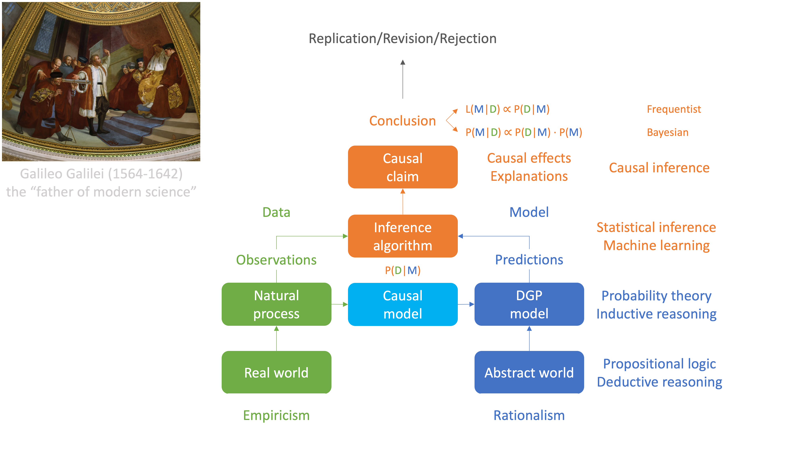{fig-align="center" width="979"}

[Shmueli (2010)](https://doi.org/10.1214/10-STS330) To Explain or to Predict?

## Statistical inference

$$
\begin{array}{ll}
1. & \text{data (observations/measurements)} \\
2. & \text{model (DGP)} \\
\hline
\therefore & \text{unknown quantities} \\
\end{array}
$$

##  {background-image="images/last_week_tonight.jpg" background-size="contain"}

## Take homes from last week

-   Simple example of Bayesian inference (breast cancer diagnotic test)

-   Statistical models

-   Probability distributions

-   Random variables

## Statistical models

Statistical models = **probability distributions** of **random variables**

:::::: columns
::: {.column width="30%"}

:::

:::: {.column width="70%"}
::: text-align-center
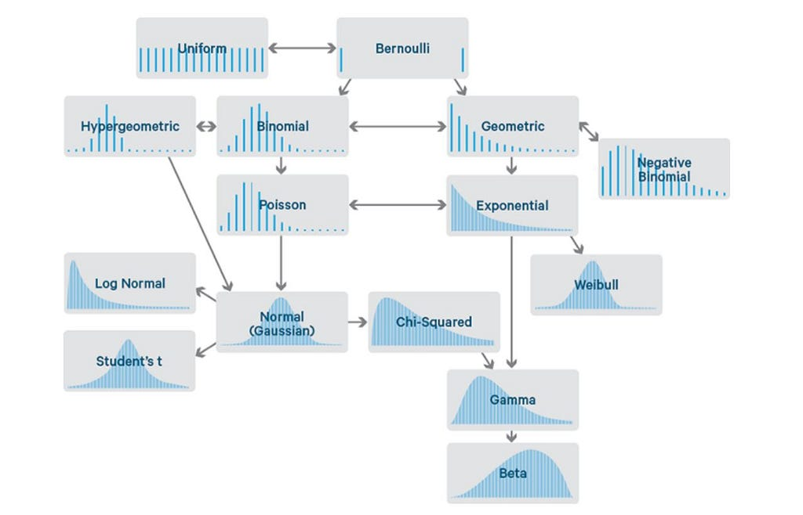

<https://distribution-explorer.github.io/>

<https://prob.bayesfusion.com/>
:::
::::
::::::

## Statistical models

A convenient way to represent the **premises** of **inductive arguments** about DGPs

:::::: columns
::: {.column width="30%"}

:::

:::: {.column width="70%"}
::: text-align-center


<https://distribution-explorer.github.io/>

<https://prob.bayesfusion.com/>
:::
::::
::::::

## Statistical models

A convenient way to represent the **premises** of **inductive arguments** about DGPs

:::::: columns
::: {.column width="30%"}

:::

:::: {.column width="70%"}
 

$$
p : \Omega \to [0, 1]
$$

::: fragment
$$
\sum_{\omega \in \Omega} p(\omega) = 1
$$
:::
::::
::::::

## Statistical models

A convenient way to represent the **premises** of **inductive arguments** about DGPs

::::: columns
::: {.column width="30%"}

:::

::: {.column width="70%"}
**Uniform distribution** (discrete) [WP](https://en.wikipedia.org/wiki/Discrete_uniform_distribution) [PDE](https://distribution-explorer.github.io/discrete/discrete_uniform.html)

$$
p(\omega \mid K_0) = \frac{1}{|\Omega|} = \frac{1}{n}
$$
:::
:::::

## Statistical models

A convenient way to represent the **premises** of **inductive arguments** about DGPs

:::::: columns
::: {.column width="30%"}

:::

:::: {.column width="70%"}
**Normal distribution** (continuous) [WP](https://en.wikipedia.org/wiki/Normal_distribution) [PDE](https://distribution-explorer.github.io/continuous/normal.html)

$$
p(\omega \mid K_{N}) = \frac{1}{\sqrt{2\pi \sigma^2}} \exp \!\left( -\frac{\bigl(y - \mu \bigr)^2}{2\sigma^2} \right)
$$

::: fragment
$$
\text{GLM} : \mu = \beta_0 + \beta_1 \cdot x
$$
:::
::::
::::::

## Statistical models

A convenient way to represent the **premises** of **inductive arguments** about DGPs

:::::: columns
::: {.column width="30%"}

:::

:::: {.column width="70%"}
**General Linear Models** (continuous) [WP](https://en.wikipedia.org/wiki/General_linear_model)

$$
p(\omega \mid K_{\text{GLM}}) = \frac{1}{\sqrt{2\pi \sigma^2}} \exp \!\left( -\frac{\bigl(y - (\beta_0 + \beta_1 \cdot x) \bigr)^2}{2\sigma^2} \right)
$$

::: fragment
[{fig-align="center" width="550"}](https://lindeloev.github.io/tests-as-linear/)
:::
::::
::::::

## Statistical models

A convenient way to represent the **premises** of **inductive arguments** about DGPs

::::: columns
::: {.column width="30%"}

:::

::: {.column width="70%"}
**Large Language Models** (discrete, ANN) [WP](https://en.wikipedia.org/wiki/GPT-3)

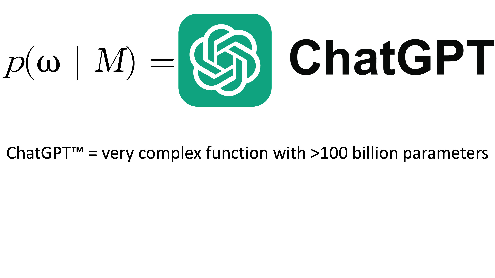{fig-align="center" width="440"}
:::
:::::

::: notes
GPT-3: 175 billion parameters = 5 million "neurons" x 35K parameters per neuron on average
:::

::: notes
Large language models ultimately define a probability distribution over a finite set of tokens in their vocabulary, so it is indeed a discrete distribution—even though the vocabulary is usually very large, it’s still a finite (and hence discrete) set of possible tokens
:::

## Statistical models

A convenient way to represent the **premises** of **inductive arguments** about DGPs

::::: columns
::: {.column width="30%"}

:::

::: {.column width="70%"}
**The human brain** (continuous, BNN) [WP](https://en.wikipedia.org/wiki/Free_energy_principle)

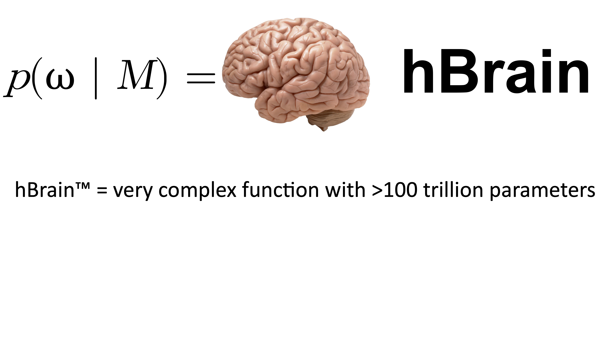{fig-align="center" width="440"}
:::
:::::

## Statistical models

A convenient way to represent the **premises** of **inductive arguments** about DGPs

::::: columns
::: {.column width="30%"}

:::

::: {.column width="70%"}
**The human brain** (continuous, BNN) [WP](https://en.wikipedia.org/wiki/Free_energy_principle)

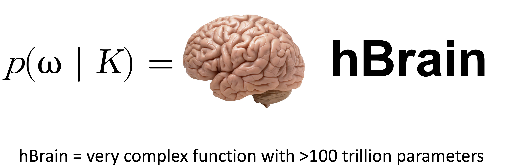{fig-align="center" width="440"}

{fig-align="center" width="550"}
:::
:::::

## Models vs. the real world

 

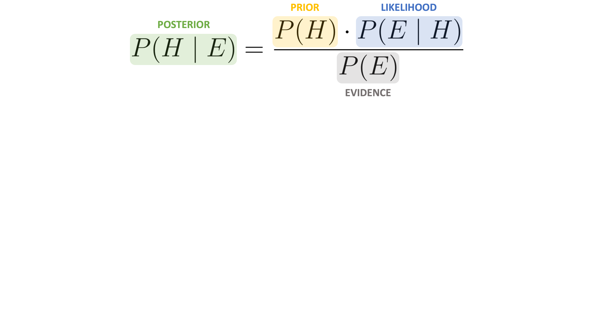{fig-align="center"}

## Models vs. the real world

In order to reason about the real world, we need a set of premises/assumptions

{fig-align="center"}

## Models vs. the real world

In order to reason about the real world, we need a KB that we can use to answer a query

{fig-align="center"}

## Models vs. the real world

In order to reason about the real world, we need a model of it

{fig-align="center"}

::: notes
Discuss model and parameter uncertainty (in addition to sampling uncertainty) and how Bayesian inference helps us quantify and propagate these uncertainties, something that frequentist inference cannot do
:::

## The real world of robots

{fig-align="center"}

## Causal model: Science before statistics

```{r}
#| echo: false
dag <- dagify(
  Weight ~ Height,
  exposure = "Height",
  outcome = "Weight"
)

coordinates(dag) <- list(
  x = c(Height = 0, Weight = 1),
  y = c(Height = 0, Weight = 0)
)

ggdag(dag) + theme_dag()
```

## Causal model: Science before statistics

```{r}
#| echo: false
dag <- dagify(
  Weight ~ Height,
  Height ~ Task,
  Weight ~ Task,
  exposure = "Height",
  outcome = "Weight"
)

coordinates(dag) <- list(
  x = c(Height = 0, Task = 1, Weight = 2),
  y = c(Height = 0, Task = 1, Weight = 0)
)

ggdag(dag) + theme_dag()
```

## Causal model: Science before statistics

```{r}
#| echo: false
dag <- dagify(
  Weight ~ Height,
  exposure = "Height",
  outcome = "Weight"
)

coordinates(dag) <- list(
  x = c(Height = 0, Weight = 1),
  y = c(Height = 0, Weight = 0)
)

ggdag(dag) + theme_dag()
```

## Causal model: Science before statistics

$$
\text{Weight} = f(\text{Height})
$$

 

::: fragment
$$
\text{Weight} = \beta_0 + \beta_1 \times \text{Height}
$$
:::

## Causal model: Science before statistics

$$
\text{Weight} = f(\text{Height})
$$

 

$$
\text{Weight} = \beta_0 + \beta_1 \times \text{Height} + \epsilon
$$

 

::: fragment
{fig-align="center" height="400"}
:::

## Causal model: Science before statistics

$$
\text{Weight} = f(\text{Height})
$$

 

$$
\text{Weight} = \beta_0 + \beta_1 \times \text{Height} + \epsilon
$$

 

$$
\text{Next token} = \text{ChatGPT}\bigl(\text{Prompt tokens}\bigr)
$$

::: fragment
$$
\text{Next token} = \text{ChatGPT}\bigl(\text{Prompt tokens} + \text{Previous token}\bigr)
$$
:::

::: fragment
$$
\text{STOP} = \text{ChatGPT}\bigl(\text{Prompt tokens} + \text{Previous tokens}\bigr)
$$
:::

::: notes
GPT-3: 175 billion parameters = 5 million "neurons" x 35K parameters per neuron on average
:::

## Random variables

::: fragment
$$
\begin{aligned}[l]
\text{Height} & = \{ 10, 20, 30 \} \\
\text{Weight} & = \{ 20, 30, 40 \}
\end{aligned}
$$
:::

 

::: fragment
```{r}
#| output-location: default
Height <- c(10, 20, 30)

Weight <- c(20, 30, 40)
```
:::

## Sample space

```{r}
ss <-
  expand_grid(Height, Weight) %>%
  mutate(Ω = paste0("⍵", 1:n())) %>% 
  select(Ω, everything())

ss
```

## Sample space

```{r}
#| eval: false
#| output-location: default
ss %>% ???
```

## Argument: Evidence

```{r}
ss %>% 
  mutate(
    P1 = (Height == 10) %=>% (Weight == 20),
    P2 = (Height == 20) %=>% (Weight == 30),
    P3 = (Height == 30) %=>% (Weight == 40),
    E  = P1 & P2 & P3)                        # evidence/premises/assumptions/KB
```

## Argument: Evidence

```{r}
#| output-location: default
ss %>% 
  mutate(
    P1 = (Height == 10) %=>% (Weight == 20),
    P2 = (Height == 20) %=>% (Weight == 30),
    P3 = (Height == 30) %=>% (Weight == 40),
    E  = P1 & P2 & P3) %>%                    # evidence/premises/assumptions/KB
  filter(E)
```

## Argument: Hypothesis

```{r}
#| output-location: default
ss %>% 
  mutate(
    P1 = (Height == 10) %=>% (Weight == 20),
    P2 = (Height == 20) %=>% (Weight == 30),
    P3 = (Height == 30) %=>% (Weight == 40),
    E  = P1 & P2 & P3,                        # evidence/premises/assumptions/KB
    #    --------------------------------
    H  = (Weight == 20) | (Weight == 40)) %>% # hypothesis/conclusion/query
  filter(E)
```

## Argument: Inference

```{r}
#| output-location: default
ss %>% 
  mutate(
    P1 = (Height == 10) %=>% (Weight == 20),
    P2 = (Height == 20) %=>% (Weight == 30),
    P3 = (Height == 30) %=>% (Weight == 40),
    E  = P1 & P2 & P3,                        # evidence/premises/assumptions/KB
    #    --------------------------------
    H  = (Weight == 20) | (Weight == 40)) %>% # hypothesis/conclusion/query
  filter(E) %>% 
  summarize(`P(H | E)` = mean(H))
```

## Argument

```{r}
#| output-location: default
ss %>% 
  mutate(
    P1 = (Height == 10) %=>% (Weight == 20),
    P2 = (Height == 20) %=>% (Weight == 30),
    P3 = (Height == 30) %=>% (Weight == 40),
    E  = P1 & P2 & P3,                        # evidence/premises/assumptions/KB
    #    --------------------------------
    H  = (Weight == 20) | (Weight == 40)) %>% # hypothesis/conclusion/query
  filter(E)
```

::: fragment
$$
\text{Weight} = f(\text{Height})
$$
:::

::: fragment
$$
\text{Weight} = \beta_0 + \beta_1 \times \text{Height}
$$
:::

::: fragment
$$
\text{Weight} = 10 + 1 \times \text{Height}
$$
:::

## Argument

```{r}
#| output-location: default
ss %>% 
  rowwise() %>% 
  mutate(
    E  = (Weight == 10 + 1 * Height),         # linear function equivalent to premises P1, P2 and P3
    #    --------------------------------
    H  = (Weight == 20) | (Weight == 40)) %>% # hypothesis/conclusion/query
  ungroup() %>% 
  filter(E)
```

## Argument: Inference

```{r}
#| output-location: default
ss %>% 
  rowwise() %>% 
  mutate(
    E  = (Weight == 10 + 1 * Height),         # linear function equivalent to premises P1, P2 and P3
    #    --------------------------------
    H  = (Weight == 20) | (Weight == 40)) %>% # hypothesis/conclusion/query
  ungroup() %>% 
  filter(E) %>% 
  summarize(`P(H | E)` = mean(H))
```

## Probability distribution

-   Given a universe/sample space ($\Omega$)

-   A probability distribution is a function ($p$) that assigns a probability to each possible world/outcome ($\omega$), e.g., the uniform distribution:

::: fragment
$$p(\omega) = \frac{1}{|\Omega|} = \frac{1}{n}$$
:::

-   Since outcomes are partitions of the sample space, their probabilities must sum to 1

::: fragment
$$\sum_{\omega \in \Omega} p(\omega) = 1$$
:::

## Sample space

```{r}
#| output-location: default
ss
```

## Probability distribution

```{r}
#| output-location: default
ss %>% mutate(p = 1 / n())                     # uniform probability distribution (prior)
```

## Probability distribution

```{r}
#| output-location: default
ss %>% mutate(p = 1 / n()) %>%                 # uniform probability distribution (prior)
  rowwise() %>% 
  mutate(
    E  = (Weight == 10 + 1 * Height)) %>%      # linear function equivalent to premises P1, P2 and P3
  ungroup()
```

## Probability distribution

```{r}
#| output-location: default
ss %>% mutate(p = 1 / n()) %>%                 # uniform probability distribution (prior)
  rowwise() %>% 
  mutate(
    E  = (Weight == 10 + 1 * Height)) %>%      # linear function equivalent to premises P1, P2 and P3
  ungroup() %>%
  mutate(p = if_else(E, p, 0))                 # if E is true, keep p, otherwise set it to 0
```

## Probability distribution

```{r}
#| output-location: default
ss %>% mutate(p = 1 / n()) %>%                 # uniform probability distribution (prior)
  rowwise() %>% 
  mutate(
    E  = (Weight == 10 + 1 * Height)) %>%      # linear function equivalent to premises P1, P2 and P3 
  ungroup() %>%
  mutate(p = if_else(E, p / sum(p[E]), 0))     # if E is true, normalize p, otherwise set it to 0
```

## Probability distribution

```{r}
#| output-location: default
ss %>% mutate(p = 1 / n()) %>%                 # uniform probability distribution (prior)
  rowwise() %>% 
  mutate(
    E  = (Weight == 10 + 1 * Height)) %>%      # linear function equivalent to premises P1, P2 and P3 
  ungroup() %>%
  mutate(p = if_else(E, p / sum(p[E]), 0))     # (posterior)
```

## Argument: Hypothesis

```{r}
#| output-location: default
ss %>% mutate(p = 1 / n()) %>%                 # uniform probability distribution (prior)
  rowwise() %>% 
  mutate(
    E  = (Weight == 10 + 1 * Height),          # linear function equivalent to premises P1, P2 and P3
    #    --------------------------------
    H  = (Weight == 20) | (Weight == 40)) %>%  # hypothesis/conclusion/query
  ungroup() %>%
  mutate(p = if_else(E, p / sum(p[E]), 0))     # (posterior)
```

## Argument: Hypothesis

```{r}
#| eval: false
#| output-location: default
ss %>% mutate(p = 1 / n()) %>%                 # uniform probability distribution (prior)
  rowwise() %>% 
  mutate(
    E  = (Weight == 10 + 1 * Height),          # linear function equivalent to premises P1, P2 and P3
    #    --------------------------------
    H  = (Weight == 20) | (Weight == 40)) %>%  # hypothesis/conclusion/query
  ungroup() %>%
  mutate(p = if_else(E, p / sum(p[E]), 0))     # (posterior)
```

::: nonincremental
-   Given a probability distribution $p$, the probability of proposition/event $H$ is:
:::

::: fragment
$$P(H) = \sum_{\omega \in H} p(\omega)$$
:::

## Argument: Hypothesis

```{r}
#| output-location: default
ss %>% mutate(p = 1 / n()) %>%                 # uniform probability distribution (prior)
  rowwise() %>% 
  mutate(
    E  = (Weight == 10 + 1 * Height),          # linear function equivalent to premises P1, P2 and P3
    #    --------------------------------
    H  = (Weight == 20) | (Weight == 40)) %>%  # hypothesis/conclusion/query
  ungroup() %>%
  mutate(p = if_else(E, p / sum(p[E]), 0))     # (posterior)
```

## Argument: Inference

```{r}
#| output-location: default
ss %>% mutate(p = 1 / n()) %>%                 # uniform probability distribution (prior)
  rowwise() %>% 
  mutate(
    E  = (Weight == 10 + 1 * Height),          # linear function equivalent to premises P1, P2 and P3
    #    --------------------------------
    H  = (Weight == 20) | (Weight == 40)) %>%  # hypothesis/conclusion/query
  ungroup() %>%
  mutate(p = if_else(E, p / sum(p[E]), 0)) %>% # (posterior)
  summarize(`P(H | E)` = sum(p[H]))
```

## Statistical models

A convenient way to represent the **premises** of **inductive arguments** about DGPs

:::::: columns
::: {.column width="30%"}

:::

:::: {.column width="70%"}
::: text-align-center


<https://distribution-explorer.github.io/>

<https://prob.bayesfusion.com/>
:::
::::
::::::

## Statistical models

A convenient way to represent the **premises** of **inductive arguments** about DGPs

::::: columns
::: {.column width="30%"}

:::

::: {.column width="70%"}
**Uniform distribution** (discrete) [WP](https://en.wikipedia.org/wiki/Discrete_uniform_distribution) [PDE](https://distribution-explorer.github.io/discrete/discrete_uniform.html)

$$
p(\omega \mid K_0) = \frac{1}{|\Omega|} = \frac{1}{n}
$$
:::
:::::

::: notes
The discrete uniform distribution is the maximum-entropy distribution over a finite set (no constraints beyond normalization), while the normal distribution is the maximum-entropy continuous distribution when we only know the mean and variance/standard deviation.
:::

::: notes
While many well‐known distributions (e.g., Normal, Binomial, Poisson) do have a finite mean and variance, there are also heavy‐tailed distributions (like the Cauchy distribution) whose mean and/or variance do not exist in the usual finite sense. In other words, the integrals that define the mean or variance can diverge. Thus, not every probability distribution has a finite mean and variance.
:::

## Statistical models

A convenient way to represent the **premises** of **inductive arguments** about DGPs

::::: columns
::: {.column width="30%"}

:::

::: {.column width="70%"}
**Uniform distribution** (discrete) [WP](https://en.wikipedia.org/wiki/Discrete_uniform_distribution) [PDE](https://distribution-explorer.github.io/discrete/discrete_uniform.html)

$$
p(x, y \mid K_0) = \frac{1}{|\Omega|} = \frac{1}{n}
$$
:::
:::::

## Statistical models

A convenient way to represent the **premises** of **inductive arguments** about DGPs

:::::: columns
::: {.column width="30%"}

:::

:::: {.column width="70%"}
**General Linear Models** (continuous) [WP](https://en.wikipedia.org/wiki/General_linear_model)

$$
p(x, y \mid K_{\text{GLM}}) = \frac{1}{\sqrt{2\pi \sigma^2}} \exp \!\left( -\frac{\bigl(y - (\beta_0 + \beta_1 \cdot x) \bigr)^2}{2\sigma^2} \right)
$$

::::
::::::

## Statistical models

A convenient way to represent the **premises** of **inductive arguments** about DGPs

:::::: columns
::: {.column width="30%"}

:::

:::: {.column width="70%"}
**General Linear Models** (continuous) [WP](https://en.wikipedia.org/wiki/General_linear_model)

$$
p(x, y \mid \beta_0, \beta_1, \sigma, K_{\text{GLM*}}) = \frac{1}{\sqrt{2\pi \sigma^2}} \exp \!\left( -\frac{\bigl(y - (\beta_0 + \beta_1 \cdot x) \bigr)^2}{2\sigma^2} \right)
$$
::::
::::::

## Statistical models

A convenient way to represent the **premises** of **inductive arguments** about DGPs

::::: columns
::: {.column width="30%"}

:::

::: {.column width="70%"}
**Statistical models** (discrete/continuous) [WP](https://en.wikipedia.org/wiki/Statistical_model)

$$
p(d \mid \theta, K_{\text{M*}})
$$
:::
:::::

## Statistical models

A convenient way to represent the **premises** of **inductive arguments** about DGPs

::::: columns
::: {.column width="30%"}

:::

::: {.column width="70%"}
**Statistical models** (discrete/continuous) [WP](https://en.wikipedia.org/wiki/Statistical_model)

$$
p(d \mid \theta)
$$
:::
:::::

## Statistical models

A convenient way to represent the **premises** of **inductive arguments** about DGPs

::::: columns
::: {.column width="30%"}

:::

::: {.column width="70%"}
**Statistical models** (discrete/continuous) [WP](https://en.wikipedia.org/wiki/Statistical_model)

$$
p(d_{\text{unobs}} \mid \theta)
$$
:::
:::::

## Statistical models

A convenient way to represent the **premises** of **inductive arguments** about DGPs

::::: columns
::: {.column width="30%"}

:::

::: {.column width="70%"}
**Statistical models** (discrete/continuous) [WP](https://en.wikipedia.org/wiki/Statistical_model)

$$
p(\theta \mid d_{\text{obs}})
$$
:::
:::::

## Statistical models

A convenient way to represent the **premises** of **inductive arguments** about DGPs

::::: columns
::: {.column width="30%"}

:::

::: {.column width="70%"}
**Statistical models** (discrete/continuous) [WP](https://en.wikipedia.org/wiki/Statistical_model)

$$
p(\theta \mid d_{\text{obs}}) = \frac{p(\theta) \cdot p(d_{\text{obs}} \mid \theta)}{p(d_{\text{obs}})}
$$
:::
:::::

## Bayesian inference: Globe tossing


## Statistical inference

-   Statistical inference is the process of using facts we know (the data) to learn about facts we don't know (the DGP)

-   Traditional probability (a.k.a. **data probability** or **likelihood**):

    -   $P(X = x \mid M)$ = probability of the data ($x$) given a model of the DGP ($M$)

-   The problem of statistical inference

    -   **Inverse probability**: $P(M \mid X = x)$ = probability of $M$ given $x$
    -   [It is impossible to calculate the inverse probability!]{.underline}

-   The (more reasonable, limited) goal of statistical inference

    -   Let $M = \{M^*, \theta\}$, where $M^*$ (the functional form of $M$) is assumed and $\theta$ are the parameters of $M^*$ to be learned from $x$
    -   **Inferential probability**: $P(\theta \mid X = x, M^*)$ = probability of $\theta$ given $x$ and $M^*$
    -   $P(\theta \mid x)$ \[simpler, alternative notation\]

-   [Learning (incl. statistical inference) is impossible without assumptions!]{.underline}

::: notes
Inference is the process of using facts we know to learn about facts we do not know. A theory of inference gives assumptions necessary to get from the former to the latter, along with a definition for and summary of the resulting uncertainty. Any one theory of inference is neither right nor wrong, but merely an axiom that may or may not be useful. http://tinyurl.com/y3v8nfwh
:::

## Statistical models: Notation {visibility="hidden"}

-   **Random variable**: $Y$

-   **Realization**: $y$

-   **Statistical model**: $M$

-   **PMF/PDF on S**: $p$

-   **PMF/PDF on X**: $p_Y$ or $p(Y)$ or $f_Y$ or $f(Y)$

    -   $p_Y$ or $p(Y)$ denotes the overall probability distribution of $Y$

    -   $p_Y(y)$, $p(Y = y)$ or $p(y)$ denotes the probability mass/density of a specific value $y$ of $Y$

-   **Parameter**: $\theta$

-   **Data (unobserved)**: $(X_1, X_2, \ldots, X_n)$

-   **Data (observed)**: $(x_1, x_2, \ldots, x_n)$

-   **Function of X**: $g(X)$

-   **Statistic**: $T = h(X) : X \to \mathbb{R}$ (a statistic, being a function of a random variable, is also a random variable)

-   **Statistic**: $t = h(x) : x \to \mathbb{R}$

-   **Parameter**: $\theta$ **Estimator**: $\hat\theta$ **Estimate**: $\hat\theta(y)$

## Bayes' theorem for statistical inference

 

::: text-align-center
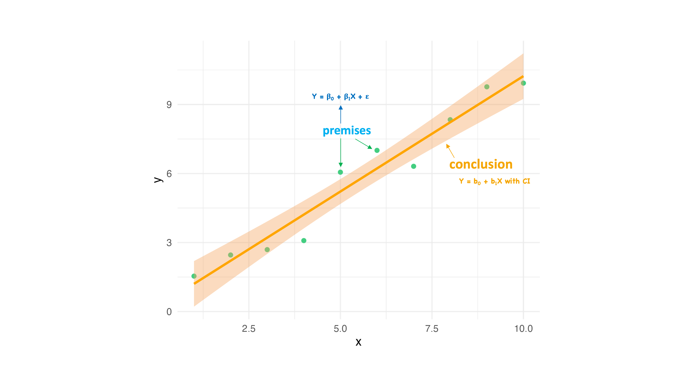
:::

## Bayes' theorem for statistical inference

**Bayesian interpretation**: data are fixed, parameters are random

::: text-align-center
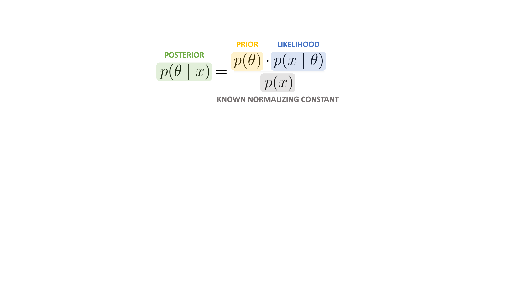
:::

## Bayes' theorem for statistical inference

**Bayesian interpretation**: data are fixed, parameters are random

::: text-align-center
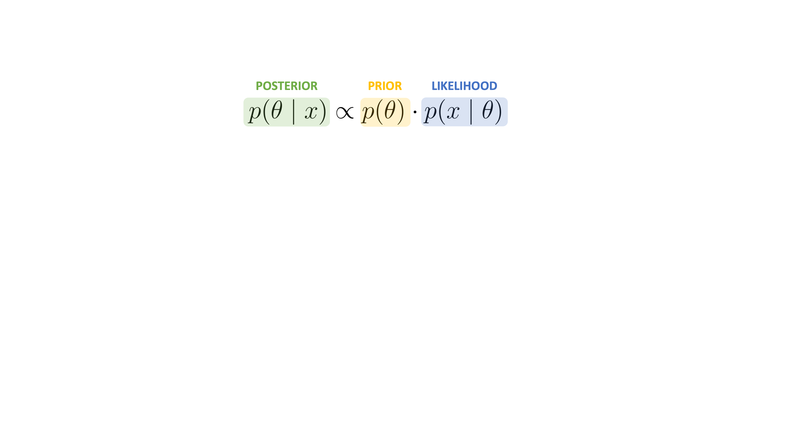
:::

## Globe tossing: Setup


## Globe tossing: Setup

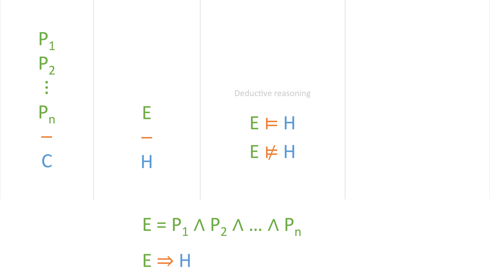

## Globe tossing: Setup

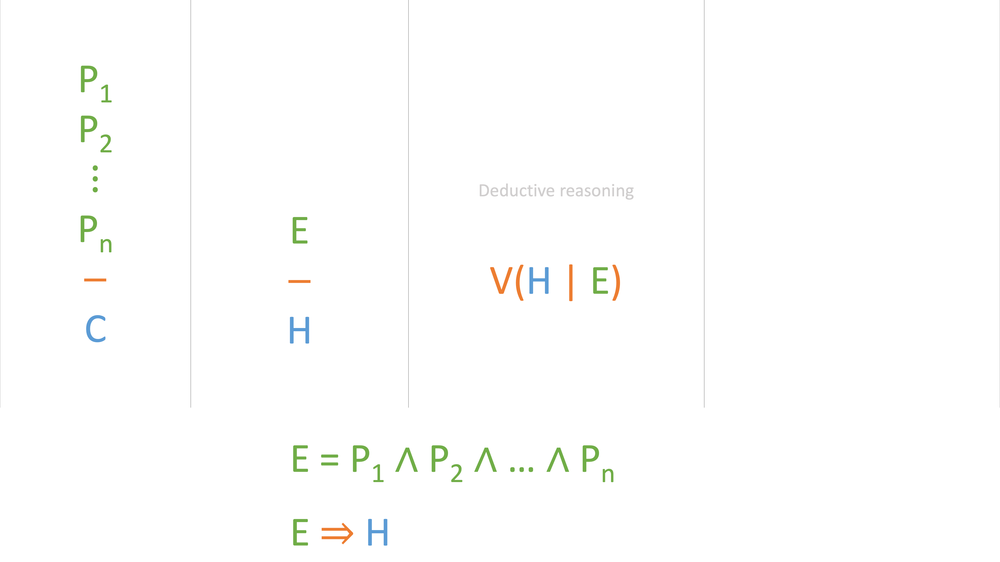

## Globe tossing: Setup

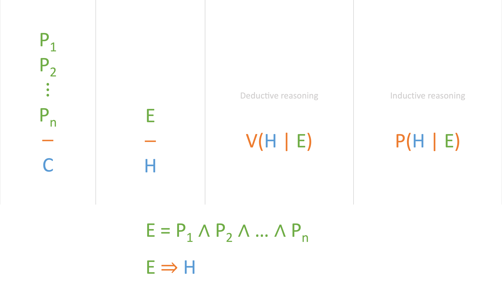

## Globe tossing: Setup

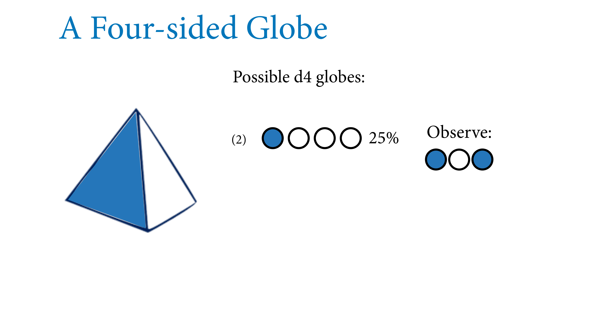

## Globe tossing: Likelihood

::: fragment
$$
\begin{array}{ r l }
  1)         & \text{there is a 4-sided globe with 1 side covered in water (blue) and 3 sides covered in land (white)} \\
  2)         & \text{the globe is tossed 3 times} \\
  \therefore & \text{2 of the tosses show a blue side}
\end{array}
$$
:::

 

::: fragment
$$
\begin{array}{r l}
  \pi     & = \text{proportion of blue sides on the globe}\ (0.25) \\
  n       & = \text{number of globe tosses}\ (3) \\
  X       & = \text{what is the number of tosses that show a blue side?} \\
  x       & = \text{number of tosses that show a blue side}\ (2) \\
\end{array}
$$
:::

 

::: fragment
$$
p(X = 2 \mid \pi = 0.25, n = 3, M^*) =\ ?
$$
:::

## Globe tossing: Likelihood

$$
\begin{array}{ r l }
  1)         & \text{there is a 4-sided globe with 1 side covered in water (blue) and 3 sides covered in land (white)} \\
  2)         & \text{the globe is tossed 3 times} \\
  \therefore & \text{2 of the tosses show a blue side}
\end{array}
$$

 

$$
\begin{array}{r l}
  \pi     & = \text{proportion of blue sides on the globe}\ (0.25) \\
  n       & = \text{number of globe tosses}\ (3) \\
  X       & = \text{what is the number of tosses that show a blue side?} \\
  x       & = \text{number of tosses that show a blue side}\ (2) \\
\end{array}
$$

 

$$
p(X = 2 \mid \pi = 0.25, n = 3, M^{\text{Binomial}}) = \binom{n}{k}\pi^k(1-\pi)^{n-k} = 0.14062
$$

## Globe tossing: Likelihood

```{r}
# data
x <- 2
n <- 3

# possible proportions of blue sides on the globe
sides <- 4
π <- seq(0, 1, length.out = sides + 1)

# likelihood of the data given the proportion of blue sides on the globe
df <- tibble(π, likelihood = dbinom(x, prob = π, size = n))

df
```

## Globe tossing: Prior

The beta distribution is a family of distributions that describe the probability of continuous random variables within the interval $[0, 1]$, making it particularly useful for modeling proportions, probabilities, and other quantities bounded between 0 and 1

::: columns
::: {.column width="33%"}
```{r}
#| echo: false
X = seq(0, 1, 0.01)
a = 0.5
b = 0.5

df <- tibble(X, pX = dbeta(X, a, b))

df %>%
  gf_line(pX ~ X, color = "blue", linewidth = 1) %>%
  gf_labs(x = "π", y = "p(π)", title = str_glue("π ~ Beta(a = {a}, b = {b})")) %>% gf_theme(text = element_text(size = 30), plot.title=element_text(size=30), axis.title=element_text(size=30))
```
:::

::: {.column width="34%"}
```{r}
#| echo: false
X = seq(0, 1, 0.01)
a = 1
b = 1

df <- tibble(X, pX = dbeta(X, a, b))

df %>%
  gf_line(pX ~ X, color = "blue", linewidth = 1) %>%
  gf_labs(x = "π", y = "p(π)", title = str_glue("π ~ Beta(a = {a}, b = {b})")) %>% gf_theme(text = element_text(size = 30), plot.title=element_text(size=30), axis.title=element_text(size=30))
```
:::

::: {.column width="33%"}
```{r}
#| echo: false
X = seq(0, 1, 0.01)
a = 2
b = 2

df <- tibble(X, pX = dbeta(X, a, b))

df %>%
  gf_line(pX ~ X, color = "blue", linewidth = 1) %>%
  gf_labs(x = "π", y = "p(π)", title = str_glue("π ~ Beta(a = {a}, b = {b})")) %>% gf_theme(text = element_text(size = 30), plot.title=element_text(size=30), axis.title=element_text(size=30))
```
:::
:::

::: columns
::: {.column width="33%"}
```{r}
#| echo: false
X = seq(0, 1, 0.01)
a = 2
b = 8

df <- tibble(X, pX = dbeta(X, a, b))

df %>%
  gf_line(pX ~ X, color = "blue", linewidth = 1) %>%
  gf_labs(x = "π", y = "p(π)", title = str_glue("π ~ Beta(a = {a}, b = {b})")) %>% gf_theme(text = element_text(size = 30), plot.title=element_text(size=30), axis.title=element_text(size=30))
```
:::

::: {.column width="34%"}
```{r}
#| echo: false
X = seq(0, 1, 0.01)
a = 5
b = 5

df <- tibble(X, pX = dbeta(X, a, b))

df %>%
  gf_line(pX ~ X, color = "blue", linewidth = 1) %>%
  gf_labs(x = "π", y = "p(π)", title = str_glue("π ~ Beta(a = {a}, b = {b})")) %>% gf_theme(text = element_text(size = 30), plot.title=element_text(size=30), axis.title=element_text(size=30))
```
:::

::: {.column width="33%"}
```{r}
#| echo: false
X = seq(0, 1, 0.01)
a = 8
b = 2

df <- tibble(X, pX = dbeta(X, a, b))

df %>%
  gf_line(pX ~ X, color = "blue", linewidth = 1) %>%
  gf_labs(x = "π", y = "p(π)", title = str_glue("π ~ Beta(a = {a}, b = {b})")) %>% gf_theme(text = element_text(size = 30), plot.title=element_text(size=30), axis.title=element_text(size=30))
```
:::
:::

## Globe tossing: Prior

```{r}
#| echo: false
x <- 2
n <- 3
sides <- 4
π <- seq(0, 1, length.out = sides + 1)
df <- tibble(π, likelihood = dbinom(x, prob = π, size = n))
df
```

::: fragment
```{r}
# hyperparameters = parameters of the prior probability distribution
a = 1
b = 1

# prior probability of the proportion of blue sides on the globe before observing any data
df <- df %>% mutate(prior = dbeta(π, a, b))

df
```
:::

## Globe tossing: Posterior

::: {.text-align-center style="color: #357EC7"}
**LIKELIHOOD**
:::

$$
p(X = 2 \mid \pi, n = 3) \\
$$

::: {.text-align-center style="color: #FFA500"}
**PRIOR**
:::

$$
p(\pi \mid a = 1, b = 1) \\
$$

::: {.text-align-center style="color: #4E9258"}
**POSTERIOR**
:::

$$
p(\pi \mid X = 2, n = 3) \propto p(\pi \mid a = 1, b = 1) \cdot p(X = 2 \mid \pi, n = 3) \\
$$

::: text-align-center
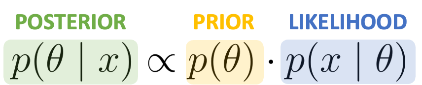{height="100"}
:::

## Globe tossing: Posterior

```{r}
# posterior probability of the proportion of blue sides on the globe after observing the data
df <- df %>% mutate(posterior = prior * likelihood)

df
```

## Globe tossing: Posterior

```{r}
df %>%
  gf_point(posterior ~ π, color = "#4E9258", alpha = 1) %>%
  gf_segment(x = ~π, xend = ~π, y = 0, yend = ~posterior, color = "#4E9258", linewidth = 0.5) %>%
  gf_labs(x = "π", y = "p", title = "Posterior probability distribution of π") %>% gf_theme(plot.title = element_text(size = 20))
```

## Globe tossing: Setup


## 

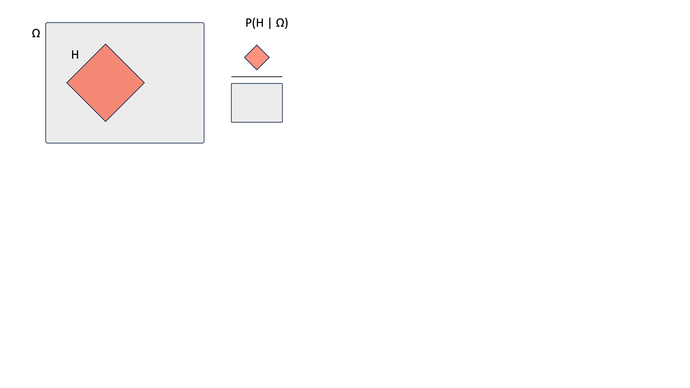

## 


## 

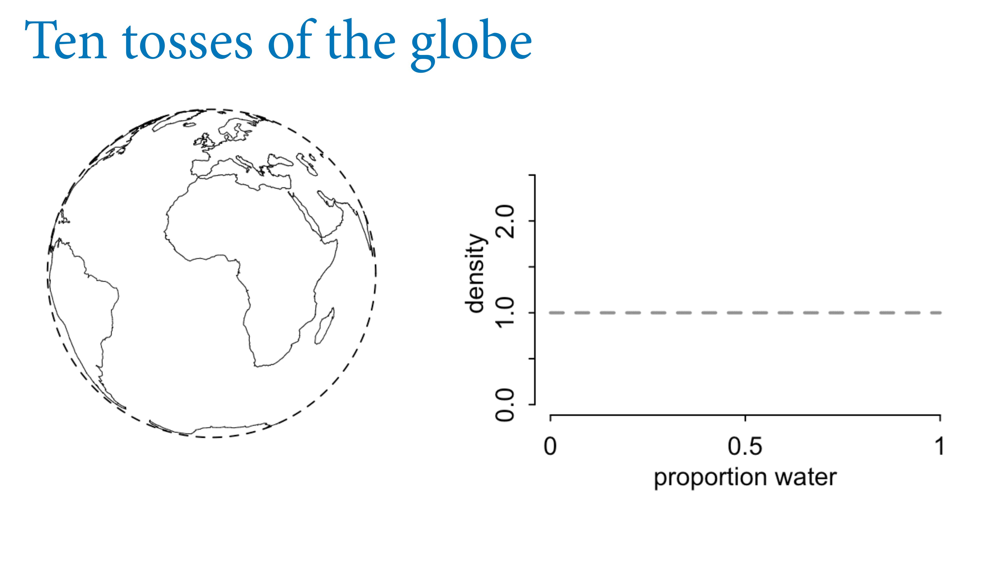

## 


## 

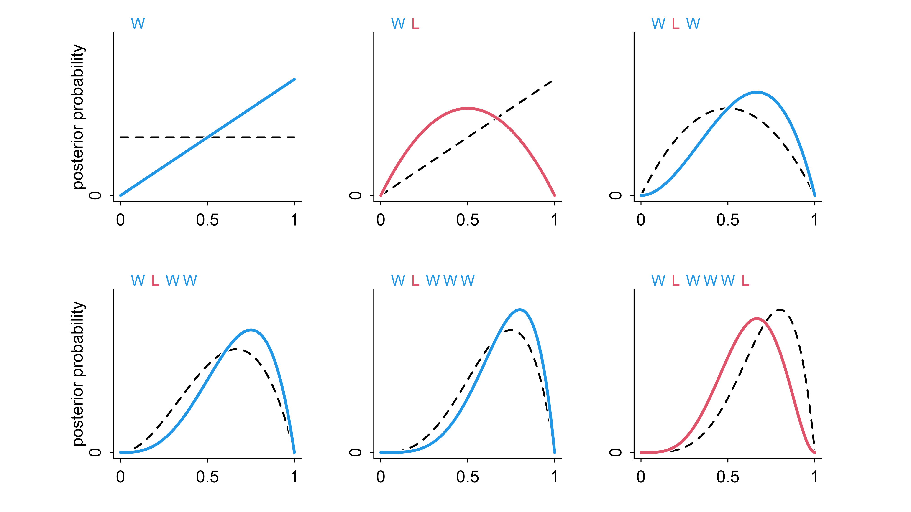

## 

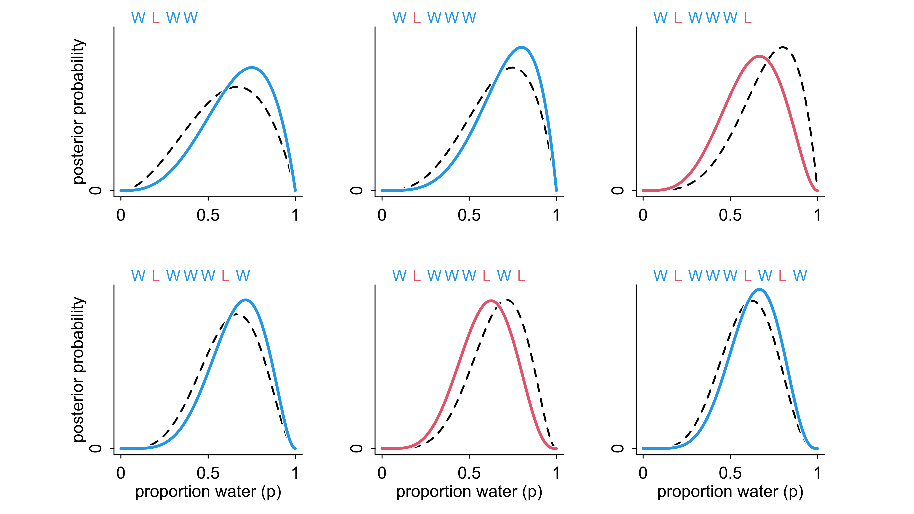

## 

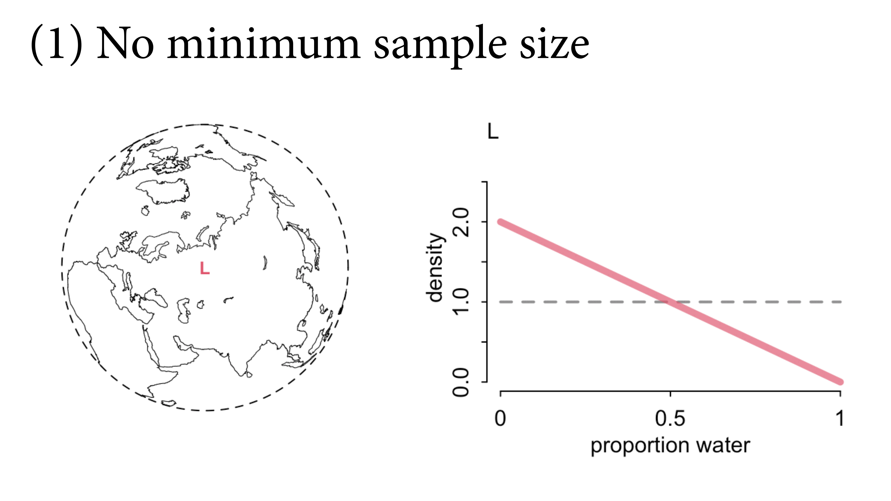

## 

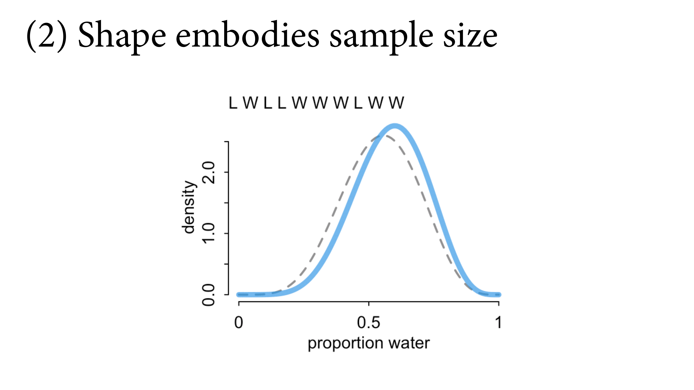

## 

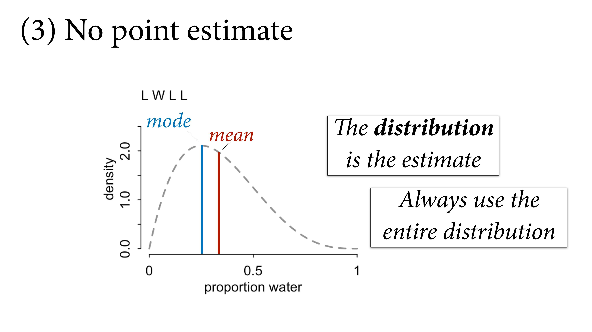

## 

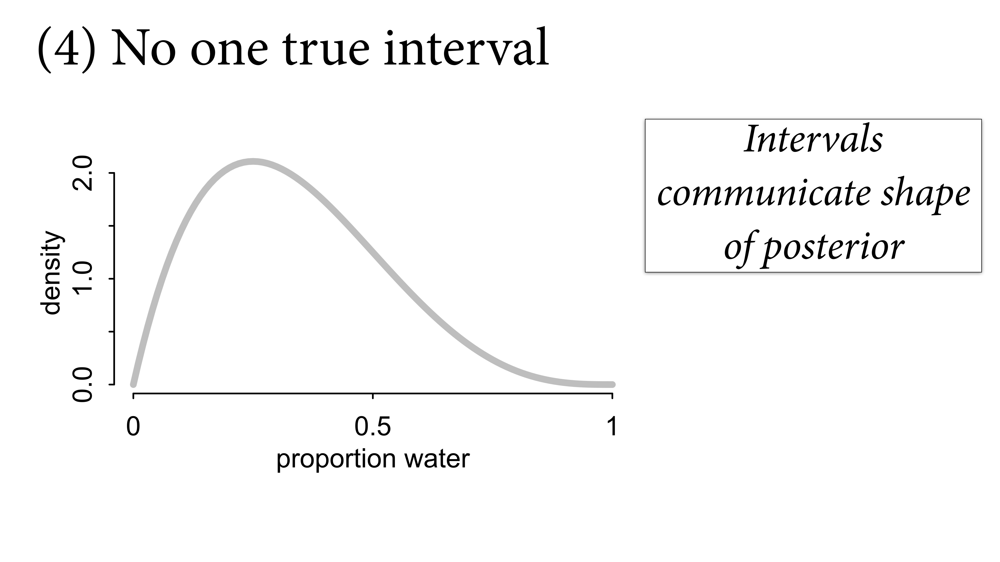

## 

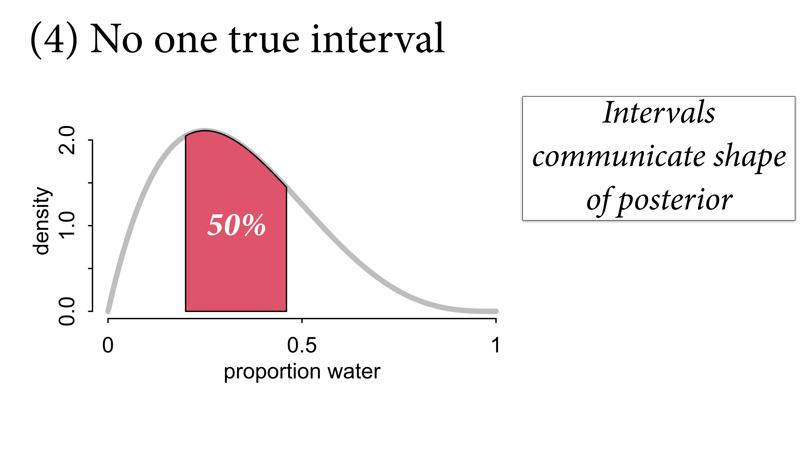

## 

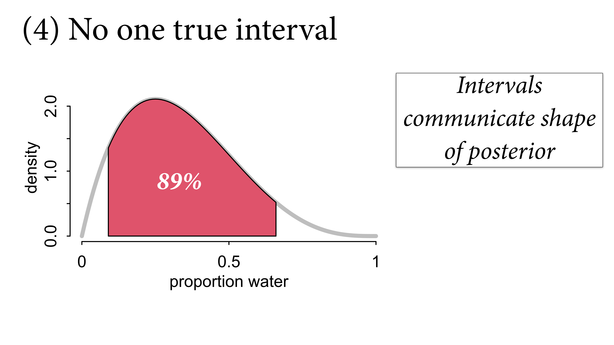

## 

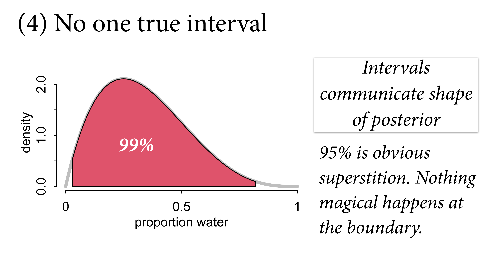

## 

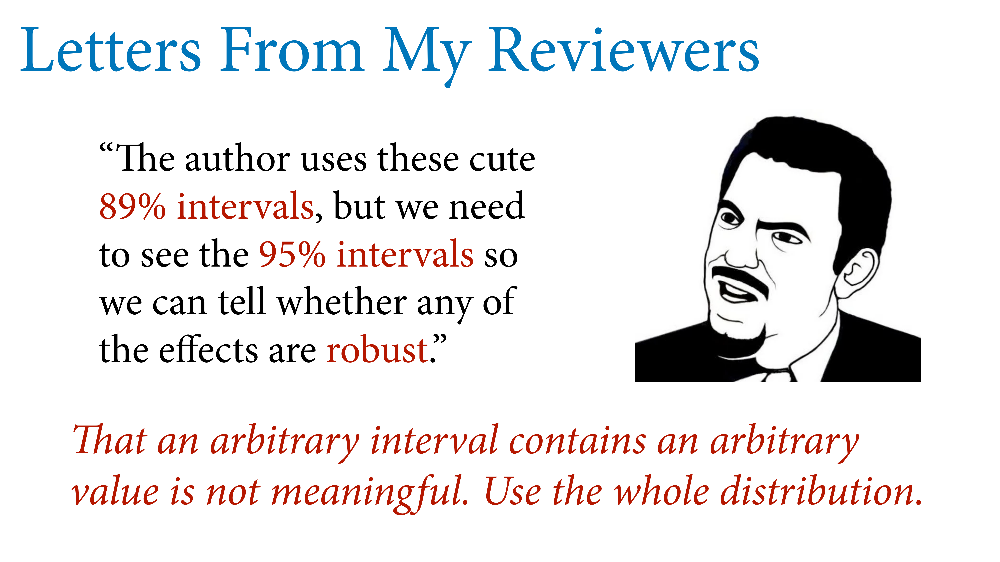

## Globe tossing experiment

[Bayesian inference using grid approximation](https://www.bayesrulesbook.com/chapter-6)

```{r}
globe_tossing_grid_approx <- function(w, l, a = 1, b = 1, grid_size = 1000) {
  # create grid of proportion of water values
  prop_w.grid <- seq(from = 0, to = 1, length.out = grid_size + 1)
  
  # calculate prior (and normalize for plotting)
  prior <- dbeta(prop_w.grid, a, b)
  prior.normalized <- prior / sum(prior)
  
  # calculate likelihood (and normalize for plotting)
  likelihood <- dbinom(w, size = w+l, prob = prop_w.grid)
  likelihood.normalized <- likelihood / sum(likelihood)

  # calculate posterior and normalize
  posterior.unnormalized <- prior * likelihood
  posterior <- posterior.unnormalized / sum(posterior.unnormalized)

  # plot prior, likelihood, and posterior
  tibble(prop_w.grid, prior, likelihood.normalized, posterior) %>%
    gf_line(likelihood.normalized ~ prop_w.grid, color = "#357EC7") %>%
    gf_line(prior.normalized ~ prop_w.grid, color = "#FFA500") %>%
    gf_line(posterior ~ prop_w.grid, color = "#4E9258") %>%
    gf_labs(x = "proportion water (p)", y = "posterior probability")
}
```

```{r}
#| include: false
globe_tossing_samples <- function(w, l, a = 1, b = 1, n = 1000) { rbeta(n, w + a, l + b) }
```

## Globe tossing experiment

Prior information: About 71% of the Earth's surface is covered by water \[[usgs.gov](https://www.usgs.gov/special-topics/water-science-school/science/how-much-water-there-earth)\]

::: columns
::: {.column width="50%"}
::: fragment
```{r}
#| fig-height: 7.5
globe_tossing_grid_approx(w = 8, l = 2,
                          a = 1, b = 1) %>% gf_lims(y = c(0, 0.007))
```
:::

::: {.fragment .text-align-center}
[**prior**]{style="font-weight: bold; color: rgb(255, 165, 0);"}  [**likelihood**]{style="color: #357EC7"}  [**posterior**]{style="color: #4E9258"}
:::

::: fragment
```{r}
#| echo: false
HPDI(globe_tossing_samples(w = 8, l = 2,
                           a = 1, b = 1)) %>% round(2)
```
:::
:::

::: {.column width="50%"}
::: fragment
```{r}
#| fig-height: 7.5
globe_tossing_grid_approx(w = 8, l = 2,
                          a = 29, b = 11) %>% gf_lims(y = c(0, 0.007))
```
:::

::: {.fragment .text-align-center}
[**prior**]{style="font-weight: bold; color: rgb(255, 165, 0);"}  [**likelihood**]{style="color: #357EC7"}  [**posterior**]{style="color: #4E9258"}
:::

::: fragment
```{r}
#| echo: false
HPDI(globe_tossing_samples(w = 8, l = 2,
                           a = 29, b = 11)) %>% round(2)
```
:::
:::
:::

## Globe tossing experiment

Prior information: About 71% of the Earth's surface is covered by water \[[usgs.gov](https://www.usgs.gov/special-topics/water-science-school/science/how-much-water-there-earth)\]

::: columns
::: {.column width="50%"}
::: fragment
```{r}
#| fig-height: 7.5
globe_tossing_grid_approx(w = 2, l = 8,
                          a = 29, b = 11) %>% gf_lims(y = c(0, 0.007))
```
:::

::: {.fragment .text-align-center}
[**prior**]{style="font-weight: bold; color: rgb(255, 165, 0);"}  [**likelihood**]{style="color: #357EC7"}  [**posterior**]{style="color: #4E9258"}
:::

::: fragment
```{r}
#| echo: false
HPDI(globe_tossing_samples(w = 2, l = 8,
                           a = 29, b = 11)) %>% round(2)
```
:::
:::

::: {.column width="50%"}
::: fragment
```{r}
#| fig-height: 7.5
globe_tossing_grid_approx(w = 80, l = 20,
                          a = 1,  b = 9) %>% gf_lims(y = c(0, 0.011))
```
:::

::: {.fragment .text-align-center}
[**prior**]{style="font-weight: bold; color: rgb(255, 165, 0);"}  [**likelihood**]{style="color: #357EC7"}  [**posterior**]{style="color: #4E9258"}
:::

::: fragment
```{r}
#| echo: false
HPDI(globe_tossing_samples(w = 80, l = 20,
                           a = 1,  b = 9)) %>% round(2)
```
:::
:::
:::

## References

::: {#refs}
:::

##  {background-image="images/thats_all_folks.jpg" background-size="50%"}

##  {background-image="images/briggs2.png" background-size="contain"}

##  {background-image="images/bayesian_inference_is_just_counting.jpg" background-size="contain"}

