```{r}
#| include: false
library(dagitty)

net_dag <- dagitty(
'dag {
  malaria_risk [outcome]
  net [exposure]
  eligible -> net
  health -> malaria_risk
  health -> net
  household -> eligible
  household -> net
  income -> eligible
  income -> health
  income -> malaria_risk
  income -> net
  net -> malaria_risk
  resistance -> malaria_risk
  temperature -> malaria_risk
  temperature -> net    
}')
```

```{r}
#| include: false
library(coursekata)

theme_set(theme_bw())

m = 1000
```

```{r}
#| include: false
library(tidyverse)
library(ggridges)
library(latex2exp)
```

```{r}
#| include: false
data(Howell1, package = "rethinking")

df.obs <-
  Howell1 %>%
  filter(age >= 18) %>%
  select(weight, height) %>%
  round() %>% 
  select(H = height, W = weight)

df.obs

range(df.obs$H)

mle.lm.fit <- lm(W ~ H, data = df.obs)
```

##  {background-image="images/last_week_tonight.jpg" background-size="contain"}

## Modern science: statistical (+ causal) inference

{fig-align="center" width="979"}

See also: [Shmueli (2010)](https://doi.org/10.1214/10-STS330) To explain or to predict?

::: notes
A purely statistical model (likelihood) by itself does not necessarily capture the actual causal process. A likelihood says, “Given parameters $\theta$, here is the joint probability (or conditional probability) for the data $x$,” but it does not say whether or why one variable influences another or in what manner. To fully describe the data‐generating process (DGP), you typically need to add causal assumptions (for instance, a directed acyclic graph, or structural equation models) so that the model encodes not just statistical association but also causal relationships/effects.

In short:

-   Statistical model:

    -   A parametric (or nonparametric) specification of $$p(x \mid \theta)$$, encoding correlations/associations

-   Causal/Generative model:

    -   A specification that includes causal structure (e.g., via a DAG or structural equations) so that you can interpret parameter changes as interventions or do predictions about “what if we do X?” instead of just “if we observe X?”

Hence, to treat the likelihood as truly the “data‐generating process model,” you need to incorporate those causal assumptions. Otherwise, the likelihood alone is just a “data model” that might match the observed associations, but not necessarily represent the causal relationships/effects/generative process.
:::

##  {background-image="causal_salad/part.01.slide.07.png" background-size="50%"}

##  {background-image="causal_salad/part.01.slide.08.png" background-size="50%"}

##  {background-image="causal_salad/part.03.slide.14.png" background-size="contain"}

##  {background-image="causal_salad/part.01.slide.05.png" background-size="contain"}

## Models can be accurate without being correct!

::: fragment
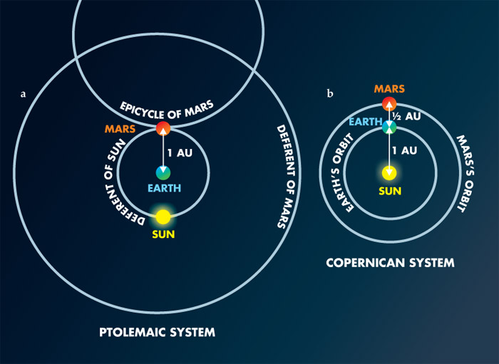{fig-align="center" width="603"}
:::

## What is causal inference?

- **Statistical inference**: learning **statistical relationships** (patterns of association) between random variables

  - Predict **unobserved outcomes** under **same** conditions  
    [*What if I see this?*]{.gray}

- **Causal inference**: learning **cause-and-effect relationships** between random variables

  - Predict **unobserved outcomes** under **changed** conditions:
    - **consequences of interventions** (causal prediction, forward-looking)  
      [*What if I do this?*]{.gray}

    - **counterfactual outcomes** (causal imputation, backward-looking)  
      [*What if I had done something else?*]{.gray}
    
##  {background-image="causal_salad/part.01.slide.10.png" background-size="50%"}

##  {background-image="causal_salad/part.01.slide.11.png" background-size="50%"}

## The ladder of causation

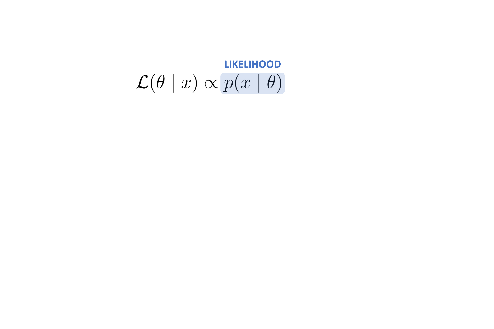{fig-align="center"}

## Experiments are no refuge {visibility="hidden"}

-   Why do experiments work? When do they work (or not)?

-   Should you test for balance after randomization?

-   What if treatment allocation were imperfect?

-   Should you control for anything? Everything?

-   What is the causal effect in the target population?

-   **Answers to these and other questions about experiments depend upon causal assumptions**

## Description is no refuge {visibility="hidden"}

-   The goal is to describe populations, not samples

-   Sampling bias, stratified sampling, post-stratification, missing data, measurement error, etc.

-   **In order to describe populations, we need to make causal assumptions about how the sample was generated**

## Statistical learning is cause-blind

::: fragment
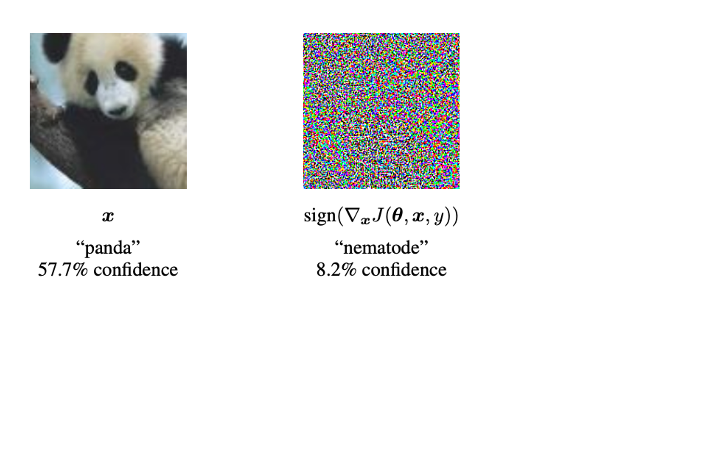{fig-align="center" height="440"}

[Goodfellow et al. (2014)](https://doi.org/10.48550/arXiv.1412.6572)
:::

## Statistical learning is cause-blind

{fig-align="center" height="440"}

[Goodfellow et al. (2014)](https://doi.org/10.48550/arXiv.1412.6572)

## Statistical learning is cause-blind

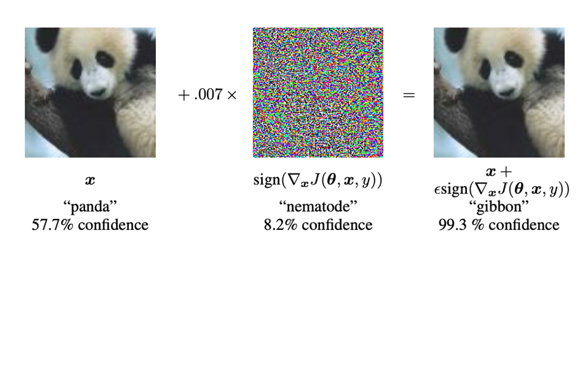{fig-align="center" height="440"}

[Goodfellow et al. (2014)](https://doi.org/10.48550/arXiv.1412.6572)

## No causes in, no causes out!

::::: columns
::: {.column width="66%"}
-   The data themselves do not contain information about causes

-   It is not possible to reliably learn causes from data alone

-   Statistical models alone are insufficient; they do not contain causal information

-   Statistical learning methods (incl. multivariate linear regression) do not distinguish causes from confounds

-   p-values are not causal statements

-   AIC etc. are purely predictive
:::

::: {.column width="34%"}
[{fig-align="center"}](https://academic.oup.com/book/27760)
:::
:::::

##  {background-image="causal_salad/part.01.slide.28.png" background-size="50%"}

##  {background-image="causal_salad/part.02.slide.06.png" background-size="50%"}

## Spurious correlations: correlation is not causation

Source: <https://tylervigen.com/spurious-correlations>

::::: columns
::: {.column width="60%"}
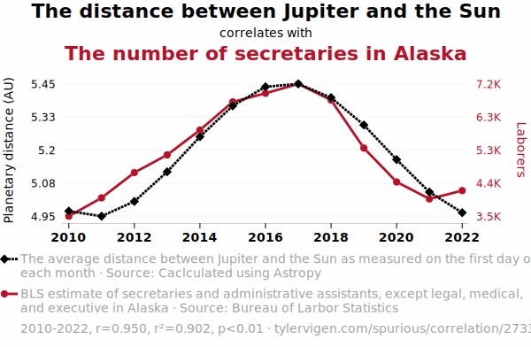
:::

::: {.column width="40%"}
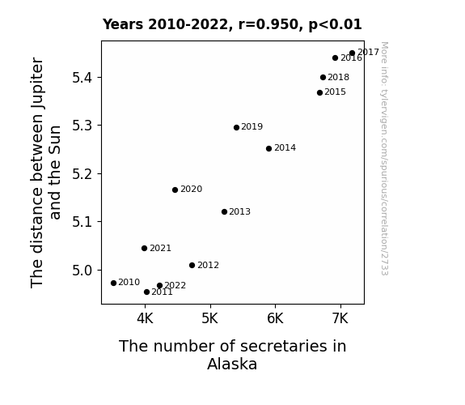
:::
:::::

## Spurious correlations: correlation is not causation

Source: <https://tylervigen.com/spurious-correlations>

::::: columns
::: {.column width="40%"}

:::

::: {.column width="60%"}
> As the distance between Jupiter and the Sun increases, the gravitational pull on Earth fluctuates, leading to a rise in cosmic productivity waves. These waves, when they reach Alaska, have been found to have a magnetic effect on the influx of secretarial energy, prompting more individuals to pursue careers in Alaska as professional secretaries. It's like a celestial calling for secretarial excellence in the land of the midnight sun.
:::
:::::

## Spurious correlations: correlation is not causation

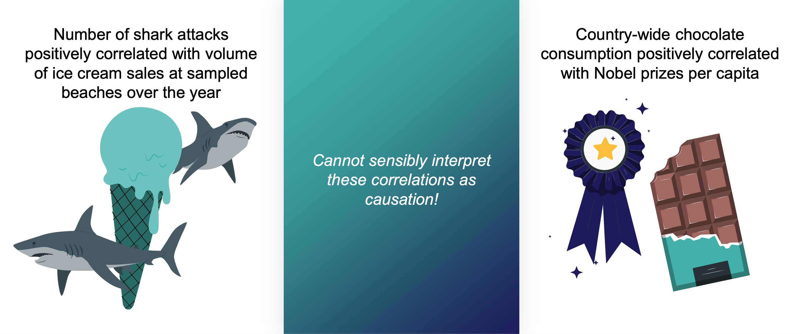

## Spurious correlations: correlation is not causation

::::: columns
::: column
{fig-align="center" width="330"}
:::

::: column
{fig-align="center" width="330"}
:::
:::::

##  Sometime correlation/association is causation!

-   If there are no confounders and there is a linear relationship between the treatment and the outcome, then correlation is causation

-   If there are no confounders and there is a statistical relationship between the treatment and the outcome, then association is causation

::: notes
-   Adjusting for baseline covariates can make an estimate more precise
:::

## Causal inference workflow

1.  **Specify causal question** (estimand, e.g., average treatment effect of exposure on outcome)

2.  **Make causal model** (e.g., draw causal diagram)

3.  **Test causal model**

4.  **Translate causal model into statistical model** (e.g., multivariate linear regression)

5.  **Test statistical model**

6.  **Fit statistical model to data to estimate causal effect** (e.g., regression coefficient)

7.  **Test causal predictions**

## Specify causal question

"*Does using a bed net reduce the risk of malaria?*"

```{r}
#| output-location: default
data(net_data, package="causalworkshop") # https://r-causal.github.io/causal_workshop_website

net_data
```

## Specify causal question

"*Does using a bed net reduce the risk of malaria?*"

```{r}
#| output-location: default
gf_density(~ malaria_risk, fill = ~ net, data = net_data)
```

## Specify causal question

"*Does using a bed net reduce the risk of malaria?*"

```{r}
#| output-location: default
favstats(malaria_risk ~ net, data = net_data) %>% knitr::kable()
```

## Specify causal question

"*Does using a bed net reduce the risk of malaria?*"

```{r}
#| output-location: default
lm(malaria_risk ~ net, data = net_data) %>%
  broom::tidy(conf.int = TRUE) %>% select(term, estimate, conf.low, conf.high) %>% knitr::kable()
```

## Draw causal diagram (DAG)

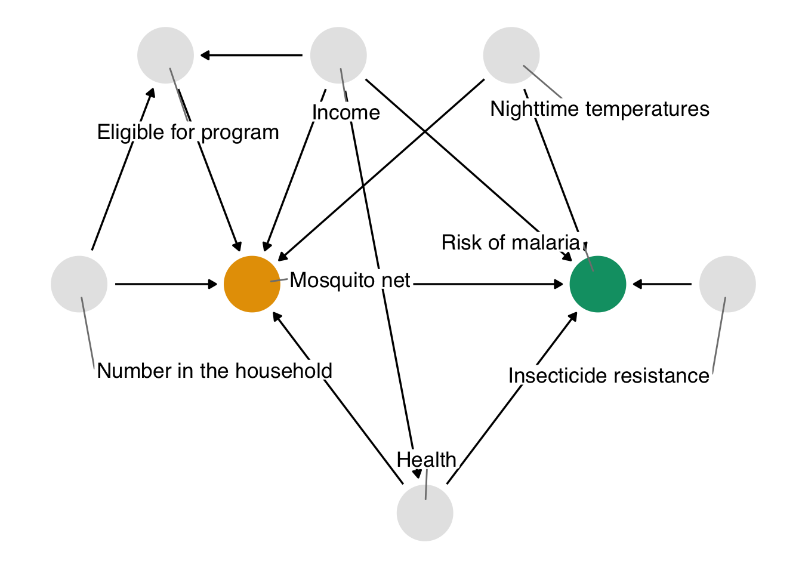{fig-align="center"}

## Draw causal diagram (DAG)

```{r}
#| output-location: default
#| eval: false
library(dagitty)

net_dag <- dagitty(
'dag {
  malaria_risk [outcome]
  net [exposure]
  eligible -> net
  health -> malaria_risk
  health -> net
  household -> eligible
  household -> net
  income -> eligible
  income -> health
  income -> malaria_risk
  income -> net
  net -> malaria_risk
  resistance -> malaria_risk
  temperature -> malaria_risk
  temperature -> net    
}')
```

## Draw causal diagram (DAG)

```{r}
#| echo: false
#| output-location: default
set.seed(666)
```

```{r}
#| output-location: default
plot(net_dag)
```


## Translate DAG into statistical model

::: columns

::: column
{fig-align="center"}
:::

::: column
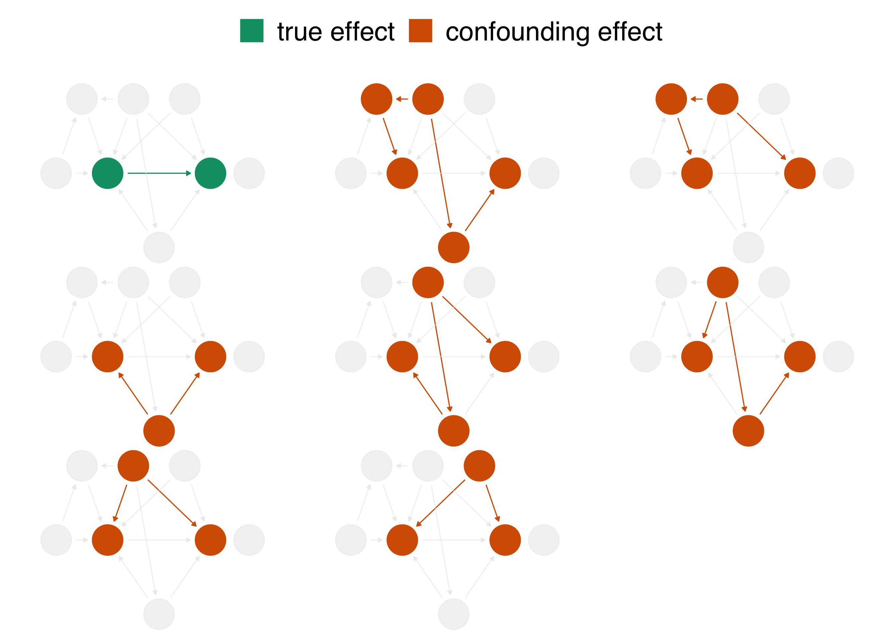{fig-align="center"}
:::

:::

## Translate DAG into statistical model

```{r}
#| output-location: default
as_tibble(paths(net_dag)) %>% filter(open) %>% knitr::kable()
```

## Translate DAG into statistical model

```{r}
#| output-location: default
adjustmentSets(net_dag)
```

-   These three variables are a **minimal adjustment set**, i.e., the minimum set of variables to adjust for in order to block all backdoor paths/confounding effects between treatment and outcome,

-   such that the estimate of the statistical association between exposure and outcome can be interpreted as an estimate of the causal effect of the exposure on the outcome

## Estimate causal effect using statistical model

```{r}
#| output-location: default
lm(malaria_risk ~ net + health + income + temperature, data = net_data) %>% 
  broom::tidy(conf.int = TRUE) %>% select(term, estimate, conf.low, conf.high) %>% knitr::kable()
```

##  {background-image="causal_salad/part.02.slide.06.png" background-size="50%"}

## Make a causal model

-   Fundamental component of a causal model: A function that determines how a variable is influenced by others

::: fragment
$$
Y = f(X)
$$
:::

-   In a graphical causal model (a.k.a. a causal diagram), this function is represented by an arrow that connects two variables

::: fragment
$$
X \to Y
$$
:::

-   There is no method for making causal models other than **science**

-   There is no method for science other than **honest anarchy**

## Make a causal model

-   A causal model represents our knowledge about the data generating process (DGP)

    -   For example, domain knowledge and previous studies/experiments
    
    -   A causal model is a set of assumptions about the causal relationships between variables

-   A causal model is often represented graphically as a directed acyclic graph (DAG)

    -   A set of nodes (variables) connected by arrows (causal relationships), without cycles/loops

-   A DAG only says which variables influence another, not how (functional form of the causal relationship)

## Make a causal model

-   Variables are nodes

-   Cause-effect relationships are arrows:

    -   $A \rightarrow B$
    
    -   "$A$ is a possible cause of $B$"

-   Absence of arrow from $A$ to $B$ is a stronger assumption:

    -   "$A$ is **definitely not** a cause of $B$"

-   Create DAG with team and stakeholders as a transparent representation of your shared understanding of the DGP and the causal assumptions that inform data collection and statistical analysis

-   Include all possible causal variables (**even if not in data**) and arrows

-   Complexity is okay, reality is complex!

## Make a causal model

-   Terminology: $\quad A \rightarrow B \rightarrow C$

    -   $A$ is a **parent** of $B$

    -   $B$ is a **child** of $A$

    -   $C$ is a **descendant** of $A$

    -   $A$ is an **ancestor** of $C$

    -   If a variable has one or more parents it is an **endogeneous** variable, otherwise it is an **exogeneous** variable

    -   A **path** is a sequence of arrows through variables, regardless of the directions of arrows

-   Examples:


##  {background-image="causal_salad/part.02.slide.09.png" background-size="50%"}

##  {background-image="causal_salad/part.02.slide.10.png" background-size="50%"}

##  {background-image="causal_salad/part.02.slide.11.png" background-size="50%"}

##  {background-image="causal_salad/part.02.slide.12.png" background-size="50%"}

##  {background-image="causal_salad/part.02.slide.13.png" background-size="50%"}

##  {background-image="causal_salad/part.02.slide.73.png" background-size="50%"}

## Translate DAG into statistical model

-   Causal models can be complicated

-   But rules for analyzing them are simple

-   Graph analysis allows:

    -   Testing the causal model

    -   Translating the causal model into a statistical model

-   All of this requires understanding [*d*-separation](https://www.dagitty.net/learn/dsep/), i.e., identifying and blocking all backdoor paths

## The three elemental confounds

::: notes
counfounding paths/effects
:::

-   **Fork**: $Z$ is a common cause of $X$ and $Y$

::: fragment
$$X \leftarrow Z \rightarrow Y$$
:::

-   **Pipe** (a.k.a. chain): $Z$ is a mediator between $X$ and $Y$

::: fragment
$$X \rightarrow Z \rightarrow Y$$
:::

-   **Collider**: $Z$ is a common effect of $X$ and $Y$

::: fragment
$$X \rightarrow Z \leftarrow Y$$
:::

##  {background-image="causal_salad/part.02.slide.32.png" background-size="50%"}

##  {background-image="causal_salad/part.02.slide.33.png" background-size="50%"}

##  {background-image="causal_salad/part.02.slide.34.png" background-size="50%"}

##  {background-image="causal_salad/part.02.slide.35.png" background-size="50%"}

##  {background-image="causal_salad/part.02.slide.36.png" background-size="50%"}

##  {background-image="causal_salad/part.02.slide.37.png" background-size="50%"}

##  {background-image="causal_salad/part.02.slide.38.png" background-size="50%"}

##  {background-image="causal_salad/part.02.slide.40.png" background-size="50%"}

## Simpson's paradox

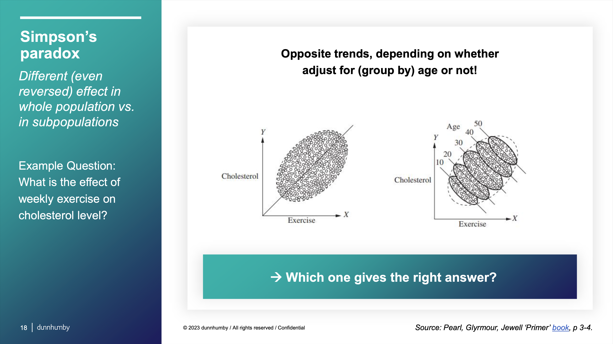

## Simpson's paradox

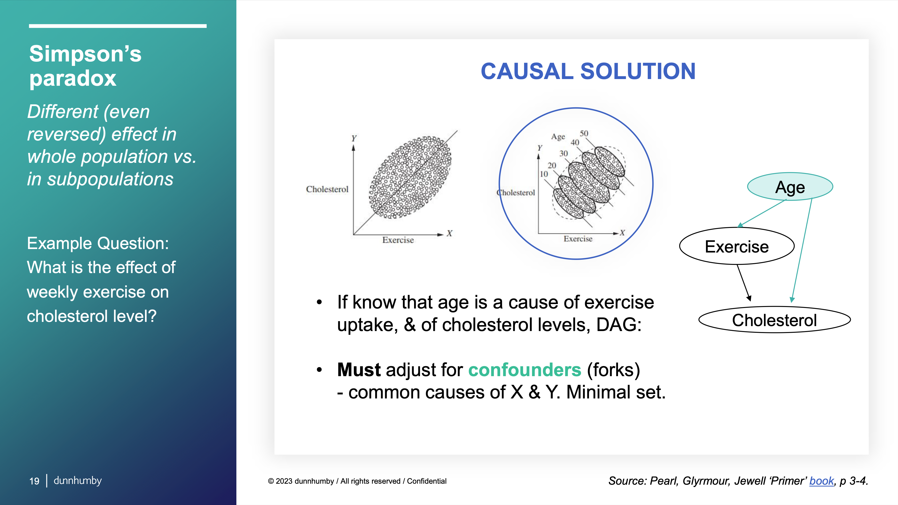

## Berkson's paradox

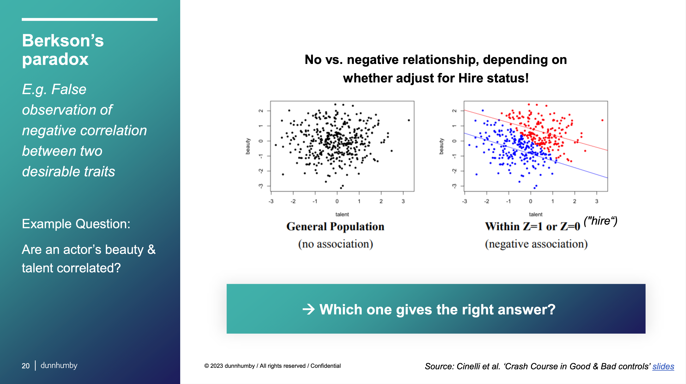

## Berkson's paradox

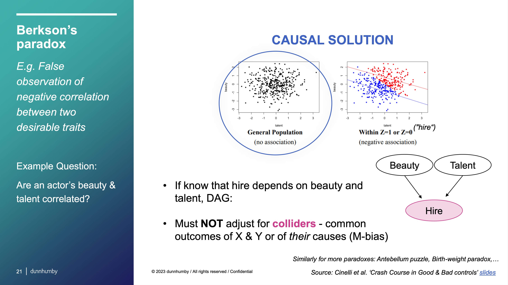


##  {background-image="causal_salad/part.02.slide.41.png" background-size="50%"}

##  {background-image="causal_salad/part.02.slide.42.png" background-size="50%"}

##  {background-image="causal_salad/part.02.slide.43.png" background-size="50%"}

##  {background-image="causal_salad/part.02.slide.44.png" background-size="50%"}

##  {background-image="causal_salad/part.02.slide.45.png" background-size="50%"}

##  {background-image="causal_salad/part.02.slide.46.png" background-size="50%"}

##  {background-image="causal_salad/part.02.slide.47.png" background-size="50%"}

##  {background-image="causal_salad/part.02.slide.48.png" background-size="50%"}

##  {background-image="causal_salad/part.02.slide.49.png" background-size="50%"}

##  {background-image="causal_salad/part.02.slide.50.png" background-size="50%"}

##  {background-image="causal_salad/part.02.slide.51.png" background-size="50%"}

##  {background-image="causal_salad/part.02.slide.52.png" background-size="50%"}

##  {background-image="causal_salad/part.02.slide.53.png" background-size="50%"}

##  {background-image="causal_salad/part.02.slide.54.png" background-size="50%"}

##  {background-image="causal_salad/part.02.slide.55.png" background-size="50%"}

##  {background-image="causal_salad/part.02.slide.56.png" background-size="50%"}

##  {background-image="causal_salad/part.02.slide.57.png" background-size="50%"}

##  {background-image="causal_salad/part.02.slide.58.png" background-size="50%"}

##  {background-image="causal_salad/part.02.slide.59.png" background-size="50%"}

## Table 2 fallacy

- Do not present or interpret individual coefficients as causal effects

- Interpretation depends upon the causal model, not just the statistical model

- A statistical model designed to identify $X \to Y$ will NOT also identify the causal effect of all other variables

- Each causal query requires its own, bespoke statistical model

::: fragment
[Westreich and Greenland (2013)](https://doi.org/10.1093/aje/kws412)
:::

##  {background-image="causal_salad/part.02.slide.62.png" background-size="50%"}

## Good and bad controls

- **"Control" variable**: A variable introduced in a statistical model specifically to enable a causal estimate; it is not of intrinsic interest by itself

- **Common heuristics** for choosing control variables:
  
  - Anything in the spreadsheet (YOLO! causal salad)
  
  - Any variables not highly collinear

  - Any variable that is statistically significantly associated with the outcome

  - Any variable that improves predictive performance (e.g., using automatic variable selection) 
  
  - Any pre-treatment variable (baseline measurements)
  
::: notes
-   Don't adjust for the future (post-treatment measurements) if you are estimating the total causal effect of exposure on outcome!
:::

::: fragment
[Cinelli et al. (2021)](https://doi.org/10.1177/00491241221099552) A Crash Course in Good and Bad Controls
:::

##  {background-image="causal_salad/part.02.slide.64.png" background-size="50%"}

##  {background-image="causal_salad/part.02.slide.65.png" background-size="50%"}

##  {background-image="causal_salad/part.02.slide.66.png" background-size="50%"}

##  {background-image="causal_salad/part.02.slide.67.png" background-size="50%"}

##  {background-image="causal_salad/part.02.slide.68.png" background-size="50%"}

##  {background-image="causal_salad/part.02.slide.69.png" background-size="50%"}

##  {background-image="causal_salad/part.02.slide.70.png" background-size="50%"}

##  {background-image="causal_salad/part.02.slide.71.png" background-size="50%"}

##  {background-image="causal_salad/part.02.slide.72.png" background-size="50%"}

## Estimate causal effect using statistical model

- Sometimes the causal model implies you need a **regression model**

- But this is NOT always the case

- Other models and approaches are available, e.g., **stratification**, **matching**, **propensity scores**, **instrumental variables**, **structural equation models**, **causal AI**, etc.

- **Bayesian networks** are a **general approach** to handle arbitrary causal models

##  {background-image="images/clipboard-3308191871.png" background-size="75%"}

## Much much more

- **Computation of treatment effects**: NOT a single parameter

- **Post-stratification**: effect for the population, not the sample

- **Partial-identification**: confounded but learning

- **Research design**

## Full luxury causal workflow

1. Derive candidate **causal model** using "science" (domain knowledge, theory, etc.)

2. Program causal model as a **generative simulation** (e.g., a Bayesian network)

3. Design research and validate your statistical analysis using (2)

4. Confront model with data; celebrate both wins and losses

5. Revise and repeat

## Full sadness non-causal workflow

1. Find or collect some variables that are **conceptually** (but not **logically**) related to the phenomenon

2. Probe the data anyway you can to reveal **asterisks**

3. Tell a **hopeful causal story** about why these asterisks exist

4. Never state the **assumptions** licensing this story

5. **Revel** in your magnificent *h*-index

## Causal inference textbooks and online courses


## Free, open-source causal inference tools

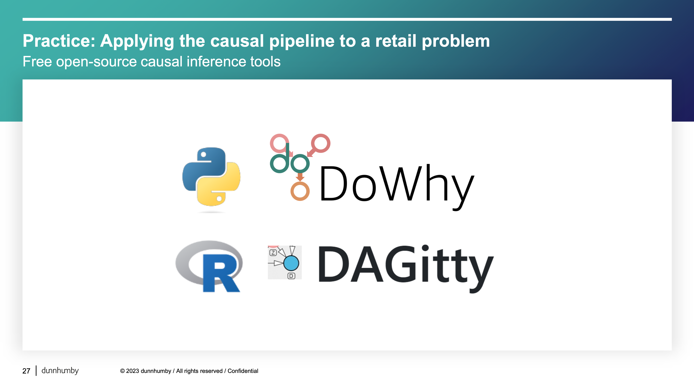

## Modern science: statistical (+ causal) inference

{fig-align="center" width="979"}

See also: [Shmueli (2010)](https://doi.org/10.1214/10-STS330) To explain or to predict?

## Statistical inference is inductive reasoning

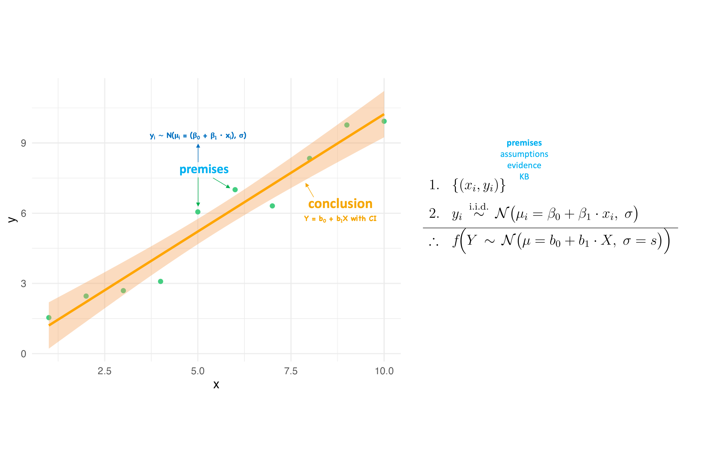

## Statistical inference is inductive reasoning

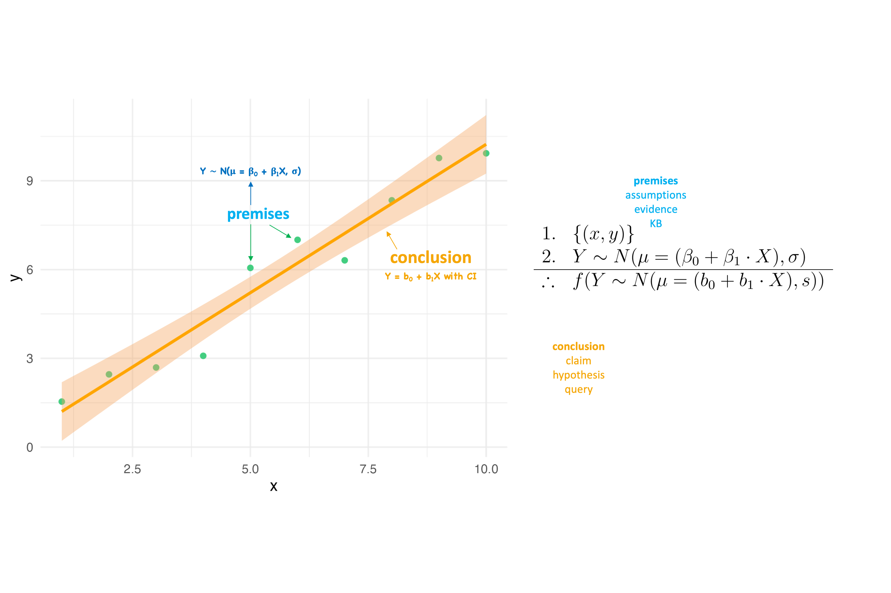

## Statistical inference is inductive reasoning

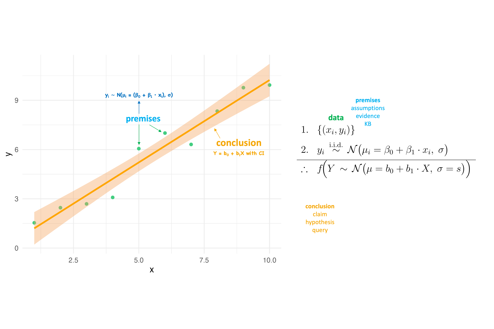

## Statistical inference is inductive reasoning

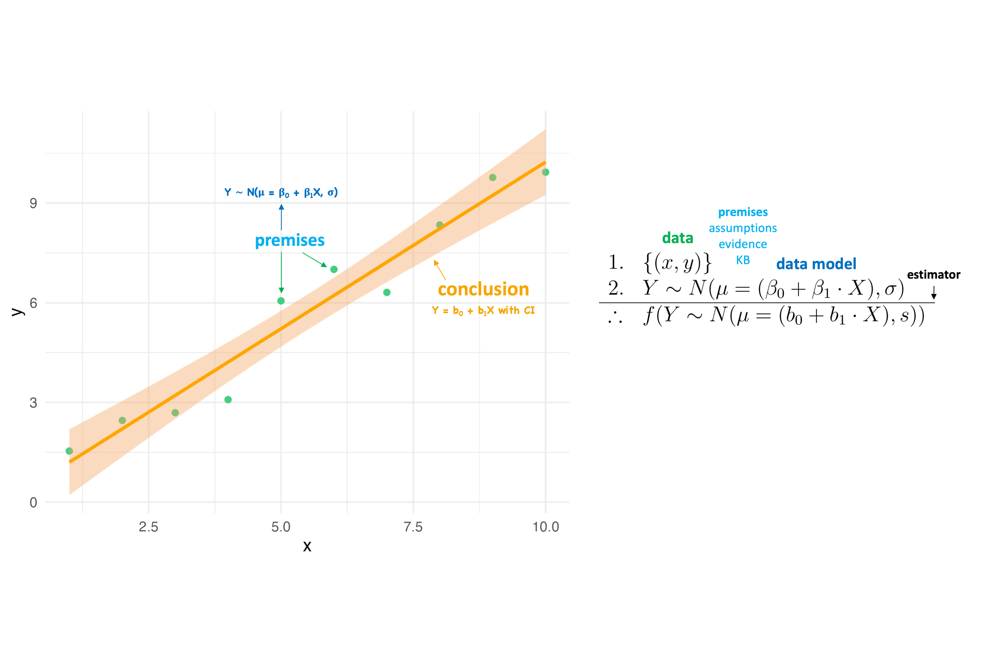

## Statistical inference is inductive reasoning

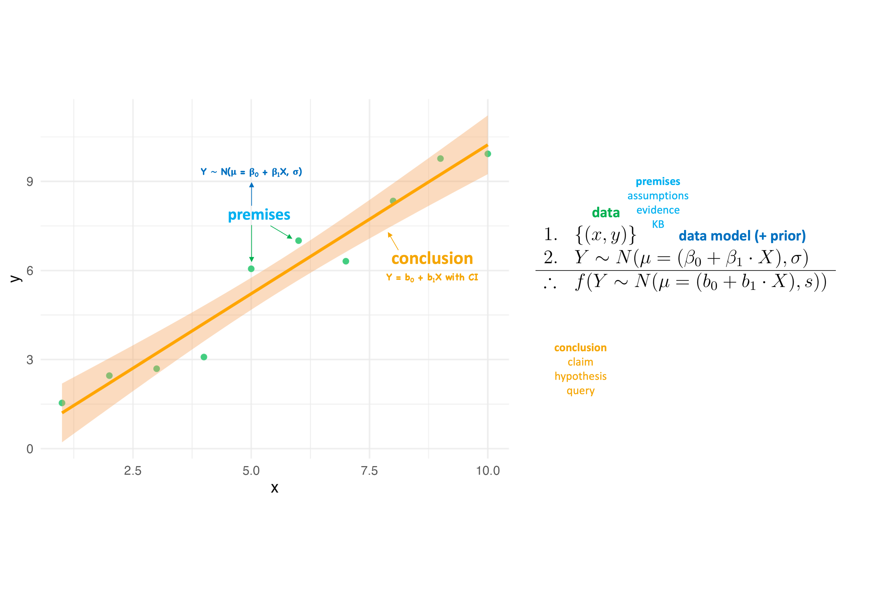

## Statistical inference is inductive reasoning

```{r}
#| fig-height: 6
#| echo: false
#| warning: false
beta0 <- -70
beta1 <- 0.7
sigma <- 5

set.seed(666)

H <- seq(137, 179)
n <- length(H)
mu <- beta0 + beta1 * H
W <- replicate(m, rnorm(n, mu, sigma))

df <- bind_cols(tibble(H), as.data.frame(W)) %>%
  pivot_longer(-H, names_to = "replicate", values_to = "W") %>%
  mutate(H = factor(H))

df %>%
  gf_density_ridges(H ~ W, linetype = 0, fill = "orange", alpha = 0.5) %>%
  # gf_point(H ~ W, data = df %>% group_by(H) %>% sample_n(5), color = "skyblue4", size = 1) %>%
  gf_model(W ~ H, color = "darkorange") %>%
  gf_labs(title = TeX(r'(Model 1 $\; y_i = \beta_0 + \beta_1 x_i + \epsilon_i\; \beta_0 = -70, \beta_1 = 0.7, \sigma = 5$)'), y = "Height (cm)", x = "Weight (Kg)") %>%
  gf_theme(axis.text.x = element_text(angle = 45, hjust = 1)) +
  coord_flip() +
  expand_limits(x = c(0, 80))
```

## Statistical inference is inductive reasoning

```{r}
#| fig-height: 6
#| echo: false
#| warning: false
beta0 <- 230
beta1 <- -1.2
sigma <- 2

set.seed(666)

H <- seq(137, 179)
n <- length(H)
mu <- beta0 + beta1 * H
W <- replicate(m, rnorm(n, mu, sigma))

df <- bind_cols(tibble(H), as.data.frame(W)) %>%
  pivot_longer(-H, names_to = "replicate", values_to = "W") %>%
  mutate(H = factor(H))

df %>%
  gf_density_ridges(H ~ W, linetype = 0, fill = "orange", alpha = 0.5) %>%
  # gf_point(H ~ W, data = df %>% group_by(H) %>% sample_n(5), color = "skyblue4", size = 1) %>%
  gf_model(W ~ H, color = "darkorange") %>%
  gf_labs(title = TeX(r'(Model 2 $\; y_i = \beta_0 + \beta_1 x_i + \epsilon_i\; \beta_0 = 230, \beta_1 = -1.2, \sigma = 2$)'), y = "Height (cm)", x = "Weight (Kg)") %>%
  gf_theme(axis.text.x = element_text(angle = 45, hjust = 1)) +
  coord_flip() +
  expand_limits(x = c(0, 80))
```

## Statistical inference is inductive reasoning


## Statistical inference is inductive reasoning

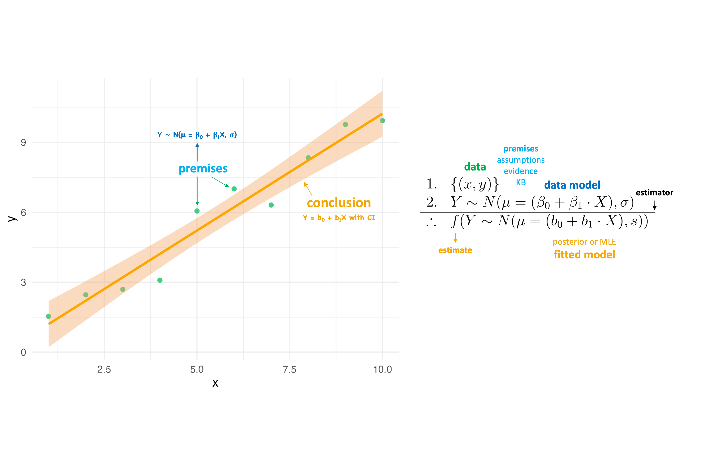

## Statistical inference is inductive reasoning

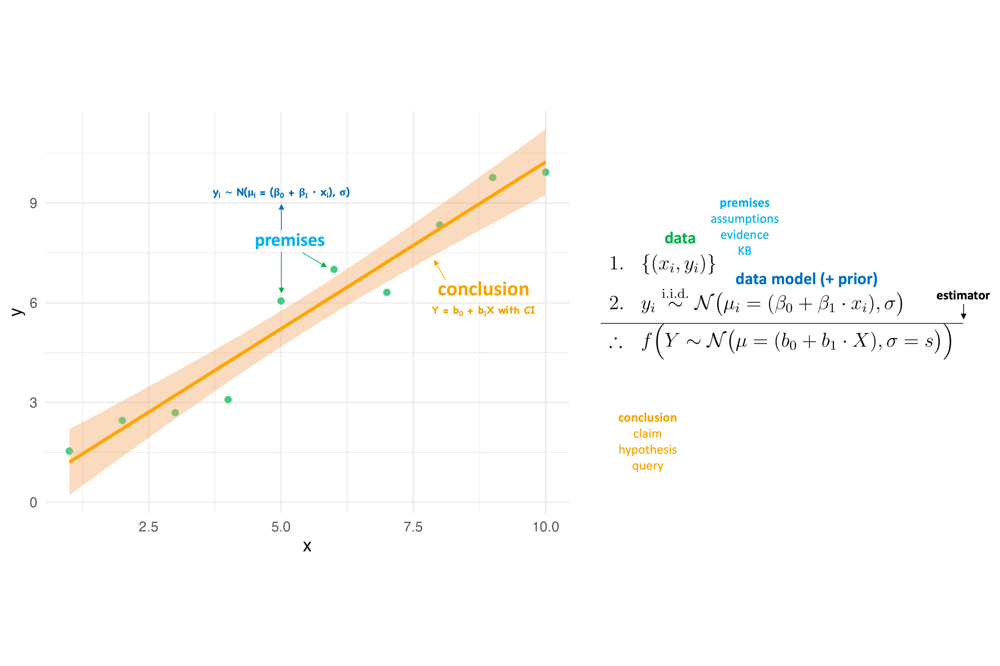

## Statistical inference is inductive reasoning

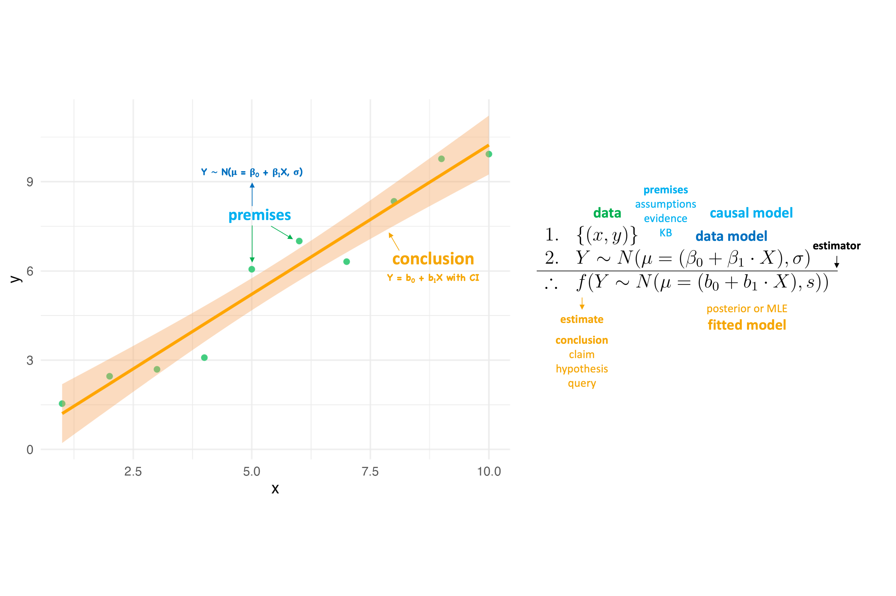

## Statistical inference is inductive reasoning

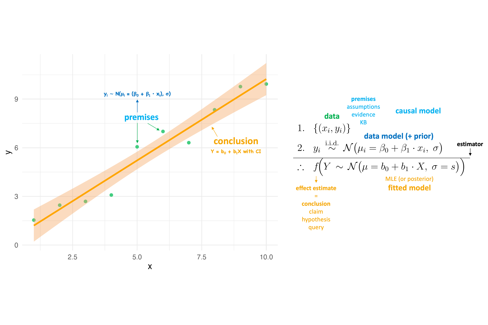

## Modern science: statistical (+ causal) inference

{fig-align="center" width="979"}

See also: [Shmueli (2010)](https://doi.org/10.1214/10-STS330) To explain or to predict?


## Modern science: statistical (+ causal) inference


## Modern science: statistical (+ causal) inference

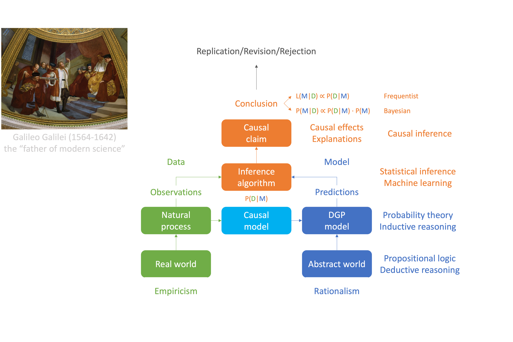

## Modern science: statistical (+ causal) inference

{fig-align="center" width="979"}

See also: [Shmueli (2010)](https://doi.org/10.1214/10-STS330) To explain or to predict?

## Modern science: statistical (+ causal) inference

{height="400"}


## Modern science: statistical (+ causal) inference


## Modern science: statistical (+ causal) inference

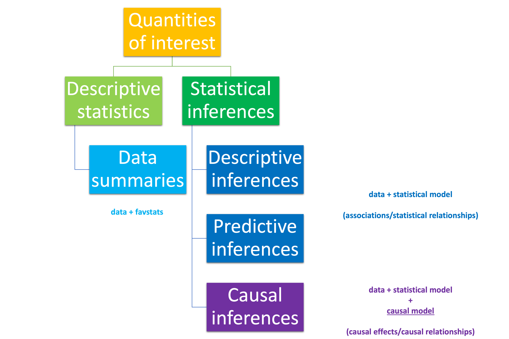

## Modern science: statistical (+ causal) inference


## Modern science: statistical (+ causal) inference

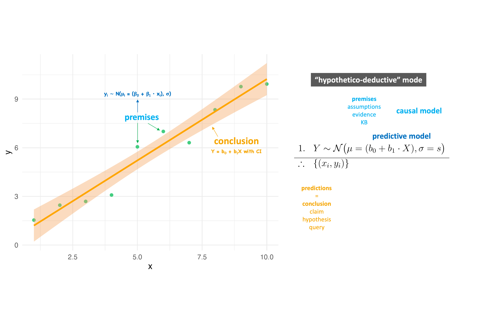

## Modern science: statistical (+ causal) inference

```{r}
#| fig-height: 6
#| echo: false
#| warning: false
beta0 <- -53
beta1 <- 0.634
sigma <- 4

set.seed(666)

H <- seq(137, 179)
n <- length(H)
mu <- beta0 + beta1 * H
W <- replicate(m, rnorm(n, mu, sigma))

df <- bind_cols(tibble(H), as.data.frame(W)) %>%
  pivot_longer(-H, names_to = "replicate", values_to = "W") %>%
  mutate(H = factor(H))

df %>%
  gf_density_ridges(H ~ W, linetype = 0, fill = "orange", alpha = 0.5) %>%
  gf_model(W ~ H, color = "darkorange") %>%
  gf_labs(title = TeX(r'(Best fit model (MLE) $\; y_i = \beta_0 + \beta_1 x_i + \epsilon_i\; \beta_0 = -53, \beta_1 = 0.634, \sigma = 4$)'), y = "Height (cm)", x = "Weight (Kg)") %>%
  gf_theme(axis.text.x = element_text(angle = 45, hjust = 1)) +
  coord_flip() +
  expand_limits(x = c(0, 80))
```

## Modern science: statistical (+ causal) inference

```{r}
#| fig-height: 6
#| echo: false
#| warning: false
beta0 <- -53
beta1 <- 0.634
sigma <- 4

set.seed(666)

H <- seq(137, 179)
n <- length(H)
mu <- beta0 + beta1 * H
W <- replicate(m, rnorm(n, mu, sigma))

df <- bind_cols(tibble(H), as.data.frame(W)) %>%
  pivot_longer(-H, names_to = "replicate", values_to = "W") %>%
  mutate(H = factor(H))

df %>%
  gf_density_ridges(H ~ W, linetype = 0, fill = "orange", alpha = 0.5) %>%
  gf_point(H ~ W, data = df %>% group_by(H) %>% sample_n(5), color = "orange4", size = 1) %>%
  gf_model(W ~ H, color = "darkorange") %>%
  gf_labs(title = TeX(r'(Best fit model (MLE) $\; y_i = \beta_0 + \beta_1 x_i + \epsilon_i\; \beta_0 = -53, \beta_1 = 0.634, \sigma = 4 \;$ and its predictions)'), y = "Height (cm)", x = "Weight (Kg)") %>%
  gf_theme(axis.text.x = element_text(angle = 45, hjust = 1)) +
  coord_flip() +
  expand_limits(x = c(0, 80))
```

## Modern science: statistical (+ causal) inference


## Modern science: statistical (+ causal) inference

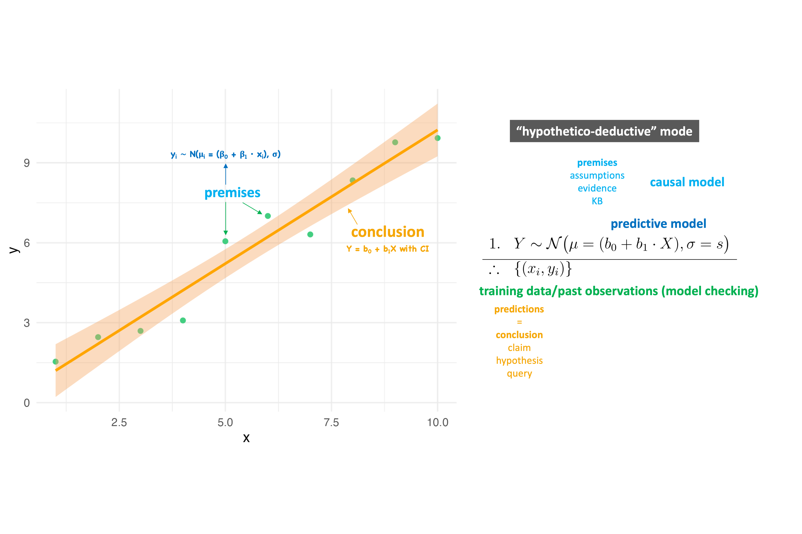

## Modern science: statistical (+ causal) inference

```{r}
#| fig-height: 6
#| echo: false
#| warning: false
beta0 <- -53
beta1 <- 0.634
sigma <- 4

set.seed(666)

H <- seq(137, 179)
n <- length(H)
mu <- beta0 + beta1 * H
W <- replicate(m, rnorm(n, mu, sigma))

df <- bind_cols(tibble(H), as.data.frame(W)) %>%
  pivot_longer(-H, names_to = "replicate", values_to = "W") %>%
  mutate(H = factor(H))

df %>%
  gf_density_ridges(H ~ W, linetype = 0, fill = "orange", alpha = 0.5) %>%
  gf_point(H ~ W, data = df %>% group_by(H) %>% sample_n(5), color = "orange4", size = 1) %>%
  gf_model(W ~ H, color = "darkorange") %>%
  gf_labs(title = TeX(r'(Best fit model (MLE) $\; y_i = \beta_0 + \beta_1 x_i + \epsilon_i\; \beta_0 = -53, \beta_1 = 0.634, \sigma = 4 \;$ and its predictions)'), y = "Height (cm)", x = "Weight (Kg)") %>%
  gf_theme(axis.text.x = element_text(angle = 45, hjust = 1)) +
  coord_flip() +
  expand_limits(x = c(0, 80))
```

## Modern science: statistical (+ causal) inference

```{r}
#| fig-height: 6
#| echo: false
#| warning: false
beta0 <- -53
beta1 <- 0.634
sigma <- 4

set.seed(666)

H <- seq(137, 179)
n <- length(H)
mu <- beta0 + beta1 * H
W <- replicate(m, rnorm(n, mu, sigma))

df <- bind_cols(tibble(H), as.data.frame(W)) %>%
  pivot_longer(-H, names_to = "replicate", values_to = "W") %>%
  mutate(H = factor(H))

df.obs <- df.obs %>%
  mutate(H = factor(H, levels = levels(df$H)))

df %>%
  gf_density_ridges(H ~ W, linetype = 0, fill = "orange", alpha = 0.5) %>%
  #gf_point(H ~ W, data = df %>% group_by(H) %>% sample_n(5), color = "orange4", size = 1) %>%
  gf_point(H ~ W, data = df.obs, color = "green4", size = 1) %>%
  gf_model(W ~ H, color = "darkorange") %>%
  gf_labs(title = TeX(r'(Best fit model (MLE) $\; y_i = \beta_0 + \beta_1 x_i + \epsilon_i\; \beta_0 = -53, \beta_1 = 0.634, \sigma = 4 \;$ and observed data used for training)'), y = "Height (cm)", x = "Weight (Kg)") %>%
  gf_theme(axis.text.x = element_text(angle = 45, hjust = 1)) +
  coord_flip() +
  expand_limits(x = c(0, 80))
```

## Modern science: statistical (+ causal) inference

```{r}
#| fig-height: 6
#| echo: false
#| output-location: default
performance::check_predictions(mle.lm.fit) %>%
  plot() +
  labs(x = "Weight (Kg)") +
  scale_color_manual(values = c("Observed data" = "green4", "Model-predicted data" = "darkorange"))
```

## Modern science: statistical (+ causal) inference


## Modern science: statistical (+ causal) inference

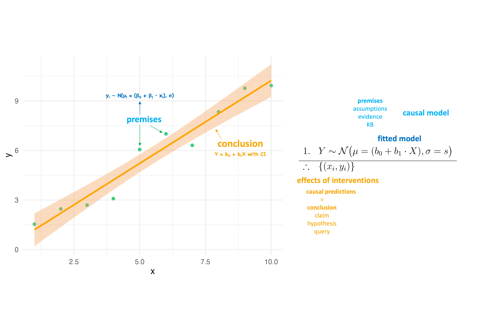

## Modern science: statistical (+ causal) inference

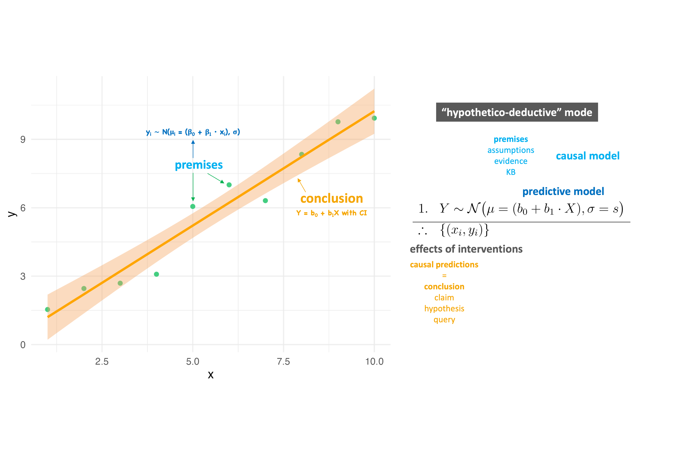

## Severe testing textbooks

::::::: columns
:::: {.column width="56%"}
::: text-align-center
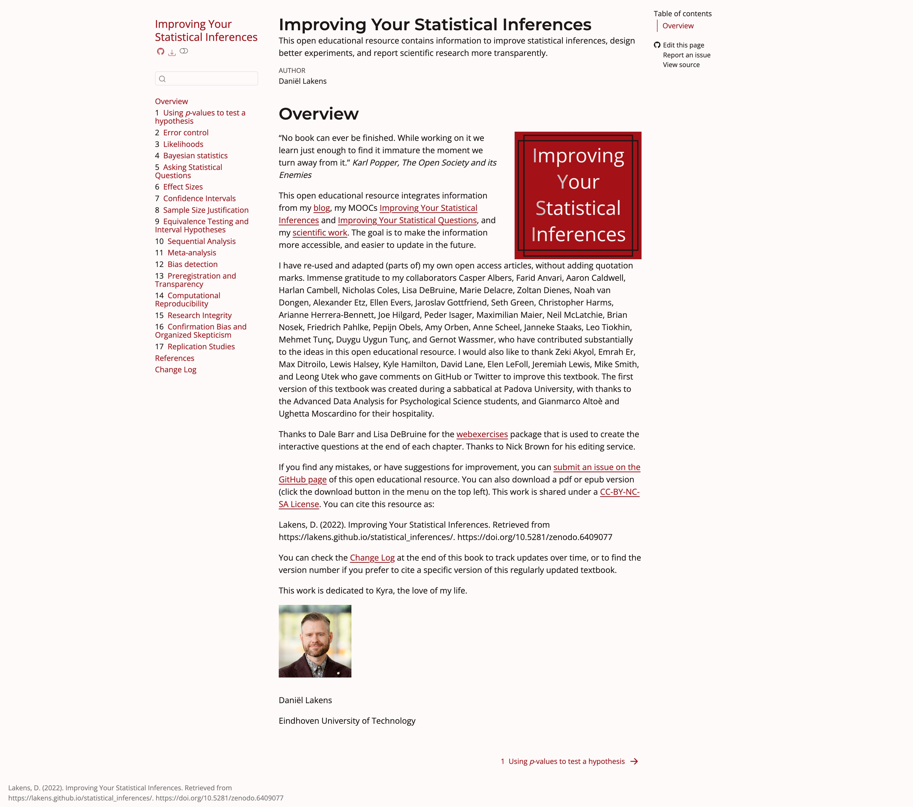{height="440"}

<https://lakens.github.io/statistical_inferences>
:::
::::

:::: {.column width="44%"}
::: text-align-center
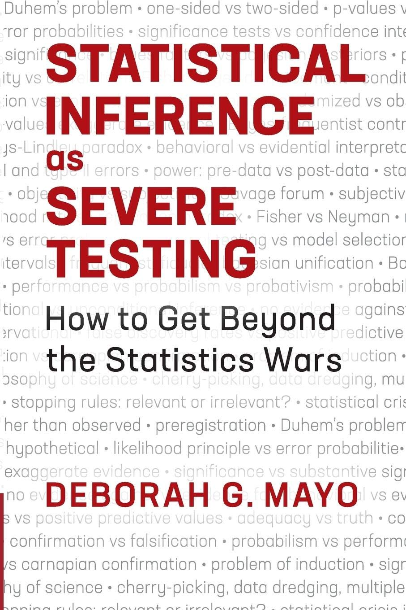{height="440"}

<https://doi.org/10.1017/9781107286184>
:::
::::
:::::::

 

See also: [Gelman and Shalizi (2012)](https://doi.org/10.1111/j.2044-8317.2011.02037.x) Philosophy and the practice of Bayesian statistics

##  {background-image="images/thats_all_folks.jpg" background-size="contain"}

## Key take home messages

-   Be thoughtful, skeptical, humble, open, and honest!

-   If you can't simulate it, don't analyze it!

-   All models say only what they are told to say!

-   Test before you est(imate)!


## The taxonomy of estimands

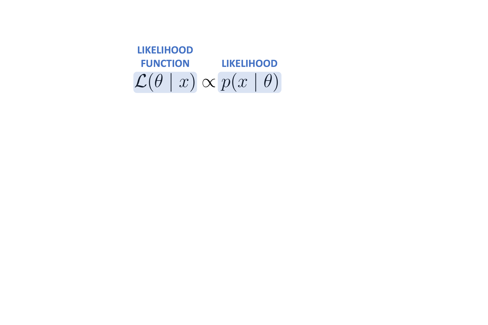{fig-align="center"}

## Causal inference textbooks

::::::: columns
:::: {.column width="50%"}
::: text-align-center
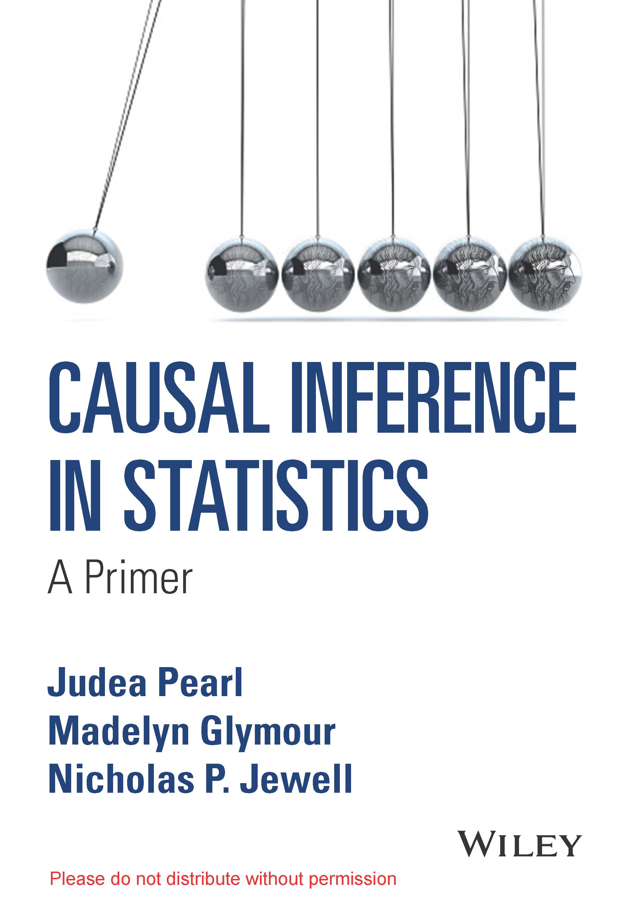{height="440"}

<http://bayes.cs.ucla.edu/PRIMER>
:::
::::

:::: {.column width="50%"}
::: text-align-center
{height="440"}

<http://bayes.cs.ucla.edu/WHY>
:::
::::
:::::::

 

See also: [How to learn causal inference on your own for free](https://towardsdatascience.com/how-to-learn-causal-inference-on-your-own-for-free-98503abc0a06)

## What is a model? What is a good model?

-   All models only say what they are told to say (and nothing more)!

-   This is not a limitation or a flaw; it's just the way things are

-   All models are lists of "*If this, then that*" statements

-   A simple model:

    -   "*If this die has six sides, then the probability any side is up in a throw is one in six*"

    -   It is a very accurate model, too: it matches reality well; indeed, it makes beautiful predictions

    -   It is a very useful model, too, for casino owners, because it makes them a lot of money!

    -   But it is not a causal model, none of the "*if-then*" statements are causal

-   All models are wrong, but some are useful!

-   The final lesson is simple: put all models to the test!

https://www.wmbriggs.com/post/43375/

## What makes a good model?

::: nonincremental
-   Any data set can be perfectly fit by an infinite number of models!
:::

$$
y_i \sim \text{Norm}\bigl(\sin(\alpha \cdot x_i), 1/\tau\bigr)
$$

[Boué (2019)](https://arxiv.org/abs/1904.12320) "*Real numbers, data science and chaos: how to fit any dataset with a single parameter*"


## Causal inference workflow

-   At the heart of causal inference is the causal question

## Description, prediction, and explanation

-   Questions about description, prediction, and explanation are fundamentally different

-   Causal questions cannot be answered with predictive models

-   Causal questions require causal models

-   Causal models are generative models

-   Predictive modeling generally uses a different workflow than the workflow for causal modeling

-   Predictive modeling goal is to maximize predictive accuracy while retaining generalization to new data

-   The key measure of validity in prediction modeling is predictive accuracy. A convenient detail about predictive modeling is that we can often assess if we're right, which is not true of descriptive statistics for which we only have a subset of data, or causal inference for which we don’t know the true causal structure.

-   Often, people mistakenly use methods for selecting features (variables) for prediction models to select confounders in causal models

-   Prediction metrics cannot determine the causal structure of your question, and predictive value for the outcome does not make a variable a confounder

-   In general, background knowledge (not prediction or associational statistics) should help you select variables for causal models

-   Prediction is nevertheless crucial to causal inference. From a philosophical perspective, we’re comparing predictions from different what if scenarios: What would the outcome had one thing happened vs. if another thing happened?

## Causal inference

-   The goal of causal inference is to understand the impact that a variable, sometimes called an exposure, has on another variable, sometimes called an outcome. “Exposure” and “outcome” are the terms we’ll use in this book to describe the causal relationship we’re interested in. Importantly, our goal is to answer this question clearly and precisely. In practice, this means using techniques like study design (e.g., a randomized trial) or statistical methods (like propensity scores) to calculate an unbiased effect of the exposure on the outcome.

-   As with prediction and description, it’s better to start with a clear, precise question to get a clear, precise answer

-   Making valid causal inferences requires several assumptions that we’ll discuss in Section 3.2. Unlike prediction, we generally cannot confirm that our causal models are correct. In other words, most assumptions we need to make are unverifiable. We’ll come back to this topic time and time again in the book—from the basics of these assumptions to practical decision-making to probing our models for problems.

## Why isn’t the right causal model just the best prediction model?

At this point, you may wonder why the right causal model isn’t just the best prediction model. It makes sense that the two would be related: naturally, things that cause other things would be predictors. It’s causality all the way down, so any predictive information is related, in some capacity, to the causal structure of the thing we’re predicting. Doesn’t it stand to reason that a model that predicts well is causal, too? It’s true that some predictive models can be great causal models and vice versa. Unfortunately, this is not always the case; causal effects needn’t predict particularly well, and good predictors needn’t be causally unbiased (Shmueli 2010).

Descriptive, predictive, and causal analyses will always contain some aspect of each other. A predictive model gains some of its predictive power from the causal structure of the outcome, and a causal model has some predictive power because it contains information about the outcome. However, the same model in the same data with different goals will have different usefulness depending on those goals.

## Table 2 fallacy

A closely related idea is the Table Two Fallacy, so-called because, in health research papers, descriptive analyses are often presented in Table 1, and regression models are often presented in Table 2 (Westreich and Greenland 2013). The Table Two Fallacy is when a researcher presents confounders and other non-exposure variables, particularly when they interpret those coefficients as if they, too, were causal. The problem is that in some situations, the model to estimate an unbiased effect of one variable may not be the same model to estimate an unbiased effect of another variable. In other words, we can’t interpret the effects of confounders as causal because they might themselves be confounded by another variable unrelated to the original exposure.

## Causal inference workflow

We’ll play the whole game of causal analysis using a few key steps:

-   Specify a causal question

-   Draw our assumptions using a causal diagram

-   Model our assumptions

-   Diagnose our models

-   Estimate the causal effect

-   Conduct sensitivity analysis on the effect estimate

## Potential outcomes

Factual outcomes and counterfactual outcomes are two realizations of potential outcomes


---


---

## Scientists’ attitudes toward bias, replicability and scientific practice

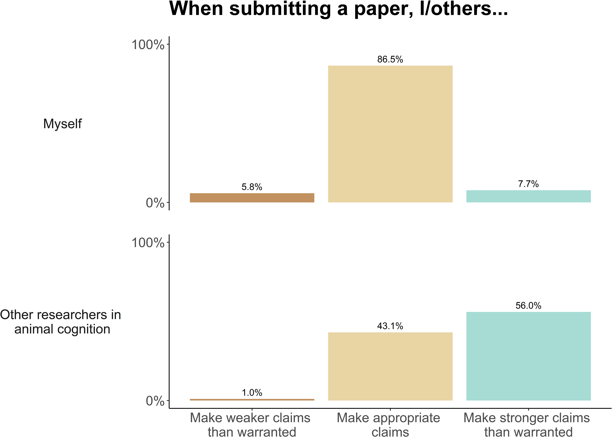

[Farrar et al. (2021)](https://doi.org/10.1371/journal.pone.0256607)

## Scientists’ attitudes toward bias, replicability and scientific practice

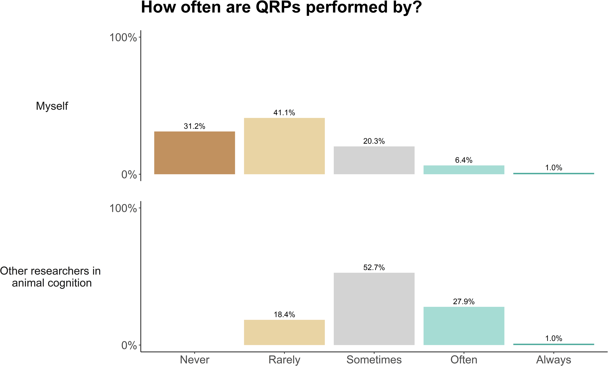

[Farrar et al. (2021)](https://doi.org/10.1371/journal.pone.0256607)


# Causal inference in Python: Theory to practice

[https://youtu.be/XwYHUv2nH34](https://youtu.be/XwYHUv2nH34?si=nQ6J5zModeUS9oV1)


## Causal inference workflow

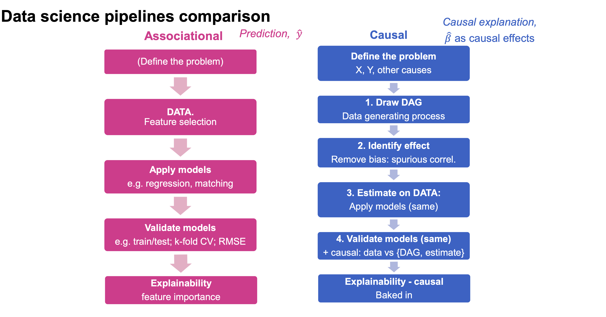


## DAGs represent joint probability distributions

-   A DAG is a mathematical object, i.e., a joint probability distribution:

$$
P(X, Y, Z) = P(X)\,P(Y \mid X)\,P(Z \mid X, Y)
$$

-   Causal assumptions: Endogeneous variables only depend on their parents (can check vs. data)

-   The fork: $Z$ **is a common cause of** $X$ **and** $Y$**, with** $X$ **also causing** $Y$

    -   DAG: $Z \to X$, $Z \to Y$, and $X \to Y$

$$
P(X, Y, Z) = P(X \mid Z) \cdot P(Y \mid X, Z) \cdot P(Z)
$$

-   The collider: $Z$ **is a common effect of** $X$ **and** $Y$**, with** $X$ **also causing** $Y$
    -   DAG: $X \to Z$, $Y \to Z$, and $X \to Y$

$$
P(X, Y, Z) = P(X) \cdot P(Y \mid X) \cdot P(Z \mid X, Y)
$$

-   The pipe (or chain): $X$ **causes** $Y$ **via** $Z$
    -   DAG: $X \to Z \to Y$

$$
P(X, Y, Z) = P(X) \cdot P(Y \mid Z) \cdot P(Z \mid X)
$$

## Identify effect

-   Identification: Isolating the causal effect of $X$ on $Y$

-   From the causal structure represented by the DAG, identify which variables to adjust for to estimate the pure causal effect of $X$ (the treatment) on $Y$ (the outcome), free from spurious associations (bias)

-   Adjusting/controlling for $Z$ = grouping by/segregating by/stratifying on $Z$, e.g., using regression or matching

-   Adjusting/controlling for ALL variables can introduce bias (Berkson's paradox). Rather, use *just the right* variables

## Interventions

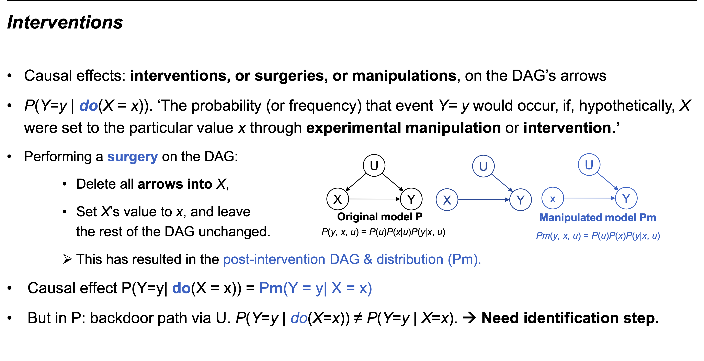

## Identify effect: Blocking or d-separation

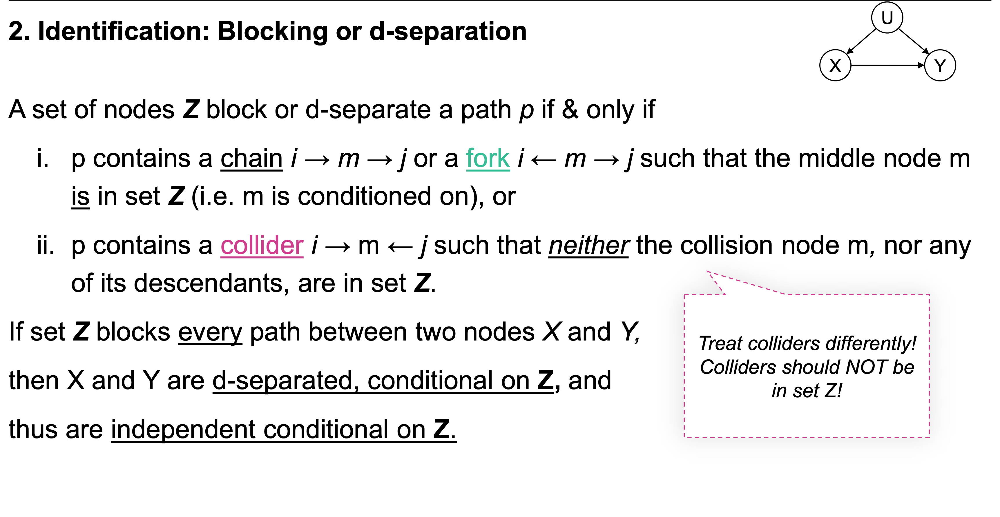

## Identify effect: Backdoor criterion

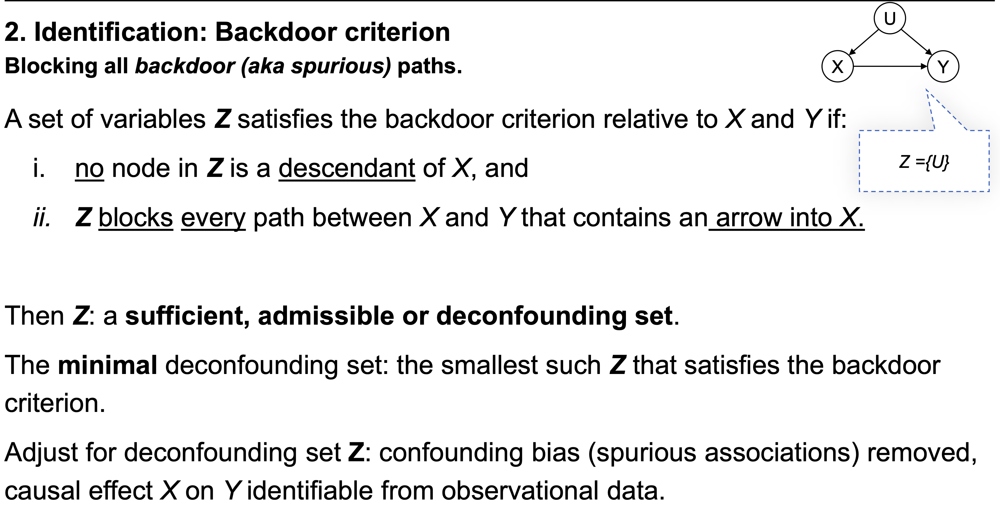

## Simpson's paradox


## Simpson's paradox


## Berkson's paradox


## Berkson's paradox


## Estimate using data

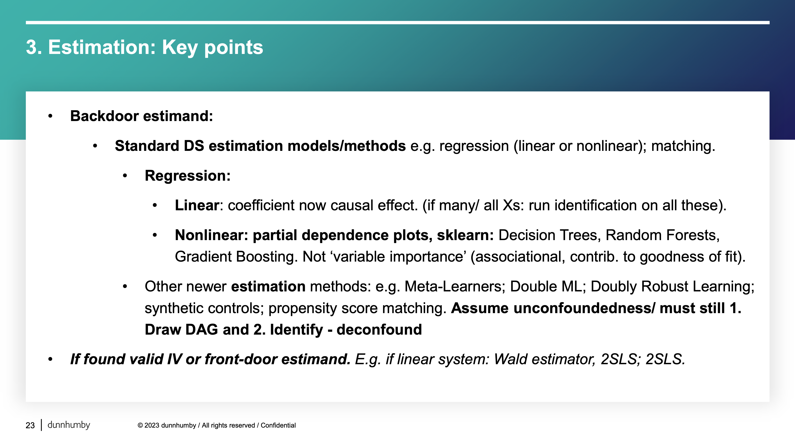

## Validate model

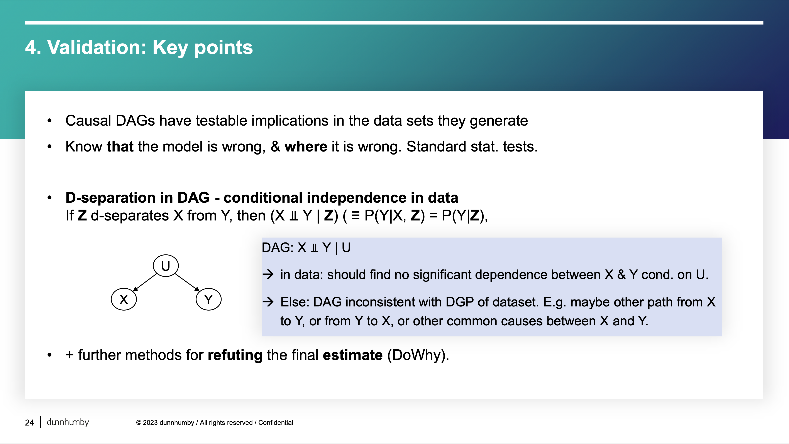

## Explain

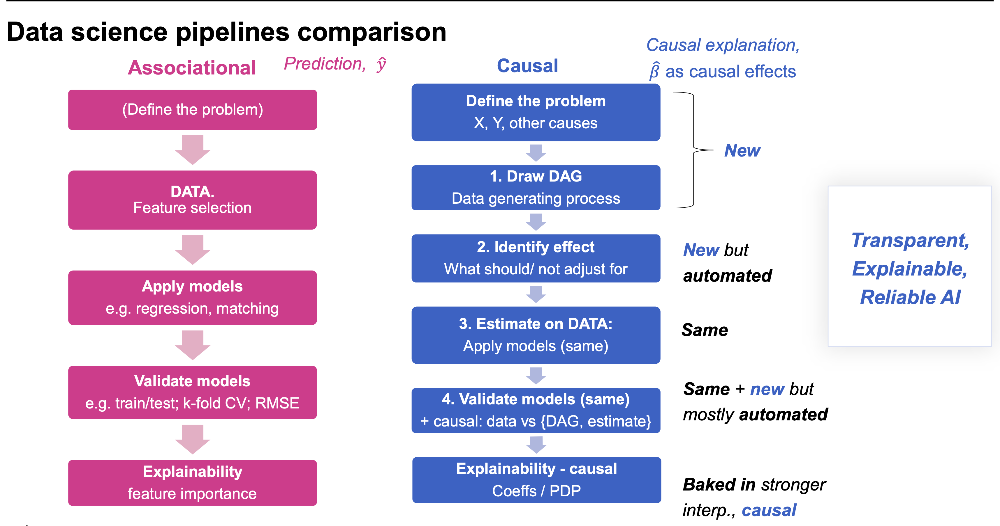

## Resources


## Practice


