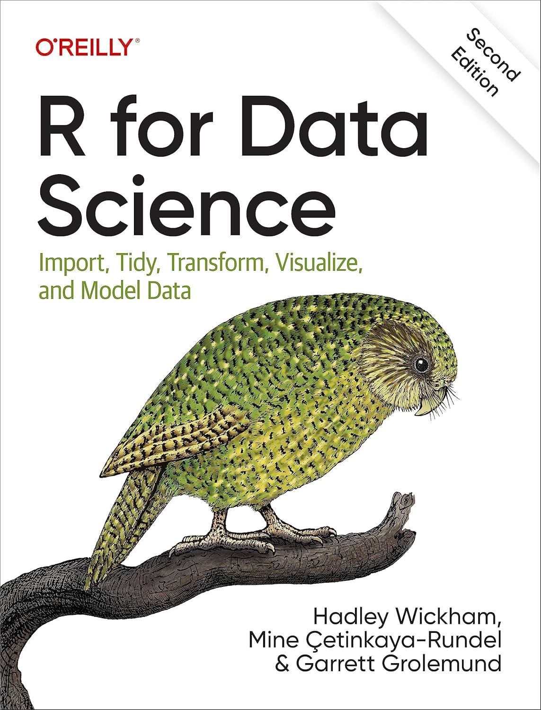
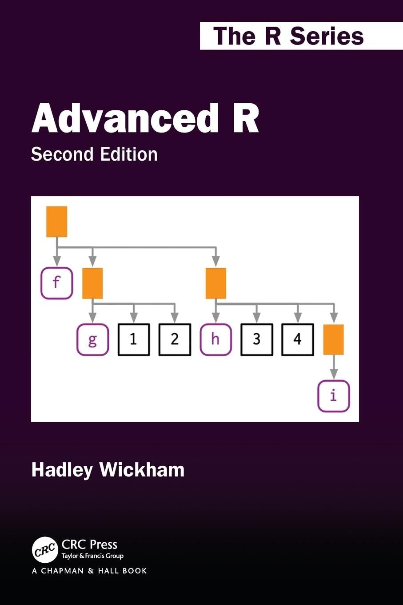
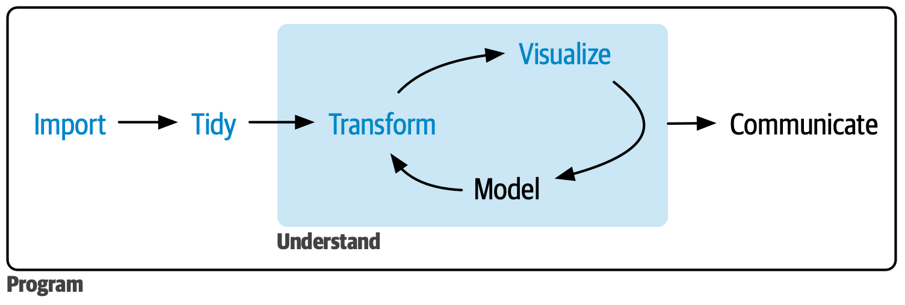
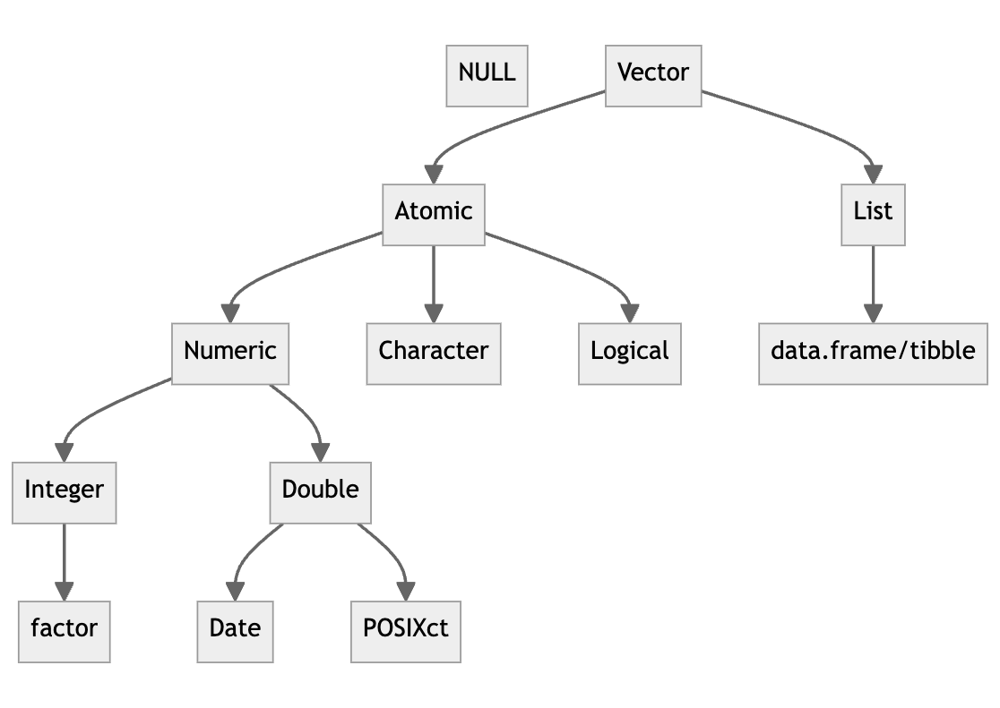
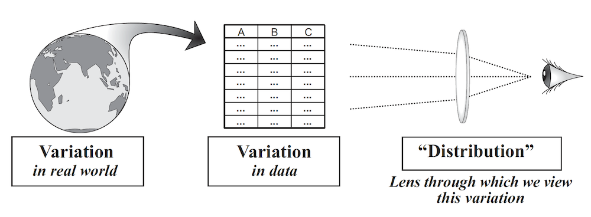
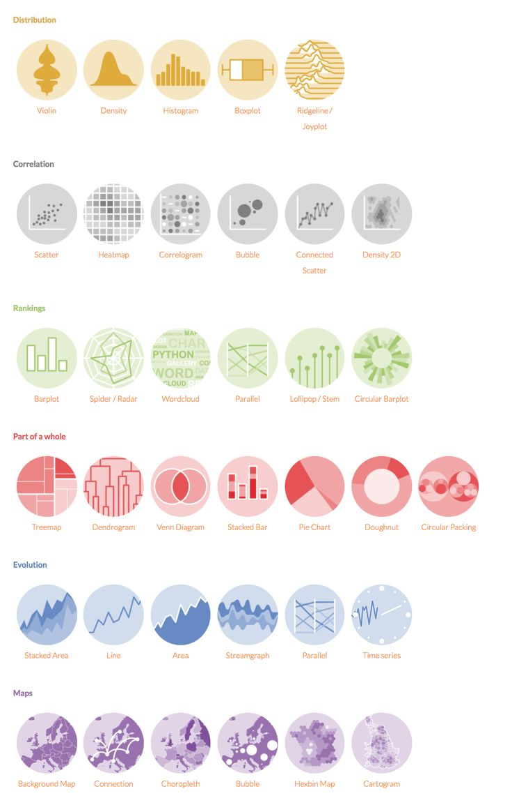

```{r}
#| include: false
library(coursekata)
```

## R: Books

::::: columns
::: column
[{height="550"}](https://r4ds.hadley.nz/)
:::

::: column
[{height="550"}](https://adv-r.hadley.nz/)
:::
:::::

## R: Cheatsheets

### Tidyverse

:::::: columns
:::: column
::: nonincremental
-   [Data import with `readr`](https://rstudio.github.io/cheatsheets/html/data-import.html)
-   [Data tidying with `tidyr`](https://rstudio.github.io/cheatsheets/html/tidyr.html)
-   [Data transformation with `dplyr`](https://rstudio.github.io/cheatsheets/html/data-transformation.html)
-   [Data visualization with `ggplot2`](https://rstudio.github.io/cheatsheets/html/data-visualization.html)
:::
::::

::: column
{height="150"}
:::
::::::

### CourseKata

::: nonincremental
-   [R cheatsheet (XCD)](r-cheatsheet-XCD.pdf)
:::

### R syntax comparison

::: nonincremental
-   [Dollar sign vs Formula vs Tidyverse syntax](syntax.pdf)
:::

## R: Objects and function calls

-   In R, **everything that exists is an object** and **everything that happens is a function call**

-   Some objects (e.g., *vectors*, *lists* and *data frames*) store **data** (a.k.a. values)

    -   **Numeric** (**Integer** and **Double**): `5` (5.0), `5L` (5), `17.2`, and `6.38E-4`

    -   **Character**: `"Hello world!"` or `'Hello world!'`

    -   **Logical**: `TRUE` or `FALSE` (can be abbreviated as `T` or `F`, respectively)

    -   `NULL` (the null value)

    -   `NA` (not available, missing/unknown value)

    -   `Inf`, `-Inf`, and `NaN`

-   Other objects (*functions*) store **code** (a.k.a. instructions)

-   An object is saved in the computer's memory (**environment**) only if given a name

::: fragment
```{r}
#| output-location: default
message <- "Hello world!"
```
:::

-   You can access the value or code stored in an object by using its name

::: fragment
```{r}
print(message)
```
:::

## R: Names

-   A valid name consists of letters, numbers, and the dot or underscore characters

-   Names are case-sensitive

-   A valid name must start with a letter (or a dot followed by a letter)

-   If a name is enclosed in back-ticks (\`), there are essentially no restrictions on the characters that can be used, including spaces and special characters

```{r}
#| echo: false
#| output-location: fragment
rm(list = ls())
```

::: fragment
```{r}
#| output-location: default
`Valid name with spaces and special character!` <- "Hello world!"

valid_name <- 5

VALID_NAME <- TRUE # all upper-case names are usually reserved for user-defined constants

valid.name <- NULL

.valid_name <- NA
```
:::

 

::: fragment
```{r}
#| echo: false
#| output-location: default
ls.str()
```
:::

## R: Functions

-   Calling a function instructs the computer to execute the code stored within that function

-   A function takes zero, one, or more input objects (**arguments**) and returns an output object

-   To call a function, place its arguments (separated by commas and wrapped in parentheses) after its name

::: fragment
```{r}
#| output-location: default
message <- "Hello world!"
```
:::

&nbsp;

::: fragment
```{r}
print(message)
```
:::

-   `print` is called by default in R and therefore it can be omitted; it prints its argument and returns it invisibly

::: fragment
```{r}
message
```
:::

## R: Calling a function

```{r}
#| eval: false
#| output-location: default
help(rnorm) # same as ?rnorm
```

## X

Exact matching on tags. For each named supplied argument the list of formal arguments is searched for an item whose name matches exactly. It is an error to have the same formal argument match several actuals or vice versa.
Partial matching on tags. Each remaining named supplied argument is compared to the remaining formal arguments using partial matching. If the name of the supplied argument matches exactly with the first part of a formal argument then the two arguments are considered to be matched. It is an error to have multiple partial matches. Notice that if f <- function(fumble, fooey) fbody, then f(f = 1, fo = 2) is illegal, even though the 2nd actual argument only matches fooey. f(f = 1, fooey = 2) is legal though since the second argument matches exactly and is removed from consideration for partial matching. If the formal arguments contain ... then partial matching is only applied to arguments that precede it.
Positional matching. Any unmatched formal arguments are bound to unnamed supplied arguments, in order. If there is a ... argument, it will take up the remaining arguments, tagged or not.
If any arguments remain unmatched an error is declared.


arguments, positional, keyword, default

show example of function help

## R: Function composition

-   The output of a function can be used as the input of another function; this is called **function composition**

-   Imagine you want to compute the population standard deviation using `sqrt()` and `mean()` as building blocks:

::: fragment
```{r}
#| output-location: default
square <- function(x) x^2
deviation <- function(x) x - mean(x)
```
:::

-   You either nest the function calls:

::: fragment
```{r}
x <- runif(100)

sqrt(mean(square(deviation(x))))
```
:::

-   Or you save the intermediate results as variables:

::: fragment
```{r}
out <- deviation(x)
out <- square(out)
out <- mean(out)
out <- sqrt(out)
out
```
:::

## R: Function composition

-   Or you use the pipe operator `%>%` (pronounced as “and then”) provided by the `magrittr` package and automatically loaded by tghe `dplyr` package:

::: fragment
```{r}
x %>%
  deviation() %>%
  square() %>%
  mean() %>%
  sqrt()
```
:::

-   `x %>% f` is equivalent to `x %>% f()` which is equivalent to `f(x)`

-   `x %>% f(y)` is equivalent to `f(x, y)`

-   `x %>% f(y, .)` is equivalent to `f(y, x)`

-   Since version 4.1.0, R has a native pipe operator `|>` whose behaviour is by and large the same as that of `%>%`, but with [some crucial differences](https://www.tidyverse.org/blog/2023/04/base-vs-magrittr-pipe)!

-   The pipe allows you to focus on the high-level composition of functions rather than the low-level flow of data

-   The focus is on what’s being done (the verbs), rather than on what’s being modified (the nouns)

## R: Operators

::::: columns
::: {.column width="40%"}
-   **Arithmetic operators**:

    ::: nonincremental
    -   `+` (addition)
    -   `-` (subtraction)
    -   `*` (multiplication)
    -   `/` (division)
    -   `^` (exponent)
    -   `%%` (modulus)
    -   `%/%` (integer division)
    :::

-   **Assignment operators**:

    ::: nonincremental
    -   `<-` (assign)
    -   `=` (assign)
    :::
:::

::: {.column width="60%"}
-   **Comparison operators**:

    ::: nonincremental
    -   `==` (equal)
    -   `!=` (not equal)
    -   `<` (less than) `<=` (less than or equal to)
    -   `>` (greater than) `>=` (greater than or equal to)
    :::

-   **Logical operators**:

    ::: nonincremental
    -   `&` or `&&` (logical AND)
    -   `|` or `||` (logical OR)
    -   `!` (logical NOT)
    :::

-   **Miscellaneous operators**:

    ::: nonincremental
    -   `%in%` (value matching)
    -   `%>%` or `|>` (pipe)
    -   `:` (range)
    -   `?` (help)
    :::
:::
:::::

## R: Operators

::: fragment
```{r}
1 + 9
```
:::

::: fragment
```{r}
sum(1, 9)
```
:::

::: fragment
```{r}
x <- 17.2

x
```
:::

::: fragment
```{r}
assign("x", 17.2) # assigns the value `17.2` to the variable `x` and invisibly returns `NULL`

x
```
:::

::: fragment
```{r}
round(x)
```
:::

::: fragment
```{r}
x
```
:::

::: fragment
```{r}
x <- round(x)

x
```
:::

## R: Environment

-   An environment can be thought of as a collection of objects (functions, variables etc.)

-   A new environment is created when we start a new R session

-   Only objects which are assigned a name are stored in the environment

::: fragment
```{r}
1969
```
:::

::: fragment
```{r}
y <- 1969

y
```
:::

::: fragment
```{r}
z <- y / 30

z
```
:::

## R: Environment

-   Use the `ls()` function to list the names of all objects in the environment:

::: fragment
```{r}
ls()
```
:::

-   Use the `ls.str()` function to list all objects in the default environment:

::: fragment
```{r}
ls.str()
```
:::

## R: Environment

::: fragment
```{r}
typeof(x)
```
:::

::: fragment
```{r}
is.numeric(x); is.double(x); is.integer(x); is.character(x); is.logical(x); is.null(x); is.na(x)
```
:::

::: notes
Generally, you can test if a vector is of a given type with an is.\*() function: is.logical(), is.integer(), is.double(), and is.character()

For atomic vectors, type is a property of the entire vector: all elements must be the same type. When you attempt to combine different types they will be coerced in a fixed order: character → double → integer → logical. The final type will be the type of the highest type element in the coercion hierarchy. For example, combining a character and a logical will result in two character vectors. Combining a character and a double will result in two double vectors.

Coercion often happens automatically. Most mathematical functions (+, log, abs, etc.) will coerce to numeric. This coercion is particularly useful for logical vectors because TRUE becomes 1 and FALSE becomes 0. This means that you can use a logical vector as an index to a vector. For example, x\[c(TRUE, FALSE, TRUE)\] will return the 1st and 3rd elements of x.

```{r}
x <- c(FALSE, FALSE, TRUE)
as.numeric(x)
#> [1] 0 0 1

# Total number of TRUEs
sum(x)
#> [1] 1

# Proportion that are TRUE
mean(x)
#> [1] 0.333
```

Generally, you can deliberately coerce by using an as.\*() function, like as.logical(), as.integer(), as.double(), or as.character(). Failed coercion of strings generates a warning and a missing value:

```{r}
as.integer(c("1", "1.5", "a"))
#> Warning: NAs introduced by coercion
#> [1]  1  1 NA
```
:::

::: fragment
```{r}
rm(x, y, z)

ls()
```
:::

::: fragment
```{r}
rm(list = ls())

ls()
```
:::


## R: Packages

XXX

## R: Scope

XXX

## R: Help

::: fragment
```{r}
#| eval: false
#| output-location: default
?mean # for help on the `mean` function, same as `help(mean)` or `help("mean")`
```
:::

 

::: fragment
```{r}
#| eval: false
#| output-location: default
??mean # to search help for the "mean" string, same as `help.search("mean")`
```
:::

 

::: fragment
```{r}
#| eval: false
#| output-location: default
help("mean", package = "mosaic")
```
:::

 

::: fragment
```{r}
#| eval: false
#| output-location: default
help(package = "mosaic")
```
:::

::: fragment
For more help on how to get help go to <https://www.r-project.org/help.html>
:::

-   [RDocumentation](https://www.rdocumentation.org)
-   [rdrr.io](https://rdrr.io/)
-   [Rseek](https://rseek.org/)
-   [Search R project](https://search.r-project.org/)

## R: Vectors

-   So far we have been working with objects containing a single value, but R can also work with collections of values

-   In fact, R is designed to make it easy to work with collections of values

-   **Vectors** are the most basic data objects in R; they store (ordered) collections of values

-   Vectors come in two flavors: **atomic vectors** and **lists**

-   **Atomic vectors** (often simply referred to as "vectors") are *homogeneous vectors*, i.e., all the values they contain (**elements**) must be of the same type

-   **Lists** are *heterogeneous vectors*, i.e., the elements they contain can be of different types

::: {.fragment style="text-align: center"}
{height="200"}
:::

## R: Vectors

-   Use `c()` (short for combine) to create a vector/longer vectors from shorter ones

::: fragment
```{r}
numeric_vector <- c(42, 18, 5, 5) # NOT the same as `c(18, 5, 42, 5)`

numeric_vector
```
:::

::: fragment
```{r}
typeof(numeric_vector); length(numeric_vector)
```
:::

::: fragment
```{r}
x <- 13

x
```
:::

::: fragment
```{r}
typeof(x); length(x)
```
:::

::: fragment
```{r}
identical(13, c(13))
```
:::

::: fragment
```{r}
character_vector <- c("apple", "banana", "orange")
logical_vector <- c(TRUE, FALSE, TRUE, FALSE)
empty_vector <- NULL
```
:::

## R: Vectorized operations

-   If you ask R to perform an operation on an atomic vector, it will perform it element-wise and return an atomic vector of the same length (but not necessarily the same type) with the output of that operation for each element, in the original order

::: fragment
```{r}
numeric_vector <- c(42, 18, 5, 5)

numeric_vector
```
:::

::: fragment
```{r}
numeric_vector + 10
```
:::

::: fragment
```{r}
numeric_vector > 5
```
:::

::: fragment
```{r}
(numeric_vector > 5) & (numeric_vector != 42)
```
:::

-   Learn more about element-wise operations on vectors in the `purr` cheatsheet at <https://rstudio.github.io/cheatsheets/html/purrr.html>

## R: Subset and pull operators

-   **Subset operator**: `[]` select any number of elements from an input vector and return an output vector of the same type containing those elements
-   **Pull operators**: `[[]]` and `$` select a single element from an input vector and return that element, possibly of a different type than the input vector
-   Subsetting and pull operators can be combined with assignment to modify selected elements of an input vector

::: notes
Subsetting can be combined with assignment to modify elements of a vector. For example, `x[1] <- 2` will replace the first element of `x` with `2`. You can also use subsetting to remove elements of a vector by assigning to `NULL`. For example, `x[1] <- NULL` will remove the first element of `x`.

All subsetting operators can be combined with assignment to modify selected values of an input vector: this is called subassignment. The basic form is `x[i] <- value`.

Subsetting is a natural complement to `str()`. While `str()` shows you all the pieces of any object (its structure), subsetting allows you to pull out the pieces that you’re interested in.

There are two additional subsetting operators, which are needed for S4 objects: `@` (equivalent to `$`), and `slot()` (equivalent to `[[`). `@` is more restrictive than `$` in that it will return an error if the slot does not exist.
:::

## R: Subset and pull operators

::::::::::::::::::::: columns
:::::::::::: {.column width="45%"}
::: fragment
```{r}
x <- c(2.1, 4.2, 3.3, 5.4)

x
```
:::

::: fragment
```{r}
x[1]
```
:::

::: fragment
```{r}
x[3]
```
:::

::: fragment
```{r}
x[0]
```
:::

::: fragment
```{r}
x[5]
```
:::

::: fragment
```{r}
x[]
```
:::

::: fragment
```{r}
x[c(3, 1)]
```
:::

::: fragment
```{r}
x[c(2, 2, 4)]
```
:::

::: fragment
```{r}
x[-c(3, 1)]
```
:::
::::::::::::

:::::::::: {.column width="55%"}
::: fragment
```{r}
x[c(TRUE, TRUE, FALSE, FALSE)]
```
:::

::: fragment
```{r}
x > 4
```
:::

::: fragment
```{r}
x[x > 4]
```
:::

::: fragment
```{r}
names(x) <- c("A", "B", "C", "D")

x
```
:::

::: fragment
```{r}
x <- c(A = 2.1, B = 4.2, C = 3.3, D = 5.4)

x
```
:::

::: fragment
```{r}
names(x)
```
:::

::: fragment
```{r}
x[c("C", "A", "A")]
```
:::
::::::::::
:::::::::::::::::::::

## R: Lists

-   Lists can contain values of different types, including atomic vectors and lists
-   Use `list()` to create a list

::: fragment
```{r}
l <- list(A = "Hello world!", B = 5L, C = c(TRUE, FALSE, TRUE), D = c(2.3, 5.9))
```
:::

-   Use `str()` (short for structure) to get a summary of the structure of an object

::: fragment
```{r}
str(l)
```
:::

::: fragment
```{r}
typeof(l)
```
:::

::: fragment
```{r}
length(l)
```
:::

::: fragment
```{r}
is.list(l)
```
:::

::: fragment
```{r}
names(l)
```
:::

## R: Lists

-   Subset and pull operators work with lists the same way they work with atomic vectors
-   `[` subset and return a list; `[[` and `$` pull and return an element from a list

::::::::::::: columns
:::::: {.column width="50%"}
::: fragment
```{r}
l
```
:::

::: fragment
```{r}
l[c(3, 1)]
```
:::

::: fragment
```{r}
l[c(FALSE, TRUE, FALSE, TRUE)]
```
:::
::::::

:::::::: {.column width="50%"}
::: fragment
```{r}
l[c("B", "D")]
```
:::

 

::: fragment
```{r}
l[[4]]
```
:::

::: fragment
```{r}
l[["D"]]
```
:::

::: fragment
```{r}
l$D # same as `l[["D"]]`
```
:::

::: fragment
```{r}
l$D[2]
```
:::
::::::::
:::::::::::::

## R: Data frames

-   Data frames are the most common way tabular data (row x column, like an Excel spreadsheet) are stored in R
-   Data frames are lists of atomic vectors of equal length
-   Each element of a data frame (an atomic vector) represents a **variable** (column)
-   Use `data.frame()` or `tibble()` (preferred in the `tidyverse`) to create a data frame or tibble, respectively

::: fragment
```{r}
df <- tibble(name = c("James", "John", "Robert"), height = c(180, 165, 195), weight = c(80, 90, 70))

df
```
:::

## R: Data frames

```{r}
#| echo: false
df
```

-   This data frame is organized in a "tidy" format:
    -   Each row represents a **observation** (person) [use one dataframe for each type/class of observation unit]
    -   Each column represents a **variable** (name, height, weight)
    -   Each value represents a **measurement** (James, 180, 80)
-   It's generally good practice to format data frames in a tidy way ("to keep things tidy")

-   Metadata/codebook/samplesheet (details re: unit of observation, description of columns, units of numerical variables, levels of categorical variables, data source, etc.) `?mtcars`

-   Sample vs census

-   The statistical thinker seeks to identify patterns in data, i.e., relationships between variables. But it is not easy to do this by direct examination of a data frame.

## R: Data frames

-   Use `head()` or `tail()` to look at the first or last six rows/observations of a data frame

::: fragment
```{r}
dim(penguins); nrow(penguins); ncol(penguins)
```
:::

::: fragment
```{r}
length(penguins)
```
:::

::: fragment
```{r}
head(penguins)
```
:::

## R: Data frames

```{r}
#| echo: false
df
```

-   Use `str()` or `glimpse()` to look at the structure of a data frame

::: fragment
```{r}
str(df)
```
:::

::: fragment
```{r}
glimpse(df)
```
:::

## R: Data frames

```{r}
#| echo: false
df
```

::: fragment
```{r}
df[1] # select column 1; same as `df["name"]`
```
:::

::: fragment
```{r}
df[c(3, 1)] # select columns 3 and 1; same as `df[c("weight", "name")]`
```
:::

## R: Data frames

```{r}
#| echo: false
df
```

::: fragment
```{r}
df[["height"]] # pull out the `height` column
```
:::

::: fragment
```{r}
df$height # pull out the `height` column
```
:::

::: fragment
```{r}
df$height[2] # pull out the second value of the `height` column
```
:::

## R: Data frames

```{r}
#| echo: false
df
```

::: fragment
```{r}
df[3, 1] # select row 3, column 1
```
:::

::: fragment
```{r}
df[c(3, 1), c(1, 2)] # select rows 3 and 1, columns 1 and 2
```
:::

## R: Data frames

```{r}
#| echo: false
df
```

::: fragment
```{r}
df[df$weight > 80, ] # select rows where `weight > 80`, keep all columns
```
:::

## R: Data frames

```{r}
#| echo: false
df
```

::: fragment
```{r}
df$nationality <- c("British", "American", "Australian") # add a new column

df
```
:::

::: fragment
```{r}
df$bmi <- df$weight / (df$height / 100)^2 # add a new column with values calculated from other columns

df
```
:::

## R: Data frames (the `dplyr` way)

-   `dplyr` is a package that provides a set of functions for data manipulation

-   `dplyr` is a grammar of data manipulation, providing a consistent set of verbs that help you solve the most common data manipulation challenges:

    -   `select()` select variables/columns based on their names
    -   `pull()` pull a variable/column based on its name
    -   `filter()` select observations/rows based on their values
    -   `mutate()` adds new variables/columns that are functions of existing variables/columns
    -   `arrange()` changes the ordering of the observations/rows
    -   `summarise()` (or `summarize()`) reduces multiple values down to a single value

-   These verbs combine naturally with `group_by()` which allows you to perform any operation "by group"

-   Learn more about these verbs in the `dplyr` cheatsheet at <https://rstudio.github.io/cheatsheets/html/data-transformation.html>

## R: Data frames (the `dplyr` way)

```{r}
#| echo: false
df <- df %>% select(name, height, weight)
df
```

::: fragment
```{r}
df %>% select(weight, name) # select columns by name, same as `select(df, weight, name)`
```
:::

::: fragment
```{r}
df %>% pull(height) # pull out the `height` column
```
:::

::: fragment
```{r}
df %>% filter(weight > 80) # select rows where `weight > 80`, keep all columns
```
:::

## R: Data frames (the `dplyr` way)

```{r}
#| echo: false
df
```

::: fragment
```{r}
df %>% mutate(
  nationality = c("British", "American", "Australian"),  # add a new column
  bmi = weight / (height / 100)^2 # add a new column with values calculated from other columns
)
```
:::

::: fragment
```{r}
df %>% arrange(weight) # sort by `bmi`; use `df %>% arrange(desc(weight))` to sort in descending order
```
:::

## R: Data frames (the `dplyr` way)

-   `dplyr` verbs can be combined using the pipe operator to perform to perform complex data manipulations

::: fragment
```{r}
#| echo: false
df
```
:::

::: fragment
```{r}
df %>%
  mutate(
    nationality = c("American", "British", "Australian"),
    bmi = weight / (height / 100)^2
  ) %>%
  filter(nationality != "British") %>%
  select(name, nationality, bmi) %>%
  arrange(desc(bmi))
```
:::

## Variables and functions in statistics {visibility="hidden"}

-   A function $f$ from a set $X$ to a set $Y$ is an assignment of an element of $Y$ to each element of $X$

::::: columns
::: {.column .fragment width="50%"}
{width="240"}
:::

::: {.column .fragment width="50%"}
{width="240"}
:::
:::::

-   A variable is a function from the sample space to the real numbers
    -   $f : \Omega \rightarrow \mathbb{R}$
    -   It represents a measurable property of each element of the sample space

## Data types/measurement levels

-   **Qualitative** vs **quantitative** (discrete and continuous)
-   **Categorical** (nominal and ordinal) vs **numeric** (interval and ratio)
    -   **Nominal**: the data can only be categorized
    -   **Ordinal**: the data can be categorized and ranked
    -   **Interval**: the data can be categorized and ranked, equal spacing
    -   **Ratio**: the data can be categorized and ranked, equal spacing, true zero
-   The CK book uses the terms **categorical** and **quantitative** variables
    -   Values assigned to categorical variables represent categories
    -   Values assigned to quantitative variables represent quantities

## Data types/measurement levels

|                     | Nominal | Ordinal | Interval | Ratio |
|---------------------|---------|---------|----------|-------|
| **Equality**        | X       | X       | X        | X     |
| **Order**           |         | X       | X        | X     |
| **Add/subtract**    |         |         | X        | X     |
| **Multiply/divide** |         |         |          | X     |
| Mode                | X       | X       | X        | X     |
| Median              |         | X       | X        | X     |
| Mean                |         |         | X        | X     |
| IQR                 |         | X       | X        | X     |
| Variance/SD         |         |         | X        | X     |

::: notes
<https://matthewrenze.com/articles/the-four-subtypes-of-data-in-data-science/>
:::

## Data types/measurement levels

-   Most quantitative variables in R contains `Numeric` (`Integer` or `Double`) values
-   Most categorical variables in R contains `Character` or `factor` values

::: fragment
```{r}
#| echo: false
df <- df %>% mutate(
  nationality = c("British", "American", "Australian"),  # add a new column
  bmi = weight / (height / 100)^2 # add a new column with values calculated from other columns
)

df
```
:::

::: fragment
```{r}
df$nationality <- factor(df$nationality)

# or

df <- df %>% mutate(nationality = factor(nationality))

df
```
:::

## R: Factors and levels

-   `factor` is a special data type for categorical variables
-   A `factor` variable is stored as a vector of `Integer` values
-   Each `Integer` value corresponds to a level, a `Character` value that represents a category and it is used when displaying a categorical variable
-   The levels are ordered alphabetically by default, but they can be ordered in any way

::: fragment
```{r}
treatment <- factor(c("placebo", "placebo", "drug1", "placebo", "drug1", "drug2"))

str(treatment)
```
:::

::: fragment
```{r}
levels(treatment)
```
:::

::: fragment
```{r}
as.integer(treatment)
```
:::

::: fragment
```{r}
treatment <- factor(c("placebo", "drug1"))

str(treatment)
```
:::

::: fragment
```{r}
treatment <- factor(c("placebo", "drug1"), levels = c("placebo", "drug1", "drug2"))

str(treatment)
```
:::

## R: Data structures

{style="text-align: center"}

## R: Missing values

-   Sometimes (in fact, usually) there are missing values in a dataset
-   R represents missing data with the value `NA` (not available or unknown)
-   If a dataset code missing values in some other way (e.g., -999), recode them as `NA`

::: fragment
```{r}
#| eval: false
# read dataset from a file
df <- read_csv("penguins.csv")

# and recode missing values, for example:

# replace -999 with `NA` in the `body_mass_kg` variable/column

df$body_mass_kg[df$body_mass_kg == -999] <- NA # old school

# or

df <- df %>% mutate(body_mass_kg = na_if(body_mass_kg, -999)) # tidyverse
```
:::

 

::: fragment
```{r}
#| eval: false
# read dataset from a file specifying the code for missing values; `na` argument defaults to `c("", "NA")`
df <- read_csv("penguins.csv", na = c(-999))
```
:::

-   Learn more about reading/writing datasets from/to files in the `readr` cheatsheet at <https://rstudio.github.io/cheatsheets/html/data-import.html>

## R: Missing values

-   You must be careful when removing observations with missing values

::: fragment
```{r}
#| eval: false
# remove observations/rows that have `NA` in any variable/column
df <- na.omit(df) # old school
df <- df %>% drop_na() # tidyverse

# remove observations/rows that have `NA` in the `sex` and `body_mass_kg` variable/column
df <- df %>% drop_na(sex, body_mass_kg) # tidyverse
```
:::

-   Sometimes removing observations with missing values introduces bias
-   In that case, you should use imputation methods to replace missing values with plausible values

::: fragment
```{r}
#| eval: false
# replace `NA` with `0` in the `body_mass_kg` variable/column
df <- df %>% mutate(body_mass_kg = replace_na(body_mass_kg, 0))
```
:::

## Data distributions

-   One of the most important concepts in statistics is the concept of **distribution**

-   A distribution is the pattern of variation in a variable (the "shape" of a variable)

::: {.fragment style="text-align: center"}
{width="400"}
:::

-   The pattern of variation in a variable made of many data points is often not obvious until you visualize or summarize all the data points together as a whole

::: {.fragment style="text-align: center"}
{width="300"}
:::

## Data distributions

-   Several tools can be used for exploring data distributions; many of these tools are visual, e.g., histograms, boxplots, scatterplots, bar graphs, etc.

-   Being skilled at using these tools to look at distributions is an important part of the statistician’s toolbox—and R can help you do it!

::: {.fragment style="text-align: center"}
{width="280"}
:::

## R: Visualizing and summarizing quantitative variables

-   The most common way to visualize a quantitative variable is with a histogram

::: fragment
```{r, fig.width=6, fig.height=4}
gf_histogram(~ body_mass_kg, data = penguins)
```
:::

## R: Visualizing and summarizing quantitative variables

-   In a histogram, the columns or bars represent the number of data values that fall within specified intervals of the variable of interest
-   These intervals are called `bins`, and the width of the intervals is called the `binwidth`

::: fragment
```{r, fig.width=6, fig.height=4}
gf_histogram(~ body_mass_kg, bins = 100, data = penguins)
```
:::

## R: Visualizing and summarizing quantitative variables

-   Use the `favstats()` function to calculate the "five-number summary" of a quantitative variable

::: fragment
```{r}
favstats(~ body_mass_kg, data = penguins)
```
:::

## R: Visualizing and summarizing quantitative variables

::: fragment
```{r, fig.width=6, fig.height=4}
gf_histogram(~ body_mass_kg, data = penguins) %>% gf_boxplot(width = 2)
```
:::

## R: Visualizing and summarizing categorical variables

-   The most common way to visualize the distribution of categorical variable is with a **bar graph** (or bar plot/chart)
-   A bar graph looks like a histogram, but it’s not; there is no such thing as bins in a bar graph
-   The number of bars in a bar graph is always equal the number of categories/levels in the categorical variable/factor

## R: Visualizing and summarizing categorical variables

::: fragment
```{r}
levels(penguins$species)
```
:::

::: fragment
```{r, fig.width=6, fig.height=4}
gf_bar(~ species, data = penguins)
```
:::

## R: Visualizing and summarizing categorical variables

::::: columns
::: {.column width="50%"}
```{r}
#| fragment: false
gf_bar(~ species, data = penguins)
```
:::

::: {.column width="50%"}
```{r, fig.eight=4}
#| fragment: false
gf_props(~ species, data = penguins)
```
:::
:::::

## R: Visualizing and summarizing categorical variables

::::: columns
::: {.column width="50%"}
```{r}
#| fragment: false
gf_bar(~ species, data = penguins)
```
:::

::: {.column width="50%"}
```{r, fig.eight=4}
#| fragment: false
gf_percents(~ species, data = penguins)
```
:::
:::::

## Quantities of interest (QOI) in empirical quantitative research {visibility="hidden"}

-   Data summaries
-   Inference
    -   Descriptive inference
    -   Counterfactual inference
        -   Prediction
        -   What-If
        -   Causal inference (two perspectives):
            -   Causal prediction: Prediction of intervention/knowing a cause means being able to predict the consequences of an intervention "What if I do this?"
            -   Causal imputation: Imputation of missing data/knowing a cause means being able to impute unobserved counterfactual outcomes "What if I had done something else?"

##  {background-image="images/thats_all_folks.jpg" background-size="50%"}

:::::::::::::::::::::::::::::::::::::::::::::::::::::::::::::::::::::::::::::::::::::::::::::::::::::::::::::::::::::::::::::::::::::::::
