```{r}
#| include: false
library(tidyverse)
theme_set(theme_minimal())

#| output-location: default
# def conditional operator
`%=>%` <- function(A, B) {
  !A | B
}

# def biconditional operator 
`%<=>%` <- function(A, B) {
  (A %=>% B) & (B %=>% A)
}
```

## Deductive and inductive reasoning

-   The goal of **deductive reasoning** is to determine whether an argument is valid, i.e., the **conclusion is guaranteed to be true**, assuming the premises are true

::: fragment
$$
\begin{array}{ll}
1. & \text{All men are mortal} \\
2. & \text{Socrates is a man} \\
\hline
\therefore & \text{Socrates is mortal} \\
\end{array}
$$
:::

-   The goal of **inductive reasoning** is to determine whether an argument is strong, i.e., the **conclusion is likely to be true**, assuming the premises are true

::: fragment
$$
\begin{array}{ll}
1. & \text{~90% of men are RH} \\
2. & \text{Socrates is a man} \\
\hline
\therefore & \text{Socrates is RH} \\
\end{array}
$$
:::

## Statistical inference is inductive reasoning

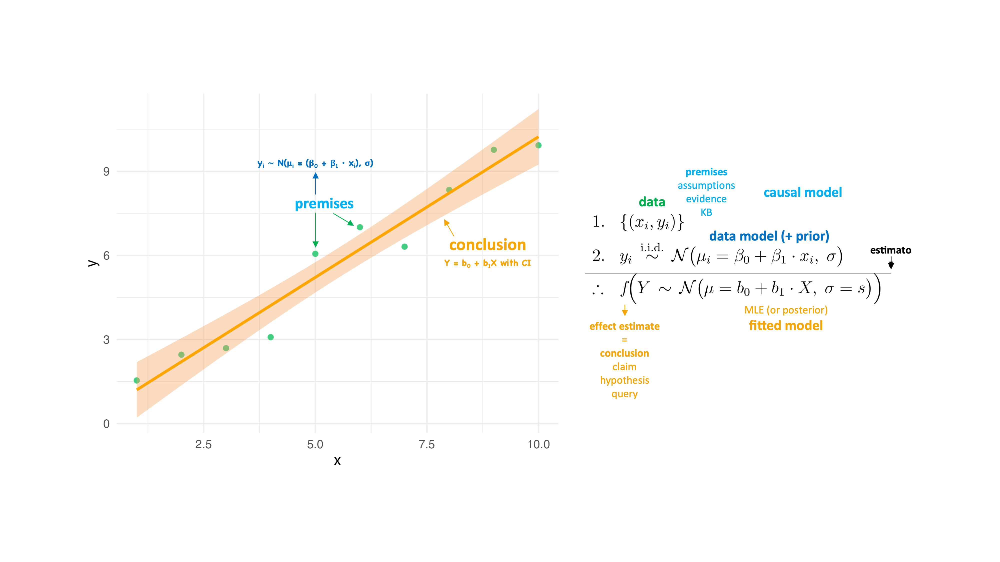

## Scientific reasoning is inductive reasoning

> *All of the things we say in science, all of the conclusions, are uncertain.*
>
> *Scientific knowledge is a body of statements of varying degrees of certainty — some most unsure, some nearly sure, but none absolutely certain.*
>
> *And it is of paramount importance, in order to make progress, that we recognize this ignorance and this doubt.*
>
> *Because we have this doubt, we then propose looking in new directions for new ideas.*
>
> — [Richard Feynman](https://en.wikipedia.org/wiki/Richard_Feynman) (1918 – 1988, Nobel-prize winning theoretical physicist)

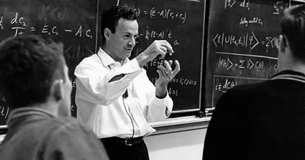{width="200"}

::: notes
Plausible reasoning/Reasoning under uncertainty
:::

## Scientific reasoning is inductive reasoning, but …


This article discusses a study \[[Yao et al. (2023)](https://link.springer.com/article/10.1007/s11192-023-04759-6)\] analyzing the frequency of hedging words, such as "might" and "probably", in scientific literature over the past two decades. The findings indicate that the use of such words has declined by approximately 40% during this period.

## What the &#%! is probability?

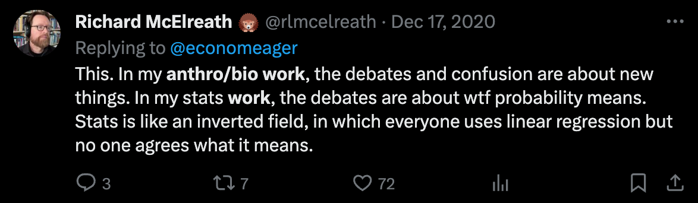{height="200"}

-   Ontological interpretations

    -   Limiting relative frequency/proportion (frequentists say "long-run" but mean ∞ 🤯)
    -   Physical chance/propensity\
         

-   Epistemological interpretations

    -   Degree of belief in the truth of a proposition (subjective Bayesian)

    -   Strength of an inductive argument (objective Bayesian)

## What the &#%! is probability?

{height="200"}

::: nonincremental
-   Ontological interpretations

    -   Limiting relative frequency/proportion (frequentists say "long-run" but mean ∞ 🤯)
    -   Physical chance/propensity\
         

-   Epistemological interpretations

    -   Degree of belief in the truth of a proposition (subjective Bayesian)

    -   **Strength of an inductive argument (objective Bayesian)**
:::

## Artificial intelligence

::: nonincremental
-   Our goal in this series of lectures is to program an **artificial intelligence (AI)**: A computer algorithm that is capable of logical reasoning (deductive and inductive)
:::

{height="500"}

## Artificial intelligence

::: nonincremental
-   Our goal in this series of lectures is to program an **artificial intelligence (AI)**: A computer algorithm that is capable of logical reasoning (deductive and inductive)

-   To achieve this, we need a way to translate a logical argument from English to a language that the computer understands
:::

-   Specifically, we will use:

    -   **Propositional logic** (mathematical language) to formalize **deductive reasoning**

    -   **Probability theory** (mathematical language) to formalize **inductive reasoning**

    -   **R** (programming language) to translate a deductive or inductive argument written in the language of propositional logic or probability theory into a computer algorithm

## From propositional logic to probability theory

-   **Propositional logic** is a mathematical language that we use to 1) **represent knowledge** with logical variables/propositions and 2) **reason** about the **truth** of propositions, given the knowledge base (*deductive reasoning*)

-   **Probability theory** extends propositional logic to reason about the **plausibility** of propositions, given the knowledge base (*inductive reasoning*)

## From propositional logic to probability theory


## From propositional logic to probability theory

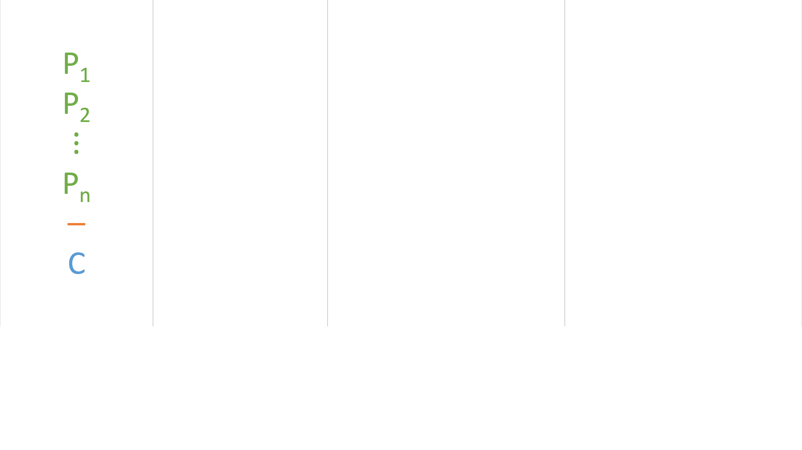

## From propositional logic to probability theory

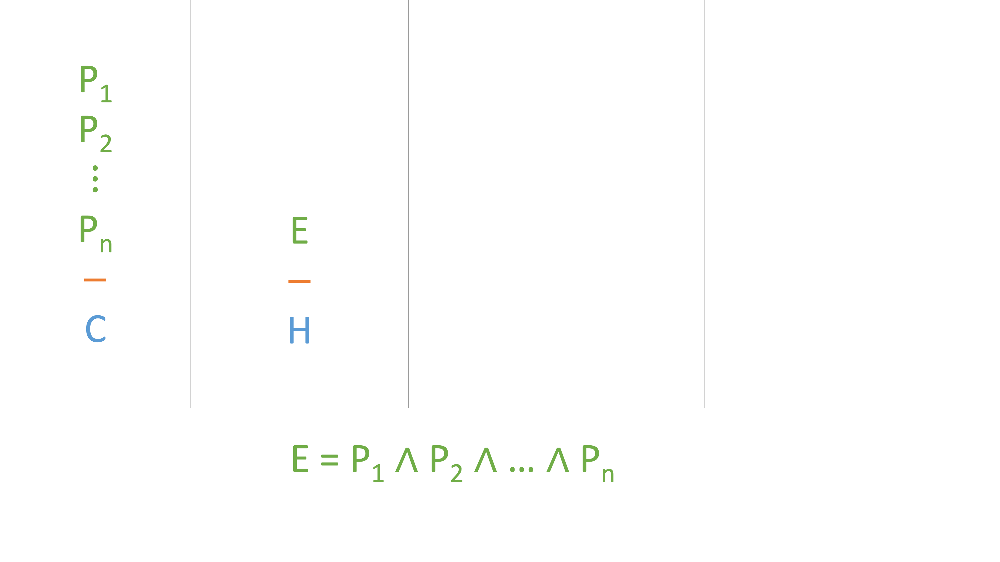

## From propositional logic to probability theory

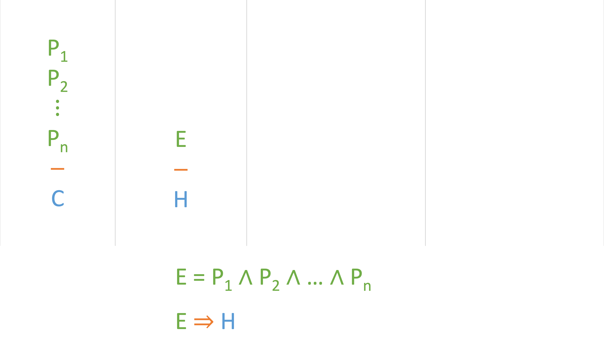

## From propositional logic to probability theory


## From propositional logic to probability theory

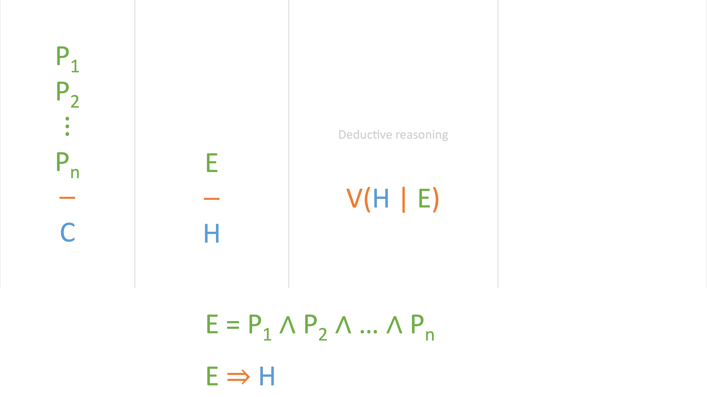

## From propositional logic to probability theory

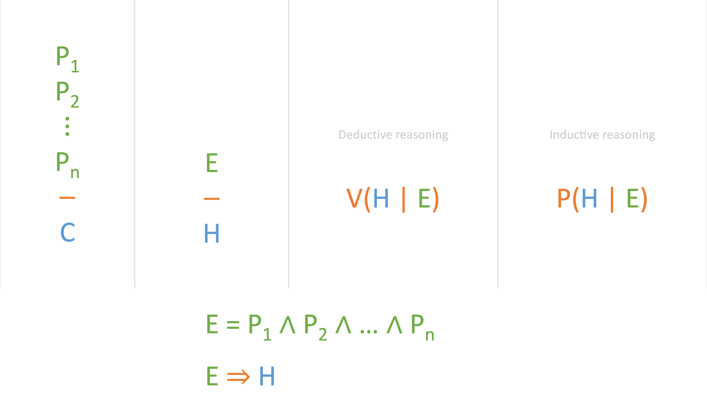

## Sample space and outcomes

-   The universe/**sample space** ($\Omega$) is the set of all possible worlds/**outcomes** ($\omega_i$), i.e., the set of all possible combinations of truth-value assignments for a given set of atomic variables

-   The sample space for a set of $n$ atomic variables consists of $2^n$ possible outcomes

::: fragment
$$\Omega = \{ \omega_1, \omega_2, \ldots, \omega_{2^n} \}$$
:::

-   For example, given a set of two atomic variables $A$ and $B$, the sample space consists of four possible outcomes

::: fragment
|  $\Omega$  |      $A$       |      $B$       |
|:----------:|:--------------:|:--------------:|
| $\omega_1$ | [TRUE]{.green} | [TRUE]{.green} |
| $\omega_2$ | [TRUE]{.green} | [FALSE]{.red}  |
| $\omega_3$ | [FALSE]{.red}  | [TRUE]{.green} |
| $\omega_4$ | [FALSE]{.red}  | [FALSE]{.red}  |
:::

## Sample space and outcomes

```{r}
#| include: false
vars <- c("A", "B")

ss <-
  expand_grid(!!!set_names(map(vars, ~ c(TRUE, FALSE)), vars)) %>%
  mutate(Ω = paste0("⍵", 1:n())) %>%
  select(Ω, everything())

ss
```

```{r}
ss <-
  expand_grid(
    A = c(TRUE, FALSE),
    B = c(TRUE, FALSE)) %>%
  mutate(Ω = paste0("⍵", 1:n())) %>%
  select(Ω, everything())

ss
```

## Propositions and events

-   An **event** is a subset of the sample space, including the empty set ($\emptyset$) and the sample space itself ($\Omega$)

-   Event $X$: the subset of the sample space where proposition $X$ is true

-   The terms **proposition** and **event** are often used interchangeably

-   Probability applies to propositions/events

    -   $P(X)$ = probability that proposition $X$ is true

    -   $P(X)$ = probability that event $X$ occurs

## Propositions and events

::: nonincremental
-   Proposition $X$: $\: A$
:::

::: fragment
```{r}
#| output-location: default
ss
```
:::

## Propositions and events

::: nonincremental
-   Proposition $X$: $\: A$
:::

```{r}
#| output-location: default
ss %>% mutate(X = A)
```

-   Event $X$: the subset of $\Omega$ where $X$ is true

::: fragment
```{r}
ss %>% mutate(X = A) %>% filter(X)
```
:::

## Propositions and events

::: nonincremental
-   Proposition $X$: $\: \lnot A$
:::

::: fragment
```{r}
#| output-location: default
ss
```
:::

## Propositions and events

::: nonincremental
-   Proposition $X$: $\: \lnot A$
:::

```{r}
#| output-location: default
ss %>% mutate(X = !A)
```

-   Event $X$: the subset of $\Omega$ where $X$ is true

::: fragment
```{r}
ss %>% mutate(X = !A) %>% filter(X)
```
:::

## Propositions and events

::: nonincremental
-   Proposition $X$: $\: \lnot A \lor B$
:::

::: fragment
```{r}
#| output-location: default
ss
```
:::

## Propositions and events

::: nonincremental
-   Proposition $X$: $\: \lnot A \lor B$
:::

```{r}
#| output-location: default
ss %>% mutate(X = !A | B)
```

-   Event $X$: the subset of $\Omega$ where $X$ is true

::: fragment
```{r}
ss %>% mutate(X = !A | B) %>% filter(X)
```
:::

## Propositions and events

::: nonincremental
-   Proposition $X$: $\: A \implies B$
:::

::: fragment
```{r}
#| output-location: default
ss
```
:::

## Propositions and events

::: nonincremental
-   Proposition $X$: $\: A \implies B$
:::

```{r}
#| output-location: default
ss %>% mutate(X = A %=>% B)
```

-   Event $X$: the subset of $\Omega$ where $X$ is true

::: fragment
```{r}
ss %>% mutate(X = A %=>% B) %>% filter(X)
```
:::

## Propositions and events

::: nonincremental
-   If $X$ is a tautology ($\top$), then event $X$ is the sample space $\Omega$
:::

::: fragment
```{r}
#| output-location: default
ss
```
:::

## Propositions and events

::: nonincremental
-   If $X$ is a tautology ($\top$), then event $X$ is the sample space $\Omega$
:::

```{r}
#| output-location: default
ss %>% mutate(X = A | !A)
```

::: fragment
```{r}
ss %>% mutate(X = A | !A) %>% filter(X)
```
:::

## Propositions and events

::: nonincremental
-   If $X$ is a contradiction ($\bot$), then event $X$ is the empty set $\emptyset$
:::

::: fragment
```{r}
#| output-location: default
ss
```
:::

## Propositions and events

::: nonincremental
-   If $X$ is a contradiction ($\bot$), then event $X$ is the empty set $\emptyset$
:::

```{r}
#| output-location: default
ss %>% mutate(X = A & !A)
```

::: fragment
```{r}
ss %>% mutate(X = A & !A) %>% filter(X)
```
:::

 

-   A **tautology** is a proposition which is true in every possible world (certainly true)

-   A **contradiction** is a proposition which is false in every possible world (certainly false)

-   A **contingent proposition** is one that is true in some possible worlds and false in others

## From propositional logic to probability theory


## Artificial intelligence for inductive reasoning

-   We will implement this $P$ function in R to build an AI for deductive reasoning

    -   **Input**: A deductive argument with one or more premises (`P1`, `P2`, …) and a conclusion (`H`)

    -   **Output**: A `Numeric` value, measuring the inductive strength of the argument

-   First, we will program this computer algorithm step-by-step

-   Then, we will wrap it up into a reusable function called `P`

-   We will use the *proportional syllogism* (a classical argument that is foundational to statistical inference) as an example

## Proportional syllogism

The proportional syllogism is a logical argument that draws a conclusion based on a proportion

::::: columns
::: {.column .fragment .nonincremental}
**Premises**

-   A bag contains two blue balls and one white ball

-   One ball is drawn from the bag

**Conclusion**

-   A blue ball is drawn from the bag
:::

::: {.column .fragment .nonincremental}
$$
\begin{array}{ll}
1. & B1 \lor B2 \lor W \\
2. & \neg((B1 \land B2) \lor (B1 \land W) \lor (B2 \land W)) \\
\hline
\therefore & B1 \lor B2
\end{array}
$$
:::
:::::

## Proportional syllogism

The proportional syllogism is a logical argument that draws a conclusion based on a proportion

$$
\begin{array}{ll}
1. & B1 \lor B2 \lor W \\
2. & \neg((B1 \land B2) \lor (B1 \land W) \lor (B2 \land W)) \\
\hline
\therefore & B1 \lor B2
\end{array}
$$

-   The goal is to assess the **inductive strength** of this argument, i.e., to measure how likely the conclusion is to be true given that the premises are true

-   We will assess the inductive strength of this argument following these steps:

    -   Build the truth table of this argument
        -   First, create a data frame with all possible combinations of atomic variables
        -   Second, add columns for premises ($E = P1, P2$) and conclusion ($H$)
    -   Calculate the proportion of rows where $E$ is true, in which $H$ is also true (probability)

## Proportional syllogism

Create a data frame with all possible combinations of atomic variables

```{r}
expand_grid(
  B1 = c(TRUE, FALSE),
  B2 = c(TRUE, FALSE),
  W  = c(TRUE, FALSE))
```

## Proportional syllogism

Add columns for premises ($E = P1, P2$) and conclusion ($H$)

```{r}
#| output-location: default
expand_grid(B1 = c(TRUE, FALSE), B2 = c(TRUE, FALSE), W  = c(TRUE, FALSE)) %>%
  mutate(
    P1 = B1 | B2 | W,
    P2 = !((B1 & B2) | (B1 & W) | (B2 & W)),
    E  = P1 & P2,
    H  = B1 | B2
  )
```

## Proportional syllogism

Calculate the proportion of rows where $E$ is true, in which $H$ is also true

```{r}
#| output-location: default
expand_grid(B1 = c(TRUE, FALSE), B2 = c(TRUE, FALSE), W  = c(TRUE, FALSE)) %>%
  mutate(
    P1 = B1 | B2 | W,
    P2 = !((B1 & B2) | (B1 & W) | (B2 & W)),
    E  = P1 & P2,
    H  = B1 | B2
  )
```

## Proportional syllogism

Calculate the proportion of rows where $E$ is true, in which $H$ is also true

```{r}
#| output-location: default
expand_grid(B1 = c(TRUE, FALSE), B2 = c(TRUE, FALSE), W  = c(TRUE, FALSE)) %>%
  mutate(
    P1 = B1 | B2 | W,
    P2 = !((B1 & B2) | (B1 & W) | (B2 & W)),
    E  = P1 & P2,
    H  = B1 | B2
  ) %>%
  filter(E)
```

## Proportional syllogism

Calculate the proportion of rows where $E$ is true, in which $H$ is also true

```{r}
#| output-location: default
expand_grid(B1 = c(TRUE, FALSE), B2 = c(TRUE, FALSE), W  = c(TRUE, FALSE)) %>%
  mutate(
    P1 = B1 | B2 | W,
    P2 = !((B1 & B2) | (B1 & W) | (B2 & W)),
    E  = P1 & P2,
    H  = B1 | B2
  ) %>%
  filter(E) %>%
  pull(H)
```

## Proportional syllogism

Calculate the proportion of rows where $E$ is true, in which $H$ is also true

```{r}
#| output-location: default
expand_grid(B1 = c(TRUE, FALSE), B2 = c(TRUE, FALSE), W  = c(TRUE, FALSE)) %>%
  mutate(
    P1 = B1 | B2 | W,
    P2 = !((B1 & B2) | (B1 & W) | (B2 & W)),
    E  = P1 & P2,
    H  = B1 | B2
  ) %>%
  filter(E) %>%
  pull(H) %>%
  mean()
```

::: fragment
{height="300"}
:::

## Proportional syllogism

Artificial intelligence for inductive reasoning implemented in a single line of R code! 🤯

```{r}
#| output-location: default
expand_grid(B1 = c(TRUE, FALSE), B2 = c(TRUE, FALSE), W  = c(TRUE, FALSE)) %>% mutate(P1 = B1 | B2 | W, P2 = !((B1 & B2) | (B1 & W) | (B2 & W)), E = P1 & P2, H  = B1 | B2) %>% filter(E) %>% pull(H) %>% mean()
```

-   In this example with **two (2) blue balls** and **one (1) white ball**:

::: fragment
$$P(H \mid E) = 0.6667 = \frac{2}{2 + 1}$$
:::

-   In general, for any number of blue balls ($b$) and white balls ($w$):

::: fragment
$$P(H \mid E) = \frac{b}{b + w}$$
:::

-   This mathematical formula captures the logic of the [Bernoulli trial](https://en.wikipedia.org/wiki/Bernoulli_trial)

-   This logic is fundamental to probability theory and inductive reasoning

## Artificial intelligence for inductive reasoning

```{r}
#| output-location: default
library(rlang)
```

```{r}
#| output-location: default
P <- function(..., H) {
  # capture premises as a list of quosures
  premises <- enquos(...)

  # capture conclusion (H) as a quosure
  H <- enquo(H)

  if (length(premises) == 0) {
    # if no premises are provided, set evidence (E) to TRUE (tautology)
    E <- expr(TRUE)
  } else {
    # else set evidence (E) to conjunction of all premises
    E <- reduce(premises, ~ expr((!! .x) & (!! .y)))
  }
    
  # extract atomic variables from E and H
  vars <- unique(c(all.vars(E), all.vars(H)))
  
  # build truth table and calculate proportion of rows where E is true, in which H is also true
  expand_grid(!!!set_names(rep(list(c(TRUE, FALSE)), length(vars)), vars)) %>%
    mutate(E = !!E, H = !!H) %>%
    filter(E) %>%
    pull(H) %>%
    mean()
}
```

## Classical strong and weak inductive arguments

::::: columns
::: {.column width="50%"}
***Modus ponens***

$$
\begin{array}{c}
A \implies B \\
A \\
\hline
B
\end{array}
$$
:::

::: {.column width="50%"}
***Modus tollens, inverse of***

$$
\begin{array}{c}
A \implies B \\
\neg B \\
\hline
A
\end{array}
$$
:::
:::::

::::: columns
::: {.column width="50%"}
**Affirming the consequent**

$$
\begin{array}{c}
A \implies B \\
B \\
\hline
A
\end{array}
$$
:::

::: {.column width="50%"}
**Denying the antecedent, inverse of**

$$
\begin{array}{c}
A \implies B \\
\neg A \\
\hline
B
\end{array}
$$
:::
:::::

```{r}
#| include: false
library(flextable)

P.flex <- function(..., H, table = TRUE, flex = TRUE) {
  # capture premises as a list of quosures
  premises <- enquos(...)
  
  # capture conclusion (H) as a quosure
  H <- enquo(H)
  
  # extract atomic variables from premises and H
  vars <- unique(c(unlist(lapply(premises, all.vars)), all.vars(H)))
  
  # create data frame with all possible combinations of atomic variables/worlds (universe)
  tt <- expand_grid(!!!set_names(rep(list(c(TRUE, FALSE)), length(vars)), vars))

  # add columns for premises
  for (i in seq_along(premises)) {
    tt[[paste0("P", i)]] <- eval_tidy(premises[[i]], data = tt)
  }
  
  # add columns for conjunction of all premises (E) and H
  tt <- tt %>%
    mutate(
      E = if_all(starts_with("P"), identity),
      H = eval_tidy(H, data = tt)
    )
  
  # calculate P(H | E) by checking whether in every possible world/row where E is true, H is also true
  P <- tt %>%
    filter(E) %>%
    pull(H) %>%
    mean()
  
  # return P(H | E) if truth table output is not requested
  if (!table) {
    return(P)
  }
  
  # return truth table if formatted truth table output is not requested
  if (!flex) {
    return(tt)
  }
  
  # define colors
  highlight_color <- "beige"  # Standard HTML color name
  true_color <- "darkgreen"
  false_color <- "darkred"
  
  # convert the truth table into a flextable
  tt.formatted <- flextable(tt) %>%
    bold(part = "header") %>%  # Bold the header
    bold(part = "footer") %>%  # Bold the footer
    bg(i = which(tt$E == TRUE), bg = highlight_color, part = "body")  # Highlight E = TRUE rows
  
  # apply text colors
  for (col in colnames(tt)) {
    tt.formatted <- tt.formatted %>%
      color(i = which(tt[[col]] == TRUE), j = col, color = true_color) %>%
      color(i = which(tt[[col]] == FALSE), j = col, color = false_color)
  }
  
  # add footer with the calculated P(C | K) value
  tt.formatted <- tt.formatted %>%
    add_footer_row(
      values = paste("P(H | E) =", round(P, 3)),
      colwidths = ncol(tt)
    ) %>%
    align(align = "right", part = "footer")

  # return formatted truth table
  return(tt.formatted)
}
```

## *Modus ponens*

*Modus ponens* is a logical argument that affirms the antecedent to conclude the consequent

::::::::: columns
::::: column
::: {.fragment .nonincremental}
**Premises**

-   If it is raining, then the ground is wet

-   It is raining

**Conclusion**

-   The ground is wet
:::

::: fragment
$$
\begin{array}{ll}
1. & R \implies W \\
2. & R \\
\hline
\therefore & W
\end{array}
$$
:::
:::::

::::: column
::: fragment
```{r}
#| echo: false
#| output-location: default
P.flex(P1 = R %=>% W, P2 = R, H = W)
```
:::

::: fragment
```{r}
#| output-location: default
P(P1 = R %=>% W,
  P2 = R,       
  H  = W)
```
:::
:::::
:::::::::

## Affirming the consequent

Affirming the consequent is a logical argument that affirms the consequent to conclude the antecedent

::::::::: columns
::::: column
::: {.fragment .nonincremental}
**Premises**

-   If it is raining, then the ground is wet

-   The ground is wet

**Conclusion**

-   It is raining
:::

::: fragment
$$
\begin{array}{ll}
1. & R \implies W \\
2. & W \\
\hline
\therefore & R
\end{array}
$$
:::
:::::

::::: column
::: fragment
```{r}
#| echo: false
#| output-location: default
P.flex(P1 = R %=>% W, P2 = W, H = R)
```
:::

::: fragment
```{r}
#| output-location: default
P(P1 = R %=>% W,
  P2 = W,
  H  = R)
```
:::
:::::
:::::::::

## Affirming the consequent

Affirming the consequent is a logical argument that affirms the consequent to conclude the antecedent

:::::: columns
:::: column
::: nonincremental
**Premises**

-   If it is raining, then the ground is wet

-   ~~The ground is wet~~

**Conclusion**

-   It is raining
:::

$$
\begin{array}{ll}
1. & R \implies W \\
\hline
\therefore & R
\end{array}
$$
::::

::: column
```{r}
#| echo: false
#| output-location: default
P.flex(P1 = R %=>% W, H = R)
```

```{r}
#| output-location: default
P(P1 = R %=>% W,
  H  = R)
```
:::
::::::

## *Modus tollens*, inverse of

A logical argument that denies the consequent to conclude the antecedent

::::::::: columns
::::: column
::: {.fragment .nonincremental}
**Premises**

-   If it is raining, then the ground is wet

-   The ground is not wet

**Conclusion**

-   It is raining
:::

::: fragment
$$
\begin{array}{ll}
1. & R \implies W \\
2. & \neg W \\
\hline
\therefore & R
\end{array}
$$
:::
:::::

::::: column
::: fragment
```{r}
#| echo: false
#| output-location: default
P.flex(P1 = R %=>% W, P2 = !W, H = R)
```
:::

::: fragment
```{r}
#| output-location: default
P(P1 = R %=>% W,
  P2 = !W,
  H  = R)
```
:::
:::::
:::::::::

## Denying the antecedent, inverse of

A logical argument that denies the antecedent to conclude the consequent

::::::::: columns
::::: column
::: {.fragment .nonincremental}
**Premises**

-   If it is raining, then the ground is wet

-   It is not raining

**Conclusion**

-   The ground is wet
:::

::: fragment
$$
\begin{array}{c}
1. & R \implies W \\
2. & \neg R \\
\hline
\therefore & W
\end{array}
$$
:::
:::::

::::: column
::: fragment
```{r}
#| echo: false
#| output-location: default
P.flex(P1 = R %=>% W, P2 = !R, H = W)
```
:::

::: fragment
```{r}
#| output-location: default
P(P1 = R %=>% W,
  P2 = !R,
  H  = W)
```
:::
:::::
:::::::::

## Denying the antecedent, inverse of

A logical argument that denies the antecedent to conclude the consequent

::::::::: columns
::::: column
::: nonincremental
**Premises**

-   If it is raining, then the ground is wet

-   ~~It is not raining~~

**Conclusion**

-   The ground is wet
:::

$$
\begin{array}{c}
1. & R \implies W \\
\hline
\therefore & W
\end{array}
$$
:::::

::::: column
```{r}
#| echo: false
#| output-location: default
P.flex(P1 = R %=>% W, H = W)
```

```{r}
#| output-location: default
P(P1 = R %=>% W,
  H  = W)
```
:::::
:::::::::

## From propositional logic to probability theory

-   Desiderata of probability theory ([Cox's theorem](https://en.wikipedia.org/wiki/Cox%27s_theorem))

    -   Probability theory must obey the rules of propositional logic
    
    -   Probability theory must obey common-sense directional rules
    
    -   Probability theory should enable us to reason quantitatively about the plausibility of propositions


-   Axioms of probability theory

    -   The plausability of a proposition is a real number: $\: P(H \mid E) \in \mathbb{R}$

    -   XXX

    -   XXX

[For more information:]{.fragment}

-   [Probability as logical inference: A dramatic reading of E.T. Jaynes' textbook](https://youtu.be/zOeOgXbC5hE)

-   [One probability to rule them all?](https://youtu.be/HCG57e7Ogv8?si=2PY1EBoPfjLdS6yd)

## From propositional logic to probability theory

-   Probability theory extends propositional logic (deductive reasoning) to reasoning under uncertainty (inductive reasoning)

-   Probability is a measure of how strongly a conclusion is entailed by the premises

-   Once the premises and the conclusion are subjectively chosen, probability is entirely objective

-   All probability is conditional

 

### Rules of probability theory {.fragment}

::: fragment
Cox's theorem implies that
:::

-   $0 \le P(A \mid K) \le 1$

-   $P(A \mid K) = 0$ iff hypothesis $A$ given evidence $K$ is a contradiction ($P(F) = P(\emptyset) = 0$)

-   $P(A \mid K) = 1$ iff hypothesis $A$ given evidence $K$ is a tautology ($P(T) = P(\Omega) = 1$)

-   $P(A \land B \mid K) = P(A \mid K) \cdot P(B \mid A \land K) = P(B \mid K) \cdot P(A \mid B \land K)$

## From propositional logic to probability theory

### Product rule (AND) - Bayes' theorem

::: nonincremental
-   $P(A \land B \mid K) = P(A \mid K) \cdot P(B \mid A \land K) = P(B \mid K) \cdot P(A \mid B \land K) = P(B \land A \mid K)$

    ::: incremental
    -   $P(A \mid B \land K) = \frac{P(A \land B \mid K)}{P(B \mid K)}$

    -   $P(A \mid B \land K) = \frac{P(A \mid K) \cdot P(B \mid A \land K)}{P(B \mid K)}$
    :::
:::

### [Sum rule (OR)]{.fragment}

-   $P(A \lor B \mid K) = P(A \mid K) + P(B \mid K) - P(A \land B \mid K)$

### [Negation rule (NOT)]{.fragment}

-   $P(\lnot A \mid K) = 1 - P(A \mid K)$

## Rules of probability theory/inductive reasoning

### [Product rule (AND) - Bayes' theorem]{.fragment}

-   $P(A \land B) = P(A) \cdot P(B \mid A) = P(B) \cdot P(A \mid B) = P(B \land A)$

    -   $P(A \mid B) = \frac{P(A \land B)}{P(B)} \quad \text{“conditional probability”}$

    -   $P(A \mid B) = \frac{P(A) \cdot P(B \mid A)}{P(B)} \quad \text{Bayes' theorem}$

### [Sum rule (OR)]{.fragment}

-   $P(A \lor B) = P(A) + P(B) - P(A \land B)$

### [Negation rule (NOT)]{.fragment}

-   $P(\lnot A) = 1 - P(A)$

### [Law of total probability]{.fragment}

-   $P(B) = \sum_{i=1}^n P(B \land A_i) \text{ where } \{A_1, A_2, \ldots, A_n\} \text{ are mutually exclusive and exhaustive propositions}$

## Mutually exclusive and exhaustive propositions

::: fragment
### Mutually exclusive propositions
:::

::: fragment
Two propositions/events $A$ and $B$ are mutually exclusive iff
:::

-   $P(A \land B) = 0 \quad A \land B \equiv F \quad A \cap B = \emptyset$

::: fragment
If two propositions/events $A$ and $B$ are mutually exclusive, then the sum rule simplifies from
:::

-   $P(A \lor B) = P(A) + P(B) - P(A \land B)$

::: fragment
to
:::

-   $P(A \lor B) = P(A) + P(B)$

::: fragment
### Exhaustive propositions
:::

::: fragment
Two propositions/events $A$ and $B$ are exhaustive iff
:::

-   $P(A \lor B) = 1 \quad A \lor B \equiv T \quad A \cup B = \Omega$

## Mutually exclusive and exhaustive propositions

::: fragment
For example, $A$ and $\lnot A$ are mutually exclusive and exhaustive propositions/events
:::

-   $A$ and $\lnot A$ are mutually exclusive propositions because $P(A \land \lnot A) = P(F) = P(\emptyset) = 0$

-   $A$ and $\lnot A$ are exhaustive propositions because $P(A \lor \lnot A) = P(T) = P(\Omega) = 1$

 

::: fragment
### Law of total probability
:::

-   $P(B) = \sum_{i=1}^n P(B \land A_i) \text{ where } \{A_1, A_2, \ldots, A_n\} \text{ are mutually exclusive and exhaustive propositions}$

-   $P(B) = P(B \land A) + P(B \land \lnot A)$

 

::: fragment
### Bayes' theorem
:::

-   $P(A \mid B) = \frac{P(A \land B)}{P(B)} = \frac{P(A) \cdot P(B \mid A)}{P(B)} = \frac{P(A) \cdot P(B \mid A)}{P(B \land A) + P(B \land \lnot A)} = \frac{P(A) \cdot P(B \mid A)}{P(A) \cdot P(B \mid A) + P(\lnot A) \cdot P(B \mid \lnot A)}$

## Independent propositions

::: fragment
Two propositions/events $A$ and $B$ are independent iff
:::

-   $P(A \mid B) = P(A)$

::: fragment
or, equivalently
:::

-   $P(B \mid A) = P(B)$

::: fragment
If two propositions/events $A$ and $B$ are independent, then the product rule simplifies from
:::

-   $P(A \land B) = P(A) \cdot P(B \mid A)$

::: fragment
to
:::

-   $P(A \land B) = P(A) \cdot P(B)$

## Association does not imply causation

::: fragment
"Correlation is not causation" - correlation is just a special case of statistical association
:::

::: fragment
Two propositions/events $A$ and $B$ are associated iff they are NOT independent
:::

-   $P(A \mid B) \ne P(A)$

::: fragment
or, equivalently
:::

-   $P(B \mid A) \ne P(B)$

::: fragment
For example,
:::

-   $P(\text{heart attack} \mid \text{high cholesterol levels}) > P(\text{heart attack})$

-   $P(\text{shark attack} \mid \text{high ice cream sales}) > P(\text{shark attack})$

::: fragment
We bring causation to probability; we do not get causation from probability!
:::

## Association does not imply causation

A statistical association is a logical relationship between two propositions/events and does not imply a causal relationship between them

::: fragment
For example,
:::

-   reducing cholesterol levels lowers the risk of a heart attack (causal relationship), however

-   reducing ice cream sales does not lower the risk of a shark attack, even though there is a statistical association between high ice cream sales and shark attacks

:::: fragment
::: text-align-center
{height="240"}

[Spurious Correlations - Tyler Vigen](https://tylervigen.com/spurious-correlations)
:::
::::

## The "ladder of causation"

From Pearl and Mackenzie (2018) [The Book of Why](https://bayes.cs.ucla.edu/WHY/)

::: text-align-center

:::

## Probability distribution

-   Jaynes’ [principle of maximum entropy](https://en.wikipedia.org/wiki/Principle_of_maximum_entropy) states that, in the absence of additional information, outcomes in the sample space are equally likely

::: fragment
$$\forall \omega \in \Omega \quad p(\omega) = \frac{1}{|\Omega|}$$

where $p(\omega)$ is the probability (or more precisely the *probability mass*) of $\omega$
:::

-   $p$ is also known as **probability distribution** or *probability mass function* (PMF) of $\Omega$

-   For example, given the following sample space

::: fragment
```{r}
#| echo: false
ss
```
:::

## Probability distribution

::: nonincremental
-   Jaynes’ [principle of maximum entropy](https://en.wikipedia.org/wiki/Principle_of_maximum_entropy) states that, in the absence of additional information, outcomes in the sample space are equally likely
:::

$$\forall \omega \in \Omega \quad p(\omega) = \frac{1}{|\Omega|}$$

::: nonincremental
where $p(\omega)$ is the probability (or more precisely the *probability mass*) of $\omega$

-   $p$ is also known as **probability distribution** or *probability mass function* (PMF) of $\Omega$

-   For example, given the following sample space $\quad p(\omega) = \frac{1}{4} = 0.25$
:::

::: fragment
```{r}
ss %>% mutate(p = 1 / n())
```
:::

## Probability calculation

::: fragment
The probability of proposition/event $X$ is calculated as
:::

::: fragment
$$P(X) = \sum_{\omega \in X} p(\omega)$$
:::

::: fragment
For example, if proposition $X$ is $A \lor B$, then $P(X)$ is
:::

::: fragment
```{r}
ss %>%
  mutate(p = 1 / n()) %>%
  mutate(X = A | B) %>%
  filter(X) %>% 
  summarize(`P(X)` = sum(p))
```
:::

::: fragment
or more succinctly
:::

::: fragment
```{r}
ss %>%
  mutate(p = 1 / n()) %>%
  mutate(X = A | B) %>%
  summarize(`P(X)` = sum(p[X]))
```
:::

## Humans often fail when reasoning with probabilities!

[**Gambler's fallacy**]{.fragment}

::: fragment
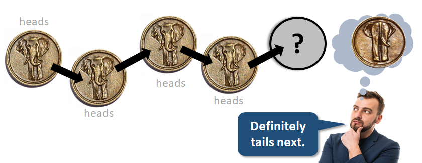{height="280"}
:::

## Humans often fail when reasoning with probabilities!

**Base rate fallacy**

::: fragment
{height="400"}
:::

## Humans often fail when reasoning with probabilities!

**Prosecutor's fallacy**

[{.fragment height="250"}](https://www.theguardian.com/world/2021/apr/18/obscure-maths-bayes-theorem-reliability-covid-lateral-flow-tests-probability)

-   Sally Clark was found guilty of the murder of her two infant sons

-   The defense argued that both children had died of sudden infant death syndrome

-   The prosecution relied on flawed statistical evidence presented by a paediatrician who testified that the probability of two infants dying of SIDS in the same family is 1 in 73M

-   The jury mistakenly interpreted this probability (of the evidence given the presumption of innocence) with the probability of Sally Clark's innocence given the evidence

::: notes
-   Sally Clark's first son died within a few weeks of his birth, and her second son died in similar circumstances two years later
-   Soon after, Sally Clark was arrested and tried for both deaths
-   The defense argued that the children had died of sudden infant death syndrome (SIDS)
-   The prosecution relied on flawed statistical evidence presented by a paediatrician who testified that the probability of two infants dying of SIDS in the same family was 1 in 73 million
-   Sally Clark was convicted and spent three years in prison before being released on second appeal (not because of the flawed stats but because it emerged that the prosecution forensic pathologist had failed to disclose microbiological reports that suggested the second of Sally Clark's sons had died of natural causes)
-   Soon after she was convicted, the Royal Statistical Society issued a statement arguing that there was no statistical basis for the paediatrician's claim
-   Sally Clark's experience caused her to develop severe psychiatric problems and she died four years later of alcohol poisoning
:::

## A typical study in the social/biomedical sciences

-   A group of 62 subjects was randomly split into two groups of 31 and 31 subjects
-   Each subject in the first group looked at a picture of Rodin's *The Thinker* for 30 seconds (*treatment group*)
-   Each subject in the second group looked at a picture of the *Discobulus of Myron* for 30 seconds (*control group*)

:::: fragment
::: text-align-center
{width="550"}
:::
::::

## A typical study in the social/biomedical sciences

::: nonincremental
-   A group of 62 subjects was randomly split into two groups of 31 and 31 subjects
-   Each subject in the first group looked at a picture of Rodin's *The Thinker* for 30 seconds (*treatment group*)
-   Each subject in the second group looked at a picture of the *Discobulus of Myron* for 30 seconds (*control group*)
-   All subjects then rated their belief in the existence of God on a scale from 0 to 100
:::

-   The mean belief in the existence of God was 41.5 for the treatment group and 61.5 for the control group
-   **Is there an effect of the treatment on the belief in the existence of God?**
-   If there were no effect (*null hypothesis*), then the probability of observing a difference this large or larger is 3% \[**P = 0.03**, t(55) = 2.24, Cohen’s d = 0.60\]
-   Therefore, looking at the picture of *The Thinker* for 30 seconds significantly promotes religious disbelief!

## The fallacy of the transposed conditional

::: fragment
All three examples (base-rate fallacy, prosecutor's fallacy, and the scientific study) commit the **fallacy of the transposed conditional**, i.e., confuse the probability of the evidence given the hypothesis ("*sampling probability*") with the probability of the hypothesis given the evidence ("*inferential probability*")
:::

::: fragment
[P(]{.orange}[evidence]{.green} [\|]{.orange} [hypothesis]{.blue}[)]{.orange} = [P(]{.orange}[hypothesis]{.blue} [\|]{.orange} [evidence]{.green}[)]{.orange}
:::

 

::: fragment
**Base-rate fallacy**<br/> [P(]{.orange}[vaccinated]{.green} [\|]{.orange} [hospitalized]{.blue}[)]{.orange} = [P(]{.orange}[hospitalized]{.blue} [\|]{.orange} [vaccinated]{.green}[)]{.orange}
:::

 

::: fragment
**Prosecutor's fallacy**<br/> [P(]{.orange}[two deaths]{.green} [\|]{.orange} [innocent]{.blue}[)]{.orange} = [P(]{.orange}[innocent]{.blue} [\|]{.orange} [two deaths]{.green}[)]{.orange}
:::

 

::: fragment
**Scientific study**<br/> [P(]{.orange}[same or larger effect]{.green} [\|]{.orange} [null hypothesis]{.blue}[)]{.orange} = [P(]{.orange}[null hypothesis]{.blue} [\|]{.orange} [same or larger effect]{.green}[)]{.orange}
:::

## The fallacy of the transposed conditional

::: text-align-center
{height="550"}

<https://doi.org/10.1126/science.1215647>
:::

## The fallacy of the transposed conditional

::: text-align-center
{height="550"}

<https://cup.columbia.edu/book/bernoullis-fallacy/9780231199957>
:::

## Logical probability textbooks

::::::: columns
:::: {.column width="50%"}
::: text-align-center
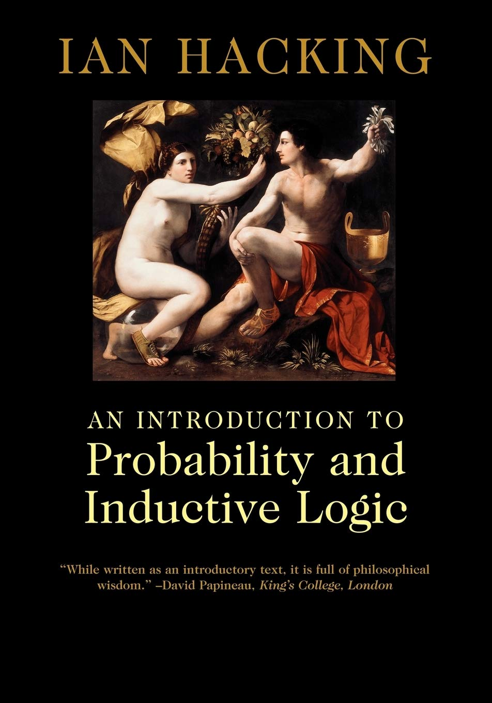{height="550"}

<https://doi.org/10.1017/CBO9780511801297>
:::
::::

:::: {.column width="50%"}
::: text-align-center
{height="550"}

<https://doi.org/10.1017/CBO9780511790423>
:::
::::
:::::::

## Probability theory textbooks and online courses

::::::: columns
:::: {.column width="50%"}
::: text-align-center
{height="500"}

<https://youtube.com/playlist?list=PLUl4u3cNGP60hI9ATjSFgLZpbNJ7myAg6>
:::
::::

:::: {.column width="50%"}
::: text-align-center
{height="500"}

<https://projects.iq.harvard.edu/stat110>
:::
::::
:::::::

##  {background-image="images/thats_all_folks.jpg" background-size="50%"}

## Valid and invalid deductive arguments as inductive arguments

::: text-align-center
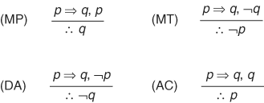{height="100"}
:::

**Modus ponens (MP)**

```{r}
expand_grid(p = c(TRUE, FALSE), q = c(TRUE, FALSE)) %>%
  mutate(
    E = (!p | q) & p,
    H = q    
  ) %>% 
  filter(E) %>%
  summarize(`P(H | E)` = mean(H))
```

## Valid and invalid deductive arguments as inductive arguments

::: text-align-center
{height="100"}
:::

**Modus tollens (MT)**

```{r}
expand_grid(p = c(TRUE, FALSE), q = c(TRUE, FALSE)) %>%
  mutate(
    E = (!p | q) & !q,
    H = !p    
  ) %>% 
  filter(E) %>%
  summarize(`P(H | E)` = mean(H))
```

## Valid and invalid deductive arguments as inductive arguments

::: text-align-center
{height="100"}
:::

**Denying the antecedent (DA)**

```{r}
expand_grid(p = c(TRUE, FALSE), q = c(TRUE, FALSE)) %>%
  mutate(
    E = (!p | q) & !p,
    H = !q    
  ) %>% 
  filter(E) %>%
  summarize(`P(H | E)` = mean(H))
```

## Valid and invalid deductive arguments as inductive arguments

::: text-align-center
{height="100"}
:::

**Affirming the consequent (AC)**

```{r}
expand_grid(p = c(TRUE, FALSE), q = c(TRUE, FALSE)) %>%
  mutate(
    E = (!p | q) & q,
    H = p    
  ) %>% 
  filter(E) %>%
  summarize(`P(H | E)` = mean(H))
```

## Probability function in R

```{r}
library(tidyverse)
library(rlang)

P <- function(H, ...) {
  # Capture the hypothesis H and premises E as quosures
  H <- enquo(H)
  E <- enquos(...)

  # Extract the propositional variables from H and E
  extract_vars <- function(expr) all.vars(expr)

  # Generate all possible combinations of truth values
  generate_sample_space <- function(vars) {
    expand_grid(!!!set_names(rep(list(c(TRUE, FALSE)), length(vars)), vars))
  }

  # Combine multiple logical expressions with AND
  combine_with_and <- function(exprs) {
    if (length(exprs) > 1) {
      reduce(exprs, ~ expr(!!..1 & !!..2))
    } else {
      exprs[[1]]
    }
  }

  # Extract all variables from H and E
  vars <- unique(c(extract_vars(H), if (length(E) > 0) extract_vars(combine_with_and(E))))

  # Generate the sample space
  S <- generate_sample_space(vars)

  # Evaluate and filter the sample space based on premises E
  if (length(E) > 0) {
    E_condition <- combine_with_and(E)
    S <- S %>% filter(eval_tidy(E_condition, data = S))
  }

  # Filter based on hypothesis H and calculate the probability of H given E
  H_condition <- H
  P_H_given_E <- S %>% filter(eval_tidy(H_condition, data = S)) %>% nrow() / nrow(S)

  return(P_H_given_E)
}
```

## Probability function in R

```{r}
#| output-location: slide
run_probability_function_tests <- function() {
  cat("Running probability function tests\n")
  
  # Test 01: Simple OR operation, expecting probability 0.75
  # A OR B
  expected1 <- 0.75
  result1 <- P(A | B)
  cat("Test  1 - Expected:", expected1, "Result:", result1, "\n")

  # Test 02: AND operation with a single string premise, expecting probability 0.3333
  # A OR B
  # -------
  # A AND B
  expected2 <- 0.3333
  result2 <- P(A & B, A | B)
  cat("Test  2 - Expected:", expected2, "Result:", result2, "\n")

  # Test 3: Implication with no premises, expecting probability 0.75
  # A => B
  expected3 <- 0.75
  result3 <- P(!A | B)
  cat("Test  3 - Expected:", expected3, "Result:", result3, "\n")

  # Test 4: Complex premise with a vector of strings, expecting probability 1
  # A AND (B OR C)
  # --------------
  # A OR B
  expected4 <- 1
  result4 <- P(A | B, A & (B | C))
  cat("Test  4 - Expected:", expected4, "Result:", result4, "\n")

  # Test 5: Complex premise with negation as a vector, expecting probability 0.5
  # A OR B
  # NOT (A AND B)
  # -----------
  # A AND NOT B
  expected5 <- 0.5
  result5 <- P(A & !B, A | B, !(A & B))
  cat("Test  5 - Expected:", expected5, "Result:", result5, "\n")

  # Test 6: Complex logical relationships with a vector, expecting probability 0.75
  # B1 OR B2 OR B3 OR W
  # NOT (B1 AND W)
  # NOT (B2 AND W)
  # NOT (B3 AND W)
  # NOT (B1 AND B2)
  # NOT (B1 AND B3)
  # NOT (B2 AND B3)
  # -------------------
  # B1 OR B2 OR B3
  expected6 <- 0.75
  result6 <- P(B1 | B2 | B3, B1 | B2 | B3 | W, !(B1 & W), !(B2 & W), !(B3 & W), !(B1 & B2), !(B1 & B3), !(B2 & B3))
  cat("Test  6 - Expected:", expected6, "Result:", result6, "\n")

  # Test 7: Modus Ponens (valid)
  expected7 <- 1
  result7 <- P(q, !p | q, p)
  cat("Test  7 (Modus Ponens) - Expected:", expected7, "Result:", result7, "\n")

  # Test 8: Modus Tollens (valid)
  expected8 <- 1
  result8 <- P(!p, !p | q, !q)
  cat("Test  8 (Modus Tollens) - Expected:", expected8, "Result:", result8, "\n")

  # Test 9: Affirming the Consequent (invalid)
  expected9 <- 0.5
  result9 <- P(p, !p | q, q)
  cat("Test  9 (Affirming the Consequent) - Expected:", expected9, "Result:", result9, "\n")

  # Test 10: Denying the Antecedent (invalid)
  expected10 <- 0.5
  result10 <- P(!q, !p | q, !p)
  cat("Test 10 (Denying the Antecedent) - Expected:", expected10, "Result:", result10, "\n")

  # Test 11: Valid chain argument (Transitivity)
  expected11 <- 1
  result11 <- P(r, !p | q, !q | r, p)
  cat("Test 11 (Transitivity) - Expected:", expected11, "Result:", result11, "\n")

  # Test 12: Invalid chain argument (Broken chain)
  expected12 <- 0.6667  # Corrected from 0.5 to 2/3
  result12 <- P(r, !p | q, !s | r, p)
  cat("Test 12 (Broken Chain) - Expected:", expected12, "Result:", result12, "\n")

  # Test 13: Double negation (valid)
  expected13 <- 1
  result13 <- P(p, !(!p))
  cat("Test 13 (Double Negation) - Expected:", expected13, "Result:", result13, "\n")

  # Test 14: Contradiction (invalid)
  expected14 <- NaN
  result14 <- P(p, !p, p)
  cat("Test 14 (Contradiction) - Expected:", expected14, "Result:", result14, "\n")
}

# Run the probability function tests
run_probability_function_tests()
```
