```{r}
#| include: false
library(tidyverse)
library(ggridges)
library(coursekata)
library(latex2exp)

cmdstanr::check_cmdstan_toolchain(fix = TRUE, quiet = TRUE)
cmdstanr::register_knitr_engine(override = FALSE)
# options(mc.cores = parallel::detectCores())

theme_set(theme_minimal())
set.seed(123)
```

##  {background-image="images/last_week_tonight.jpg" background-size="contain"}

## Take homes from last week

-   Statistical models

-   Bayesian inference: a simple example (globe tossing)

## Statistical inference

-   Statistical inference is the process of using facts we know (the data) to learn about facts we don't know (the DGP)

::: fragment
$$
\begin{array}{ll}
1. & \text{data (measurements of observables)} \\
2. & \text{model of the DGP} \\
\hline
\therefore & \text{unknown quantities} \\
\end{array}
$$
:::

::: notes
Inference is the process of using facts we know to learn about facts we do not know. A theory of inference gives assumptions necessary to get from the former to the latter, along with a definition for and summary of the resulting uncertainty. Any one theory of inference is neither right nor wrong, but merely an axiom that may or may not be useful. http://tinyurl.com/y3v8nfwh
:::

## Statistical inference

::: nonincremental
-   Statistical inference is the process of using facts we know (the data) to learn about facts we don't know (the DGP)
:::

$$
\begin{array}{ll}
1. & \{ x_1, x_2, \ldots, x_n \} \\
2. & p(x \mid M) \\
\hline
\therefore & \text{unknown quantities} \\
\end{array}
$$

## Statistical inference

::: nonincremental
-   Statistical inference is the process of using facts we know (the data) to learn about facts we don't know (the DGP)
:::

$$
\begin{array}{ll}
1. & \{ (x_1, y_1), (x_2, y_2), \ldots, (x_n, y_n) \} \\
2. & p(x, y \mid M) \\
\hline
\therefore & \text{unknown quantities} \\
\end{array}
$$

## From spreading Nutella to modeling the DGP

{fig-align="center" height="250"}

-   Imagine the toast as the sample space of all possible $(x, y)$ outcomes

-   Imagine spreading 1 Kg of Nutella (the total probability mass) on the toast

-   Imagine the way the Nutella is spread on the toast as the probability distribution/statistical model

-   The probability mass (or density) function $p(x, y \mid M)$ is a map of how thickly Nutella is spread on the toast—it shows the local mass (or density, $p$) of Nutella at each square (or point) $(x, y)$, according to the spreading instructions (model assumptions, $M$)

## From spreading Nutella to modeling the DGP

$$p(x, y \mid M)$$

-   Once we have the probability distribution, we can:

    -   **Infer**: reason under uncertainty, i.e., calculate the probability of any proposition/event and estimate unknown quantities of interest

    -   **Predict**: sample from it to generate data in accordance with the model

    -   **Explain**: estimate causal effects (when combined with a causal model)

    -   **Decide**: act under uncertainty (when combined with a decision model)

::: notes
A decision model outlines how uncertain outcomes relate to costs and benefits, enabling choices based on expected value/utility
:::

## Helper functions

```{r}
#| output: false
#| echo: false
library(coursekata)

theme_set(theme_minimal())

set.seed(666)
```

```{r}
#| output-location: default
# discretized and reparameterized probability density functions
ddunif <- function(x, location = 0, scale = 1) dunif(x, location - scale, location + scale) / sum(dunif(x, location - scale, location + scale))

ddnorm <- function(x, location = 0, scale = 1) dnorm(x, location, scale) / sum(dnorm(x, location, scale))

ddcauchy <- function(x, location = 0, scale = 1) dcauchy(x, location, scale) / sum(dcauchy(x, location, scale))

# plot model helper
plot_model <- function(df, n = NULL) {
  # df is expected to have X, Y, and p columns
  
  # count total number of cells
  n_cells <- nrow(df) 
  
  # decide style based on total number of cells
  if (n_cells < 100) {
    line_color  <- "black"
    line_width  <- 0.5
    text_size   <- 3
  } else if (n_cells < 200) {
    line_color  <- "black"
    line_width  <- 0.3
    text_size   <- 2
  } else if (n_cells < 500) {
    line_color  <- "black"
    line_width  <- 0.2
    text_size   <- NA
  } else {
    line_color  <- NA
    line_width  <- 0
    text_size   <- NA
  }
  
  # if samples are requested, do not add text labels
  if (!is.null(n)) {
    text_size <- NA
  }
  
  # count number of distinct X and Y values for axis text sizing
  n_x <- length(unique(df$X))
  n_y <- length(unique(df$Y))
  
  axis_text_x_size <- if(n_x < 10) { 12 } else if(n_x < 20) { 10 } else if(n_x < 40) { 8 } else { 6 }
  axis_text_y_size <- if(n_y < 10) { 12 } else if(n_y < 20) { 10 } else if(n_y < 40) { 8 } else { 6 }
  
  max_x <- max(df$X)
  max_y <- max(df$Y)
  
  # determine the fill scale parameters based on n_cells:
  # dor small grids, the range of p is set higher (midpoint and limit are larger)
  # dor larger grids, the scale is "compressed" to better reflect small p values.
  if (n_cells < 100) {
    mid_val   <- 0.25
    limit_val <- 1
  } else if (n_cells < 200) {
    mid_val   <- 0.125
    limit_val <- 0.5
  } else if (n_cells < 500) {
    mid_val   <- 0.0625
    limit_val <- 0.25
  } else {
    mid_val   <- 0.03125
    limit_val <- 0.125
  }
  
  fill_scale <- scale_fill_gradientn(
    colors = c("white", "chocolate4", "black"),
    values = c(0, mid_val, 1),
    limits = c(0, limit_val),
    oob = scales::squish
  )
  
  x_scale <- scale_x_continuous(breaks = seq(0, max_x))
  y_scale <- scale_y_continuous(breaks = seq(0, max_y))
  base_theme <- theme(
    panel.grid.major = element_blank(),
    panel.grid.minor = element_blank(),
    axis.text.x = element_text(size = axis_text_x_size, margin = margin(t = 2, b = 0)),
    axis.text.y = element_text(size = axis_text_y_size, margin = margin(r = 2, l = 0))
  )
  
  # visualize probability distribution as a tile plot
  plt <- gf_tile(
    Y ~ X,
    data = df,
    fill = ~ p,
    color = line_color,
    linewidth = line_width) %>%
    gf_refine(
      fill_scale,
      x_scale,
      y_scale,
      base_theme) +
    expand_limits(x = c(0, max_x), y = c(0, max_y)) +
    coord_fixed(expand = FALSE)
  
  # optionally add text labels if text_size is applicable
  if (!is.na(text_size)) {
    plt <- plt %>% gf_text(label = ~ sprintf("%0.4f", p), size = text_size, alpha = 0.75)
  }
  
  # optionally overlay random sample points if n is provided
  if (!is.null(n)) {
    plt <- plt %>% gf_point(
      Y ~ X,
      # sample to generate data in accordance with the model
      data = df %>% slice_sample(n = n, weight_by = p, replace = TRUE), 
      size = 4,
      color = "red2",
      alpha = 0.5,
      stroke = 0
    )
  }
  
  return(plt)
}
```


## Uniform probability distribution

```{r}
ss <-
  expand_grid(
    A = c(TRUE, FALSE),
    B = c(TRUE, FALSE)) %>%
  mutate(Ω = paste0("⍵", 1:n())) %>%
  select(Ω, everything()) %>% 
  mutate(p = 1 / n()) # uniform probability distribution function

ss %>% knitr::kable()
```

## Uniform probability distribution

```{r}
#| output-location: default
ss <-
  expand_grid(
    X = c(0, 1),
    Y = c(0, 1)) %>%
  mutate(Ω = paste0("⍵", 1:n())) %>%
  select(Ω, everything()) %>% 
  mutate(p = 1 / n()) # M0

ss %>% knitr::kable()
```

## Uniform spreading of Nutella on a toast

**Small toast**

```{r}
#| fig.width: 3
#| fig.height: 3
expand_grid(X = c(0, 1), Y = c(0, 1)) %>%
  mutate(p = 1 / n()) %>%
  plot_model()
```

## Uniform spreading of Nutella on a toast

**Medium toast**

```{r}
#| fig.width: 4
#| fig.height: 4
expand_grid(X = c(0, 1, 2), Y = c(0, 1, 2)) %>%
  mutate(p = 1 / n()) %>%
  plot_model()
```

## Uniform spreading of Nutella on a toast

**Large toast**

```{r}
#| fig.width: 5
#| fig.height: 5
expand_grid(X = c(0, 1, 2, 3), Y = c(0, 1, 2, 3)) %>%
  mutate(p = 1 / n()) %>%
  plot_model()
```


## Calculate joint probability

::: columns

::: column
```{r}
#| fig.width: 5
#| fig.height: 5
#| echo: false
expand_grid(X = c(0, 1, 2, 3), Y = c(0, 1, 2, 3)) %>%
  mutate(p = 1 / n()) %>%
  plot_model()
```

:::

::: column

$$P(X = 1, Y = 3 \mid M_0)$$

::: fragment
```{r}
expand_grid(X = c(0, 1, 2, 3), Y = c(0, 1, 2, 3)) %>%
  mutate(
    p = 1 / n() # M0
  ) %>%
  filter(
    X == 1, Y == 3
  ) %>% 
  summarize(P = sum(p)) %>%
  pull(P)
```
:::

:::

:::


## Calculate marginal probability

::: columns

::: column
```{r}
#| fig.width: 5
#| fig.height: 5
#| echo: false
expand_grid(X = c(0, 1, 2, 3), Y = c(0, 1, 2, 3)) %>%
  mutate(p = 1 / n()) %>%
  plot_model()
```

:::

::: column

$$P(X = 1 \mid M_0)$$

::: fragment
```{r}
expand_grid(X = c(0, 1, 2, 3), Y = c(0, 1, 2, 3)) %>%
  mutate(
    p = 1 / n() # M0
  ) %>%
  filter(
    X == 1
  ) %>% 
  summarize(P = sum(p)) %>%
  pull(P)
```
:::

:::

:::


## Calculate marginal probability

::: columns

::: column
```{r}
#| fig.width: 5
#| fig.height: 5
#| echo: false
expand_grid(X = c(0, 1, 2, 3), Y = c(0, 1, 2, 3)) %>%
  mutate(p = 1 / n()) %>%
  plot_model()
```
:::

::: column

$$P(Y = 3 \mid M_0)$$

::: fragment
```{r}
expand_grid(X = c(0, 1, 2, 3), Y = c(0, 1, 2, 3)) %>%
  mutate(
    p = 1 / n() # M0
  ) %>%
  filter(
    Y == 3
  ) %>% 
  summarize(P = sum(p)) %>%
  pull(P)
```
:::

:::

:::

## Calculate conditional probability

::: columns

::: column
```{r}
#| fig.width: 5
#| fig.height: 5
#| echo: false
expand_grid(X = c(0, 1, 2, 3), Y = c(0, 1, 2, 3)) %>%
  mutate(p = 1 / n()) %>%
  plot_model()
```
:::

::: column

$$P(Y = 3 \mid X = 1, M_0)$$

::: fragment
```{r}
#| eval: false
#| output-location: default
expand_grid(X = c(0, 1, 2, 3), Y = c(0, 1, 2, 3)) %>%
  mutate(
    p = 1 / n() # M0
  )
```
:::

:::

:::

## Calculate conditional probability

::: columns

::: column
```{r}
#| fig.width: 5
#| fig.height: 5
#| echo: false
expand_grid(X = c(0, 1, 2, 3), Y = c(0, 1, 2, 3)) %>%
  mutate(p = 1 / n()) %>%
  plot_model()
```
:::

::: column

$$P(Y = 3 \mid X = 1, M_0)$$

```{r}
#| eval: false
#| output-location: default
expand_grid(X = c(0, 1, 2, 3), Y = c(0, 1, 2, 3)) %>%
  mutate(
    p = 1 / n() # M0
  ) %>% 
  mutate(
    X1 = (X == 1)
  )
```

:::

:::

## Calculate conditional probability

::: columns

::: column
```{r}
#| fig.width: 5
#| fig.height: 5
#| echo: false
expand_grid(X = c(0, 1, 2, 3), Y = c(0, 1, 2, 3)) %>%
  mutate(p = 1 / n()) %>%
  mutate(
    X1 = (X == 1)
  ) %>% 
  mutate(p = if_else(X1, p / sum(p[X1]), 0)) %>% 
  plot_model()
```
:::

::: column

$$P(Y = 3 \mid X = 1, M_0)$$

```{r}
#| eval: false
#| output-location: default
expand_grid(X = c(0, 1, 2, 3), Y = c(0, 1, 2, 3)) %>%
  mutate(
    p = 1 / n() # M0
  ) %>%
  mutate(
    X1 = (X == 1)
  ) %>% 
  mutate(
    p = if_else(X1, p / sum(p[X1]), 0)
  )
```

:::

:::


## Calculate conditional probability

::: columns

::: column
```{r}
#| fig.width: 5
#| fig.height: 5
#| echo: false
expand_grid(X = c(0, 1, 2, 3), Y = c(0, 1, 2, 3)) %>%
  mutate(p = 1 / n()) %>%
  mutate(
    X1 = (X == 1)
  ) %>% 
  mutate(p = if_else(X1, p / sum(p[X1]), 0)) %>% 
  plot_model()
```
:::

::: column

$$P(Y = 3 \mid X = 1, M_0)$$

```{r}
expand_grid(X = c(0, 1, 2, 3), Y = c(0, 1, 2, 3)) %>%
  mutate(
    p = 1 / n() # M0
  ) %>%
  mutate(
    X1 = (X == 1)
  ) %>% 
  mutate(
    p = if_else(X1, p / sum(p[X1]), 0)
  ) %>% 
  filter(
    Y == 3
  ) %>%
  summarize(P = sum(p)) %>%
  pull(P)
```

:::

:::


## Uniform model

::: columns

::: column

$p(X = x, Y = y \mid M_0)$

```{r}
#| fig.width: 5
#| fig.height: 5
#| eval: false
#| output-location: default
#

expand_grid(X = seq(0, 10), Y = seq(0, 10)) %>%
  mutate(
    p = 1 / n()) %>% # M0
  plot_model()
```

:::

::: column

```{r}
#| fig.width: 5
#| fig.height: 5
#| echo: false
#| output-location: default
#

expand_grid(X = seq(0, 10), Y = seq(0, 10)) %>%
  mutate(
    p = 1 / n()) %>% # M0
  plot_model()
```
:::

:::

## Uniform model

::: columns

::: column

$p(x, y)$

```{r}
#| fig.width: 5
#| fig.height: 5
#| eval: false
#| output-location: default
#

expand_grid(X = seq(0, 10), Y = seq(0, 10)) %>%
  mutate(
    p = 1 / n()) %>% # M0
  plot_model()
```

:::

::: column

```{r}
#| fig.width: 5
#| fig.height: 5
#| echo: false
#| output-location: default
#

expand_grid(X = seq(0, 10), Y = seq(0, 10)) %>%
  mutate(
    p = 1 / n()) %>% # M0
  plot_model()
```
:::

:::

## Linear model with no error

```{r}
#| output: false
#| echo: false
sample.size <- 50
grid.size <- 10

b0 <- 3
b1 <- 1
s  <- 1
e  <- seq(-s, s)
```

::: columns

::: column

$p(x, y \mid M_1)$

```{r}
#| fig.width: 5
#| fig.height: 5
#| eval: false
#| output-location: default
b0 <- 3; b1 <- 1

expand_grid(X = seq(0, 10), Y = seq(0, 10)) %>%
  mutate(
    p = 1 / n()) %>% # M0
  rowwise() %>% 
  mutate(
    M1 = (Y == b0 + b1 * X)) %>% 
  ungroup() %>%
  mutate(p = if_else(M1, p / sum(p[M1]), 0)) %>%
  plot_model()
```

:::

::: column

```{r}
#| fig.width: 5
#| fig.height: 5
#| echo: false
#| output-location: default
b0 <- 3; b1 <- 1

expand_grid(X = seq(0, 10), Y = seq(0, 10)) %>%
  mutate(
    p = 1 / n()) %>% # M0
  rowwise() %>% 
  mutate(
    M1 = (Y == b0 + b1 * X)) %>% 
  ungroup() %>%
  mutate(p = if_else(M1, p / sum(p[M1]), 0)) %>%
  plot_model()
```
:::

:::


## Linear model with uniform error

::: columns

::: column

$p(x, y \mid M_2)$

```{r}
#| fig.width: 5
#| fig.height: 5
#| eval: false
#| output-location: default
b0 <- 3; b1 <- 1; s <- 1

expand_grid(X = seq(0, 10), Y = seq(0, 10)) %>%
  mutate(
    p = 1 / n()) %>% # M0
  rowwise() %>% 
  mutate(
    M2 = Y %in% (b0 + b1 * X + seq(-s, s))) %>% 
  ungroup() %>%
  mutate(p = if_else(M2, p / sum(p[M2]), 0)) %>%
  plot_model()
```

:::

::: column

```{r}
#| fig.width: 5
#| fig.height: 5
#| echo: false
#| output-location: default
b0 <- 3; b1 <- 1; s <- 1

expand_grid(X = seq(0, 10), Y = seq(0, 10)) %>%
  mutate(
    p = 1 / n()) %>% # M0
  rowwise() %>% 
  mutate(
    M2 = Y %in% (b0 + b1 * X + seq(-s, s))) %>% 
  ungroup() %>%
  mutate(p = if_else(M2, p / sum(p[M2]), 0)) %>%
  plot_model()
```
:::

:::


## Linear model with uniform error

::: columns

::: column

$p(x, y \mid M_2)$

```{r}
#| fig.width: 5
#| fig.height: 5
#| eval: false
#| output-location: default
b0 <- 3; b1 <- 1; s <- 1

expand_grid(X = seq(0, 10), Y = seq(0, 10)) %>%
  mutate(
    p = ddunif(Y, location = (b0 + b1 * X), scale = s)) %>% # M0, M2
  plot_model()
```

:::

::: column

```{r}
#| fig.width: 5
#| fig.height: 5
#| echo: false
#| output-location: default
b0 <- 3; b1 <- 1; s <- 1

expand_grid(X = seq(0, 10), Y = seq(0, 10)) %>%
  mutate(
    p = ddunif(Y, location = (b0 + b1 * X), scale = s)) %>% # M0, M2
  plot_model()
```
:::

:::


## Linear model with normal (Gaussian) error

::: columns

::: column

$p(x, y \mid M_3)$

```{r}
#| fig.width: 5
#| fig.height: 5
#| eval: false
#| output-location: default
b0 <- 3; b1 <- 1; s <- 1

expand_grid(X = seq(0, 10), Y = seq(0, 10)) %>%
  mutate(
    p = ddnorm(Y, location = (b0 + b1 * X), scale = s)) %>% # M0, M3
  plot_model()
```

:::

::: column

```{r}
#| fig.width: 5
#| fig.height: 5
#| echo: false
#| output-location: default
b0 <- 3; b1 <- 1; s <- 1

expand_grid(X = seq(0, 10), Y = seq(0, 10)) %>%
  mutate(
    p = ddnorm(Y, location = (b0 + b1 * X), scale = s)) %>% # M0, M3
  plot_model()
```
:::

:::

## Linear model with Cauchy error

::: columns

::: column

$p(x, y \mid M_4)$

```{r}
#| fig.width: 5
#| fig.height: 5
#| eval: false
#| output-location: default
b0 <- 3; b1 <- 1; s <- 1; e <- seq(-s, s)

expand_grid(X = seq(0, 10), Y = seq(0, 10)) %>%
  mutate(
    p = ddcauchy(Y, location = (b0 + b1 * X), scale = s)) %>% # M0, M4
  plot_model()
```

:::

::: column

```{r}
#| fig.width: 5
#| fig.height: 5
#| echo: false
#| output-location: default
b0 <- 3; b1 <- 1; s <- 1

expand_grid(X = seq(0, 10), Y = seq(0, 10)) %>%
  mutate(
    p = ddcauchy(Y, location = (b0 + b1 * X), scale = s)) %>% # M0, M4
  plot_model()
```
:::

:::


## Statistical inference

::: nonincremental
-   Statistical inference is the process of using facts we know (the data) to learn about facts we don't know (the DGP)
:::

$$
\begin{array}{ll}
1. & \{ (x_1, y_1), (x_2, y_2), \ldots, (x_n, y_n) \} \\
2. & p(x, y \mid M) \\
\hline
\therefore & \text{unknown quantities} \\
\end{array}
$$

## Statistical inference

::: nonincremental
-   Statistical inference is the process of using facts we know (the data) to learn about facts we don't know (the DGP)

-   **Data probability** (a.k.a. **likelihood**):
:::

## Statistical inference

::: nonincremental
-   Statistical inference is the process of using facts we know (the data) to learn about facts we don't know (the DGP)

-   **Data probability** (a.k.a. **likelihood**):

    -   $p(x \mid M)$ = probability distribution of the data given our knowledge of the DGP
:::

-   **Inverse probability**:

    -   $p(M \mid x)$ = probability distribution of $M$ given $x$

    -   The problem of statistical inference: It is impossible to calculate the inverse probability!

    -   The (more reasonable, limited) goal of statistical inference:

        -   Let $M = \{M^*, \theta\}$, where $M^*$ (the functional form of $M$) is assumed and $\theta$ are the parameters of $M^*$ to be learned from $x$

## Statistical inference

::: nonincremental
-   Statistical inference is the process of using facts we know (the data) to learn about facts we don't know (the DGP)

-   **Data probability** (a.k.a. **likelihood**):

    -   $p(x \mid M)$ = probability distribution of the data given our knowledge of the DGP
:::

::: nonincremental
-   **Inverse probability**:

    -   $p(M \mid x)$ = probability distribution of $M$ given $x$

    -   The problem of statistical inference: It is impossible to calculate the inverse probability!

    -   The (more reasonable, limited) goal of statistical inference:

        -   Let $M = \{M^*, \theta\}$, where $M^*$ (the functional form of $M$) is assumed and $\theta$ are the parameters of $M^*$ to be learned from $x$
:::

::: nonincremental
-   **Inferential probability** (a.k.a. **posterior**):
:::

## Statistical inference

::: nonincremental
-   Statistical inference is the process of using facts we know (the data) to learn about facts we don't know (the DGP)

-   **Data probability** (a.k.a. **likelihood**):

    -   $p(x \mid M)$ = probability distribution of the data given our knowledge of the DGP
:::

::: nonincremental
-   **Inverse probability**:

    -   $p(M \mid x)$ = probability distribution of $M$ given $x$

    -   The problem of statistical inference: It is impossible to calculate the inverse probability!

    -   The (more reasonable, limited) goal of statistical inference:

        -   Let $M = \{M^*, \theta\}$, where $M^*$ (the functional form of $M$) is assumed and $\theta$ are the parameters of $M^*$ to be learned from $x$
:::

::: nonincremental
-   **Inferential probability** (a.k.a. **posterior**):

    -   $p(\theta \mid x, M^*)$ = probability distribution of $\theta$ given $x$ and $M^*$
:::

## Statistical inference

::: nonincremental
-   Statistical inference is the process of using facts we know (the data) to learn about facts we don't know (the DGP)

-   **Data probability** (a.k.a. **likelihood**):

    -   $p(x \mid M)$ = probability distribution of the data given our knowledge of the DGP
:::

::: nonincremental
-   **Inverse probability**:

    -   $p(M \mid x)$ = probability distribution of $M$ given $x$

    -   The problem of statistical inference: It is impossible to calculate the inverse probability!

    -   The (more reasonable, limited) goal of statistical inference:

        -   Let $M = \{M^*, \theta\}$, where $M^*$ (the functional form of $M$) is assumed and $\theta$ are the parameters of $M^*$ to be learned from $x$
:::

::: nonincremental
-   **Inferential probability** (a.k.a. **posterior**):

    -   $p(\theta \mid x)$ = probability distribution of $\theta$ given $x$ and $M^*$
:::

## Bayes' theorem for statistical inference

::: text-align-center
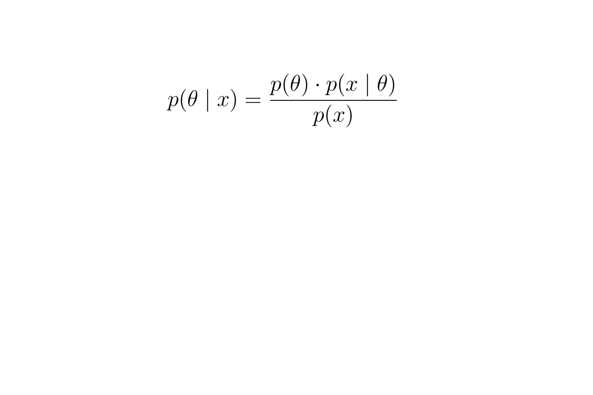
:::

## Bayes' theorem for statistical inference

::: text-align-center
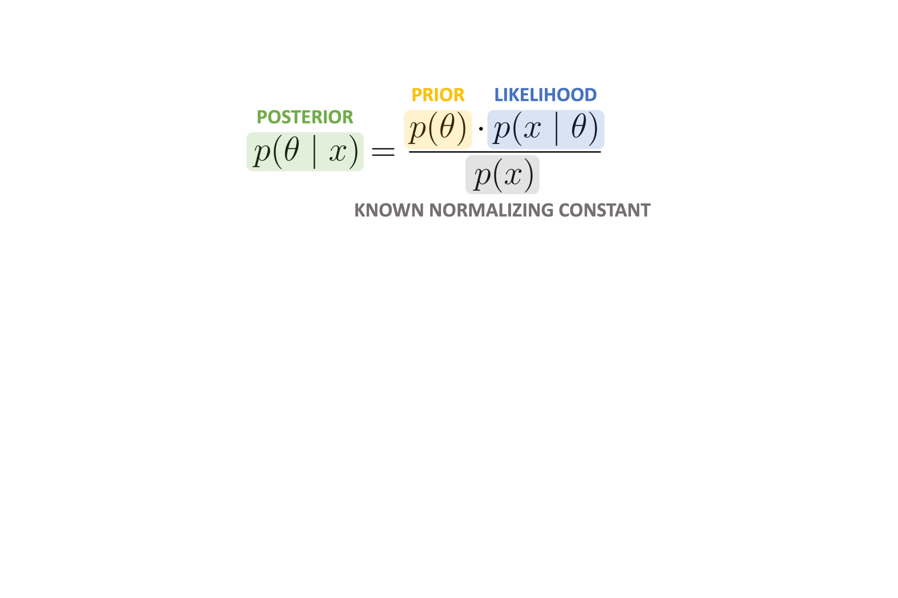
:::

## Bayes' theorem for statistical inference

::: text-align-center
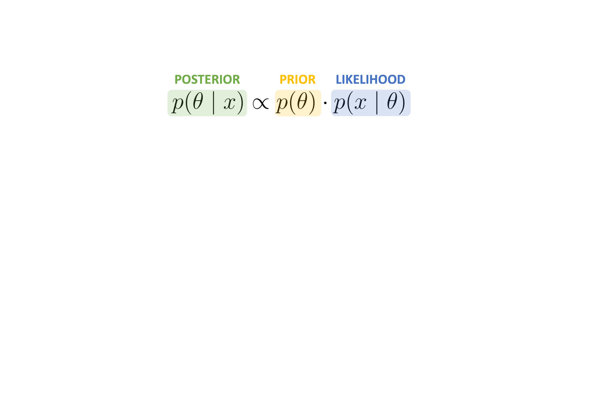
:::

## Statistical inference: globe tossing


## Science before statistics

Clearly state the **research question**


## Identify the estimand

From the *research question* to the *quantity of interest*: the **estimand**


::: notes
quantitative empirical research question
:::

## Identify the estimand

The **estimand** should be identified before statistical data analysis is performed!

::: notes
Questionable research practices: HARKing, cherry-picking, P-hacking, fishing, and data dredging or mining

<https://youtu.be/0Rnq1NpHdmw>
:::


## Identify the estimand

The **estimand** is a *quantity of interest* that is out of reach and hidden from us


## Identify the estimand

The **estimand** is the target of statistical inference


::: notes
the conclusion of an inductive argument
:::

## Collect the data

The **sampling process**: a crucial component of *study design*


## Collect the data

The **sampling process**: a crucial component of *study design*

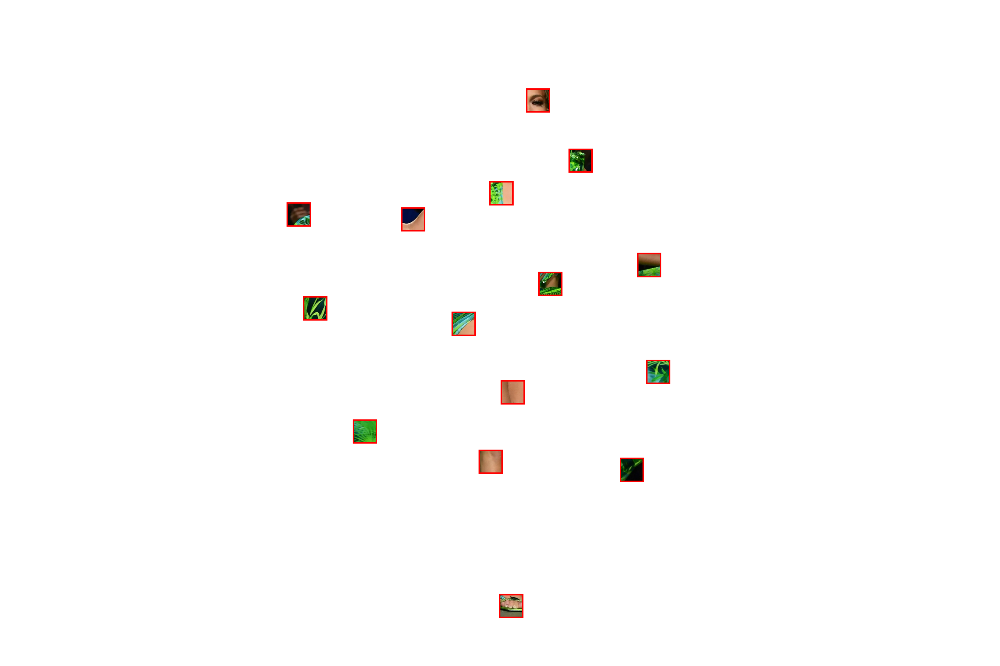

## Build a model of the data generating process

A **statistical model** (i.e., a probability distribution of one or more random variables) that captures important features of the DGP, including the *estimand* and *sampling process*


## Fit the statistical model to the data

Train the *statistical model* with the *data* using an **estimator** (i.e., an inference algorithm) in order to obtain an **estimate** of the *estimand*

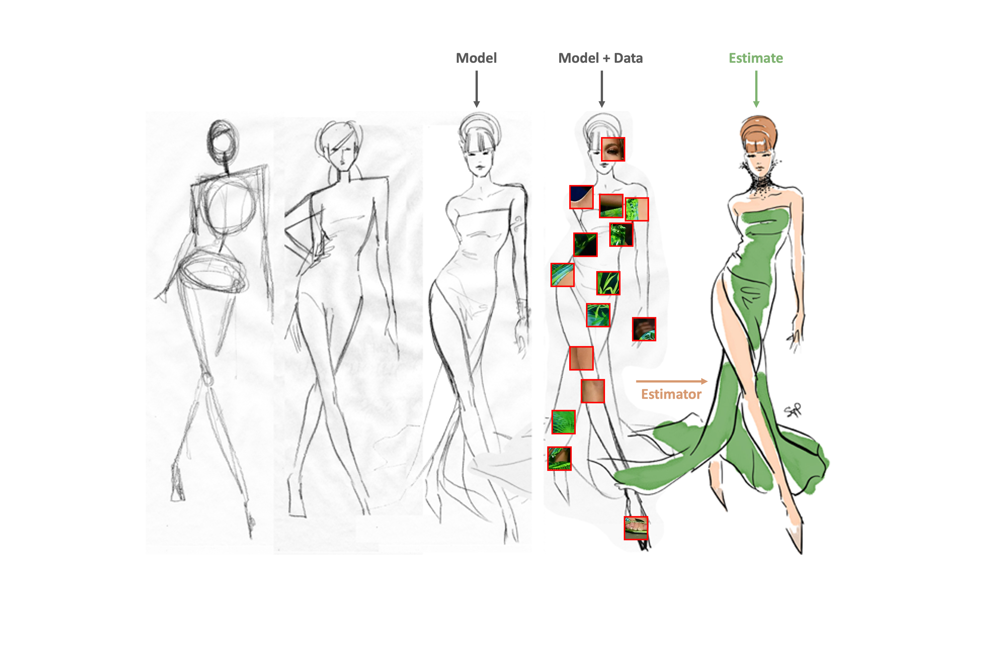

## The estimate (in an ideal world)

With a perfect model and infinite amount of data, the estimate would be the estimand


## The estimate (in reality, hopefully)

 


## The estimate (in reality, hopefully not)

 


## 


## 

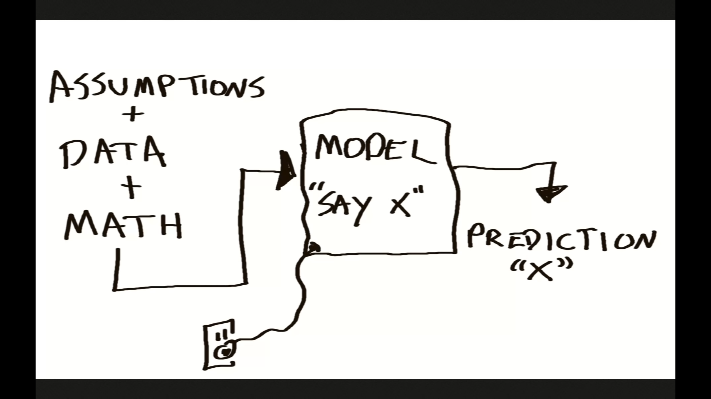

## 

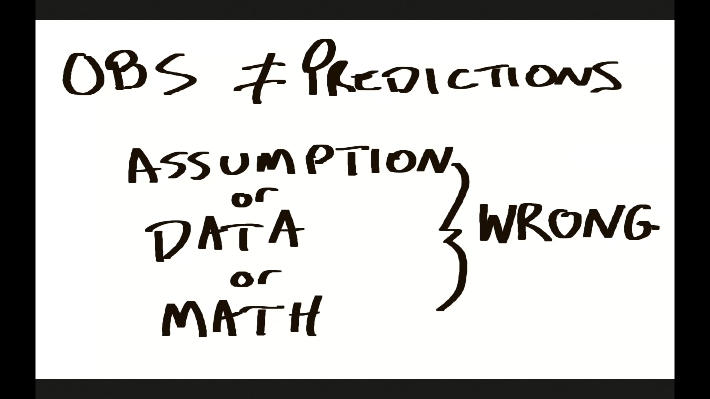

## Observations

```{r}
#| echo: false
#| fig.height: 6
datasauRus::datasaurus_dozen %>%
  filter(dataset != "slant_down") %>%
  gf_point(y ~ x, colour = ~ dataset, alpha = 0.5) +
  coord_fixed(expand = FALSE) +
  theme_void() +
  theme(legend.position = "none", strip.text = element_blank()) +
  facet_wrap(~ dataset, ncol = 4, nrow = 3)
```

## Model, say "line"!

```{r}
#| echo: false
#| fig.height: 6
datasauRus::datasaurus_dozen %>%
  filter(dataset != "slant_down") %>%
  gf_point(y ~ x, colour = ~ dataset, alpha = 0.5) +
  coord_fixed(expand = FALSE) +
  theme_void() +
  theme(legend.position = "none", strip.text = element_blank()) +
  facet_wrap(~ dataset, ncol = 4, nrow = 3)
```

## Predictions

```{r}
#| echo: false
#| output-location: default
#| fig.height: 6
datasauRus::datasaurus_dozen %>%
  filter(dataset != "slant_down") %>%
  gf_point(y ~ x, colour = ~ dataset, alpha = 0.05) %>%
  gf_lm(se = FALSE) +
  coord_fixed(expand = FALSE) +
  theme_void() +
  theme(legend.position = "none", strip.text = element_blank()) +
  facet_wrap(~ dataset, ncol = 4, nrow = 3)
```

## Estimand, estimator, and estimate

:::::: columns
::: {.column width="70%"}
-   **Estimand** ([what you want]{style="color: orangered"})

    -   Quantity of interest (QOI) that cannot be deduced with certainty (*inductive argument*)

-   **Estimator** ([how you get it]{style="color: orangered"})

    -   Statistical procedure used to infer value of estimand from the data and statistical model

-   **Estimate** ([what you get]{style="color: orangered"})

    -   Inferred value of estimand, with measure of uncertainty

-   The data and statistical model are the *premises* (evidence/assumptions) of the inductive argument

-   The estimate is the uncertain *conclusion* (hypothesis/assertion) of the inductive argument

-   The estimator is the *inference rule* for strong inductive reasoning
:::

:::: {.column width="30%"}
::: {.fragment .text-align-right}

:::
::::
::::::

::: notes
-   estimand = conclusion/hypothesis
-   data and probability model of the DGP = premises/evidence/assumptions
:::

## Statistical inference workflow

1.  **State** the scientific question (often qualitative, but must be clearly defined)

2.  **Identify** the estimand/quantity of interest (QOI), [given question]{style="color: orangered"}

3.  **Collect** the data, [given estimand, question]{style="color: orangered"}

4.  **Build** a probability model of the DGP to capture important features of the estimand and sampling process, [given data, estimand, question]{style="color: orangered"}

5.  **Test** the statistical model (e.g., with simulated data, sensitivity analysis, prior predictive checking), [given model, data, estimand, question]{style="color: orangered"}

6.  **Fit** the statistical model to the data using an estimator to obtain an estimate of the estimand, [given estimator, model, data, estimand, question]{style="color: orangered"}

7.  **Evaluate** the estimate/fitted model with the collected data (e.g., cross-validation, residual analysis, posterior predictive checking), [given estimate, estimator, model, data, estimand, question]{style="color: orangered"}

8.  **Replicate** (compare predictions of fitted model with new data), [given all of the above]{style="color: orangered"}

9.  **Report** [all of the above]{style="color: orangered"} in an open and reproducible manner

## Bayesian vs. frequentist theories of inference

-   **Bayesian inference**
    -   **Belief-type probabilities**: applicable to both data and parameters
    -   **Estimator**: Bayes' theorem
    -   **Estimate**: Posterior probability distribution
-   **Likelihood inference**[@Royall2023]
    -   **Frequency-type probabilities**: only applicable to data (random samples)
    -   **Estimator**: Likelihood function
    -   **Estimate**: MLE (point estimate) with confidence interval
-   **Null-hypothesis significance testing (NHST)**[@Perezgonzalez2015]
    -   **Frequency-type probabilities**: only applicable to data (random samples)
    -   A monstrosity born out of the unholy marriage of:
        -   [Fisher's significance testing](https://en.wikipedia.org/wiki/Statistical_significance): A statistical tool, [not a theory of inference!]{.underline}
        -   [Neyman-Pearson hypothesis testing](https://en.wikipedia.org/wiki/Statistical_hypothesis_test): A decision theory, [not a theory of inference!]{.underline}

## Definition of a statistical inference problem {visibility="hidden"}

-   A problem where you have to **estimate unknown variables from known variables** (given some prior knowledge of how these two sets of variables are related to one another)

    -   **known variables** are sometimes called **observed variables**

    -   **unknown variables** are sometimes called **unobserved variables** (a.k.a latent or hidden variables)

-   The solution to any statistical inference problem is a probability distribution

-   The probability of the unobserved variables ($u$) given the observed variables ($o$)

    -   $p(u \mid o)$

    -   $u = \theta$ \[parameters of $M^*$, the functional form of $M$ (the probability model of the DGP)\]

    -   $o = x$ \[data\]

    -   $p(\theta \mid x)$ \[inferential probability\]

## Bayes' theorem: The rule of statistical inference

 

::: text-align-center

:::

## Bayes' theorem: The rule of statistical inference

**Bayesian interpretation**: data are fixed, parameters are random

::: text-align-center

:::

## Bayes' theorem: The rule of statistical inference

**Bayesian interpretation**: data are fixed, parameters are random

::: text-align-center

:::

## Bayes' theorem: The rule of statistical inference

**Bayesian interpretation**: data are fixed, parameters are random

::: text-align-center
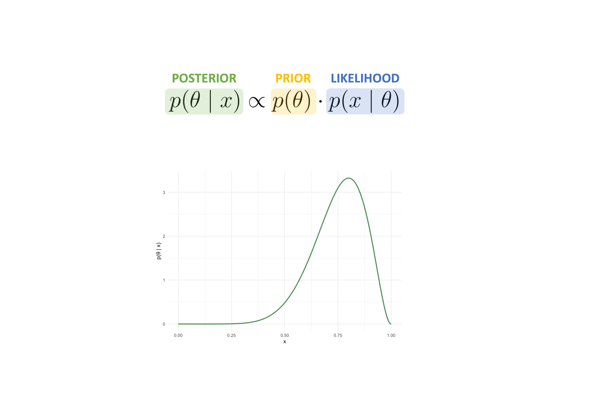
:::

## Bayes' theorem: The rule of statistical inference

 

::: text-align-center

:::

## Bayes' theorem: The rule of statistical inference

**Frequentist interpretation**: data are random, parameters are fixed

::: text-align-center

:::

## Bayes' theorem: The rule of statistical inference

**Frequentist interpretation**: data are random, parameters are fixed

::: text-align-center
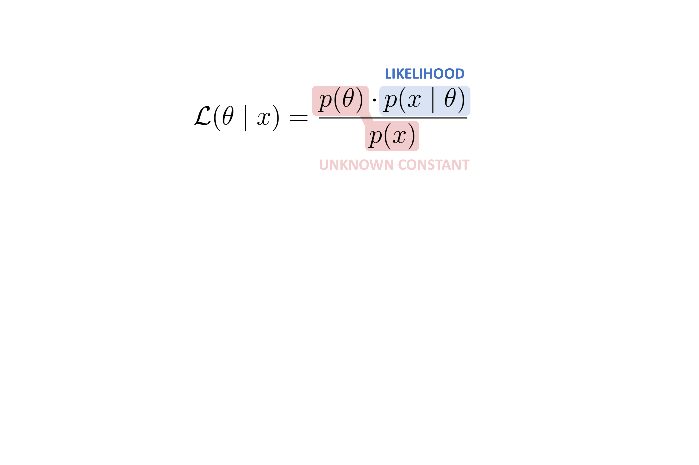
:::

## Bayes' theorem: The rule of statistical inference

**Frequentist interpretation**: data are random, parameters are fixed

::: text-align-center

:::

## Bayes' theorem: The rule of statistical inference

**Frequentist interpretation**: data are random, parameters are fixed

::: text-align-center

:::

## Bayes' theorem: The rule of statistical inference

**Frequentist interpretation**: data are random, parameters are fixed

::: text-align-center
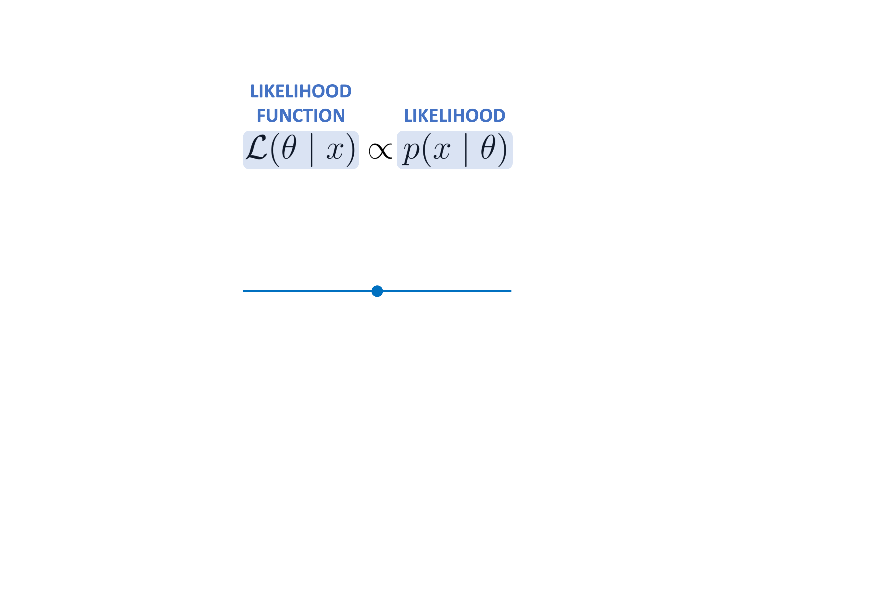
:::

## Bayes' theorem: The rule of statistical inference

**Frequentist interpretation**: data are random, parameters are fixed

::: text-align-center
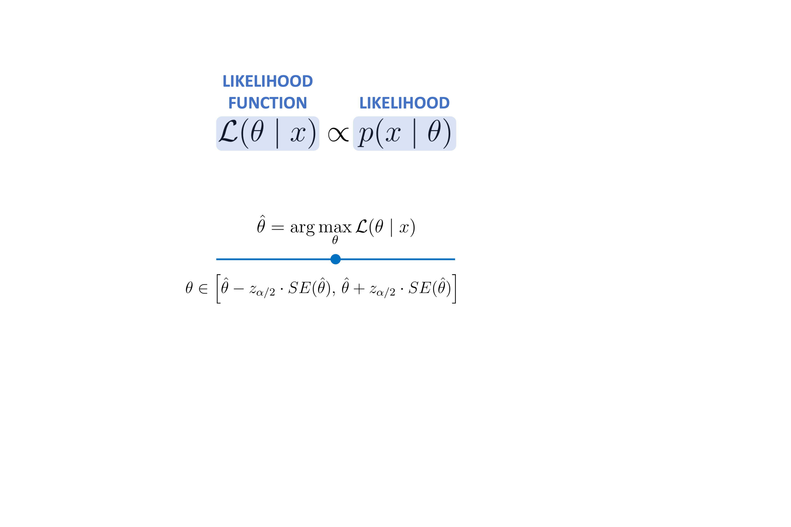
:::

::: notes
$$
\text{MLE: } \hat{\theta} = \arg\max_{\theta} \mathcal{L}(\theta \mid x)
$$

$$
\text{CI: } \theta \in \left[\hat{\theta} - z_{\alpha/2} \cdot SE(\hat{\theta}), \, \hat{\theta} + z_{\alpha/2} \cdot SE(\hat{\theta})\right]
$$
:::

## Statistical inference: Globe tossing experiment


## Estimand

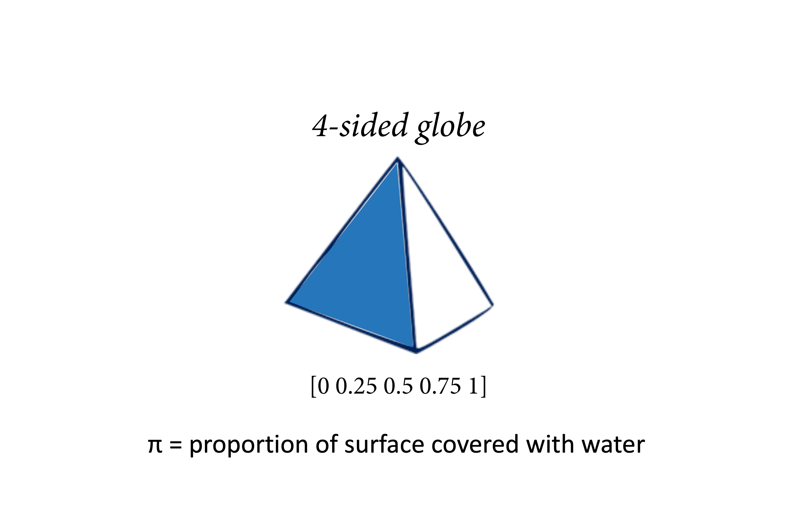

## Sampling


## Data

::::: columns
::: {.column width="60%"}
{height="550"}
:::

::: {.column width="40%"}
-   8 water, 2 land
-   $x = 8$
-   $n = 10$
:::
:::::

## Model: Likelihood and prior

[**Likelihood**: probability distribution of the data $x$ given a model of the DGP $\{ M^*, \theta \}$]{.fragment}

-   $p(X = x \mid \pi, n, M^{\text{Binomial}}) = \binom{n}{k}\pi^k(1-\pi)^{n-k}$

-   $p(x \mid \pi, n)$

::: fragment
```{r}
#| eval: false
#| output-location: default
dbinom(x, prob = π, size = n)
```
:::

::: fragment
$$
x \sim \text{Binomial}(\pi, n)
$$
:::

[**Prior**: probability distribution of $\theta$ before conditioning on the data]{.fragment}

-   $p(\Pi = \pi \mid \alpha, \beta, M^{\text{Beta}}) = \frac{\pi^{\alpha-1}(1-\pi)^{\beta-1}}{B(\alpha, \beta)}$

-   $p(\pi \mid \alpha, \beta)$

::: fragment
```{r}
#| eval: false
#| output-location: default
dbeta(π, shape1 = α, shape2 = β)
```
:::

::: fragment
$$
\pi \sim \text{Beta}(\alpha, \beta)
$$
:::

## Estimate: Posterior

[**Posterior**: probability distribution of $\theta$ after conditioning on the data]{.fragment}

-   $p(\pi \mid x, n, \alpha, \beta) \propto p(\pi \mid \alpha, \beta) \cdot p(x \mid \pi, n)$

::: fragment
```{r}
#| output-location: default
π <- c(0, 0.25, 0.5, 0.75, 1) # all possible values of π (estimand) for a four-sided globe
α <- 1; β <- 1                # parameters of the beta prior distribution (hyper-parameters)
x <- 8; n <- 10               # data
```
:::

::: fragment
```{r}
#| output-location: default
likelihood <- dbinom(x, prob = π, size = n)
```
:::

::: fragment
```{r}
#| output-location: default
prior <- dbeta(π, shape1 = α, shape2 = β)
```
:::

::: fragment
```{r}
#| output-location: default
posterior <- prior * likelihood # unnormalized posterior
```
:::

::: fragment
```{r}
#| output-location: default
posterior <- posterior / sum(posterior) # normalize posterior
```
:::

::: fragment
```{r}
df <- tibble(π, prior, likelihood, posterior)
df
```
:::

## Estimate: Posterior {visibility="hidden"}

```{r}
#| include: false
globe_tossing_grid_approx <- function(w, l, a = 1, b = 1, dprior = dbeta, grid_size = 1000) {
  # create grid of proportion of water values
  prop_w.grid <- seq(from = 0, to = 1, length.out = grid_size + 1)
  
  # calculate prior (and normalize for plotting)
  prior <- dprior(prop_w.grid, a, b)
  prior.normalized <- prior / sum(prior)
  
  # calculate likelihood (and normalize for plotting)
  likelihood <- dbinom(w, size = w+l, prob = prop_w.grid)
  likelihood.normalized <- likelihood / sum(likelihood)
  
  # calculate Maximum Likelihood Estimate (MLE)
  mle <- prop_w.grid[which.max(likelihood.normalized)]
  
  # calculate posterior and normalize
  posterior.unnormalized <- prior * likelihood
  posterior <- posterior.unnormalized / sum(posterior.unnormalized)
  
  # calculate MAP estimate
  map <- prop_w.grid[which.max(posterior)]
  
  df <- tibble(prop_w.grid, prior.normalized, likelihood.normalized, posterior)
  
  # plot prior, likelihood, and posterior
  if (grid_size <= 20) {
    df %>%
      gf_point(likelihood.normalized ~ prop_w.grid, alpha = 1, color = "#357EC7") %>%
      gf_point(prior.normalized ~ prop_w.grid, alpha = 1, color = "#FFA500") %>%
      gf_point(posterior ~ prop_w.grid, alpha = 1, color = "#4E9258") %>%
      gf_segment(x = ~prop_w.grid, xend = ~prop_w.grid, y = 0, yend = ~likelihood.normalized, linewidth = 0.5, color = "#357EC7") %>%
      gf_segment(x = ~prop_w.grid, xend = ~prop_w.grid, y = 0, yend = ~prior.normalized, linewidth = 0.5, color = "#FFA500") %>%
      gf_segment(x = ~prop_w.grid, xend = ~prop_w.grid, y = 0, yend = ~posterior, linewidth = 0.5, color = "#4E9258") %>%
      gf_labs(x = "proportion of water (π)", y = "posterior probability") %>%
      gf_theme(axis.title.x = element_text(size = 20),
               axis.title.y = element_text(size = 20),
               axis.text.x = element_text(size = 14),
               axis.text.y = element_text(size = 14))
  } else {
    df %>%
      gf_line(likelihood.normalized ~ prop_w.grid, color = "#357EC7") %>%
      gf_line(prior.normalized ~ prop_w.grid, color = "#FFA500") %>%
      gf_line(posterior ~ prop_w.grid, color = "#4E9258") %>%
      gf_labs(x = "proportion of water (π)", y = "posterior probability") %>%
      gf_theme(axis.title.x = element_text(size = 20),
               axis.title.y = element_text(size = 20),
               axis.text.x = element_text(size = 14),
               axis.text.y = element_text(size = 14))
  }
}
```

```{r}
#| include: false
globe_tossing_samples <- function(w, l, a = 1, b = 1, n = 1000) { rbeta(n, w + a, l + b) }
```

::::: columns
::: {.column width="50%"}
```{r}
#| echo: false
globe_tossing_grid_approx(w = 8, l = 2, a = 1, b = 1, dprior = dunif, grid_size = 4)
```
:::

::: {.column width="50%"}
```{r}
#| echo: false
globe_tossing_grid_approx(w = 8, l = 2, a = 1, b = 1, dprior = dunif, grid_size = 10)
```
:::
:::::

::::: columns
::: {.column width="50%"}
```{r}
#| echo: false
globe_tossing_grid_approx(w = 8, l = 2, a = 1, b = 1, dprior = dunif, grid_size = 20)
```
:::

::: {.column width="50%"}
```{r}
#| echo: false
globe_tossing_grid_approx(w = 8, l = 2, a = 1, b = 1, dprior = dunif, grid_size = 1000)
```
:::
:::::

## Estimate: Posterior

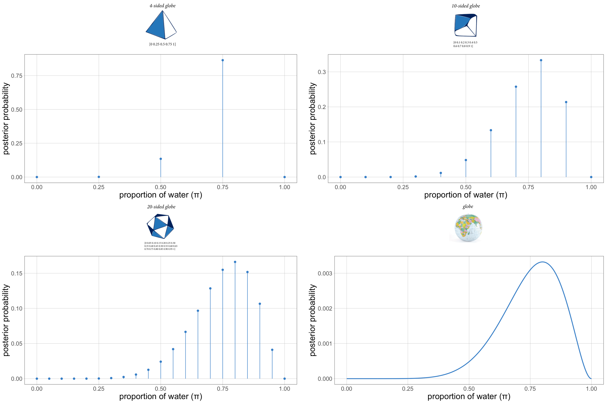

## Statistical inference: Globe tossing experiment

Prior information: About 71% of the Earth's surface is covered by water \[[usgs.gov](https://www.usgs.gov/special-topics/water-science-school/science/how-much-water-there-earth)\]

:::::::::::: columns
:::::: {.column width="38%"}
::: fragment
```{r}
#| fig-height: 7.5
globe_tossing_grid_approx(w = 8, l = 2,
                          a = 1, b = 1) %>% gf_lims(y = c(0, 0.007))
```
:::

::: {.fragment .text-align-center}
[**prior**]{style="font-weight: bold; color: rgb(255, 165, 0);"}  [**likelihood**]{style="color: #357EC7"}  [**posterior**]{style="color: #4E9258"}
:::

::: fragment
```{r}
#| echo: false
s <- globe_tossing_samples(w = 8, l = 2,
                           a = 1, b = 1)
prop_test_hpdi <- rethinking::HPDI(s) %>% round(2)
prop_test_hpdi
```
:::
::::::

:::::: {.column width="38%"}
::: fragment
```{r}
#| fig-height: 7.5
globe_tossing_grid_approx(w = 8, l = 2,
                          a = 29, b = 11) %>% gf_lims(y = c(0, 0.007))
```
:::

::: {.fragment .text-align-center}
[**prior**]{style="font-weight: bold; color: rgb(255, 165, 0);"}  [**likelihood**]{style="color: #357EC7"}  [**posterior**]{style="color: #4E9258"}
:::

::: fragment
```{r}
#| echo: false
rethinking::HPDI(globe_tossing_samples(w = 8, l = 2,
                           a = 29, b = 11)) %>% round(2)
```
:::
::::::

::: {.column width="24%"}
 
:::
::::::::::::

## Statistical inference: Globe tossing experiment

Prior information: About 71% of the Earth's surface is covered by water \[[usgs.gov](https://www.usgs.gov/special-topics/water-science-school/science/how-much-water-there-earth)\]

:::::::: columns
:::: {.column width="38%"}
```{r}
#| fig-height: 7.5
#| output-location: default
globe_tossing_grid_approx(w = 8, l = 2,
                          a = 1, b = 1) %>% gf_lims(y = c(0, 0.007))
```

::: text-align-center
[**prior**]{style="font-weight: bold; color: rgb(255, 165, 0);"}  [**likelihood**]{style="color: #357EC7"}  [**posterior**]{style="color: #4E9258"}
:::

```{r}
#| echo: false
#| output-location: default
prop_test_hpdi
```
::::

:::: {.column width="38%"}
::: fragment
```{r}
prop.test(x = 8, n = 10, # [0.50, 0.95] with Yates' continuity correction
          conf.level = .89, correct = FALSE)
```
:::
::::

::: {.column width="24%"}
 
:::
::::::::

## Statistical inference: Globe tossing experiment

Prior information: About 71% of the Earth's surface is covered by water \[[usgs.gov](https://www.usgs.gov/special-topics/water-science-school/science/how-much-water-there-earth)\]

```{r}
#| include: false
prop_test_ci <- confint(prop.test(x = 8, n = 10, conf.level = .89, correct = FALSE)) %>% round(2)
```

::::::::: columns
:::: {.column width="38%"}
```{r}
#| fig-height: 7.5
#| output-location: default
globe_tossing_grid_approx(w = 8, l = 2,
                          a = 1, b = 1) %>% gf_lims(y = c(0, 0.007)) %>% gf_point(x = prop_test_ci$p, y = 0, color = "#357EC7", size = 4) %>% gf_segment(x = prop_test_ci$lower, y = 0, xend = prop_test_ci$upper, yend = 0, color = "#357EC7")
```

::: text-align-center
[**prior**]{style="font-weight: bold; color: rgb(255, 165, 0);"}  [**likelihood**]{style="color: #357EC7"}  [**posterior**]{style="color: #4E9258"}
:::

```{r}
#| echo: false
#| output-location: default
prop_test_hpdi
```
::::

:::: {.column width="38%"}
```{r}
#| output-location: default
prop.test(x = 8, n = 10, # [0.50, 0.95] with Yates' continuity correction
          conf.level = .89, correct = FALSE)
```

::: fragment
```{r}
#| echo: false
prop_test_ci
```
:::
::::

:::: {.column width="24%"}
::: fragment
```{r}
#| echo: false
#| fig-height: 24

# Number of simulations
num_simulations <- 200

# Number of observations in each simulation
num_observations <- 10

# True proportion (fixed across all repetitions)
true_proportion <- 0.7

# Confidence level
confidence_level <- 0.89

# Initialize vectors to store results
lower_bounds <- numeric(num_simulations)
upper_bounds <- numeric(num_simulations)

# Run simulations
for (i in 1:num_simulations) {
  # Generate random data based on the true proportion
  simulated_data <- rbinom(num_observations, 1, true_proportion)
  
  # Use prop.test to calculate confidence interval
  prop_test_result <- prop.test(sum(simulated_data), num_observations, conf.level = confidence_level, correct = FALSE)
  
  # Store lower and upper bounds
  lower_bounds[i] <- prop_test_result$conf.int[1]
  upper_bounds[i] <- prop_test_result$conf.int[2]
}

# Plot the long run series of confidence intervals as segments
plot(rep(true_proportion, num_simulations), 1:num_simulations, type = "l", xlim = c(0, 1),
     ylab = "", xlab = "proportion of water (π)", main = "\"Long-run\" series of 89% confidence intervals",
     lwd = 2, cex.axis = 2, cex.lab = 2, cex.main = 2, yaxt = "n")  # Adjust linewidth, font size, and remove y-axis

# Add confidence interval segments
segments(lower_bounds, 1:num_simulations, upper_bounds, 1:num_simulations, col = "#357EC7", lwd = 3)  # Adjust linewidth

# Highlight CIs that do not include the true proportion in red
for (i in 1:num_simulations) {
  if (true_proportion < lower_bounds[i] | true_proportion > upper_bounds[i]) {
    segments(lower_bounds[i], i, upper_bounds[i], i, col = "orangered", lwd = 3)  # Adjust linewidth
  }
}
```
:::
::::
:::::::::

## *P*-values and confidence intervals

-   **Fisher’s significance testing**

    -   A low *p*-value suggests that either:

        1.  The *null hypothesis* $H_0$ is false, or

        2.  The *null hypothesis* $H_0$ is true, but an unlikely event has occurred

-   **Neyman–Pearson hypothesis testing**

    -   The *p*-value is compared to a [significance level](https://en.wikipedia.org/wiki/Statistical_significance) (e.g., $\alpha = 0.05$), and action is taken based on decision rule to minimize expected loss, given the costs of Type I/II errors:

        1.  Reject the *null hypothesis* $H_0$ (does not prove it false), or

        2.  Fail to reject the *null hypothesis* $H_0$ (does not prove it true)

    -   Requires definition of the *alternative hypothesis* $H_1$

    -   Requires calculation of Type I (false positive) and Type II (false negative) error costs

    -   Requires calculation of sample size for good [statistical power](https://en.wikipedia.org/wiki/Power_of_a_test) (e.g., $1 - \beta = 0.80$)

    -   Median statistical power of studies in neuroscience is 8-31%[@Button2013] 😿

## *P*-values and confidence intervals

**Null hypothesis significance testing** (NHST) combines elements from both Fisher's significance testing and Neyman-Pearson hypothesis testing, but it doesn't strictly adhere to either[@Perezgonzalez2015]. It involves calculating a *p*-value as in Fisher's significance testing and using a fixed significance level and decision rule as in Neyman-Pearson hypothesis testing, in order to assess whether an observed effect is "*statistically significant*". NHST became widely adopted in biomedical research and the social sciences due to its simplicity and ease of application, replacing statistical thinking with the mindless "*null ritual*"[@Gigerenzer2004].

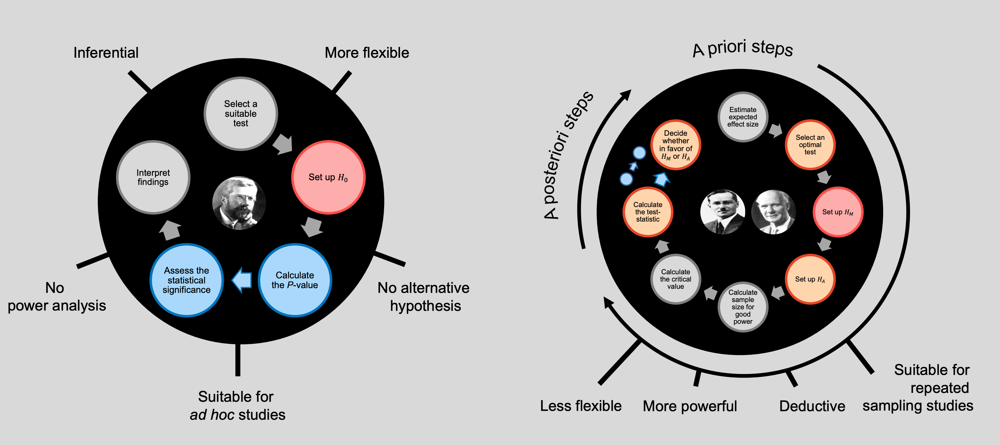

<https://arxiv.org/abs/2002.07270>

## *P*-values and confidence intervals

> "The widespread use of 'statistical significance' (generally interpreted as '*p* ≤ 0.05') as a license for making a claim of a scientific finding (or implied truth) leads to considerable distortion of the scientific process." "It is time to stop using the term 'statistically significant' entirely!" — [The ASA statement on p-values](https://doi.org/10.1080/00031305.2016.1154108)

-   The *p*-value is *not* the probability that the null hypothesis is true, or the probability that the alternative hypothesis is false

-   The 0.05 significance level is merely a convention, nothing magical happens below that threshold; a *p*-value of 0.049 is the same as a *p*-value of 0.051

-   The *p*-value does *not* measure the size or importance of the observed effect

-   The *p*-value is *not* the probability that the observed effect *is caused* 🙀<br/>by *random chance* 🦐 alone

::: {.fragment .text-align-center}
{height="100"}
:::

## *P*-values and confidence intervals

> "The widespread use of 'statistical significance' (generally interpreted as '*p* ≤ 0.05') as a license for making a claim of a scientific finding (or implied truth) leads to considerable distortion of the scientific process." "It is time to stop using the term 'statistically significant' entirely!" — [The ASA statement on p-values](https://doi.org/10.1080/00031305.2016.1154108)

::: nonincremental
-   The *p*-value is *not* the probability that the null hypothesis is true, or the probability that the alternative hypothesis is false

-   The 0.05 significance level is merely a convention, nothing magical happens below that threshold; a *p*-value of 0.049 is the same as a *p*-value of 0.051

-   The *p*-value does *not* measure the size or importance of the observed effect

-   The *p*-value is *not* the probability that the observed effect *is caused* 🙀<br/>by *random chance* 🦐 alone
:::

::: text-align-center
[{height="100"}](https://www.getty.edu/art/collection/object/103RJG)
:::

## *P*-values and confidence intervals

::: nonincremental
-   [Why most published research findings are false](https://doi.org/10.1371/journal.pmed.1004085)

-   [Statistical tests, *p*-values, confidence intervals, and power: A guide to misinterpretations](https://doi.org/10.1007/s10654-016-0149-3)

-   [The reproducibility of research and the misinterpretation of *p*-values](https://doi.org/10.1098/rsos.171085)

-   [*P*-values: Misunderstood and misused](https://doi.org/10.3389/fphy.2016.00006)

-   [The roles, challenges, and merits of the *p*-value](https://doi.org/10.1016/j.patter.2023.100878)

-   [Moving to a world beyond "*p* \< 0.05"](https://doi.org/10.1080/00031305.2019.1583913)

-   [Scientists rise up against statistical significance](https://doi.org/10.1038/d41586-019-00857-9)

-   From Nature's collection "[Statistics for biologists](https://www.nature.com/collections/qghhqm)":

    -   [Error bars](https://www.nature.com/articles/nmeth.2659)

    -   [Scientific method: Statistical errors](https://www.nature.com/articles/506150a)

    -   [*P*-values and the search for significance](https://www.nature.com/articles/nmeth.4120)

    -   [Interpreting p-values](https://www.nature.com/articles/nmeth.4210)
:::

## Statistical models

::::::: columns
:::: {.column width="46%"}
::: text-align-right
{height="350"}
:::
::::

:::: {.column width="54%"}
::: text-align-left
{height="350"}
:::
::::
:::::::

::: text-align-center
<https://distribution-explorer.github.io/>
:::

::: notes
-   Naomi Campbell = Uniform distribution
-   Helena Christensen = Bernoulli distribution
-   Cindy Crawford = Binomial distribution
-   Linda Evangelista = Beta distribution
-   Christy Turlington = Normal distribution
:::

## The normal (a.k.a. Gaussian) distribution

:::::: columns
::: {.column width="60%"}


[Carl Friedrich Gauss](https://en.wikipedia.org/wiki/Carl_Friedrich_Gauss) \[1840-1887\]
:::

:::: {.column width="40%"}
$$
p(X = x \mid \mu, \sigma, M^{\text{Normal}}) = \frac{1}{\sigma\sqrt{2\pi}} \cdot e^{-\frac{(x-\mu)^2}{2\sigma^2}}
$$

```{r}
#| eval: false
#| output-location: default
dnorm(x, mean = μ, sd = σ)
```

$$
x \sim \text{Normal}(\mu, \sigma)
$$

 

::: fragment
$$
E(x) = \mu \\
\text{Var}(x) = \sigma^2
$$
:::
::::
::::::

## The normal distribution as a statistical model

The sum of several small random fluctuations converges to a normal distribution


## The normal distribution as a statistical model

Monte Carlo simulation

```{r}
#| echo: false
# https://bookdown.org/content/4857/geocentric-models.html#why-normal-distributions-are-normal

pos <- 
  # make data with 100 people, 16 steps each with a starting point of `step == 0` (i.e., 17 rows per person)
  crossing(person = 1:100,
           step   = 0:20) %>% 
  # for all steps above `step == 0` simulate a `deviation`
  mutate(deviation = map_dbl(step, ~if_else(. == 0, 0, runif(1, -1, 1)))) %>% 
  # after grouping by `person`, compute the cumulative sum of the deviations, then `ungroup()`
  group_by(person) %>%
  mutate(position = cumsum(deviation)) %>% 
  ungroup()

ggplot(data = pos, 
       aes(x = step, y = position, group = person)) +
  geom_vline(xintercept = 20, linetype = 2) + # geom_vline(xintercept = c(4, 8, 16), linetype = 2) +
  geom_line(aes(color = person < 2, alpha  = person < 2)) +
  scale_color_manual(values = c("skyblue4", "black")) +
  scale_alpha_manual(values = c(1/5, 1)) +
  scale_x_continuous("step number", breaks = 0:4 * 4) +
  theme(legend.position = "none")
```

## The normal distribution as a statistical model

Monte Carlo simulation

```{r}
pos <- replicate(1000, sum(sample(c(-1,1), size = 20, replace = TRUE)))

gf_density(~ pos, fill = "skyblue4") %>% gf_dist("norm", sd = sd(pos), color = "black")
```

## The normal distribution as a statistical model

-   The normal distribution is the [maximum entropy probability distribution](https://en.wikipedia.org/wiki/Maximum_entropy_probability_distribution) of a random variable if nothing is known about its probability distribution other than it has a mean and a variance

    -   Maximizing entropy minimizes the amount of [prior information](https://en.wikipedia.org/wiki/Prior_probability "Prior probability") built into the probability distribution

    -   Many physical systems tend to move towards maximal entropy configurations over time

-   The normal distribution is also at the heart of the [central limit theorem](https://en.wikipedia.org/wiki/Central_limit_theorem) (CLT):

    -   The sum (or average) of independent and identically distributed random variables, regardless of their original distribution, converges to a normal distribution as the sample size increases

## Research question

What is the relationship between height and weight in humans?

 

Demographic data collected by Nancy Howell from the [Dobe !Kung people](https://en.wikipedia.org/wiki/%C7%83Kung_people) of the [Kalahari](https://en.wikipedia.org/wiki/Kalahari_Desert)

Downloaded from: <https://tspace.library.utoronto.ca/handle/1807/10395>

:::::: columns
:::: {.column width="50%"}
::: nonincremental
-   `height`: Height in cm

-   `weight`: Weight in kg

-   `age`: Age in years

-   `male`: Gender indicator
:::
::::

::: {.column width="50%"}
{height="300"}
:::
::::::

<https://www.ucpress.edu/book/9780520262348/life-histories-of-the-dobe-kung>

## Research question

What is the relationship between height and weight in humans?

```{r}
data(Howell1, package = "rethinking")

Howell1
```

## Research question

What is the relationship between height and weight in humans?

```{r}
#| fig-height: 5
gf_point(weight ~ height, data = Howell1, color = ~age)
```

## Research question

What is the relationship between height and weight in *adult* humans?

```{r}
#| fig-width: 6
d <- Howell1 %>% filter(age >= 18)

gf_point(weight ~ height, data = d, color = ~factor(male), show.legend = FALSE)
```

## Identify the estimand

The causal relationship between height (H) and weight (W) in adult humans

```{r}
#| fig-width: 6
#| output-location: default
d <- d %>% select(weight, height) %>% mutate(height_c = height - mean(height))

gf_point(weight ~ height, color = "skyblue4", data = d) %>% gf_lm(color = "black")
```

## Draw a causal diagram

**Directed acyclic graph (DAG)**: A graphical representation of a causal model

**Causal model**: A set of variables and their causal relationships = [causal assumptions]{.underline}

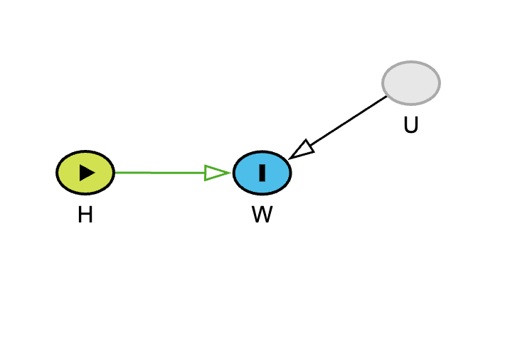

::: fragment
$$
W = f(H, U)
$$
:::

See also: [educational resources](https://www.dagitty.net/learn) at [dagitty.net](http://dagitty.net/)

## Build a statistical model

of the causal relationship between height (H) and weight (W) in adult humans using a general **linear model** (LM)[; using LM instead of GLM in order to avoid confusion with the broader class of **generalized linear models** (GLM)]{.fragment}

-   $\text{DATA} = \text{MODEL} + \text{ERROR}$

-   $\text{DATA} = \text{SIGNAL} + \text{NOISE}$

-   $y_i = b_0 + b_1 x_i + e_i$

-   $Y_i = \beta_0 + \beta_1 X_i + \epsilon_i$

 

-   $\text{WEIGHT (W)} = \text{HEIGHT (H)} + \text{OTHER STUFF (U)}$

::: fragment
```{r}
#| eval: false
#| output-location: default
lm(formula = weight ~ height, data = d)
```
:::

## Regression (variate-covariate) models

-   With $(y, x)$ data, the goal of statistical inference is often to estimate the statistical relationship between *variates* ($y$) and *covariates* ($x$)

-   **Likelihood**: The joint probability of the data $y$ and $x$ given a model of the DGP $M = \{\theta, M^* \}$

    -   $p(Y = y, X = x \mid \theta, M^*)$

    -   $p(y,x \mid \theta)$ \[simpler, alternative notation\]

-   Given the multiplication rule of probability: $P(A \cap B) = P(A \mid B) \cdot P(B)$

    -   $p(y,x \mid \theta) = p(y \mid x,\theta) \cdot p(x \mid \theta)$
    -   $p(y \mid x,\theta)$ is the regression component of the likelihood

-   We typically assume that $x$ is independent of $\theta$, therefore: $p(x \mid \theta) = p(x)$

    -   This assumption does not always hold, e.g., in the presence of [selection bias](https://en.wikipedia.org/wiki/Selection_bias)

-   [Under this assumption]{.underline}, we can rewrite the likelihood as:

    -   $p(y,x \mid \theta) = p(y \mid x,\theta) \cdot p(x)$

## Regression (variate-covariate) models

::: nonincremental
-   [Under this assumption]{.underline}, we can rewrite the likelihood as:

    -   $p(y,x \mid \theta) = p(y \mid x,\theta) \cdot p(x)$
:::

-   Since $p(x)$ is no longer dependent on $\theta$, it becomes a normalizing constant; therefore:

    -   $p(y,x \mid \theta) \propto p(y \mid x,\theta)$

-   In other words, the likelihood reduces to its regression component: the **regression likelihood**

    -   $p(y \mid x,\theta)$

-   The regression likelihood can take any functional form $M^*$ to model the statistical relationship between between *variates* ($y$) and *covariates* ($x$)

    -   $p(y \mid x, \theta, M^*)$

-   $x$ is typically linked to a single parameter of $M^*$ through a deterministic function:

    -   $p(y \mid \theta_1 = f(x,\beta),\theta_2, M^*)$

-   In other words, $x$ affects only one of the parameters $\theta$ of $M^*$ through the deterministic function $f(x,\beta)$

## Linear regression models

-   In a **linear regression model**, $f(x,\beta)$ is a *linear function* of $x$ (a.k.a. **linear predictor**):

    -   For example: $f(x,\beta) = \beta_0 + \beta_1 x$

-   Therefore, the regression likelihood becomes: $p(y \mid \theta_1 = \beta_0 + \beta_1 x,\theta_2, M^*)$

-   In a **general linear model**, the linear predictor is typically linked to the mean $\mu$ of a normal distribution with standard deviation $\sigma$: $p(y \mid \mu = \beta_0 + \beta_1 x, \sigma, M^{\text{Normal}})$

::: fragment
$$
y_i \stackrel{\text{i.i.d.}} \sim \text{Normal}(\mu = \beta_0 + \beta_1 x_i, \sigma)
$$
:::

-   which can also be equivalently formulated as:

::: fragment
$$
y_i = \beta_0 + \beta_1 x_i + \epsilon_i \\
\epsilon_i \stackrel{\text{i.i.d.}} \sim \text{Normal}(0, \sigma)
$$
:::

-   $\beta_0 + \beta_1 x_i$ is the **deterministic component** of the general linear model, and

-   $\epsilon_i$ is the **stochastic component** of the general linear model

## Build a statistical model

of the causal relationship between height (H) and weight (W) in adult humans using a general linear model (LM)

-   $\text{WEIGHT (W)} = \text{HEIGHT (H)} + \text{OTHER STUFF (U)}$

-   $y_i = \beta_0 + \beta_1 x_i + \epsilon_i \quad \quad \epsilon_i \stackrel{\text{i.i.d.}} \sim \text{Normal}(0, \sigma)$

-   $y_i \stackrel{\text{i.i.d.}} \sim \text{Normal}(\mu_i, \sigma) \quad \quad \mu_i = \beta_0 + \beta_1 x_i$

::: fragment
```{r}
#| fig-height: 3.5
#| echo: false
#| warning: false
alpha <- 45.01
beta <- 0.63
sigma <- 4.23

H <- seq(130, 180)
n <- length(H)
mu <- alpha + beta * H
W <- replicate(1000, rnorm(n, mu, sigma))

df <- bind_cols(tibble(H), as.data.frame(W)) %>%
  pivot_longer(-H, names_to = "replicate", values_to = "W") %>%
  mutate(H = factor(H))

df %>%
  gf_density_ridges(H ~ W, linetype = 0, fill = "lightblue") %>%
  gf_point(H ~ W, data = df %>% group_by(H) %>% sample_n(3), color = "blue") %>% 
  gf_labs(title = TeX(r'(Monte Carlo simulation of $y_i = \beta_0 + \beta_1 x_i + \epsilon_i$)')) %>%
  gf_theme(axis.text.x = element_text(angle = 45, hjust = 1)) +
  coord_flip()
```
:::

## Fit the statistical model to the data

$$
y_i \stackrel{\text{i.i.d.}} \sim \text{Normal}(\mu_i, \sigma) \\
\mu_i = \beta_0 + \beta_1 x_i \\
\beta_0 \sim \text{Normal}(178,20) \\
\beta_1 \sim \text{Log-Normal}(0,1) \\
\sigma \sim \text{Uniform}(0,50) \\
$$

```{r}
#| message: false
#| output-location: default
m1 <- rethinking::quap(alist( # model (likelihood and priors):
  y ~ dnorm(mu, sigma),       #   regression likelihood
  mu <- b0 + b1*x,            #   linear predictor of mu
  b0 ~ dnorm(178,20),         #   prior of intercept
  b1 ~ dlnorm(0,1),           #   prior of slope
  sigma ~ dunif(0,50)         #   prior of sigma
), data = list(y=d$weight, x=d$height_c)) # fit model to data

rethinking::precis(m1)
```

## Fit the statistical model to the data

Bayesian estimate is the joint posterior **probability** distribution of the parameters $\beta_0$ (intercept), $\beta_1$ (slope), and $\sigma$ given the data

{height="400"}

## Fit the statistical model to the data

Frequentist estimate is the maximum **likelihood** point estimate and confidence interval of the parameters $\beta_0$ (intercept) and $\beta_1$ (slope) given the data

```{r}
#| output-location: default
m2 <- lm(formula = weight ~ height_c, data = d)

broom::tidy(m2, conf.int = TRUE) %>%
  select(term, estimate, conf.low, conf.high, p.value) %>%
  mutate_at(vars(estimate, conf.low, conf.high, p.value), round, 2)
```

## Assumptions of the general linear model

-   **Linearity of linear predictor**

    -   $y_i = \beta_0 + \beta_1 x_i$

-   **Normality**, **homoscedasticity** and **independence of errors**

    -   $\epsilon_i \stackrel{\text{i.i.d.}} \sim \text{Normal}(0, \sigma)$

::: fragment
```{r}
#| fig-height: 4
performance::check_model(m2, check = c("linearity", "normality"))
```
:::

## Assumptions of the general linear model

::: nonincremental
-   **Linearity of linear predictor**

    -   $y_i = \beta_0 + \beta_1 x_i$

-   **Normality**, **homoscedasticity** and **independence of errors**

    -   $\epsilon_i \stackrel{\text{i.i.d.}} \sim \text{Normal}(0, \sigma)$
:::

```{r}
#| fig-height: 4
performance::check_model(m2, check = c("pp_check", "homogeneity"))
```

## Assumptions of the general linear model

::: nonincremental
-   **Linearity of linear predictor**

    -   $y_i = \beta_0 + \beta_1 x_i$

-   **Normality**, **homoscedasticity** and **independence of errors**

    -   $\epsilon_i \stackrel{\text{i.i.d.}} \sim \text{Normal}(0, \sigma)$
:::

```{r}
performance::check_autocorrelation(m2)
```

## References

::: {#refs}
:::

##  {background-image="images/thats_all_folks.jpg" background-size="50%"}

## Key take home messages

-   Be skeptical, thoughtful, and honest!

-   If you can't simulate it, you can't analyze it!

-   All models say only what they are told to say!

-   Test before you est(imate)!

## The taxonomy of estimands

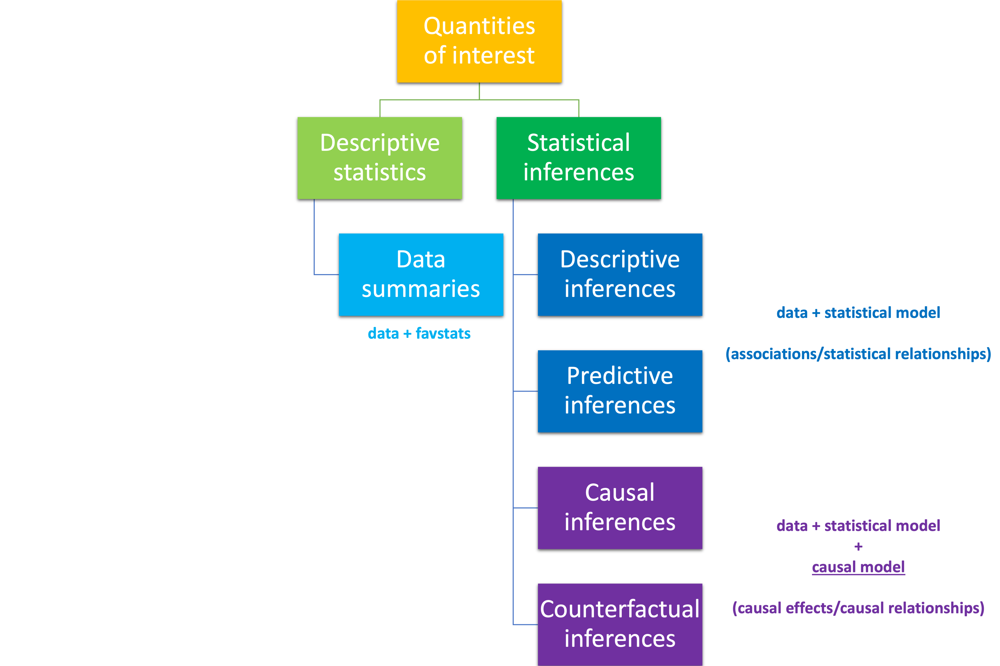

## The ladder of causation


## Causal inference textbooks

::::::: columns
:::: {.column width="50%"}
::: text-align-center
{height="500"}

<http://bayes.cs.ucla.edu/PRIMER>
:::
::::

:::: {.column width="50%"}
::: text-align-center
{height="500"}

<http://bayes.cs.ucla.edu/WHY>
:::
::::
:::::::

See also: [How to learn causal inference on your own for free](https://towardsdatascience.com/how-to-learn-causal-inference-on-your-own-for-free-98503abc0a06)
