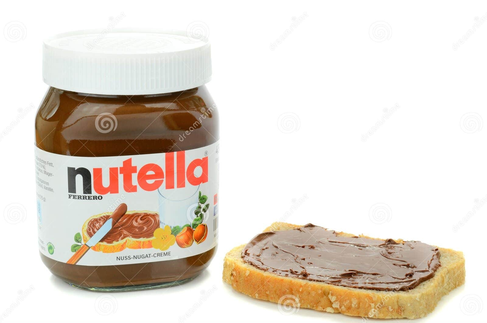

## Introduction

Imagine a piece of toast that’s come out of the toaster with a faint grid pattern pressed in by the rack. We’ll treat each little square in that pattern as a possible outcome in our sample space. Next, we spread 1 Kg of Nutella across the toast so that some squares get a thick coating and others barely any at all.

Wherever the Nutella is **thick**, the probability is **high**; where it’s **thin or absent**, the probability is **low** or **zero**. But taken together, the **total** Nutella spread must sum to 1 Kg.

In this notebook, we’ll model several probability distributions/stastistical models as different ways of smearing Nutella across the toast.



## Setup environment

```{r}
#| output: false
library(tidyverse)
library(ggformula)
library(extraDistr)

theme_set(theme_minimal())

set.seed(666)
```

## Helper functions

```{r}
plot_model <- function(df, n = NULL, title = "p(X, Y)") {
  max_x <- max(df$X)
  max_y <- max(df$Y)
  
  # 1) Base tile plot
  p_obj <- gf_tile(
    Y ~ X, data = df,
    fill = ~ p, color = "black", linewidth = 0.2
  ) %>%
    gf_labs(title = title) %>%
    gf_refine(
      scale_fill_gradientn(
        colors = c("white","chocolate4","black"),
        values = c(0, 0.125, 1),
        limits = c(0, 0.25)
      ),
      scale_x_continuous(breaks = seq(0, max_x)),
      scale_y_continuous(breaks = seq(0, max_y))
    ) +
    expand_limits(x = c(0, max_x), y = c(0, max_y))
  
  if (!is.null(n)) {
    df_samples <- df %>%
      slice_sample(n = n, weight_by = p, replace = TRUE)
    
    p_obj <- p_obj %>% gf_point(
      Y ~ X, data = df_samples,
      size = 4, color = "red2", alpha = 0.2, stroke = 0
    )
  }
  
  return(p_obj)
}
```

## Simulate data from uniform and linear models

```{r}
n <- 100
sample.size <- 10
grid.size <- 20
b0 <- 3
b1 <- 2
e  <- 1
sd <- 1
```

```{r}
X <- seq(0, grid.size, length.out = grid.size + 1)
Y <- seq(0, grid.size, length.out = grid.size + 1)

ss <-
  expand_grid(X, Y) %>%
  mutate(Ω = paste0("⍵", 1:n())) %>%
  select(Ω, everything())

ss
```

```{r}
ss %>% 
  mutate(p = 1 / n()) %>%
  rowwise() %>% 
  mutate(M = TRUE) %>% 
  ungroup() %>%
  mutate(p = if_else(M, p / sum(p[M]), 0)) %>%
  plot_model()
```

```{r}
ss %>% 
  mutate(p = 1 / n()) %>%
  rowwise() %>% 
  mutate(M = TRUE) %>% 
  ungroup() %>%
  mutate(p = if_else(M, p / sum(p[M]), 0)) %>%
  plot_model(n)
```

```{r}
ss %>% 
  mutate(p = 1 / n()) %>%
  rowwise() %>% 
  mutate(M = (Y == b0 + b1 * X)) %>% 
  ungroup() %>%
  mutate(p = if_else(M, p / sum(p[M]), 0)) %>%
  plot_model()
```

```{r}
ss %>% 
  mutate(p = 1 / n()) %>%
  rowwise() %>% 
  mutate(M = (Y == b0 + b1 * X)) %>% 
  ungroup() %>%
  mutate(p = if_else(M, p / sum(p[M]), 0)) %>%
  plot_model(n)
```

```{r}
ss %>% 
  mutate(p = 1 / n()) %>%
  rowwise() %>% 
  mutate(M = (Y == b0 + b1 * X + 0) | (Y == (b0 + b1 * X + e)) | (Y == (b0 + b1 * X - e))) %>% 
  ungroup() %>%
  mutate(p = if_else(M, p / sum(p[M]), 0)) %>%
  plot_model()
```

```{r}
ss %>% 
  mutate(p = 1 / n()) %>%
  rowwise() %>% 
  mutate(M = (Y == b0 + b1 * X + 0) | (Y == (b0 + b1 * X + e)) | (Y == (b0 + b1 * X - e))) %>% 
  ungroup() %>%
  mutate(p = if_else(M, p / sum(p[M]), 0)) %>%
  plot_model(n)
```

```{r}
ss %>% 
  mutate(p = 1 / n()) %>%
  mutate(p = ddnorm(b0 + b1 * X, mean = Y, sd = sd)) %>%
  mutate(p = p / sum(p)) %>% 
  plot_model()
```

```{r}
ss %>% 
  mutate(p = 1 / n()) %>%
  mutate(p = ddnorm(b0 + b1 * X, mean = Y, sd = sd)) %>%
  mutate(p = p / sum(p)) %>% 
  plot_model(n)
```
