```{r}
#| include: false
library(tidyverse)
theme_set(theme_minimal())
```

## Statistical inference is logical reasoning

-   Statistical inference is logical reasoning using 1) **data** (observations/measurements of observable quantities) and 2) a **model of the data generating process** (DGP) as evidence to infer unobservable quantities:

::: fragment
$$
\begin{array}{ll}
1. & \text{data (observations)} \\
2. & \text{process model} \\
\hline
\therefore & \text{unobservables} \\
\end{array}
$$
:::

-   Future observations (prediction/forecasting)
-   Unrecorded past observations or unobserved events (retrodiction/backcasting)
-   Hypothetical observations (frequentist inference)
-   Unobservable counterfactual outcomes (causal inference, requires a **causal model**)
-   Missing data (imputation)
-   Unobservable model parameters (estimation)
-   Unobservable latent variables (estimation)

::: notes
-   observables/knowns = data/observations/measurements/observed quantities; data or quantities we actually measured or could in principle measure
-   unobservables/unknowns = unobserved or unobservable quantities; quantities we cannot (or have not) measured
-   Causal inference = estimation of causal effects; prediction of effects of interventions
:::

## Ancient philosophy: rationalism vs. empiricism

{fig-alt="https://en.wikipedia.org/wiki/The_School_of_Athens" fig-align="center" height="550"}

## Modern science: statistical (+ causal) inference

{fig-alt="https://en.wikipedia.org/wiki/Tribune_of_Galileo" fig-align="center" height="550"}

## Modern science: statistical (+ causal) inference

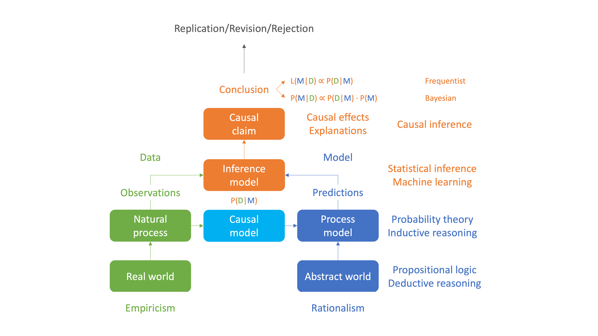{fig-align="center" width="979"}

[Shmueli (2010)](https://doi.org/10.1214/10-STS330) To Explain or to Predict?

## Statistical inference

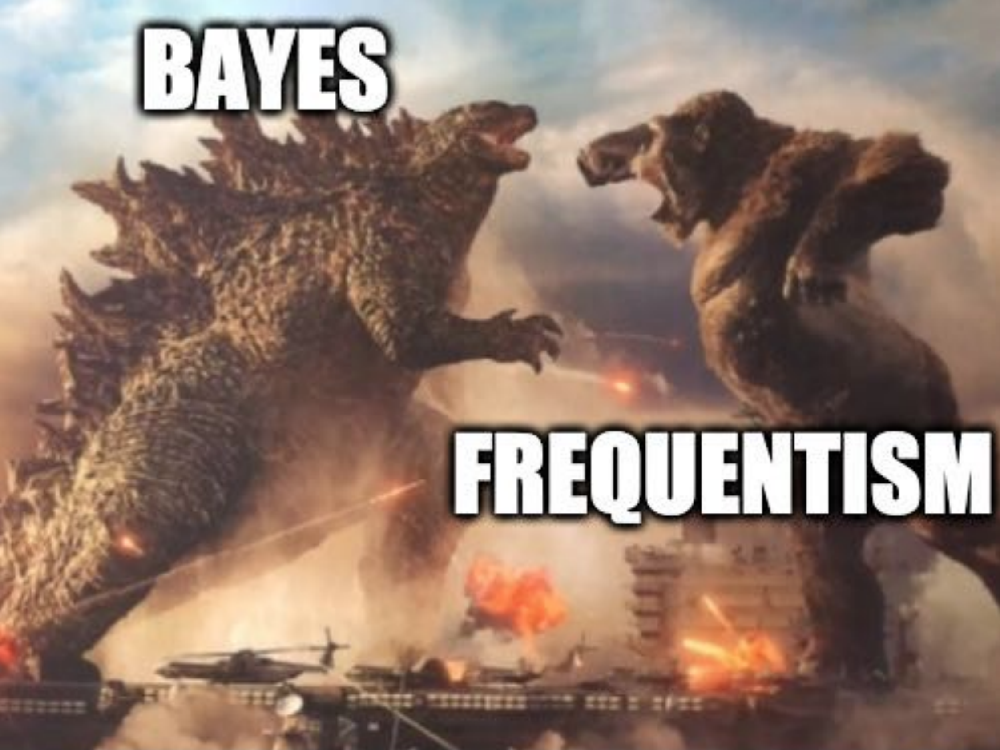

## Causal inference


## Reasoning and arguments

-   **Reasoning** is the process of drawing a conclusion from one or more premises

-   It is usually expressed as an **argument**

-   An argument is a **series of propositions**: one or more **premises** and a **conclusion**

::: fragment
$$
\begin{array}{ll}
1. & \text{data (observations)} \\
2. & \text{process model} \\
\hline
\therefore & \text{unobservables} \\
\end{array}
$$
:::

## Reasoning and arguments

::: nonincremental
-   **Reasoning** is the process of drawing a conclusion from one or more premises

-   It is usually expressed as an **argument**

-   An argument is a **series of propositions**: one or more **premises** and a **conclusion**
:::

$$
\begin{array}{ll}
1. & \text{All men are mortal} \\
2. & \text{Socrates is a man} \\
\hline
\therefore & \text{Socrates is mortal} \\
\end{array}
$$

-   **Premises** are also known as **assumptions**

-   The conjunction of all premises is also known as the **evidence** or **knowledge base**

-   The **conclusion** is also known as the **hypothesis** or **query**

## Propositions

-   A **proposition** (or statement) is a declarative sentence that is either true or false, but not both at the same time

-   It represents an assertion or claim about a particular state of affairs in the world

    -   "*it's raining*" 🌧️ [is a proposition]{.fragment .green}
    -   "*is it raining?*" 🤔 [is not a proposition]{.fragment .red}
    -   "*Gaborone is the capital of Botswana*" 🇧🇼 [is a proposition]{.fragment .green}
    -   "*Italy will win the 2026 FIFA World Cup*" ⚽️ [is a proposition]{.fragment .green}
    -   "*unicorns fly*" 🦄 [is a proposition]{.fragment .green}
    -   "*2 + 2 = 5*" [is a proposition]{.fragment .green}
    -   "*X + 2 = 5*" [is not a proposition]{.fragment .red}

::: notes
-   "*unicorns fly* is a proposition, because it can be assigned a truth value: in the real world, we would generally consider this false because unicorns don’t exist, and thus they can’t fly

-   The key is that it could be true in a hypothetical world where unicorns exist and can fly

-   The truth value doesn’t need to be known or verifiable—it just needs to be something that could, in principle, be true or false
:::

## Logical reasoning

-   **Logical reasoning** is reasoning that follows the **rules of logic**

-   It can be broadly categorized into two types:

    -   **Deductive reasoning**

        -   follows the rules of **propositional logic**

        -   is the basis of **mathematical proof** (and computer science)

    -   **Inductive reasoning**

        -   follows the rules of **probability theory**

        -   is the basis of **scientific reasoning** (incl. statistical inference)

        -   Probability theory is the logic of science!

## Deductive vs. inductive arguments

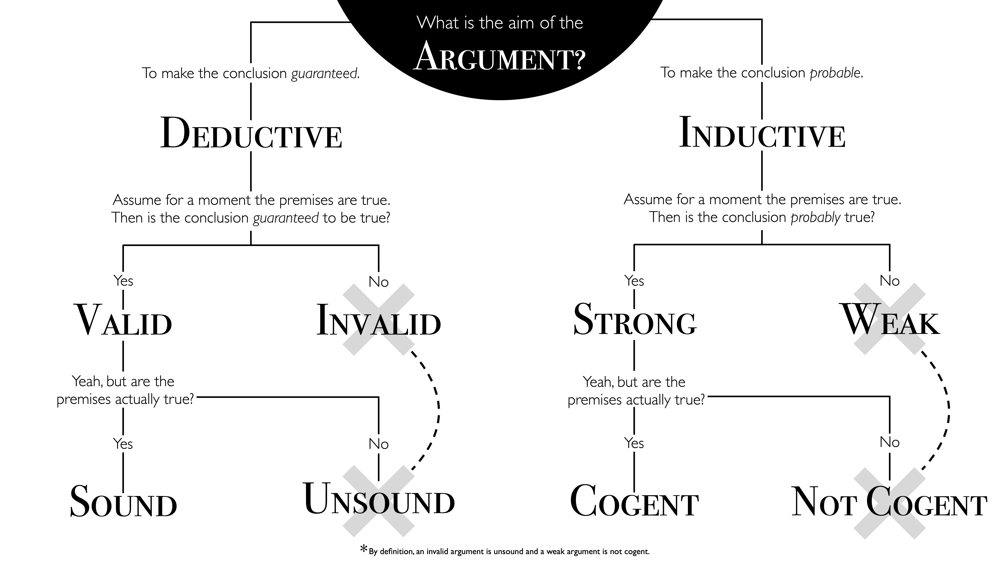{fig-align="center"}

## Deductive vs. inductive arguments

:::::::::::: columns
::::: {.column width="33%"}
::: fragment
*All men are mortal*

[*Socrates is a man*]{.underline}

*Socrates is mortal*
:::

::: fragment
**Valid and sound deductive argument**
:::
:::::

::::: {.column width="33%"}
::: fragment
*All men are mortal*

[*Socrates is mortal*]{.underline}

*Socrates is a man*
:::

::: fragment
**Invalid deductive argument**
:::
:::::

::::: {.column width="34%"}
::: fragment
*All men are blind*

[*Socrates is a man*]{.underline}

*Socrates is blind*
:::

::: fragment
**Valid but unsound deductive argument**
:::
:::::
::::::::::::

 

:::::::::::: columns
::::: {.column width="33%"}
::: fragment
*\~90% of men are RH*

[*Socrates is a man*]{.underline}

*Socrates is RH*
:::

::: fragment
**Strong and cogent inductive argument**
:::
:::::

::::: {.column width="33%"}
::: fragment
*\~30% of men are bald*

[*Socrates is a man*]{.underline}

*Socrates is bald*
:::

::: fragment
**Weak inductive argument**
:::
:::::

::::: {.column width="34%"}
::: fragment
*\~90% of men are blind*

[*Socrates is a man*]{.underline}

*Socrates is blind*
:::

::: fragment
**Strong but not cogent inductive argument**
:::
:::::
::::::::::::

## Deductive and inductive reasoning recap

-   The goal of **deductive reasoning** is to determine whether the **conclusion is guaranteed** to be true, assuming the premises are true (truth-preserving, certain/full info)

::: fragment
$$
\begin{array}{ll}
1. & \text{All men are mortal} \\
2. & \text{Socrates is a man} \\
\hline
\therefore & \text{Socrates is mortal} \\
\end{array}
$$
:::

-   The goal of **inductive reasoning** is to determine whether the **conclusion is likely** to be true, assuming the premises are true (not truth-preserving, uncertain/partial info)

::: fragment
$$
\begin{array}{ll}
1. & \text{~90% of men are RH} \\
2. & \text{Socrates is a man} \\
\hline
\therefore & \text{Socrates is RH} \\
\end{array}
$$
:::

::: notes
Complete vs incomplete information/knowledge of the causes

Information is quantified as the reduction in uncertainty (or entropy) when the outcome of a random process is revealed.

Information is tied to how much an observation resolves ambiguity.

**Entropy**

-   Entropy measures the average uncertainty or "surprise" in a random variable $X$

-   Higher entropy means more uncertainty

-   When an outcome is observed, the entropy reduction equals the information gained (in bits)

**Self information (surprisal)**

-   The information gained from observing a specific outcome $x$

-   Rare outcomes (low $p(x)$) provide more information than common ones

**Mutual information**

-   Quantifies the reduction in uncertainty about $Y$ after knowing $X$

-   Measures shared information between variables

**Conditional entropy**

-   Residual uncertainty in $Y$ given knowledge of $X$

**Kullback-Leibler (KL) divergence**

-   Measures the "distance" between two distributions $P$ and $Q$

-   Represents inefficiency (in bits) of using $Q$ to model $P$
:::

## Artificial intelligence

::: nonincremental
-   Our goal in this series is to program an **artificial intelligence (AI)**: A computer algorithm that is capable of logical (deductive and inductive) reasoning
:::

{height="500"}

## Artificial intelligence

::: nonincremental
-   Our goal in this series is to program an **artificial intelligence (AI)**: A computer algorithm that is capable of logical (deductive and inductive) reasoning

-   To achieve this, we need a way to translate a logical argument from English to a language that the computer understands
:::

-   Specifically, we will use:

    -   **Propositional logic** (mathematical language) to formalize **deductive reasoning**

    -   **Probability theory** (mathematical language) to formalize **inductive reasoning**

    -   **R** (programming language) to translate a deductive or inductive argument written in the language of propositional logic or probability theory into a computer algorithm

::: notes
A mathematical language used to represent and use knowledge/information to reason about the truth or plausibility of a conclusion assuming that the premises are true
:::

::: notes
In a **factored representation** of knowledge, **states** are represented as **assignments of values to variables**.

Propositional logic is a factored representation of knowledge.

First-order logic is a structured representation of knowledge.
:::

## Propositional logic: Variables

-   **Propositional variables** (a.k.a. logical or Boolean variables) represent propositions and thus hold one of two values, either **True** or **False** (a.k.a. the **truth value** of a proposition)

-   Propositional variables are typically represented by uppercase Roman letters

::::: columns
::: {.column .fragment}
$A \:$ ["*the robot has an antenna*"]{.fragment}
:::

::: {.column .fragment}
$B \:$ ["*the robot is blue*"]{.fragment}
:::
:::::

:::::: columns
::: {.column .fragment width="30%"}
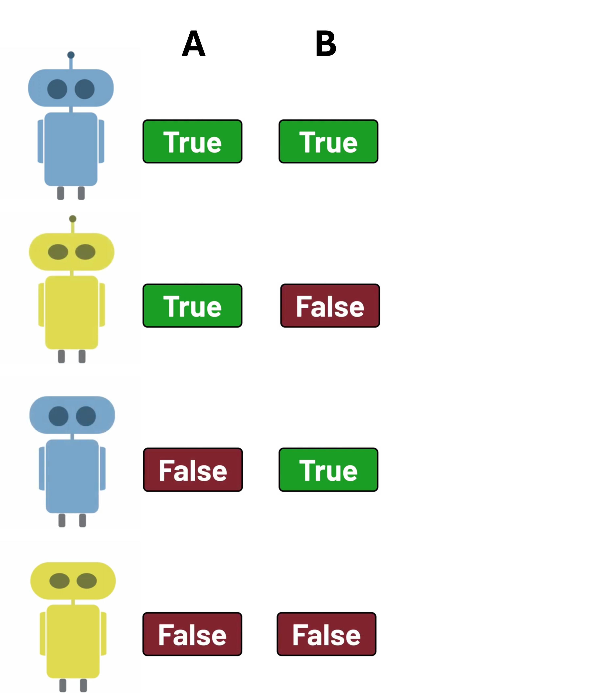
:::

::: {.column .fragment width="34%"}
 

|      $A$       |      $B$       |
|:--------------:|:--------------:|
| [TRUE]{.green} | [TRUE]{.green} |
| [TRUE]{.green} | [FALSE]{.red}  |
| [FALSE]{.red}  | [TRUE]{.green} |
| [FALSE]{.red}  | [FALSE]{.red}  |
:::

::: {.column .fragment width="36%"}
```{r}
#| output-location: default
expand_grid(
  A = c(TRUE, FALSE),
  B = c(TRUE, FALSE))
```
:::
::::::

::: notes
**Truth table** = the set of all possible truth-value assignments (valuations) of a set of atomic variables

**Sample space** = the set of all possible outcomes

**Logical space** = the set of all possible worlds

**State space** = the set of all possible states a system can be in
:::

## Propositional logic: Variables

There are two types of propositional variables: atomic and compound variables

-   An **atomic variable** represents a single, indivisible proposition

-   A **compound variable** is formed by combining one or more atomic variables with **logical operators** (a.k.a. logical connectives or Boolean operators)

 

::: fragment
| English | Math | R |
|:----------------------------------|:------------------|:------------------|
| $X \:$ "*the robot is **NOT** blue*" | $\lnot B$ | `!B` |
| $Y \:$ "*the robot is blue **AND** it has an antenna*" | $B \land A$ | `B & A` |
| $Z \:$ "***IF** the robot has an antenna **THEN** it's **NOT** blue*" | $A \implies \lnot B$ | `A %=>% !B` |
:::

## Propositional logic: Operators

| English         | Math           | R           |             |
|:----------------|:---------------|:------------|:------------|
| **NOT** A       | $\lnot A$      | `!A`        |             |
| A **AND** B     | $A \land B$    | `A & B`     | `all(A, B)` |
| A **OR** B      | $A \lor B$     | `A | B`     | `any(A, B)` |
| A **IMPLIES** B | $A \implies B$ | `A %=>% B`  |             |
| A **IFF** B     | $A \iff B$     | `A %<=>% B` |             |

-   The truth value of an **atomic variable** (e.g., $A$ and $B$) is assigned
-   The truth value of a **compound variable** is determined by the logical operators and truth values of its atomic components, according to the **rules of propositional logic**
-   A **truth table** is the set of all possible combinations of truth-value assignments (valuations) for a set of atomic variables
-   A truth table for $n$ atomic variables consists of $2^n$ possible valuations
-   Valuations are also known as **worlds** ($\omega$), outcomes, states, etc.
-   A truth table is also known as the **universe** ($\Omega$), sample space, state space, etc.

::: notes
In propositional logic, the truth value of an atomic variable is assigned by a truth assignment (also called a valuation), which is a function that maps each atomic variable to either True (T) or False (F).

This assignment is arbitrary and not determined by the logic itself—it depends on the context or interpretation of the variables.

-   To analyze complex formulas, all possible truth assignments are enumerated in a truth table.

-   For $n$ atomic variables, there are $2^n$ possible assignments.
:::

## Propositional logic: Negation rule

**Negation (NOT) operator** $\quad \lnot A \quad A' \quad \bar{A} \quad A^{\complement}$

::: fragment
$\lnot A \:$ ["*the robot does **NOT** have an antenna*"]{.fragment}
:::

:::::: columns
::: {.column .fragment width="30%"}

:::

::: {.column width="34%"}
 
:::

::: {.column width="36%"}
 
:::
::::::

## Propositional logic: Negation rule

**Negation (NOT) operator** $\quad \lnot A \quad A' \quad \bar{A} \quad A^{\complement}$

$\lnot A \:$ "*the robot does **NOT** have an antenna*"

:::::: columns
::: {.column width="30%"}
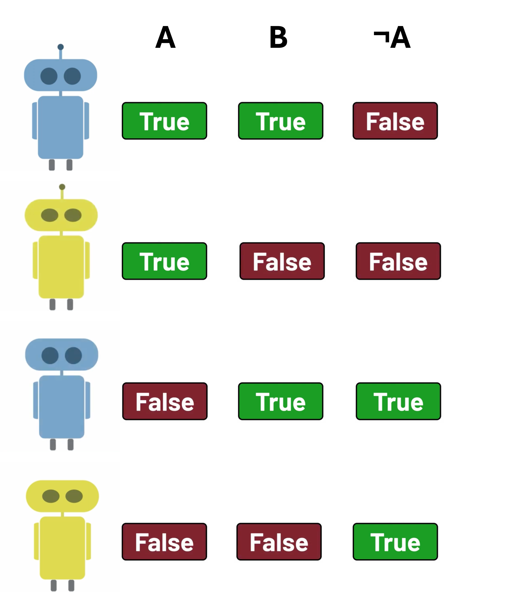
:::

::: {.column .fragment width="34%"}
 

|      $A$       |      $B$       |   $\lnot A$    |
|:--------------:|:--------------:|:--------------:|
| [TRUE]{.green} | [TRUE]{.green} | [FALSE]{.red}  |
| [TRUE]{.green} | [FALSE]{.red}  | [FALSE]{.red}  |
| [FALSE]{.red}  | [TRUE]{.green} | [TRUE]{.green} |
| [FALSE]{.red}  | [FALSE]{.red}  | [TRUE]{.green} |
:::

::: {.column .fragment width="36%"}
```{r}
#| output-location: default
expand_grid(
  A = c(TRUE, FALSE),
  B = c(TRUE, FALSE))
```
:::
::::::

## Propositional logic: Negation rule

**Negation (NOT) operator** $\quad \lnot A \quad A' \quad \bar{A} \quad A^{\complement}$

$\lnot A \:$ "*the robot does **NOT** have an antenna*"

:::::: columns
::: {.column width="30%"}

:::

::: {.column width="34%"}
 

|      $A$       |      $B$       |   $\lnot A$    |
|:--------------:|:--------------:|:--------------:|
| [TRUE]{.green} | [TRUE]{.green} | [FALSE]{.red}  |
| [TRUE]{.green} | [FALSE]{.red}  | [FALSE]{.red}  |
| [FALSE]{.red}  | [TRUE]{.green} | [TRUE]{.green} |
| [FALSE]{.red}  | [FALSE]{.red}  | [TRUE]{.green} |
:::

::: {.column width="36%"}
```{r}
#| output-location: default
expand_grid(
  A = c(TRUE, FALSE),
  B = c(TRUE, FALSE)) %>%
  mutate(`¬A` = !A)
```
:::
::::::

## Propositional logic: Negation rule

**Negation (NOT) operator** $\quad \lnot A \quad A' \quad \bar{A} \quad A^{\complement}$

$\lnot A \:$ "*the robot does **NOT** have an antenna*"

:::::: columns
::: {.column width="30%"}

:::

::: {.column width="34%"}
 

|      $A$       |      $B$       |   $\lnot A$    |
|:--------------:|:--------------:|:--------------:|
| [TRUE]{.green} | [TRUE]{.green} | [FALSE]{.red}  |
| [TRUE]{.green} | [FALSE]{.red}  | [FALSE]{.red}  |
| [FALSE]{.red}  | [TRUE]{.green} | [TRUE]{.green} |
| [FALSE]{.red}  | [FALSE]{.red}  | [TRUE]{.green} |
:::

::: {.column width="36%"}
```{r}
#| output-location: default
expand_grid(
  A = c(TRUE, FALSE),
  B = c(TRUE, FALSE)) %>%
  mutate(`¬A` = !A) %>%
  filter(`¬A`)
```
:::
::::::

## Propositional logic: Negation rule

**Negation (NOT) operator** $\quad \lnot B \quad B' \quad \bar{B} \quad B^{\complement}$

::: fragment
$\lnot B \:$ ["*the robot is **NOT** blue*"]{.fragment}
:::

:::::: columns
::: {.column .fragment width="30%"}
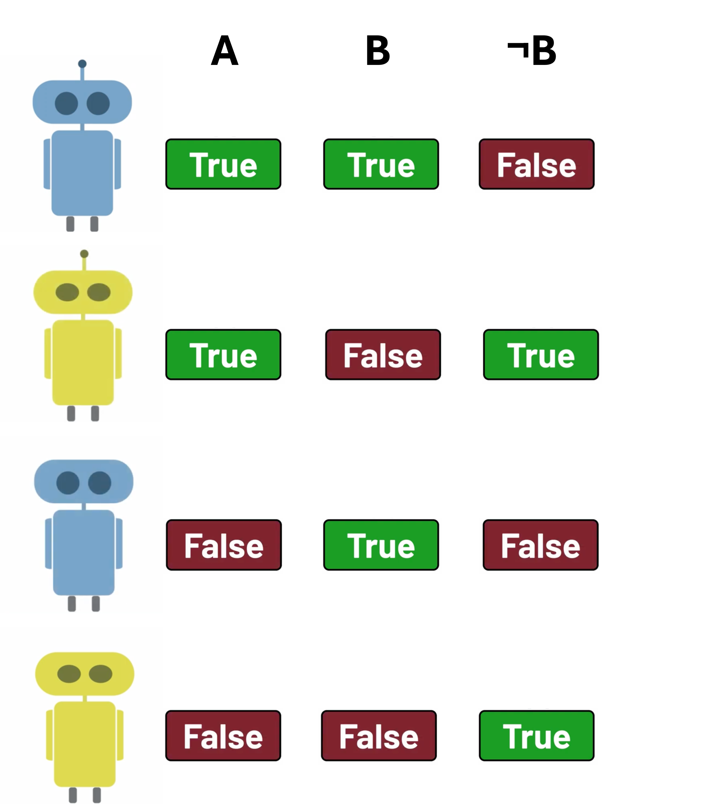
:::

::: {.column .fragment width="34%"}
 

|      $A$       |      $B$       |   $\lnot B$    |
|:--------------:|:--------------:|:--------------:|
| [TRUE]{.green} | [TRUE]{.green} | [FALSE]{.red}  |
| [TRUE]{.green} | [FALSE]{.red}  | [TRUE]{.green} |
| [FALSE]{.red}  | [TRUE]{.green} | [FALSE]{.red}  |
| [FALSE]{.red}  | [FALSE]{.red}  | [TRUE]{.green} |
:::

::: {.column .fragment width="36%"}
```{r}
#| output-location: default
expand_grid(
  A = c(TRUE, FALSE),
  B = c(TRUE, FALSE)) %>%
  mutate(`¬B` = !B)
```
:::
::::::

## Propositional logic: Negation rule

**Negation (NOT) operator** $\quad \lnot B \quad B' \quad \bar{B} \quad B^{\complement}$

$\lnot B \:$ "*the robot is **NOT** blue*"

:::::: columns
::: {.column width="30%"}

:::

::: {.column width="34%"}
 

|      $A$       |      $B$       |   $\lnot B$    |
|:--------------:|:--------------:|:--------------:|
| [TRUE]{.green} | [TRUE]{.green} | [FALSE]{.red}  |
| [TRUE]{.green} | [FALSE]{.red}  | [TRUE]{.green} |
| [FALSE]{.red}  | [TRUE]{.green} | [FALSE]{.red}  |
| [FALSE]{.red}  | [FALSE]{.red}  | [TRUE]{.green} |
:::

::: {.column width="36%"}
```{r}
#| output-location: default
expand_grid(
  A = c(TRUE, FALSE),
  B = c(TRUE, FALSE)) %>%
  mutate(`¬B` = !B) %>%
  filter(`¬B`)
```
:::
::::::

## Propositional logic: Conjunction rule

**Conjunction (AND) operator** $\quad A \land B \quad A \cdot B \quad AB \quad A,B \quad A \cap B$

::: fragment
$A \land B \:$ ["*the robot has an antenna **AND** it's blue*"]{.fragment}
:::

:::::: columns
::: {.column .fragment width="30%"}
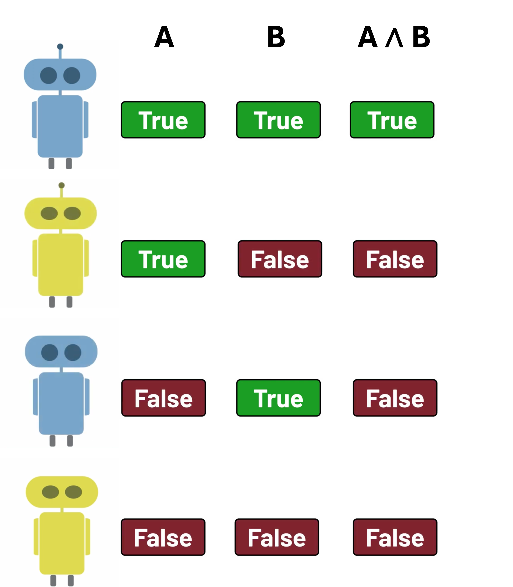
:::

::: {.column .fragment width="34%"}
 

|      $A$       |      $B$       |  $A \land B$   |
|:--------------:|:--------------:|:--------------:|
| [TRUE]{.green} | [TRUE]{.green} | [TRUE]{.green} |
| [TRUE]{.green} | [FALSE]{.red}  | [FALSE]{.red}  |
| [FALSE]{.red}  | [TRUE]{.green} | [FALSE]{.red}  |
| [FALSE]{.red}  | [FALSE]{.red}  | [FALSE]{.red}  |
:::

::: {.column .fragment width="36%"}
```{r}
#| output-location: default
expand_grid(
  A = c(TRUE, FALSE),
  B = c(TRUE, FALSE)) %>%
  mutate(`A ∧ B` = A & B)
```
:::
::::::

::: notes
-   $A \land \lnot A \:$ "*the robot has an antenna **AND** it does **NOT** have an antenna*" is an example of a **contradiction**, i.e., proposition that is always false ($\bot$)

-   $\lnot({A \land \lnot A)}$ is also known as the **law of non-contradiction**
:::

## Propositional logic: Conjunction rule

**Conjunction (AND) operator** $\quad A \land B \quad A \cdot B \quad AB \quad A,B \quad A \cap B$

$A \land B \:$ "*the robot has an antenna **AND** it's blue*"

:::::: columns
::: {.column width="30%"}

:::

::: {.column width="34%"}
 

|      $A$       |      $B$       |  $A \land B$   |
|:--------------:|:--------------:|:--------------:|
| [TRUE]{.green} | [TRUE]{.green} | [TRUE]{.green} |
| [TRUE]{.green} | [FALSE]{.red}  | [FALSE]{.red}  |
| [FALSE]{.red}  | [TRUE]{.green} | [FALSE]{.red}  |
| [FALSE]{.red}  | [FALSE]{.red}  | [FALSE]{.red}  |
:::

::: {.column width="36%"}
```{r}
#| output-location: default
expand_grid(
  A = c(TRUE, FALSE),
  B = c(TRUE, FALSE)) %>%
  mutate(`A ∧ B` = A & B) %>%
  filter(`A ∧ B`)
```
:::
::::::

-   $A \land \lnot A$ "*the robot has an antenna **AND** it does **NOT** have an antenna*" is an example of a **contradiction**, i.e., a proposition that is always false ($\bot$)

-   $\lnot({A \land \lnot A)}$ is also known as the **law of non-contradiction**

## Propositional logic: Disjunction rule

**Disjunction (OR) operator** $\quad A \lor B \quad A + B \quad A \cup B$

::: fragment
$A \lor B \:$ ["*the robot has an antenna **OR** it's blue*"]{.fragment}
:::

:::::: columns
::: {.column .fragment width="30%"}
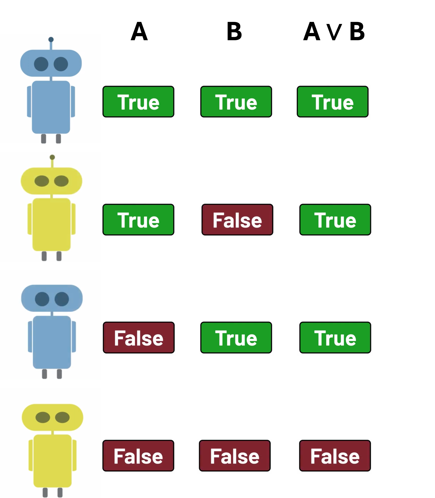
:::

::: {.column .fragment width="34%"}
 

|      $A$       |      $B$       |   $A \lor B$   |
|:--------------:|:--------------:|:--------------:|
| [TRUE]{.green} | [TRUE]{.green} | [TRUE]{.green} |
| [TRUE]{.green} | [FALSE]{.red}  | [TRUE]{.green} |
| [FALSE]{.red}  | [TRUE]{.green} | [TRUE]{.green} |
| [FALSE]{.red}  | [FALSE]{.red}  | [FALSE]{.red}  |
:::

::: {.column .fragment width="36%"}
```{r}
#| output-location: default
expand_grid(
  A = c(TRUE, FALSE),
  B = c(TRUE, FALSE)) %>%
  mutate(`A ∨ B` = A | B)
```
:::
::::::

## Propositional logic: Disjunction rule

**Disjunction (OR) operator** $\quad A \lor B \quad A + B \quad A \cup B$

$A \lor B \:$ "*the robot has an antenna **OR** it's blue*"

:::::: columns
::: {.column width="30%"}

:::

::: {.column width="34%"}
 

|      $A$       |      $B$       |   $A \lor B$   |
|:--------------:|:--------------:|:--------------:|
| [TRUE]{.green} | [TRUE]{.green} | [TRUE]{.green} |
| [TRUE]{.green} | [FALSE]{.red}  | [TRUE]{.green} |
| [FALSE]{.red}  | [TRUE]{.green} | [TRUE]{.green} |
| [FALSE]{.red}  | [FALSE]{.red}  | [FALSE]{.red}  |
:::

::: {.column width="36%"}
```{r}
#| output-location: default
expand_grid(
  A = c(TRUE, FALSE),
  B = c(TRUE, FALSE)) %>%
  mutate(`A ∨ B` = A | B) %>%
  filter(`A ∨ B`)
```
:::
::::::

-   $A \lor \lnot A$ "*the robot has an antenna **OR** it does **NOT** have an antenna*" is an example of a **tautology**, i.e., a proposition that is always true ($\top$)

-   $A \lor \lnot A$ is also known as the **law of excluded middle**

## Propositional logic: Conditional rule

**Conditional/Implication (IF-THEN/IMPLIES) operator** $\quad A \implies B \quad A \rightarrow B \quad A \subseteq B$

::: fragment
$A \implies B \:$ ["***IF** the robot has an antenna **THEN** it's blue*"]{.fragment}
:::

::::::: columns
::: {.column .fragment width="30%"}
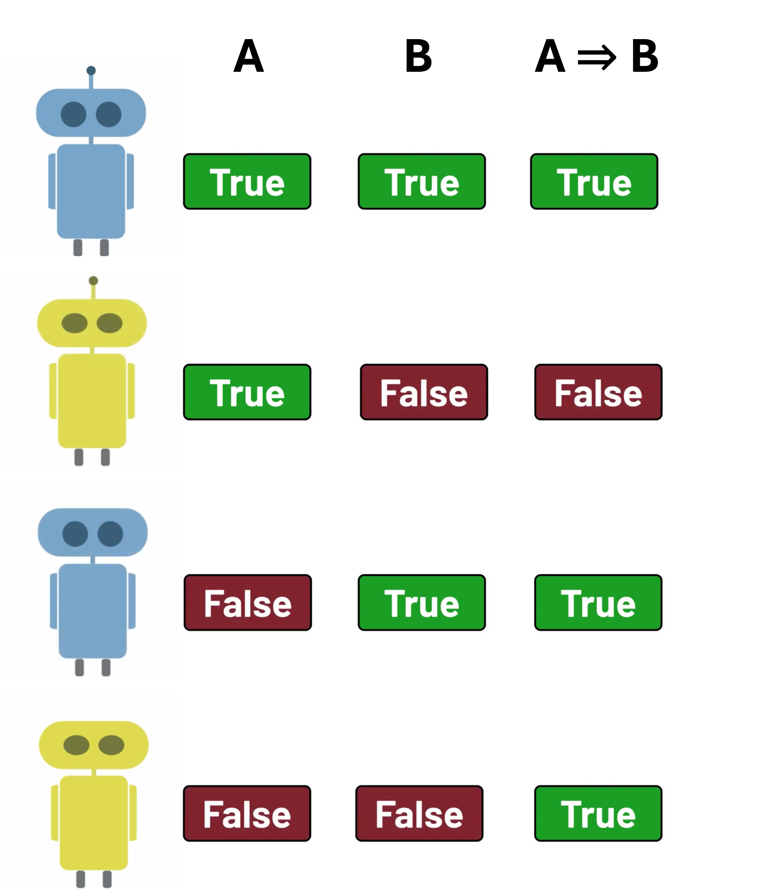
:::

:::: {.column .fragment width="34%"}
 

|      $A$       |      $B$       | $A \implies B$ |
|:--------------:|:--------------:|:--------------:|
| [TRUE]{.green} | [TRUE]{.green} | [TRUE]{.green} |
| [TRUE]{.green} | [FALSE]{.red}  | [FALSE]{.red}  |
| [FALSE]{.red}  | [TRUE]{.green} | [TRUE]{.green} |
| [FALSE]{.red}  | [FALSE]{.red}  | [TRUE]{.green} |

 

::: fragment
```{r}
#| output-location: default
# def conditional operator
`%=>%` <- function(A, B) {
  !A | B
}
```
:::
::::

::: {.column .fragment width="36%"}
```{r}
#| output-location: default
expand_grid(
  A = c(TRUE, FALSE),
  B = c(TRUE, FALSE)) %>%
  mutate(`A ⇒ B` = A %=>% B)
```
:::
:::::::

## Propositional logic: Conditional rule

**Conditional/Implication (IF-THEN/IMPLIES) operator** $\quad A \implies B \quad A \rightarrow B \quad A \subseteq B$

$A \implies B \:$ "***IF** the robot has an antenna **THEN** it's blue*"

:::::: columns
::: {.column width="30%"}

:::

::: {.column width="34%"}
 

|      $A$       |      $B$       | $A \implies B$ |
|:--------------:|:--------------:|:--------------:|
| [TRUE]{.green} | [TRUE]{.green} | [TRUE]{.green} |
| [TRUE]{.green} | [FALSE]{.red}  | [FALSE]{.red}  |
| [FALSE]{.red}  | [TRUE]{.green} | [TRUE]{.green} |
| [FALSE]{.red}  | [FALSE]{.red}  | [TRUE]{.green} |

 

```{r}
#| output-location: default
# def conditional operator
`%=>%` <- function(A, B) {
  !A | B
}
```
:::

::: {.column width="36%"}
```{r}
#| output-location: default
expand_grid(
  A = c(TRUE, FALSE),
  B = c(TRUE, FALSE)) %>%
  mutate(`A ⇒ B` = A %=>% B) %>%
  filter(`A ⇒ B`)
```
:::
::::::

-   $A$ is the **antecedent**
-   $B$ is the **consequent**

::: notes
Conditional (→) represents a sufficient condition and implies a necessary condition

A is a sufficient condition for B: If A is true, then B must be true

B is a necessary condition for A: If B is false, A cannot be true

Example:

If it is raining (A), then the ground is wet (B).
	
	•	Sufficient: Rain guarantees the ground is wet
	
	•	Necessary: For it to be raining, the ground must be wet (if the ground isn’t wet, it can’t be raining)
	
:::

## Propositional logic: Biconditional rule

**Biconditional (IFF) operator** $\quad A \iff B \quad A \leftrightarrow B \quad A = B$

::: fragment
$A \iff B \:$ ["*the robot has an antenna **IFF** it's blue*"]{.fragment}
:::

::::::: columns
::: {.column .fragment width="30%"}
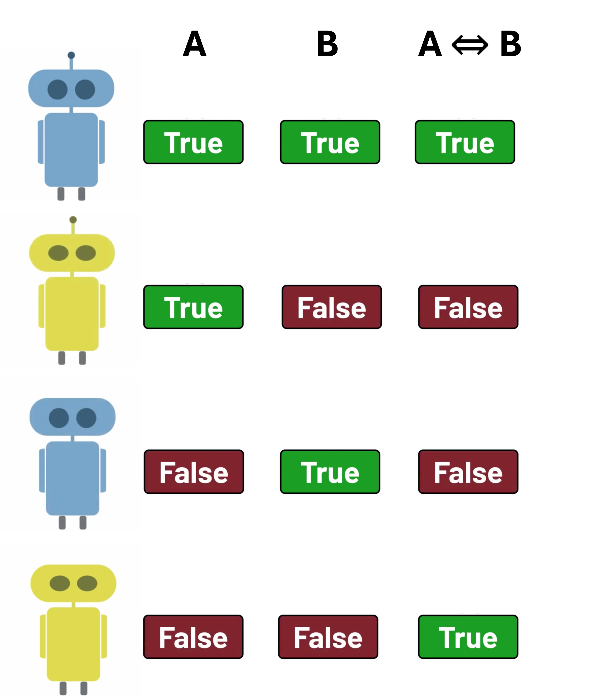
:::

:::: {.column .fragment width="34%"}
 

|      $A$       |      $B$       |   $A \iff B$   |
|:--------------:|:--------------:|:--------------:|
| [TRUE]{.green} | [TRUE]{.green} | [TRUE]{.green} |
| [TRUE]{.green} | [FALSE]{.red}  | [FALSE]{.red}  |
| [FALSE]{.red}  | [TRUE]{.green} | [FALSE]{.red}  |
| [FALSE]{.red}  | [FALSE]{.red}  | [TRUE]{.green} |

 

::: fragment
```{r}
#| output-location: default
# def biconditional operator 
`%<=>%` <- function(A, B) {
  (A %=>% B) & (B %=>% A)
}
```
:::
::::

::: {.column .fragment width="36%"}
```{r}
#| output-location: default
expand_grid(
  A = c(TRUE, FALSE),
  B = c(TRUE, FALSE)) %>%
  mutate(`A ⇔ B` = A %<=>% B)
```
:::
:::::::

## Propositional logic: Biconditional rule

**Biconditional (IFF) operator** $\quad A \iff B \quad A \leftrightarrow B \quad A = B$

$A \iff B \:$ "*the robot has an antenna **IFF** it's blue*"

:::::: columns
::: {.column width="30%"}

:::

::: {.column width="34%"}
 

|      $A$       |      $B$       |   $A \iff B$   |
|:--------------:|:--------------:|:--------------:|
| [TRUE]{.green} | [TRUE]{.green} | [TRUE]{.green} |
| [TRUE]{.green} | [FALSE]{.red}  | [FALSE]{.red}  |
| [FALSE]{.red}  | [TRUE]{.green} | [FALSE]{.red}  |
| [FALSE]{.red}  | [FALSE]{.red}  | [TRUE]{.green} |

 

```{r}
#| output-location: default
# def biconditional operator 
`%<=>%` <- function(A, B) {
  (A %=>% B) & (B %=>% A)
}
```
:::

::: {.column width="36%"}
```{r}
#| output-location: default
expand_grid(
  A = c(TRUE, FALSE),
  B = c(TRUE, FALSE)) %>%
  mutate(`A ⇔ B` = A %<=>% B) %>%
  filter(`A ⇔ B`)
```
:::
::::::

::: notes
Biconditional (↔) represents a necessary and sufficient condition

A is necessary and sufficient for B, and vice versa

Example: You can drive (A) iff you have a license (B)
:::

## Propositional logic: Logical equivalence

::: fragment
Two propositions $X$ and $Y$ are **logically equivalent** ($X \equiv Y$) iff they have the same truth value in every possible world
:::

::: fragment
For example:
:::

::::: columns
::: {.column .fragment}
 

|                |                |       X        |        Y         |
|:--------------:|:--------------:|:--------------:|:----------------:|
|      $A$       |      $B$       | $A \implies B$ | $\lnot A \lor B$ |
| [TRUE]{.green} | [TRUE]{.green} | [TRUE]{.green} |  [TRUE]{.green}  |
| [TRUE]{.green} | [FALSE]{.red}  | [FALSE]{.red}  |  [FALSE]{.red}   |
| [FALSE]{.red}  | [TRUE]{.green} | [TRUE]{.green} |  [TRUE]{.green}  |
| [FALSE]{.red}  | [FALSE]{.red}  | [TRUE]{.green} |  [TRUE]{.green}  |
:::

::: {.column .fragment}
```{r}
#| output-location: default
expand_grid(
  A = c(TRUE, FALSE),
  B = c(TRUE, FALSE)) %>%
  mutate(
    X = A %=>% B,
    Y = !A | B)
```
:::
:::::

## Propositional logic: Logical equivalence

Two propositions $X$ and $Y$ are **logically equivalent** ($X \equiv Y$) iff they have the same truth value in every possible world

For example:

::::: columns
::: column
 

|   |   | X | Y |
|:----------------:|:----------------:|:----------------:|:-----------------:|
| $A$ | $B$ | $A \lor B$ | $\lnot (\lnot A \land \lnot B)$ |
| [TRUE]{.green} | [TRUE]{.green} | [TRUE]{.green} | [TRUE]{.green} |
| [TRUE]{.green} | [FALSE]{.red} | [TRUE]{.green} | [TRUE]{.green} |
| [FALSE]{.red} | [TRUE]{.green} | [TRUE]{.green} | [TRUE]{.green} |
| [FALSE]{.red} | [FALSE]{.red} | [FALSE]{.red} | [FALSE]{.red} |
:::

::: column
```{r}
#| output-location: default
expand_grid(
  A = c(TRUE, FALSE),
  B = c(TRUE, FALSE)) %>%
  mutate(
    X = A | B,
    Y = !(!A & !B))
```
:::
:::::

::: fragment
Alternatively:

Two propositions $X$ and $Y$ are **logically equivalent** iff $X \iff Y$ is a tautology
:::

## Propositional logic: Logical entailment

::: fragment
A proposition $X$ **logically entails** another proposition $Y$ ($X \models Y$) iff in every possible world where $X$ is true, $Y$ is also true
:::

::::: columns
::: {.column .fragment}
For example:

 

|                |                |       X        |       Y        |
|:--------------:|:--------------:|:--------------:|:--------------:|
|      $A$       |      $B$       |  $A \land B$   |   $A \lor B$   |
| [TRUE]{.green} | [TRUE]{.green} | [TRUE]{.green} | [TRUE]{.green} |
| [TRUE]{.green} | [FALSE]{.red}  | [FALSE]{.red}  | [TRUE]{.green} |
| [FALSE]{.red}  | [TRUE]{.green} | [FALSE]{.red}  | [TRUE]{.green} |
| [FALSE]{.red}  | [FALSE]{.red}  | [FALSE]{.red}  | [FALSE]{.red}  |
:::

::: {.column .fragment}
```{r}
#| output-location: default
expand_grid(A = c(TRUE, FALSE), B = c(TRUE, FALSE)) %>%
  mutate(
    X = A & B,
    Y = A | B)
```
:::
:::::

::: fragment
Alternatively:

A proposition $X$ **logically entails** another proposition $Y$ iff $X \implies Y$ is a tautology
:::

## Logical entailment and deductive validity

-   The deductive validity of a logical argument is determined by checking whether the conclusion is guaranteed to be true, assuming the premises are true

-   In other words, a logical argument is deductively valid iff the premises ($E$) logically entail the conclusion ($H$)

::: fragment
$$E \models H$$
:::

::: fragment
$$
\boxed{V(\frac{E}{H}) = \begin{cases} \text{True} & \text{if } E \models H \\ \text{False} & \text{otherwise} \end{cases}}
$$
:::

## Logical entailment and deductive validity

::: nonincremental
-   The deductive validity of a logical argument is determined by checking whether the conclusion is guaranteed to be true, assuming the premises are true

-   In other words, a logical argument is deductively valid iff the premises ($E$) logically entail the conclusion ($H$)
:::

$$E \models H$$
$$
\boxed{V(H \mid E) = \begin{cases} \text{True} & \text{if } E \models H \\ \text{False} & \text{otherwise} \end{cases}}
$$


## Artificial intelligence for deductive reasoning

-   We will implement this function in R as the AI for deductive reasoning:

    -   **Input**: A deductive argument with one or more premises (`E`) and a conclusion (`H`)

    -   **Output**: A `Logical` value (`TRUE` or `FALSE`), indicating whether the argument is deductively valid or not

-   First, we will program this computer algorithm step-by-step using functions from the [`tidyverse`](https://www.tidyverse.org/) package

-   Then, we will wrap it up into a reusable function called `is.valid` using functions from the [`rlang`](https://rlang.r-lib.org/) package

-   We will use the *proportional syllogism* (a classical argument that is foundational to statistical inference) as an example

## Proportional syllogism

The proportional syllogism is a logical argument that draws a conclusion based on a proportion

::::: columns
::: {.column .fragment .nonincremental}
**Premises**

-   A bag contains two blue balls and one white ball

-   One ball is drawn from the bag

**Conclusion**

-   A blue ball is drawn from the bag
:::

::: {.column .fragment .nonincremental}
$$
\begin{array}{ll}
1. & B1 \lor B2 \lor W \\
2. & \neg((B1 \land B2) \lor (B1 \land W) \lor (B2 \land W)) \\
\hline
\therefore & B1 \lor B2
\end{array}
$$
:::
:::::

## Proportional syllogism

The proportional syllogism is a logical argument that draws a conclusion based on a proportion

$$
\begin{array}{ll}
1. & B1 \lor B2 \lor W \\
2. & \neg((B1 \land B2) \lor (B1 \land W) \lor (B2 \land W)) \\
\hline
\therefore & B1 \lor B2
\end{array}
$$

[We will determine the deductive validity of this logical argument in three steps:]{.fragment}

1.  Build the truth table (the set of all possible worlds/truth-value assignments of the set of atomic variables in the argument)

2.  Add premises and conclusion (`H`) to the truth table

3.  Identify the possible worlds where all the premises (`E`) are true

4.  Check that the logical argument is deductively valid ($E \models H$), i.e., that the conclusion is true in all those possible worlds


## Proportional syllogism

Build the truth table

```{r}
expand_grid(
  B1 = c(TRUE, FALSE),
  B2 = c(TRUE, FALSE),
  W  = c(TRUE, FALSE))
```

## Proportional syllogism

Add premises and conclusion (`H`) to the truth table

```{r}
expand_grid(B1 = c(TRUE, FALSE), B2 = c(TRUE, FALSE), W = c(TRUE, FALSE)) %>%
  mutate(
    P1 = B1 | B2 | W,
    P2 = !((B1 & B2) | (B1 & W) | (B2 & W)),
    H  = B1 | B2
  )
```

## Proportional syllogism

Identify the possible worlds where all the premises (`E`) are true

```{r}
#| output-location: default
expand_grid(B1 = c(TRUE, FALSE), B2 = c(TRUE, FALSE), W  = c(TRUE, FALSE)) %>%
  mutate(
    P1 = B1 | B2 | W,
    P2 = !((B1 & B2) | (B1 & W) | (B2 & W)),
    E  = P1 & P2,
    H  = B1 | B2
  )
```

## Proportional syllogism

Identify the possible worlds where all the premises (`E`) are true

```{r}
#| output-location: default
expand_grid(B1 = c(TRUE, FALSE), B2 = c(TRUE, FALSE), W  = c(TRUE, FALSE)) %>%
  mutate(
    P1 = B1 | B2 | W,
    P2 = !((B1 & B2) | (B1 & W) | (B2 & W)),
    E  = P1 & P2,
    H  = B1 | B2
  ) %>%
  filter(E)
```

## Proportional syllogism

Check that the logical argument is deductively valid ($E \models H$)

```{r}
#| output-location: default
expand_grid(B1 = c(TRUE, FALSE), B2 = c(TRUE, FALSE), W  = c(TRUE, FALSE)) %>%
  mutate(
    P1 = B1 | B2 | W,
    P2 = !((B1 & B2) | (B1 & W) | (B2 & W)),
    E  = P1 & P2,
    H  = B1 | B2
  ) %>%
  filter(E) %>%
  pull(H)
```

## Proportional syllogism

Check that the logical argument is deductively valid ($E \models H$)

```{r}
#| output-location: default
expand_grid(B1 = c(TRUE, FALSE), B2 = c(TRUE, FALSE), W  = c(TRUE, FALSE)) %>%
  mutate(
    P1 = B1 | B2 | W,
    P2 = !((B1 & B2) | (B1 & W) | (B2 & W)),
    E  = P1 & P2,
    H  = B1 | B2
  ) %>%
  filter(E) %>%
  pull(H) %>%
  mean()
```

## Proportional syllogism

Check that the logical argument is deductively valid ($E \models H$)

```{r}
#| output-location: default
expand_grid(B1 = c(TRUE, FALSE), B2 = c(TRUE, FALSE), W  = c(TRUE, FALSE)) %>%
  mutate(
    P1 = B1 | B2 | W,
    P2 = !((B1 & B2) | (B1 & W) | (B2 & W)),
    E  = P1 & P2,
    H  = B1 | B2
  ) %>%
  filter(E) %>%
  pull(H) %>%
  all()
```

::: fragment
{height="300"}
:::

## Proportional syllogism

Artificial intelligence for deductive reasoning implemented in a single line of R code! 🤯

```{r}
#| output-location: default
expand_grid(B1 = c(TRUE, FALSE), B2 = c(TRUE, FALSE), W  = c(TRUE, FALSE)) %>% mutate(P1 = B1 | B2 | W, P2 = !((B1 & B2) | (B1 & W) | (B2 & W)), E  = P1 & P2, H  = B1 | B2) %>% filter(E) %>% pull(H) %>% all()
```

## Artificial intelligence for deductive reasoning

```{r}
#| output-location: default
library(rlang)
```

```{r}
#| output-location: default
is.valid <- function(..., H) {
  # capture the premises as quosures
  premises <- enquos(...)
  
  # conjoin the premises as evidence
  evidence_expr <- reduce(premises, ~ expr((!! .x) & (!! .y)))
  
  # capture the conclusion/hypothesis as a quosure
  hypothesis_expr <- enquo(H)
  
  # extract the atomic variables from the evidence and hypothesis
  variables <- unique(c(
    all.vars(evidence_expr),
    all.vars(hypothesis_expr)
  ))
  
  # build the truth table (set of all possible worlds)
  tt <- expand_grid(!!!set_names(rep(list(c(TRUE, FALSE)), length(variables)), variables))
  
  # add evidence and hypothesis to the truth table
  # check that the logical argument deductively valid: hypothesis is true in all possible worlds where evidence is true
  tt %>%
    mutate(
      E = !!evidence_expr,
      H = !!hypothesis_expr
    ) %>%
    filter(E) %>%
    pull(H) %>%
    all()
}
```

## Classical valid and invalid deductive arguments

::::: columns
::: {.column width="50%"}
***Modus ponens***

$$
\begin{array}{c}
A \implies B \\
A \\
\hline
B
\end{array}
$$
:::

::: {.column width="50%"}
***Modus tollens***

$$
\begin{array}{c}
A \implies B \\
\neg B \\
\hline
\neg A
\end{array}
$$
:::
:::::

::::: columns
::: {.column width="50%"}
**Affirming the consequent**

$$
\begin{array}{c}
A \implies B \\
B \\
\hline
A
\end{array}
$$
:::

::: {.column width="50%"}
**Denying the antecedent**

$$
\begin{array}{c}
A \implies B \\
\neg A \\
\hline
\neg B
\end{array}
$$
:::
:::::

```{r}
#| include: false
library(flextable)

P <- function(..., H, table = TRUE, flex = TRUE) {
  # capture the premises/evidence as a list of quosures
  premises <- enquos(...)
  
  # capture the conclusion/hypothesis as a quosure
  conclusion <- enquo(H)
  
  # extract variable names
  vars <- unique(c(unlist(lapply(premises, all.vars)), all.vars(conclusion)))
  
  # build truth table
  truth_table <- expand.grid(replicate(length(vars), c(TRUE, FALSE), simplify = FALSE))
  colnames(truth_table) <- vars
  
  # evaluate premises in the context of the truth table
  for (i in seq_along(premises)) {
    truth_table[[paste0("P", i)]] <- eval_tidy(premises[[i]], data = truth_table)
  }
  
  # evaluate evidence and conclusion/hypothesis in the context of the truth table
  truth_table <- truth_table %>%
    mutate(
      E = if_all(starts_with("P"), identity),
      H = eval_tidy(conclusion, data = truth_table)
    )
  
  # calculate P(H | E)
  P_value <- truth_table %>%
    summarise(P = mean(H[E])) %>%
    pull(P)
  
  # return P value if truth table output is not requested
  if (!table) {
    return(P_value)
  }
  
  # return truth table if formatted truth table output is not requested
  if (!flex) {
    return(truth_table)
  }
  
  # define colors
  highlight_color <- "beige"  # Standard HTML color name
  true_color <- "darkgreen"
  false_color <- "darkred"
  
  # convert the truth table into a flextable
  truth_table_formatted <- flextable(truth_table) %>%
    bold(part = "header") %>%  # Bold the header
    bold(part = "footer") %>%  # Bold the footer
    bg(i = which(truth_table$E == TRUE), bg = highlight_color, part = "body")  # Highlight E = TRUE rows
  
  # apply text colors
  for (col in colnames(truth_table)) {
    truth_table_formatted <- truth_table_formatted %>%
      color(i = which(truth_table[[col]] == TRUE), j = col, color = true_color) %>%
      color(i = which(truth_table[[col]] == FALSE), j = col, color = false_color)
  }
  
  # add footer with the calculated P(H | E) value
  truth_table_formatted <- truth_table_formatted %>%
    add_footer_row(
      values = paste("P(H | E) =", round(P_value, 3)),
      colwidths = ncol(truth_table)
    ) %>%
    align(align = "right", part = "footer")

  # return formatted truth table
  return(truth_table_formatted)
}
```

## *Modus ponens*

*Modus ponens* is a logical argument that affirms the antecedent to conclude the consequent

::::::::: columns
::::: column
::: {.fragment .nonincremental}
**Premises**

-   If it is raining, then the ground is wet

-   It is raining

**Conclusion**

-   The ground is wet
:::

::: fragment
$$
\begin{array}{ll}
1. & R \implies W \\
2. & R \\
\hline
\therefore & W
\end{array}
$$
:::
:::::

::::: column
::: fragment
```{r}
#| echo: false
#| output-location: default
P(P1 = R %=>% W, P2 = R, H  = W)
```
:::

::: fragment
```{r}
#| output-location: default
is.valid(
  P1 = R %=>% W,
  P2 = R,       
  H  = W)
```
:::
:::::
:::::::::

## Affirming the consequent

Affirming the consequent is a logical argument that affirms the consequent to conclude the antecedent

::::::::: columns
::::: column
::: {.fragment .nonincremental}
**Premises**

-   If it is raining, then the ground is wet

-   The ground is wet

**Conclusion**

-   It is raining
:::

::: fragment
$$
\begin{array}{ll}
1. & R \implies W \\
2. & W \\
\hline
\therefore & R
\end{array}
$$
:::
:::::

::::: column
::: fragment
```{r}
#| echo: false
#| output-location: default
P(P1 = R %=>% W, P2 = W, H  = R)
```
:::

::: fragment
```{r}
#| output-location: default
is.valid(
  P1 = R %=>% W,
  P2 = W,
  H  = R)
```
:::
:::::
:::::::::

## *Modus tollens*

*Modus tollens* is a logical argument that denies the consequent to conclude the negation of the antecedent

::::::::: columns
::::: column
::: {.fragment .nonincremental}
**Premises**

-   If it is raining, then the ground is wet

-   The ground is not wet

**Conclusion**

-   It is not raining
:::

::: fragment
$$
\begin{array}{ll}
1. & R \implies W \\
2. & \neg W \\
\hline
\therefore & \neg R
\end{array}
$$
:::
:::::

::::: column
::: fragment
```{r}
#| echo: false
#| output-location: default
P(P1 = R %=>% W, P2 = !W, H  = !R)
```
:::

::: fragment
```{r}
#| output-location: default
is.valid(
  P1 = R %=>% W,
  P2 = !W,
  H  = !R)
```
:::
:::::
:::::::::


## Denying the antecedent

Denying the antecedent is a logical argument that denies the antecedent to conclude the negation of the consequent

::::::::: columns
::::: column
::: {.fragment .nonincremental}
**Premises**

-   If it is raining, then the ground is wet

-   It is not raining

**Conclusion**

-   The ground is not wet
:::

::: fragment
$$
\begin{array}{c}
1. & R \implies W \\
2. & \neg R \\
\hline
\therefore & \neg W
\end{array}
$$
:::
:::::

::::: column
::: fragment
```{r}
#| echo: false
#| output-location: default
P(P1 = R %=>% W, P2 = !R, H  = !W)
```
:::

::: fragment
```{r}
#| output-location: default
is.valid(
  P1 = R %=>% W,
  P2 = !R,
  H  = !W)
```
:::
:::::
:::::::::

## Hypothetical syllogism

The hypothetical syllogism is a logical argument that combines two conditional statements to conclude a third conditional statement

::::::::: columns
::::: column
::: {.fragment .nonincremental}
**Premises**

-   If it is raining, then the ground is wet

-   If the ground is wet, then the plants grow

**Conclusion**

-   If it is raining, then the plants grow
:::

::: fragment
$$
\begin{array}{c}
1. & R \implies W \\
2. & W \implies G \\
\hline
\therefore & R \implies G
\end{array}
$$
:::
:::::

::::: column
::: fragment
```{r}
#| echo: false
#| output-location: default
P(P1 = R %=>% W, P2 = W %=>% G, H  = R %=>% G)
```
:::

::: fragment
```{r}
#| output-location: default
is.valid(
  P1 = R %=>% W,
  P2 = W %=>% G,
  H  = R %=>% G)
```
:::
:::::
:::::::::

## Proportional syllogism

The proportional syllogism is a logical argument that draws a conclusion based on a proportion

::::::::::: columns
::::::: column
::: {.fragment .nonincremental}
**Premises**

-   A bag contains two blue balls and one white ball

-   One ball is drawn from the bag

**Conclusion**

-   A blue ball is drawn from the bag
:::

::: notes
Propositional symbols/variables:

B1 = "Blue ball 1 is drawn" B2 = "Blue ball 2 is drawn" W = "The white ball is drawn"

The propositional symbols/variables used in the premises define the set of all possible worlds/outcomes (i.e., truth table/logical space/sample space) and the logical structure of the premises/the knowledge represented by the premises restricts this set to the subset in which all premises are true.

The premises logically constrain the possible worlds/outcomes.

By the principle of indifference (logical probability), each possible world/outcome in the truth table is equally likely.
:::

::: notes
$$
P(A) = \lim_{n \to \infty} \frac{\text{Number of times } A \text{ occurs in } n \text{ trials}}{n}
$$ Frequentist probability requires infinite trials and physical mixing because it depends on empirical relative frequencies.

Frequentist probability is undefined for a single-instance event like drawing one ball.

Logical probability is a better framework in this case because it relies on counting possible worlds, not repeated trials.

Frequentist probability cannot actually compute probabilities.

Logical probability actually computes probability—frequentists can only estimate it.

Frequentist probability is useless in one-time events—it requires infinite trials to be strictly valid.

If you want a coherent theory of probability that always applies, you must use logical (Bayesian) probability.

Despite these flaws, frequentist probability persists in practice because: 1. It works well for large-scale empirical data (e.g., coin flips, medical studies). 2. It avoids subjective priors (which some mistakenly see as a flaw in Bayesian probability). 3. Historically, probability theory was developed with physical randomness in mind (games of chance, dice, coins).
:::

 

::: fragment
$$
\begin{array}{ll}
1. & B1 \lor B2 \lor W \\
2. & \neg((B1 \land B2) \lor (B1 \land W) \lor (B2 \land W)) \\
\hline
\therefore & B1 \lor B2
\end{array}
$$
:::
:::::::

::::: column
::: fragment
```{r}
#| echo: false
#| output-location: default
P(P1 = B1 | B2 | W, P2 = !((B1 & B2) | (B1 & W) | (B2 & W)), H  = B1 | B2)
```
:::

::: fragment
```{r}
#| output-location: default
is.valid(
  P1 = B1 | B2 | W,                         
  P2 = !((B1 & B2) | (B1 & W) | (B2 & W)),
  H  = B1 | B2)
```
:::
:::::
:::::::::::

## Statistical syllogism

The statistical syllogism is a logical argument that draws a conclusion about a specific case based on a generalization

::: {.fragment .nonincremental}
**Premises**

-   Most birds can fly

-   Pingu is a bird

**Conclusion**

-   Pingu can fly
:::

## Inductive generalization

Inductive generalization (a.k.a. inductive inference) is a logical argument that draws a conclusion about a generalization based on a specific case

This type of reasoning moves in the opposite direction of the statistical syllogism: it uses specific cases (observations) as evidence to infer a general conclusion

::: {.fragment .nonincremental}
**Premises**

-   Pingu is a bird and cannot fly

-   Kiwi is a bird and cannot fly

-   Ostrich is a bird and cannot fly

**Conclusion**

-   Most birds cannot fly
:::

## Scientific reasoning is inductive reasoning

::: fragment
In science, inductive reasoning is often defined as reasoning from the specific to the general, i.e., **inductive generalization**:
:::

-   from a sample to a population
-   from specific observations to a general conclusion

::: fragment
In logic, inductive reasoning is defined as **risky reasoning** (from true premises to uncertain conclusion/a conclusion that might be false)
:::

::: fragment
There are many types of inductive reasoning:
:::

-   **inductive generalization** (from the specific to the general)
-   **statistical syllogism** (from the general to the specific)
-   **analogical reasoning** (from specific to specific or from general to general)
-   **forecasting** (from the past to the future)
-   **abductive reasoning** (inference to the best/most plausible explanation)
-   **causal inference** (from the factual to the counterfactual)

::: notes
Strong inductive reasoning (where the conclusion is probable if the premises are true) differs from valid deductive reasoning, where the conclusion is certain if the premises are true
:::

::: notes
Inductive reasoning is inherently uncertain. It deals only in degrees to which, given the premises, the conclusion is credible or plausible according to some theory of evidence. Examples include many-valued logic, Dempster–Shafer theory, or probability theory with rules for inference such as Bayes' rule.

Evidence refers to the information or data that supports a claim, hypothesis, or conclusion of an argument.

Types of evidence:

-   **Empirical Evidence:** Based on direct observation or experience.
-   **Anecdotal Evidence:** Relies on personal stories or individual cases.
-   **Statistical Evidence:** Involves numerical data and statistical analyses.
-   **Expert Testimony:** Comprises statements from credible and knowledgeable individuals.

There are various theories of evidence, including:

-   **Foundationalism**: Posits that certain beliefs or pieces of evidence serve as a foundational base for others. These foundational beliefs are considered self-evident or incorrigible.
-   **Coherentism**: Asserts that the justification of beliefs relies on their coherence with other beliefs within a systematic framework. A set of beliefs is considered justified if they form a coherent and interconnected network.
-   **Reliabilism**: Focuses on the reliability of the processes or methods used to obtain evidence. A belief is considered justified if it is produced by a reliable cognitive process.
-   **Bayesianism**: Interprets probability as a measure of belief or confidence, updating beliefs based on new evidence using Bayes' theorem.

These theories provide different perspectives on how evidence should be assessed and interpreted, offering guidance on what justifies belief and inference in various epistemic contexts.

**Frequentism** is more accurately described as a statistical approach rather than a comprehensive theory of evidence. However, frequentist statistical methods are commonly employed to analyze and interpret evidence in scientific research.

In frequentist statistics:

-   **Probability is interpreted as long-run relative frequency:** Frequentists view probability as the limit of the relative frequency of an event occurring in a large number of trials. For example, the probability of getting heads in a coin toss is the limit of the number of heads divided by the total number of tosses as the number of tosses becomes very large.

-   **Parameters are considered fixed and unknown:** In frequentist statistics, parameters are fixed, unknown values. Probability statements are made about the observed data, not about the parameters.

Frequentist methods include hypothesis testing, confidence intervals, and p-values, among others. These techniques are widely used in scientific research to draw conclusions from empirical data. While frequentism is primarily a statistical approach, it plays a crucial role in shaping how evidence is evaluated in various fields.

In summary, frequentism is not a comprehensive theory of evidence like Bayesianism or other epistemological theories. Instead, it is a statistical framework used to analyze evidence and make inferences based on observed data.
:::

## Statistical inference is inductive reasoning

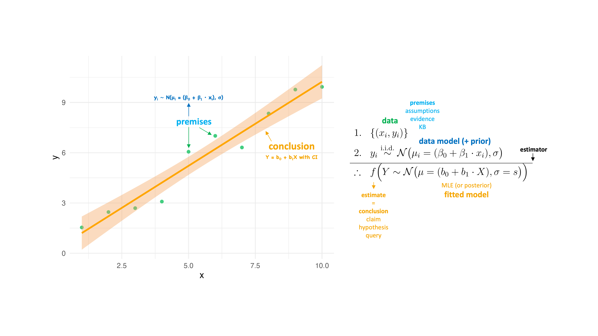

##  {background-image="images/thats_all_folks.jpg" background-size="50%"}

## Deductive logic

-   Argument forms

    -   Modus ponens

    -   Modus tollens

    -   The hypothetical syllogism

    -   Proportional syllogism

    -   The statistical syllogism

    -   Inductive generalization

    -   Induction by confirmation

    -   Analogical argument

## Induction by confirmation

-   Hypothesis

-   Prediction

-   Data

## Induction by confirmation

-   The crucial experiment

-   The inference to the best explanation

-   The best hypothesis

## Proportional syllogism

-   Probability and proportion

-   Probability theory

## Inductive generalization

XXX

## Bayes' rule

XXX

## Knowledge-based AI

-   Logic (e.g., propositional logic or first-order logic) is a language used to represent knowledge and to reason (draw conclusions, make inferences) based on this knowledge

-   Logic is used in a knowledge-based AI agent to represent knowledge and to reason (draw conclusions, make inferences) based on this knowledge

-   In deductive logic the goal is to determine whether an argument is valid (the premises entail the conclusion), using some inference algorithm or rules

-   In inductive logic the goal is to determine whether an argument is strong (the premises partially entail the conclusion), using some inference algorithm or rules

## Deductive reasoning: Propositional logic

-   The goal is to **prove** that a conclusion/hypothesis/query is true given some premises/evidence/knowledge known or assumed to be true

-   $E \models C$

-   $P(C \mid E) = 1$

## Arguments/Rules of deductive inference

Knowledge-based AI capable of logical reasoning

Knowledge engineering

Argument forms as inference rules of propositional logic/deductive inference:

-   *Modus ponens*

-   And elimination rule

-   Unit resolution rule

-   Double negation elimination rule

-   Implication elimination rule

-   Biconditional elimination rule

-   De Morgan's law (1)

-   De Morgan's law (2)

-   Distributive law (1)

-   Distributive law (2)

-   *Modus tollens*

## Scientific reasoning is inductive reasoning

-   The rules of **propositional logic** provide a formal mathematical framework for **deductive reasoning** by determining whether a conclusion necessarily follows from the premises

::: notes
-   The rules of propositional logic provide a formal mathematical framework for deductive reasoning by guaranteeing that if the premises are true, then the conclusion must also be true

-   The rules of propositional logic provide a formal mathematical framework for deductive reasoning by determining whether the premises logically entail the conclusion (i.e., whether the conclusion is true in every model where the premises are true)
:::

-   The rules of **probability theory** provide a formal mathematical framework for **inductive reasoning** by quantifying the plausibility of a conclusion given the premises

::::: columns
::: {.column .fragment width="50%"}
[{fig-align="center" height="300"}](https://bayes.wustl.edu/etj/prob/book.pdf)
:::

::: {.column .fragment width="50%"}

:::
:::::

## Logical probability function {.hidden}

```{r}
#| output-location: default

# Main function to calculate the proportion
P <- function(..., H) {
  # Capture all premises (P1, P2, ...) as quosures
  premises <- enquos(...)
  
  # Combine all premises into a single evidence expression (E)
  evidence_expr <- reduce(premises, ~ expr((!! .x) & (!! .y)))
  
  # Capture the hypothesis as a quosure
  hypothesis_expr <- enquo(H)
  
  # Extract variables from evidence and hypothesis
  variables <- unique(c(
    all.vars(evidence_expr),
    all.vars(hypothesis_expr)
  ))
  
  # Generate set of all possible worlds
  possible_worlds <- expand_grid(!!!set_names(rep(list(c(TRUE, FALSE)), length(variables)), variables))
  
  # Filter set of all possible worlds where evidence is true and calculate proportion where hypothesis is true
  possible_worlds %>%
    mutate(
      E = !!evidence_expr,
      H = !!hypothesis_expr
    ) %>%
    filter(E) %>%
    summarize(proportion = mean(H)) %>%
    pull(proportion)
}

# Example Usage: Multiple premises as expressions
P(
  P1 = B1 | B2 | W,
  P2 = !(B1 & B2) & !(B1 & W) & !(B2 & W),
  H = B1 | B2
)
```

## Logical probability function {.hidden}

```{r}
#| output-location: default

P <- function(..., H, p = NULL) {
  # capture the premises as a list of quosures
  premises <- rlang::enquos(...)
  
  # capture the conclusion as a quosure
  conclusion <- rlang::enquo(H)
  
  # extract variable names from premises and conclusion
  vars <- unique(c(
    unlist(lapply(premises, all.vars)),
    all.vars(conclusion)
  ))
  
  # generate truth table with all possible combinations of variables
  truth_table <- expand.grid(replicate(length(vars), c(TRUE, FALSE), simplify = FALSE))
  colnames(truth_table) <- vars
  
  # add premises P1, P2, ... to the truth table
  for (i in seq_along(premises)) {
    premise <- premises[[i]]
    truth_table[[paste0("P", i)]] <- rlang::eval_tidy(premise, data = truth_table)
  }
  
  # add evidence E to the truth table
  truth_table <- truth_table %>%
    mutate(E = if_all(starts_with("P"), identity)) # or `rowMeans(pick(starts_with("P"))) == 1`
  
  # add hypothesis H to the truth table
  truth_table <- truth_table %>%
    mutate(H = rlang::eval_tidy(conclusion, data = truth_table))
  
  # add uniform prior distribution if none provided
  if (is.null(p)) {
    truth_table <- truth_table %>%
      mutate(p = 1 / n())
  } else {
    if (length(p) != nrow(truth_table)) {
      stop("Length of probability vector 'p' must match the number of truth table rows.")
    }
    truth_table <- truth_table %>%
      mutate(p = p)
  }
  
  # print truth table
  print(truth_table)
  
  # calculate P(H | E)
  P <- truth_table %>%
    filter(E) %>%
    summarise(P = sum(p * H) / sum(p)) %>%
    pull(P)
  
  return(P)
}
```

## Chance does not cause anything!

{fig-alt="https://www.getty.edu/art/collection/object/103RJG" fig-align="left" height="550"}

## Chance does not cause anything!

-   Chance is not an entity; it cannot cause anything

::: notes
Chance is not an **agent** that determine an outcome. Instead, it is a **descriptor** of our uncertainty or lack of complete information about the causes that determine an outcome.

Chance is a descriptor of unpredictability — whether due to lack of information or inherent complexity. Therefore, saying “caused by chance” is misleading because it implies an agency that chance does not possess.
:::

::: notes
-   Saying that an outcome "happened by chance" is misleading—chance is a description of our uncertainty, not a causal force.
-   In statistics, probability (or chance) is a mathematical framework used to describe uncertainty, not a physical force that causes events. The frequentist and Bayesian interpretations of probability both acknowledge that “chance” is a model for uncertainty, not a causal mechanism.
:::

-   Randomness does not imply causation; it reflects our lack of knowledge or predictability

::: notes
-   When we call something random, we are often acknowledging our inability to fully determine or predict the outcome.
-   In statistics, randomness often refers to unpredictability due to incomplete information (epistemic uncertainty) or inherent variability in the system (aleatory uncertainty).
:::

-   Statements like "caused by chance" are inherently meaningless

::: notes
-   Every observed outcome has underlying causes; randomness simply means these causes are unknown or too complex to track.
-   Statisticians agree that chance is not a cause in a mechanistic sense. Instead, it’s a descriptor of uncertainty or variability. Causal inference methods (e.g., potential outcomes framework) aim to move beyond probabilistic descriptions to establish causation.
:::

-   Randomness and probability are tools to model uncertainty, not explanations for why things happen

::: notes
-   A fair die does not land on a number "due to chance"—the outcome results from physical forces, but we model it probabilistically due to practical limitations.
-   Statisticians agree that probability models describe uncertainty rather than explain why specific outcomes occur. Explanation typically requires causal modeling, experimental design, or mechanistic understanding beyond statistical models.
:::

-   The language we often can anthropomorphize randomness/chance, leading to misconceptions

::: notes
-   Phrases like "luck" and "chance" suggest an active force, when in reality, they reflect uncertainty in our knowledge.
:::

-   Understanding randomness requires distinguishing between intrinsic unpredictability and practical limitations in prediction

::: notes
-   Some systems may be truly unpredictable (e.g., quantum events), while others are just complex (e.g., weather patterns).
-   Weather forecasting is considered deterministic but practically unpredictable due to chaotic dynamics and measurement limitations.
-   Statisticians distinguish between aleatory uncertainty (true randomness, as in quantum mechanics) and epistemic uncertainty (resulting from lack of knowledge or measurement precision).
:::

## Logical vs frequentist probability {.scrollable}

| Feature | **Logical Probability** | **Frequentist Probability** |
|-------------------|-----------------------------|------------------------|
| **Definition** | Strength of inductive argument/Degree of belief based on available information | Long-run relative frequency in infinite trials |
| **Can Compute Probability?** | ✅ Yes, by counting possible worlds | ❌ No, requires infinite trials (it can only be estimated) |
| **Works for Single Events?** | ✅ Yes | ❌ No, must assume hypothetical repetition |
| **Requires a Physical Process?** | ❌ No, just logic and premises | ✅ Yes, needs repeatable trials |
| **Respects the Likelihood Principle?** | ✅ Yes | ❌ No, depends on sampling distributions and hypotheticals |
| **Requires i.i.d. Observations?** | ❌ No, works with dependencies and heterogeneity | ✅ Yes, by definition (but it can be "relaxed") |
| **Example: P(drawing blue ball)** | $\frac{2}{3}$, based on the proportion of possible outcomes | Undefined, unless an infinite number of trials are conducted |

## What is statistical inference?

-   Statistical inference is inductive **logical reasoning**: The process of drawing a probable *conclusion* about a **MODEL** of the data generating process (DGP) based on model assumptions and incomplete **DATA** as *evidence*

::: fragment
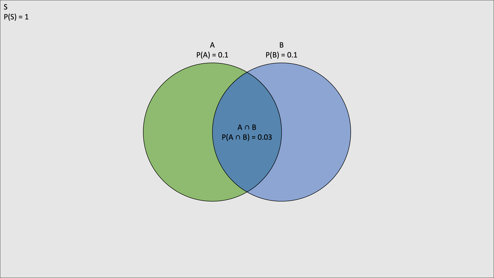{fig-align="center" height="350"}
:::

::: {.fragment .text-align-center}
**Don't fall for the sin of reification!**
:::

::: notes
Reification (also called the *Fallacy of Misplaced Concreteness*) occurs when treating a model as if it were the actual reality.
:::

::: notes
$$
\begin{array}{ll}
1. & \text{Observations/data} \\
2. & \text{DGP} : P(D \mid M) \ \rightarrow \text{Predict} \\
3. & \text{Prior} : P(M) \\
\hline
\therefore & \text{Post } : P(M \mid D) \\
& \text{Post predictive} : P(D \mid M) \ \rightarrow \text{Predict/Explain}^* \\
\end{array}
$$

-   $^*$only if a **causal model** is specified!
:::

## What is statistical inference?

::: nonincremental
-   Statistical inference is inductive **logical reasoning**: The process of drawing a probable *conclusion* about a **MODEL** of the data generating process (DGP) based on model assumptions and incomplete **DATA** as *evidence*
:::

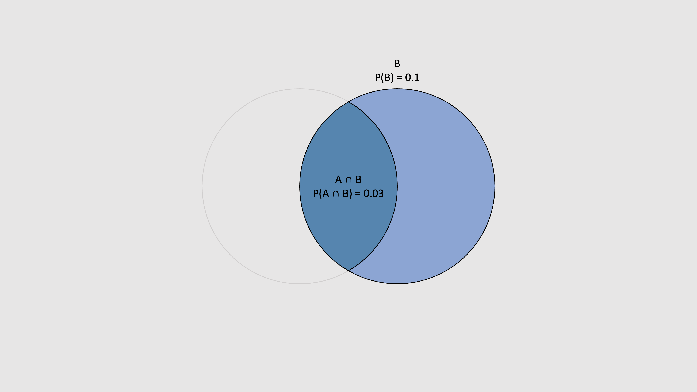{fig-align="center" height="430"}

## AI for deductive and inductive reasoning

-   This AI will be implemented in R as a function named `P` that:

    -   takes one or more premises (**evidence**, named `E`), a conclusion (**hypothesis**, named `H`), and an optional prior probability distribution (named `p`) as arguments `P(..., H, p = NULL)`

    -   returns a `Numeric` value between `0` and `1`, indicating how strongly `H` follows from `E`

        -   If `P(..., H) = 1`, then the reasoning is deductively valid, i.e., `H` is true given `E`

        -   If `0 < P(E, H) < 1`, then the reasoning is deductively invalid, with the value measuring inductive strength

        -   If `P(E, H) = 0`, then the reasoning is deductively invalid and contradictory, i.e., `H` is false given `E`
