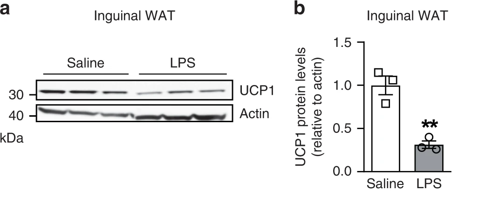

## What is statistical inference?

Statistical inference is (inductive) logical reasoning:

$$
\begin{array}{ll}
1. & \text{Observations/data} \\
2. & \text{Model assumptions} \\
\hline
\therefore & \text{Model}\ \rightarrow \text{Predictions} \\
\end{array}
$$

that uses incomplete data (e.g., a sample) and a model of the data generating process (DGP) as evidence in support of a hypothesis/claim about the DGP (e.g., random sampling from a population)

Statistical inference is the process of using inductive reasoning to draw conclusions about a data-generating process (DGP) based on incomplete data (e.g., a sample) and a model of the DGP as evidence.

## Ancient philosophy: Rationalism vs empiricism

{fig-alt="https://commons.wikimedia.org/w/index.php?curid=75881" fig-align="left" height="550"}

## Modern science: Statistical + causal inference


[Shmueli (2010)](https://doi.org/10.1214/10-STS330) To Explain or to Predict?

## An example of (frequentist) statistical inference

[**LPS treatment blunts UCP1 expression in subcutaneous adipocytes**]{.orange}



Values are expressed as mean ± SEM. \*\**p* = 0.004. Statistical test used: two-sided *t*-test.

 

**Figure 1** from [ASK1 inhibits browning of white adipose tissue in obesity](https://doi.org/10.1038/s41467-020-15483-7)

Lucchini *et al.* (2020) **Nat Commun** 11(1):1642

## Statistical inference


## Causal inference


## Inference

-   Inference is logical reasoning

## Scientific reasoning is inductive reasoning

XXX

## Arguments

-   An argument consists of one or more premises and a conclusion

-   Deductively valid and inductively strong arguments

-   Argument forms

    -   Modus ponens

    -   Modus tollens

    -   Inductive generalization

    -   Proportional syllogism

    -   Induction by confirmation

    -   Analogical argument

## Deductive logic

-   And-Or rules

    -   Conjuction-introduction rule

    -   Conjuction-elimination rule

    -   Disjunction-introduction rule

    -   Disjunction-elimination rule

-   If-Then rules

    -   Modus ponens

    -   Modus tollens

    -   Transposition

    -   The hypothetical syllogism

## Induction by confirmation

-   Hypothesis

-   Prediction

-   Data

## Induction by confirmation

-   The crucial experiment

-   The inference to the best explanation

-   The best hypothesis

## Proportional syllogism

-   Probability and proportion

-   Probability theory

## Inductive generalization

XXX

## Bayes' rule

XXX

## Knowledge-based AI

-   Logic (e.g., propositional logic or first-order logic) is a language used to represent knowledge and to reason (draw conclusions, make inferences) based on this knowledge

-   Logic is used in a knowledge-based AI agent to represent knowledge and to reason (draw conclusions, make inferences) based on this knowledge

-   In deductive logic the goal is to determine whether an argument is valid (the premises entail the conclusion), using some inference algorithm or rules

-   In inductive logic the goal is to determine whether an argument is strong (the premises partially entail the conclusion), using some inference algorithm or rules

## Deductive reasoning: Propositional logic

-   The goal is to **prove** that a conclusion/hypothesis/query is true given some premises/evidence/knowledge known or assumed to be true

-   $E \models C$

-   $P(C \mid E) = 1$

## Arguments/Rules of deductive inference

Knowledge-based AI capable of logical reasoning

Knowledge engineering

Argument forms as inference rules of propositional logic/deductive inference:

-   *Modus ponens*

-   And elimination rule

-   Unit resolution rule

-   Double negation elimination rule

-   Implication elimination rule

-   Biconditional elimination rule

-   De Morgan's law (1)

-   De Morgan's law (2)

-   Distributive law (1)

-   Distributive law (2)

-   *Modus tollens*

## Propositional symbols/variables

In propositional logic, the terms **propositional symbol** and **propositional variable** are often used interchangeably to denote **atomic propositions**—statements that are either true or false and cannot be broken down into simpler statements. These atomic propositions serve as the foundational building blocks for more complex, compound propositions formed using logical connectives/boolean operators such as AND, OR, and NOT.

## Inductive reasoning: Probability theory

XXX

## Setup environment

```{r}
#| output-location: default
#| output: false
library(tidyverse)

theme_set(theme_minimal())
```

```{r}
A <- c(TRUE, FALSE)
B <- c(TRUE, FALSE)
C <- c(TRUE, FALSE)

ss <- expand_grid(A, B, C)

ss
```

```{r}
# conditional operator
`%=>%` <- function(A, B) !A | B

# biconditional operator
`%<=>%` <- function(A, B) (!A | B) | (!B | A)
```

```{r}
# modus ponens
ss %>% 
  rowwise() %>% 
  mutate(
    P1 = A %=>% B,
    P2 = A
  ) %>% 
  mutate(E = all(pick(starts_with("P")))) %>% 
  mutate(
    H = B
  ) %>% 
  ungroup() %>% 
  summarize(
    P = mean(H[E]),
    V = if_else(P == 1, TRUE, FALSE)
  )
```

## Propositional logic-based AI in 8 lines of R code! {.scrollable}

```{r}
#| output-location: default
library(rlang)
library(flextable)

P <- function(..., H, table = TRUE, flex = TRUE) {
  # capture the premises/evidence as a list of quosures
  premises <- enquos(...)
  
  # capture the conclusion/hypothesis as a quosure
  conclusion <- enquo(H)
  
  # extract variable names
  vars <- unique(c(unlist(lapply(premises, all.vars)), all.vars(conclusion)))
  
  # build truth table
  truth_table <- expand.grid(replicate(length(vars), c(TRUE, FALSE), simplify = FALSE))
  colnames(truth_table) <- vars
  
  # evaluate premises in the context of the truth table
  for (i in seq_along(premises)) {
    truth_table[[paste0("P", i)]] <- eval_tidy(premises[[i]], data = truth_table)
  }
  
  # evaluate evidence and conclusion/hypothesis in the context of the truth table
  truth_table <- truth_table %>%
    mutate(
      E = if_all(starts_with("P"), identity),
      H = eval_tidy(conclusion, data = truth_table)
    )
  
  # calculate P(H | E)
  P_value <- truth_table %>%
    summarise(P = mean(H[E])) %>%
    pull(P)
  
  # return P value if truth table output is not requested
  if (!table) {
    return(P_value)
  }
  
  # return truth table if formatted truth table output is not requested
  if (!flex) {
    return(truth_table)
  }
  
  # define colors
  highlight_color <- "beige"  # Standard HTML color name
  true_color <- "darkgreen"
  false_color <- "darkred"
  
  # convert the truth table into a flextable
  truth_table_formatted <- flextable(truth_table) %>%
    bold(part = "header") %>%  # Bold the header
    bold(part = "footer") %>%  # Bold the footer
    bg(i = which(truth_table$E == TRUE), bg = highlight_color, part = "body")  # Highlight E = TRUE rows
  
  # apply text colors
  for (col in colnames(truth_table)) {
    truth_table_formatted <- truth_table_formatted %>%
      color(i = which(truth_table[[col]] == TRUE), j = col, color = true_color) %>%
      color(i = which(truth_table[[col]] == FALSE), j = col, color = false_color)
  }
  
  # add footer with the calculated P(H | E) value
  truth_table_formatted <- truth_table_formatted %>%
    add_footer_row(
      values = paste("P(H | E) =", round(P_value, 3)),
      colwidths = ncol(truth_table)
    ) %>%
    align(align = "right", part = "footer")

  # return formatted truth table
  return(truth_table_formatted)
}
```

## Deductive arguments {.hidden}

::::: columns
::: {.column width="50%"}
### Modus ponens

$$
\begin{array}{c}
A \implies B \\
A \\
\hline
B
\end{array}
$$
:::

::: {.column width="50%"}
### Modus tollens

$$
\begin{array}{c}
A \implies B \\
\neg B \\
\hline
\neg A
\end{array}
$$
:::
:::::

::::: columns
::: {.column width="50%"}
### Affirming the consequent

$$
\begin{array}{c}
A \implies B \\
B \\
\hline
A
\end{array}
$$
:::

::: {.column width="50%"}
### Denying the antecedent

$$
\begin{array}{c}
A \implies B \\
\neg A \\
\hline
\neg B
\end{array}
$$
:::
:::::

## Modus ponens

Modus ponens is a **valid deductive argument** that affirms the antecedent to conclude the consequent.

:::::::: columns
::::: column
::: {.fragment .nonincremental}
**Premises**

-   If it is raining, then the ground is wet

-   It is raining

**Conclusion**

-   The ground is wet
:::

::: fragment
$$
\begin{array}{ll}
1. & A \implies B \\
2. & A \\
\hline
\therefore & B
\end{array}
$$
:::
:::::

:::: column
::: fragment
```{r}
#| output-location: default
P(
  P1 = A %=>% B,
  P2 = A,       
  H  = B
)
```
:::
::::
::::::::

## Modus tollens

Modus tollens is a **valid deductive argument** that denies the consequent to conclude the negation of the antecedent.

:::::::: columns
::::: column
::: {.fragment .nonincremental}
**Premises**

-   If it is raining, then the ground is wet

-   The ground is not wet

**Conclusion**

-   It is not raining
:::

::: fragment
$$
\begin{array}{ll}
1. & A \implies B \\
2. & \neg B \\
\hline
\therefore & \neg A
\end{array}
$$
:::
:::::

:::: column
::: fragment
```{r}
#| output-location: default
P(
  P1 = A %=>% B,
  P2 = !B,
  H  = !A
)
```
:::
::::
::::::::

## Affirming the consequent

Affirming the consequent is an **invalid deductive argument** that affirms the consequent to conclude the antecedent.

:::::::: columns
::::: column
::: {.fragment .nonincremental}
**Premises**

-   If it is raining, then the ground is wet

-   The ground is wet

**Conclusion**

-   It is raining
:::

::: fragment
$$
\begin{array}{ll}
1. & A \implies B \\
2. & B \\
\hline
\therefore & A
\end{array}
$$
:::
:::::

:::: column
::: fragment
```{r}
#| output-location: default
P(
  P1 = A %=>% B,
  P2 = B,
  H  = A
)
```
:::
::::
::::::::

## Denying the antecedent

Denying the antecedent is an **invalid deductive argument** that denies the antecedent to conclude the negation of the consequent.

:::::::: columns
::::: column
::: {.fragment .nonincremental}
**Premises**

-   If it is raining, then the ground is wet

-   It is not raining

**Conclusion**

-   The ground is not wet
:::

::: fragment
$$
\begin{array}{c}
1. & A \implies B \\
2. & \neg A \\
\hline
\therefore & \neg B
\end{array}
$$
:::
:::::

:::: column
::: fragment
```{r}
#| output-location: default
P(
  P1 = A %=>% B,
  P2 = !A,
  H  = !B
)
```
:::
::::
::::::::

## Hypothetical syllogism

The hypothetical syllogism is a **valid deductive argument** that combines two conditional statements to conclude a third conditional statement.

:::::::: columns
::::: column
::: {.fragment .nonincremental}
**Premises**

-   If it is raining, then the ground is wet

-   If the ground is wet, then the plants grow

**Conclusion**

-   If it is raining, then the plants grow
:::

::: fragment
$$
\begin{array}{c}
1. & A \implies B \\
2. & B \implies C \\
\hline
\therefore & A \implies C
\end{array}
$$
:::
:::::

:::: column
::: fragment
```{r}
#| output-location: default
P(
  P1 = A %=>% B,
  P2 = B %=>% C,
  H  = A %=>% C
)
```
:::
::::
::::::::

## Proportional syllogism

The proportional syllogism is a logical argument that draws a conclusions based on a proportion.

:::::::::: columns
::::::: column
::: {.fragment .nonincremental}
**Premises**

-   A bag contains two blue balls and one white ball

-   One ball is drawn from the bag

**Conclusion**

-   A blue ball is drawn from the bag
:::

::: notes
Propositional symbols/variables:

B1 = "Blue ball 1 is drawn" B2 = "Blue ball 2 is drawn" W = "The white ball is drawn"

The propositional symbols/variables used in the premises define the set of all possible worlds/outcomes (i.e., truth table/logical space/sample space) and the logical structure of the premises/the knowledge represented by the premises restricts this set to the subset in which all premises are true.

The premises logically constrain the possible worlds/outcomes.

By the principle of indifference (logical probability), each possible world/outcome in the truth table is equally likely.
:::

::: notes
$$
P(A) = \lim_{n \to \infty} \frac{\text{Number of times } A \text{ occurs in } n \text{ trials}}{n}
$$ Frequentist probability requires infinite trials and physical mixing because it depends on empirical relative frequencies.

Frequentist probability is undefined for a single-instance event like drawing one ball.

Logical probability is a better framework in this case because it relies on counting possible worlds, not repeated trials.

Frequentist probability cannot actually compute probabilities.

Logical probability actually computes probability—frequentists can only estimate it.

Frequentist probability is useless in one-time events—it requires infinite trials to be strictly valid.

If you want a coherent theory of probability that always applies, you must use logical (Bayesian) probability.

Despite these flaws, frequentist probability persists in practice because: 1. It works well for large-scale empirical data (e.g., coin flips, medical studies). 2. It avoids subjective priors (which some mistakenly see as a flaw in Bayesian probability). 3. Historically, probability theory was developed with physical randomness in mind (games of chance, dice, coins).
:::

::: fragment
$$
\begin{array}{ll}
1. & B1 \lor B2 \lor W \\
2. & \neg((B1 \land B2) \lor (B1 \land W) \lor (B2 \land W)) \\
\hline
\therefore & B1 \lor B2
\end{array}
$$
:::
:::::::

:::: column
::: fragment
```{r}
#| output-location: default
P(
  P1 = B1 | B2 | W,                         
  P2 = !((B1 & B2) | (B1 & W) | (B2 & W)),
  H  = B1 | B2                                
)
```
:::
::::
::::::::::

## Statistical syllogism

The statistical syllogism is a logical argument that draws a conclusion about a specific case based on a generalization.

::: {.fragment .nonincremental}
**Premises**

-   Most birds can fly

-   Pingu is a bird

**Conclusion**

-   Pingu can fly
:::

::: fragment
Bayesian reasoning provides a formal framework for the statistical syllogism.
:::

## Inductive generalization

Inductive generalization (a.k.a. inductive inference) is a logical argument that draws a conclusion about a generalization based on a specific case.

This type of reasoning moves in the opposite direction of the statistical syllogism: it uses specific cases (observations) as evidence to infer a general rule, pattern, or principle.

::: {.fragment .nonincremental}
**Premises**

-   Pingu is a bird and cannot fly

-   Kiwi is a bird and cannot fly

-   Ostrich is a bird and cannot fly

**Conclusion**

-   Most birds cannot fly
:::

::: fragment
Bayesian reasoning provides a formal framework for inductive generalization.
:::

## Logical probability function {.hidden}

```{r}
#| output-location: default

# Main function to calculate the proportion
P <- function(..., H) {
  # Capture all premises (P1, P2, ...) as quosures
  premises <- enquos(...)
  
  # Combine all premises into a single evidence expression (E)
  evidence_expr <- reduce(premises, ~ expr((!! .x) & (!! .y)))
  
  # Capture the hypothesis as a quosure
  hypothesis_expr <- enquo(H)
  
  # Extract variables from evidence and hypothesis
  variables <- unique(c(
    all.vars(evidence_expr),
    all.vars(hypothesis_expr)
  ))
  
  # Generate set of all possible worlds
  possible_worlds <- expand_grid(!!!set_names(rep(list(c(TRUE, FALSE)), length(variables)), variables))
  
  # Filter set of all possible worlds where evidence is true and calculate proportion where hypothesis is true
  possible_worlds %>%
    mutate(
      E = !!evidence_expr,
      H = !!hypothesis_expr
    ) %>%
    filter(E) %>%
    summarize(proportion = mean(H)) %>%
    pull(proportion)
}

# Example Usage: Multiple premises as expressions
P(
  P1 = B1 | B2 | W,
  P2 = !(B1 & B2) & !(B1 & W) & !(B2 & W),
  H = B1 | B2
)
```

## Logical probability function {.hidden}

```{r}
#| output-location: default

P <- function(..., H, p = NULL) {
  # capture the premises as a list of quosures
  premises <- rlang::enquos(...)
  
  # capture the conclusion as a quosure
  conclusion <- rlang::enquo(H)
  
  # extract variable names from premises and conclusion
  vars <- unique(c(
    unlist(lapply(premises, all.vars)),
    all.vars(conclusion)
  ))
  
  # generate truth table with all possible combinations of variables
  truth_table <- expand.grid(replicate(length(vars), c(TRUE, FALSE), simplify = FALSE))
  colnames(truth_table) <- vars
  
  # add premises P1, P2, ... to the truth table
  for (i in seq_along(premises)) {
    premise <- premises[[i]]
    truth_table[[paste0("P", i)]] <- rlang::eval_tidy(premise, data = truth_table)
  }
  
  # add evidence E to the truth table
  truth_table <- truth_table %>%
    mutate(E = if_all(starts_with("P"), identity)) # or `rowMeans(pick(starts_with("P"))) == 1`
  
  # add hypothesis H to the truth table
  truth_table <- truth_table %>%
    mutate(H = rlang::eval_tidy(conclusion, data = truth_table))
  
  # add uniform prior distribution if none provided
  if (is.null(p)) {
    truth_table <- truth_table %>%
      mutate(p = 1 / n())
  } else {
    if (length(p) != nrow(truth_table)) {
      stop("Length of probability vector 'p' must match the number of truth table rows.")
    }
    truth_table <- truth_table %>%
      mutate(p = p)
  }
  
  # print truth table
  print(truth_table)
  
  # calculate P(H | E)
  P <- truth_table %>%
    filter(E) %>%
    summarise(P = sum(p * H) / sum(p)) %>%
    pull(P)
  
  return(P)
}
```


## Chance does not cause anything!

{fig-alt="https://www.getty.edu/art/collection/object/103RJG" fig-align="left" height="550"}

## Chance does not cause anything!

-   Chance is not an entity; it cannot cause anything

::: notes
Chance is not an **agent** that determine an outcome. Instead, it is a **descriptor** of our uncertainty or lack of complete information about the causes that determine an outcome.

Chance is a descriptor of unpredictability — whether due to lack of information or inherent complexity. Therefore, saying “caused by chance” is misleading because it implies an agency that chance does not possess.
:::

::: notes
-   Saying that an outcome "happened by chance" is misleading—chance is a description of our uncertainty, not a causal force.
-   In statistics, probability (or chance) is a mathematical framework used to describe uncertainty, not a physical force that causes events. The frequentist and Bayesian interpretations of probability both acknowledge that “chance” is a model for uncertainty, not a causal mechanism.
:::

-   Randomness does not imply causation; it reflects our lack of knowledge or predictability

::: notes
-   When we call something random, we are often acknowledging our inability to fully determine or predict the outcome.
-   In statistics, randomness often refers to unpredictability due to incomplete information (epistemic uncertainty) or inherent variability in the system (aleatory uncertainty).
:::

-   Statements like "caused by chance" are inherently meaningless

::: notes
-   Every observed outcome has underlying causes; randomness simply means these causes are unknown or too complex to track.
-   Statisticians agree that chance is not a cause in a mechanistic sense. Instead, it’s a descriptor of uncertainty or variability. Causal inference methods (e.g., potential outcomes framework) aim to move beyond probabilistic descriptions to establish causation.
:::

-   Randomness and probability are tools to model uncertainty, not explanations for why things happen

::: notes
-   A fair die does not land on a number "due to chance"—the outcome results from physical forces, but we model it probabilistically due to practical limitations.
-   Statisticians agree that probability models describe uncertainty rather than explain why specific outcomes occur. Explanation typically requires causal modeling, experimental design, or mechanistic understanding beyond statistical models.
:::

-   The language we often can anthropomorphize randomness/chance, leading to misconceptions

::: notes
-   Phrases like "luck" and "chance" suggest an active force, when in reality, they reflect uncertainty in our knowledge.
:::

-   Understanding randomness requires distinguishing between intrinsic unpredictability and practical limitations in prediction

::: notes
-   Some systems may be truly unpredictable (e.g., quantum events), while others are just complex (e.g., weather patterns).
-   Weather forecasting is considered deterministic but practically unpredictable due to chaotic dynamics and measurement limitations.
-   Statisticians distinguish between aleatory uncertainty (true randomness, as in quantum mechanics) and epistemic uncertainty (resulting from lack of knowledge or measurement precision).
:::

## Logical vs frequentist probability {.scrollable}

| Feature | **Logical Probability** | **Frequentist Probability** |
|-----------------|----------------------------|----------------------------|
| **Definition** | Degree of belief based on available information | Long-run relative frequency in infinite trials |
| **Can Compute Probability?** | ✅ Yes, by counting possible worlds | ❌ No, requires infinite trials (it can only be estimated) |
| **Works for Single Events?** | ✅ Yes | ❌ No, must assume hypothetical repetition |
| **Requires a Physical Process?** | ❌ No, just logic and premises | ✅ Yes, needs repeatable trials |
| **Respects the Likelihood Principle?** | ✅ Yes | ❌ No, depends on sampling distributions and hypotheticals |
| **Requires i.i.d. Observations?** | ❌ No, works with dependencies and heterogeneity | ✅ Yes, i.i.d. required by definition, but it can be "relaxed" |
| **Example: P(drawing blue ball)** | $\frac{2}{3}$, based on the proportion of possible outcomes | Undefined unless an infinite number of trials are conducted |
